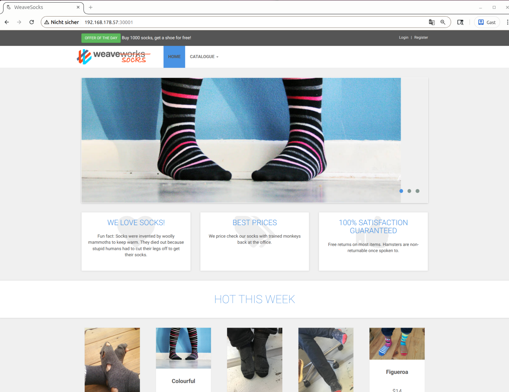
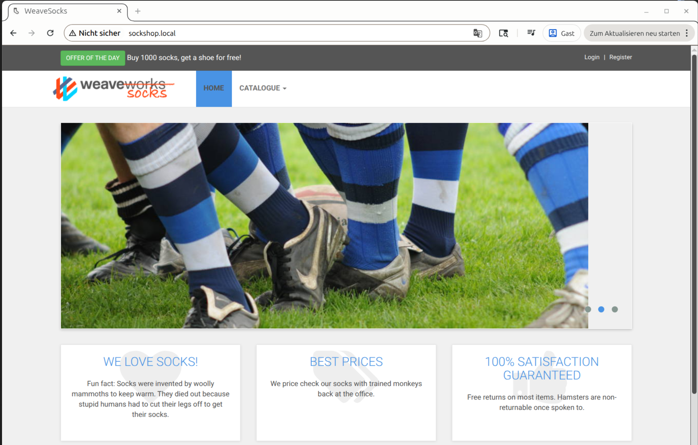
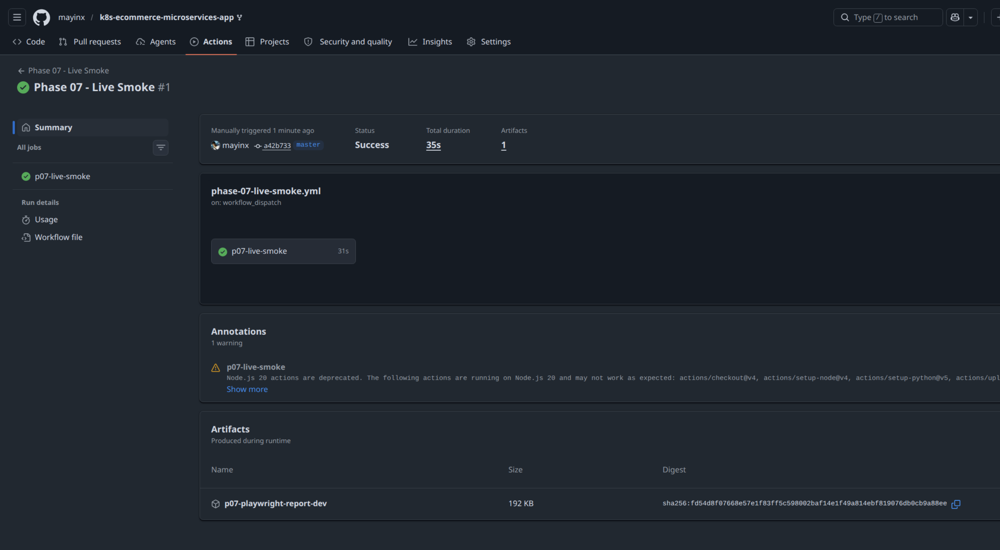
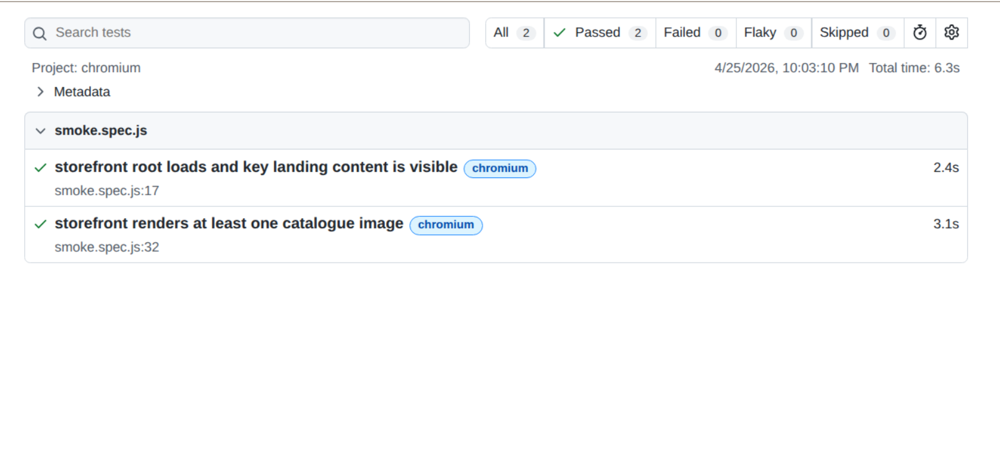
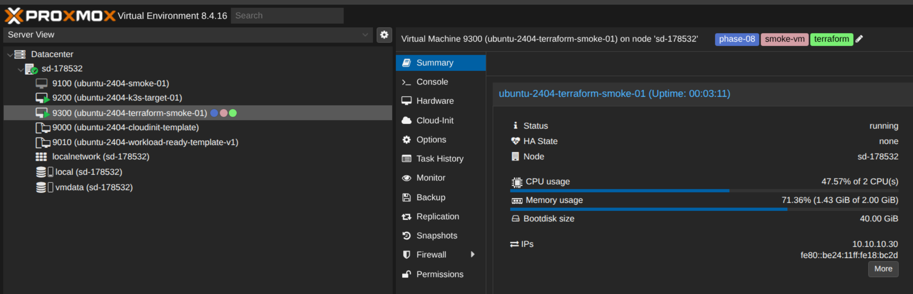

# 🧦 Sock Shop: Production-Grade DevOps Delivery Path

<!-- ### Proxmox VM Templates & K3s Target Delivery • Multi-Environment (`dev` / `prod`) • GitHub Actions CI/CD & GHCR • Cloudflare Tunnels • Tailscale Private Access • Prometheus/Grafana Observability • Ruby/Bash/Python Test Gate • Playwright Smoke Tests • Trivy Security Scanning & Dependabot • Terraform IaC Baseline • DR Backup & Restore Validation • Protected PR Workflow -->

<!--  

 -->

Production-grade DevOps project based on the upstream WeaveSocks microservices application. This repository demonstrates a **reproducible, phase-based delivery path** from a **local Docker Compose baseline** to a **long-lived Proxmox-based K3s target environment** with public `dev` and `prod` entrypoints.

> **Project focus:** The goal is not just to run the application once, but to build a reproducible, phase-based DevOps delivery path with evidence-grade documentation. The project is intentionally implemented in phases so that each new capability builds on an already proven baseline, gradually covering the core capabilities expected from a modern DevOps delivery project:
>
> - **🏗️ Infrastructure & Platform:** Infrastructure as Code (IaC), Proxmox VM templating, Kubernetes deployment, and long-lived target-environment evolution.
> - **🚢 Delivery & Operations:** Containerized microservices delivery and operation, CI/CD, repo-owned container image build and publishing, and `dev` / `prod` environment separation.
> - **🛡️ Quality & Security:** Repo-owned validation tooling, deterministic test gates, security measures, Trivy scanning, and Dependabot dependency visibility.
> - **📊 Resilience & Observability:** Prometheus/Grafana observability, Kubernetes state backup, Mongo-compatible data-store dump validation, pod recovery proof, and rollback readiness.
> - **📚 Documentation & Evidence:** Phase-based implementation logs, runbooks, decisions, architecture notes, and evidence folders. Start with the **[Documentation Index](project-docs/INDEX.md)** for the full phase-based documentation structure: implementation logs, runbooks, decisions, ADRs, architecture notes, and evidence folders. \
*Quick links:* **[Index](project-docs/INDEX.md) • [Global decisions](project-docs/DECISIONS.md) • [Debug log](project-docs/DEBUG-LOG.md) • [Roadmap](project-docs/ROADMAP.md)**

---  

## 🧱 Tech Stack

*Infrastructure, delivery & operations:*\
🐳 **Docker** | ☸️ **Kubernetes (K3s)** | 🧪 **kind** | 🐙 **GitHub Actions** | 📦 **GHCR** | 🚜 **Proxmox VE** | ☁️ **Cloud-Init** | 🧱 **Terraform** | 🛡️ **Tailscale** | ☁️ **Cloudflare Tunnels** | 🚦 **Traefik** | 🧩 **Kustomize** | 📈 **Prometheus & Grafana** | ⚓ **Helm** | 🔎 **Trivy** | 🤖 **Dependabot** | 🗄️ **MongoDB**

*Repo-owned code, tooling & tests:*\
💎 **Ruby** | 🐍 **Python** | 🐚 **Bash** | 🟨 **JavaScript** | **Minitest** | **pytest** | 🎭 **Playwright**

---

## 🚀 Live Target Environments

The project exposes two long-lived public target environments through the Proxmox-based K3s delivery path:

| Environment | Public&nbsp;Entrypoint&nbsp;&nbsp;&nbsp;&nbsp;&nbsp;&nbsp;&nbsp;&nbsp;&nbsp;&nbsp;&nbsp;&nbsp; | Role |
| :--- | :--- | :--- |
| 🧪&nbsp;**Development** | [dev-sockshop.cdco.dev](https://dev-sockshop.cdco.dev/) | Post-merge automated deployment target for validated changes; gated by required PR-checks; used for live smoke tests before production promotion |
| 🚀&nbsp;**Production** | [prod-sockshop.cdco.dev](https://prod-sockshop.cdco.dev/) | Approval-gated target environment for the promoted release |

Both entrypoints are routed through **Cloudflare Tunnel** to the **Proxmox-based K3s target platform**, where **Traefik** routes traffic by hostname into the correct namespace.

---

## 🔄 CI/CD Promotion Model

The current delivery path follows a **trunk-based CI/CD model with gated promotion**. Feature branches are reviewed through pull requests and can enter `master` only after the required deterministic checks pass. The merged commit triggers the Delivery Pipeline and is deployed automatically to `dev`. The same merge commit is finally promoted to `prod` after approval. 

### Delivery Flow 

The delivery path is organized as a controlled promotion chain: protected merge, automated `dev` deployment, optional live validation, and approval-gated `prod` promotion.

1. **🛡️&nbsp;Before merge:**\
The deterministic PR gate (**Ruby, Bash, Python tests + focused Trivy scans**) must pass before changes can enter `master` 

2. **⚡ After merge:**\
The merge commit accepted by the PR gate triggers the target delivery workflow and deploys automatically to `dev`

3. **🔍 Before production:**\
Live validation can be run against `dev` via **Python API contract smoke checks and Playwright browser smoke tests**

4. **🚀 Production promotion:**\
The same accepted commit promotes to `prod` only after reviewer approval (**GitHub Environment approval gate**)

---

### Workflow Trigger Model

The following workflows and automations implement this delivery flow:

| Workflow / automation | Trigger&nbsp;&nbsp;&nbsp;&nbsp;&nbsp;&nbsp;&nbsp;&nbsp;&nbsp;&nbsp;&nbsp;&nbsp;&nbsp;&nbsp;&nbsp;&nbsp;&nbsp;&nbsp;&nbsp;&nbsp;&nbsp;&nbsp;&nbsp;&nbsp;&nbsp;&nbsp;&nbsp;&nbsp;&nbsp;&nbsp;&nbsp;&nbsp;&nbsp;&nbsp;&nbsp;&nbsp;&nbsp;&nbsp;&nbsp;&nbsp;&nbsp;&nbsp;&nbsp;&nbsp;&nbsp;&nbsp;&nbsp;&nbsp;&nbsp;&nbsp;&nbsp;&nbsp;&nbsp; | Executed&nbsp;&nbsp;&nbsp;&nbsp;&nbsp;&nbsp;&nbsp;&nbsp;&nbsp;&nbsp;&nbsp;&nbsp;&nbsp;&nbsp;&nbsp;&nbsp;&nbsp;&nbsp;&nbsp;&nbsp;&nbsp;&nbsp;&nbsp;&nbsp;&nbsp;&nbsp;&nbsp;&nbsp;&nbsp;&nbsp;&nbsp;&nbsp;&nbsp;&nbsp;&nbsp;&nbsp;&nbsp;&nbsp;&nbsp;&nbsp;&nbsp;&nbsp;&nbsp;&nbsp;&nbsp;&nbsp;&nbsp;&nbsp; | Role&nbsp;&nbsp;&nbsp;&nbsp;&nbsp;&nbsp;&nbsp;&nbsp;&nbsp;&nbsp;&nbsp;&nbsp;&nbsp;&nbsp;&nbsp;&nbsp;&nbsp;&nbsp;&nbsp;&nbsp;&nbsp;&nbsp;&nbsp;&nbsp;&nbsp;&nbsp;&nbsp;&nbsp;&nbsp;&nbsp;&nbsp;&nbsp;&nbsp;&nbsp;&nbsp;&nbsp;&nbsp;&nbsp;&nbsp;&nbsp; |
| :--- | :--- | :--- | :--- |
| **🛡️&nbsp;Deterministic&nbsp;PR&nbsp;Gate** | (1) Pull requests targeting `master` when opened, reopened, or updated with new commits (2) Manual reruns via `workflow_dispatch` | (1) Ruby HealthCheck helper tests (2) Bash helper tests (3) Python API contract-guard tests (4) Focused Trivy repo scan and image scan | Required merge gate before changes can enter `master` |
| **🏗️&nbsp;Target&nbsp;Delivery&nbsp;Workflow** | (1) Push to `master` after merge (2) Manual runs via `workflow_dispatch` | (1) Kustomize overlay validation (2) Repo-owned `healthcheck` image build and GHCR push (3) Automated `dev` deployment (4) Approval-gated `prod` deployment | Main delivery workflow for the Proxmox target cluster |
| **🧪&nbsp;Live Smoke Workflow** | (1) Manual run via `workflow_dispatch` (2) Reusable workflow call via `workflow_call` | (1) Python live contract smoke tests (2) Playwright browser smoke tests against `dev` or `prod` | Environment-dependent validation, intentionally separate from the deterministic PR gate |
| **🤖&nbsp;Dependabot** | (1) Weekly scheduled dependency checks (2) Manual runs via GitHub UI or PR comments | (1) GitHub Actions (2) Playwright npm dependencies (3) Terraform provider dependencies | Dependency visibility for repo-owned tooling and infrastructure paths; generated PRs still go through the normal PR gate |

---

### Promotion model summary

The project does not use separate long-lived Git branches for `dev` and `prod`. Instead, `master` remains the source of truth, and the same accepted merge commit moves through:

- Deterministic PR validation
- Automated `dev` delivery
- Optional live smoke validation
- Approval-gated `prod` promotion

**Result:** This project uses a professional **single-branch promotion workflow** with protected merge checks, automated `dev` delivery, controlled `prod` promotion, separate live validation for deployed environments, and scheduled dependency visibility through Dependabot.

---

## 🌍 Target Environment Model 

### Target Shape

The current `dev` and `prod` environments do not run on separate machines.

Both run on the **same Proxmox-based target VM** inside the **same single-node K3s cluster**.

**Result: `1 VM -> 1 cluster -> 2 namespaces -> 2 app environments`**

> **Architecture Flow:**
>
> 🖥️ **1 Proxmox VM** ➔ ☸️ **1 K3s Cluster** ➔ 🗂️ **2 Namespaces** ➔ 🚀 **2 App Environments**

### Logical environment separation

The logical environment separation is implemented through:

1. **Separate Kubernetes namespaces:** `sock-shop-dev` and `sock-shop-prod`.
2. **Separate Kustomize overlays:** `deploy/kubernetes/kustomize/overlays/dev|prod`.
3. **Host-based ingress routing:** Handled through Traefik for both environments.
4. **Separate public entrypoints:** Traffic is routed via [`dev-sockshop.cdco.dev`](https://dev-sockshop.cdco.dev/) and [`prod-sockshop.cdco.dev`](https://prod-sockshop.cdco.dev/).
5. **Distinct workflow behaviors:** Automated `dev` deployment vs. approval-gated `prod` deployment.

### Operational Support Around the Target Model

Additional operational support around this target model now includes:

- **Terraform IaC baseline:** Phase 08 proves reproducible Proxmox VM provisioning through an isolated disposable smoke VM path.
- **DR backup baseline:** Phase 09 exports Kubernetes namespace state for `sock-shop-dev` and `sock-shop-prod` and validates Mongo-compatible dump artifacts through a temporary restore check.

### Public routing path

Public traffic reaches the same target platform through Cloudflare Tunnel and is then routed by **hostname** through **Traefik** to the correct namespace-based application environment.

**Result:\
\
`1 VM -> 1 cluster -> 2 namespaces -> 2 app environments`**

Note: The Terraform baseline currently supports this architecture as a reproducible Proxmox provisioning proof, while the live `dev` / `prod` target remains the already established VM `9200` from the Phase 05 target-delivery path. 

~~~text
                          Public Internet
                                |
                                | (R1) HTTPS :443
                                |
                                v
+-------------------------------------------------------------------+
|                        CLOUDFLARE TUNNEL                          |
|                   (Public Edge + Security)                        |
+-------------------------------------------------------------------+
                                |
                                | (R2) Hostname-based HTTPS routing
                                | 
                                v
+-------------------------------------------------------------------+
|     --- TARGET VM 9200 (PROXMOX / K3S SINGLE-NODE) ---            |
|                                                                   |
|   +----------------------------------------------------------+    |
|   |               TRAEFIK INGRESS CONTROLLER                 |    |
|   +----------------------------------------------------------+    |
|             |                                   |                 |
|   (R3a) dev-sockshop.cdco.dev       (R3b) prod-sockshop.cdco.dev  |
|             |                                   |                 |
|             v                                   v                 |
|   +-----------------------+         +-----------------------+     |
|   | Namespace:            |         | Namespace:            |     |
|   | sock-shop-dev         |         | sock-shop-prod        |     |
|   |                       |         |                       |     |
|   | (Automated via CI)    |         | (Approval-gated CI)   |     |
|   +-----------------------+         +-----------------------+     |
|             ^                                  ^                  |
|             |                                  |                  |
|             |  (D3) Controllers Reconcile      |                  |       
|             |       namespace resources        |                  |
|             +-----------------+----------------+                  |
|                               |                                   |
|   +----------------------------------------------------------+    |
|   |          (D2) KUBERNETES API / CONTROL PLANE             |    |
|   | API stores desired state; controllers reconcile resources|    |
|   +----------------------------------------------------------+    |
+-------------------------------------------------------------------+
                                ^
                                |
            (D1) Private Kubernetes API access via Tailscale
                                |
+-------------------------------------------------------------------+
|        --- GITHUB ACTIONS RUNNER / OPERATOR WORKSTATION ---       |
|          renders selected env-specific Kustomize overlay          |
|           overlay into final Kubernetes manifests and             |
|        uses private kubectl access to the target cluster          |
+-------------------------------------------------------------------+

~~~

The **numbered flow** above separates the public request path from the deployment control path: 
- **Public Request Path (R1-R3):**\
User traffic enters through HTTPS, reaches the Cloudflare Tunnel, and is routed by Traefik based on the requested hostname to either `sock-shop-dev` or `sock-shop-prod`.
- **Deployment Control Path (D1-D3):**\
**GitHub Actions CI** renders the selected environment-specific Kustomize overlay into final Kubernetes manifests and applies those manifests to the Kubernetes API through the private **Tailscale** access path - as the desired target cluster state for the selected namespace. The same private access model is also used for operator `kubectl` access and private port-forwarding tasks.\
**Kubernetes** then performs **reconciliation**: the API receives the manifests and stores them as desired state, and Kubernetes controllers create, update, or replace resources until the affected namespace matches the applied manifests.

### Deployment and Reconciliation Model

These namespaces are logical partitions inside one Kubernetes cluster, not separate clusters. When the `dev` overlay is applied, Kubernetes updates the desired state of the resources in `sock-shop-dev` only. The `prod` namespace remains unchanged until the `prod` overlay is applied and approved.

The delivery workflow does not copy the repository onto the VM or run the application from a Git checkout on the target machine. 

Instead, GitHub Actions applies Kubernetes manifests to the cluster API. Kubernetes stores that desired state and recreates/updates the affected resources until the namespace matches it (reconciliation).

## 🏗️ Architecture Snapshot

The current architecture is a phase-built DevOps delivery path around the Sock Shop microservices application:

- **Application:** Sock Shop microservices
- **Local baseline runtimes:** Docker Compose and local K3s
- **Kubernetes deployment model:** Raw manifests plus environment-specific Kustomize overlays
- **CI/CD platform:** GitHub Actions
- **Container registry:** GHCR
- **Historical CI smoke target:** `kind` during the Phase 03 CI/CD baseline
- **Long-lived target platform:** Proxmox VM `9200` running single-node K3s
- **Environment model:** `sock-shop-dev` and `sock-shop-prod` namespaces on the same cluster
- **Ingress and public edge:** Traefik behind Cloudflare Tunnel
- **Private access path:** Tailscale for operator and CI access to the Kubernetes API
- **Observability:** Dedicated `monitoring` namespace with `kube-prometheus-stack`, Prometheus, and Grafana
- **Testing and security:** Ruby/Bash/Python validation tooling, Playwright smoke tests, Trivy scans, Dependabot, and protected PR checks
- **Infrastructure as Code:** Terraform Proxmox smoke-VM baseline using template `9010` and disposable VM `9300`
- **Disaster recovery:** Kubernetes state backup, Mongo-compatible dump validation, pod recovery proof, and rollback-readiness documentation

**Current architecture result:** The project now proves delivery, operations, observability, testing, security, IaC, and DR readiness against a long-lived Proxmox-backed K3s target platform, rather than only demonstrating isolated local or CI/CD mechanics.

---

## 🖼️ TODO!!!: Architecture Diagram

The final architecture diagram summarizes the complete delivery path: developer workflow, GitHub Actions, GHCR, Tailscale, Proxmox VM `9200`, K3s namespaces, Traefik, Cloudflare Tunnel, Prometheus/Grafana, Terraform smoke-VM provisioning, and DR backup flow.

*Architecture overview of the production-like delivery path from repository and CI/CD workflow to the Proxmox-backed K3s target platform, public `dev` / `prod` entrypoints, observability, IaC, and DR support paths.*

---

## 🎯 Requirements Coverage & Capability Summary

### Requirement Coverage 

| Requirement area | Coverage in this project | Main proof location |
| :--- | :--- | :--- |
| **Docker / Containerized Execution** | Sock Shop runs as containerized microservices; Phase 00 proves the inherited Docker Compose runtime, Phase 05 runs the containerized microservices on the Proxmox K3s target, while the project adds repo-owned Docker work through the `healthcheck` image: Dockerfile remediation/hardening, local/CI image builds, Trivy image scans, GHCR publishing. Docker is also used as a validation/runtime technique through ephemeral `kind` cluster nodes and a temporary MongoDB container for DB restore validation. | Phase 00, Phase 03, Phase 05, Phase 07, Phase 09 |
| **Container Registry** | Repo-owned `healthcheck` image is built and pushed to GitHub Container Registry (GHCR), then reused, refactored and hardened in the delivery/testing+security phases. | Phase 03, Phase 05, Phase 07 |
| **Dev / Prod Environments** | `sock-shop-dev` and `sock-shop-prod` run as separate Kubernetes namespaces with separate Kustomize overlays and hostnames. | Live Target Environments, Target Environment Model, Phase 03, Phase 05 |
| **Kubernetes Orchestration** | Local K3s baseline, local Traefik ingress baseline, ephemeral `kind` CI smoke target, and long-lived Proxmox K3s target cluster with `dev` / `prod` namespaces. | Phase 01, Phase 02, Phase 03, Phase 05 |
| **Kubernetes Manifests / Overlays** | Proven raw manifests are reused as the base; environment-specific Kustomize overlays define `dev` and `prod` deployment inputs. | Phase 03, Phase 05 |
| **Ingress / HTTPS Access** | Traefik handles host-based routing; Cloudflare Tunnel exposes public HTTPS entrypoints without opening inbound VM ports directly. | Live Target Environments, Target Environment Model, Phase 05 |
| **Data Management / Database Handling** | MongoDB-backed services are identified as DR-relevant stateful components; Phase 09 creates MongoDB dump artifacts and validates a representative `user-db` restore/query check in a temporary MongoDB container. | Phase 00, Phase 09 |
| **CI/CD pipeline** | GitHub Actions validates overlays, builds/pushes the repo-owned image, deploys first to an ephemeral `kind` smoke target in Phase 03, later deploys to the real Proxmox K3s cluster in Phase 05, and separates deterministic PR checks from live smoke validation in Phase 07. | CI/CD Promotion Model, Phase 03, Phase 05, Phase 07 |
| **Automated dev + approved prod deployment** | Accepted changes deploy automatically to `dev`; `prod` promotion is paused behind a GitHub Environment approval gate. | CI/CD Promotion Model, Phase 03, Phase 05 |
| **Testing** | Ruby healthcheck tests, Bash traffic-generator helper tests, Python `/catalogue` contract-guard tests, Python live API smoke checks, and Playwright browser smoke tests. Deterministic checks run in the protected PR gate; live checks stay separate for deployed-environment validation. | Phase 07 |
| **Repo-owned implementation work** | Custom Bash traffic generator, Python API contract guard, refactored Ruby healthcheck helper, Playwright smoke tests, Makefile automation targets, Dockerfile hardening, Terraform Proxmox module, and DR backup helper script. | Phase 06, Phase 07, Phase 08, Phase 09 |
| **Infrastructure as Code** | Terraform Proxmox baseline provisions disposable VM `9300` from workload-ready template `9010` through the `bpg/proxmox` provider. | Phase 08, Terraform communication model |
| **Monitoring / Observability** | `kube-prometheus-stack`, Prometheus, and Grafana run in a dedicated `monitoring` namespace with private port-forward access and dashboard evidence. | Phase 06 |
| **Security / DevSecOps** | Trivy repo/image scans, evidence-based hardening of the repo-owned `healthcheck` Docker image, Dependabot for GitHub Actions / Playwright / Terraform provider dependencies, no committed live secrets, GitHub Secrets / repository variables, protected PR gate, and HTTPS edge access through Cloudflare Tunnel. | Phase 06, Phase 07, Phase 08, Phase 09 |
| **Disaster Recovery / Rollback** | Backup helper exports Kubernetes namespace state, records Secret metadata only, creates Mongo-compatible dumps, validates restore/query behavior, proves pod recovery through Kubernetes reconciliation, and documents rollback paths for bad-release scenarios. | Phase 09 |
| **Documentation / Evidence** | README, phase implementation logs, setup guides, runbooks, decisions, ADRs, evidence folders, roadmap, debug/incident log, workflow screenshots, monitoring screenshots, Terraform lifecycle proof, and DR backup/restore proof. | Documentation & Evidence Backbone, `project-docs/INDEX.md` |
| **Architecture Diagram** | Final architecture diagram is planned/linked as the visual overview of application components, CI/CD pipeline, infrastructure, Kubernetes target model, observability, IaC, and DR paths. | Architecture Diagram section |

---

### Capability Summary

This repository demonstrates an iterative DevOps delivery path built around Sock Shop, including:

✅ **Docker / containerized execution:** Docker Compose baseline, containerized Sock Shop runtime, repo-owned `healthcheck` image build/hardening, GHCR publishing, and temporary Docker containers for `kind` and MongoDB restore validation.\
✅ **Kubernetes deployment:** Local K3s baseline, Traefik ingress baseline, and long-lived Proxmox-backed K3s target cluster.\
✅ **Environment separation:** `sock-shop-dev` and `sock-shop-prod` namespaces, separate Kustomize overlays, separate hostnames, and different workflow behavior for `dev` and `prod`.\
✅ **CI/CD:** GitHub Actions workflows for overlay validation, image build/push, automated `dev` deployment, approval-gated `prod` promotion, deterministic PR checks, and live smoke validation.\
✅ **Target delivery platform:** Real Proxmox VM `9200`, single-node K3s, Tailscale private access, Cloudflare Tunnel public edge, and live `dev` / `prod` URLs.\
✅ **Observability:** Prometheus/Grafana baseline on the Proxmox target cluster through `kube-prometheus-stack`, private port-forward access, dashboard evidence, and generated storefront traffic.\
✅ **Testing:** Ruby healthcheck tests, Bash helper tests, Python `/catalogue` contract-guard tests, Python live API smoke checks, and Playwright browser smoke tests.\
✅ **DevSecOps controls:** Trivy filesystem/image scans, evidence-based Dockerfile remediation, Dependabot, protected default branch, required deterministic checks, and no committed live secrets.\
✅ **Infrastructure as Code:** Terraform Proxmox baseline with disposable smoke-VM provisioning from template `9010` to VM `9300`, followed by verification and destroy.\
✅ **Disaster recovery / rollback readiness:** Kubernetes namespace-state backup, Secret metadata only, Mongo-compatible dump validation, temporary restore check, pod recovery proof, and rollback path documentation.\
✅ **Repo-owned implementation work:** Bash traffic generator, Python API contract guard, refactored Ruby healthcheck helper, Playwright tests, Makefile automation targets, Terraform module, and DR backup helper.\
✅ **Documentation and evidence:** README, phase implementation logs, setup notes, runbooks, decisions, ADRs, roadmap, debug log, evidence folders, screenshots, and command-output proof.

---

## 📁 Current Verified Scope & Proven Highlights

The repository currently contains proven work across the following phases. *(Note: This is a moving summary, not the final shape of the project.)*

The phases are intentionally baseline-based: each step proves one capability before the next one builds on top of it.

| Phase | Project layer | Role in the project |
| :--- | :--- | :--- |
| Phase 00 | Foundation / baseline build-up | Local Docker Compose runtime baseline, repository inventory, service/port mapping, and first troubleshooting baseline |
| Phase 01 | Foundation / baseline build-up | Local K3s Kubernetes baseline through port-based NodePort access |
| Phase 02 | Foundation / baseline build-up | Local K3s ingress baseline through Traefik host-based routing |
| Phase 03 | Foundation / baseline build-up | CI/CD mechanics, `dev` / `prod` overlay model, GHCR publishing, and approval-gated smoke deployment in an ephemeral `kind` target |
| Phase 04 | Foundation / baseline build-up | Proxmox VM/template foundation for later long-lived target delivery |
| Phase 05 | Target delivery | Long-lived Proxmox K3s target with public `dev` and `prod` environments |
| Phase 06 | Operations | Prometheus/Grafana observability baseline on the target cluster |
| Phase 07 | Quality, security & governance | Test layers, Trivy/Dependabot baseline, deterministic PR gate, live smoke workflow, and branch protection |
| Phase 08 | Infrastructure automation | Terraform Proxmox IaC baseline with disposable smoke-VM provisioning |
| Phase 09 | Resilience | DR backup path, Mongo-compatible dump validation, pod recovery proof, and rollback readiness |

---

### 📚 Cross-phase documentation & evidence backbone

Alongside the technical phases, the project establishes a documentation system that makes the delivery path reproducible and reviewable.

| Documentation layer | Purpose |
| :--- | :--- |
| **[Project Docs Index](project-docs/INDEX.md)** | Main navigation hub for all phase-based documentation |
| **[Roadmap](project-docs/ROADMAP.md)** | Phase planning, remaining work, deferred hardening, and optional extension tracks |
| **[Global Decisions](project-docs/DECISIONS.md)** | Cross-phase decision summary and architectural reasoning |
| **[Debug / Incident Log](project-docs/DEBUG-LOG.md)** | Troubleshooting history, anomalies, and resolved blockers |
| **[ADR-0001](adr/%5B2026-03-17%5D%20ADR-0001%20--%20Git-Conventions.md)** | Git workflow, branching, and commit conventions |
| **[ADR-0002](adr/%5B2026-03-18%5D%20ADR-0002%20--%20Docs-System.md)** | Documentation system and repository documentation locations |
| **Phase docs** | `IMPLEMENTATION.md`, `RUNBOOK.md`, `SETUP.md`, `DECISIONS.md`, `DISCOVERY.md` where applicable |
| **Evidence folders** | Phase-level screenshots, command outputs, workflow proof, diagrams, and verification artifacts |

This documentation is part of the delivery work itself and acts as the project's backbone, illustrating and proving the baseline- and phase-based implementation appraach of the project.

---

### 🔲 Phase 00 — Local Docker Compose Baseline

> **Scope Summary:** Repository fork/remotes check, deployment-surface inventory, local Docker Compose runtime baseline, service/port/stateful-component mapping, and local host-port conflict workaround.\
**Docs: [Implementation](project-docs/00-compose-baseline/IMPLEMENTATION.md) • [Runbook](project-docs/00-compose-baseline/RUNBOOK.md)**  

#### 🔲 Proven Capabilities

- Fork/remotes verified, with upstream retained as read-only reference (through `no_push`)
- Existing deployment surfaces inventoried: Docker Compose, Kubernetes manifests, Helm chart, monitoring/alerting manifests, NetworkPolicy manifests, and inherited Terraform material    
- Local Docker Compose stack started successfully and mapped by service role:
  - Router: `edge-router` / Traefik
  - App services: `front-end`, `catalogue`, `carts`, `orders`, `payment`, `shipping`, `user`, `queue-master`
  - Datastores: MongoDB-backed `carts-db`, `orders-db`, `user-db`, plus MySQL-backed `catalogue-db`
  - Monitoring: Prometheus, Grafana, Alertmanager, node-exporter
- Traefik dashboard (router admin UI) verified on `localhost:8080`; storefront reachability issue on host `:80` diagnosed and resolved with a local Docker Compose override exposing the storefront on `localhost:8081`:  
  - Storefront reachability issue diagnosed as local host-port `:80` interception by k3s/CNI hostport rules, not as a broken application route
  - Local Compose override introduced for the baseline so the storefront remains reachable on `localhost:8081` while the upstream/default compose file stays unchanged
- Stateful services identified as DR-relevant components: MongoDB-backed `carts-db`, `orders-db`, `user-db`, MySQL-backed `catalogue-db`, and `rabbitmq`

#### ✦ Evidence Highlight

Phase 00 mapped the inherited repository baseline and Compose runtime before Kubernetes work started: Git remotes were made safe for fork-based work, runtime services and ports were identified, and the first local storefront access issue was diagnosed.

**Service and port baseline:**

| Area | Services / entrypoints |
| :--- | :--- |
| Router / admin UI | `edge-router` / Traefik dashboard on `localhost:8080` |
| Storefront | `front-end` via router; local workaround on `localhost:8081` |
| App services | `catalogue`, `carts`, `orders`, `payment`, `shipping`, `user`, `queue-master` |
| Datastores | `carts-db`, `orders-db`, `user-db`, `catalogue-db`, `rabbitmq` |
| Monitoring endpoints | Grafana `3000`, Prometheus `9090`, Alertmanager `9093`, node-exporter `9100` |

**Remotes**

~~~bash
origin    git@github.com:mayinx/k8s-ecommerce-microservices-app.git (fetch)
origin    git@github.com:mayinx/k8s-ecommerce-microservices-app.git (push)
upstream  git@github.com:DataScientest/microservices-app.git (fetch)
upstream  no_push (push)
~~~

---

### 🔲 Phase 01 — Local Port-based Kubernetes Baseline (NodePort)

> **Scope Summary:** Local K3s deployment via upstream manifests into a dedicated `sock-shop` namespace with the storefront reachable through the port-based NodePort entrypoint `30001`\
**Docs: [Implementation](project-docs/01-k8s-nodeport-baseline/IMPLEMENTATION.md) • [Runbook](project-docs/01-k8s-nodeport-baseline/RUNBOOK.md)**  

#### ✦ Proven Capabilities

  - Dedicated Kubernetes namespace `sock-shop` created as the local deployment boundary
  - Upstream Kubernetes manifests applied without rewriting the application deployment path
  - NodePort `30001` collision checked before deployment because NodePort values are cluster-wide, not namespace-scoped
  - Known local collision source resolved before applying the Sock Shop manifests
  - All Sock Shop workloads in `sock-shop` reached `Running` / `Ready`
  - Storefront reachable through the upstream NodePort path:
    - `http://localhost:30001/`
    - `http://<node-ip>:30001/`
  - Scoped cleanup/rerun path documented for removing Sock Shop resources without touching unrelated cluster work

#### ✦ Evidence Highlight

Phase 01 proves the first clean Kubernetes runtime baseline through the upstream NodePort storefront path.

*Storefront reachable through the local K3s NodePort baseline on `30001`.*

---

### 🔲 Phase 02 — Local Host-based Kubernetes Traefik Ingress Baseline (`sockshop.local`)

> **Scope Summary:** Local K3s ingress baseline for `sockshop.local`: Traefik routes host-based browser traffic for `sockshop.local` to the Sock Shop `front-end` Service, while the Phase 01 NodePort remains available as a fallback.\
**Docs: [Implementation](project-docs/02-k8s-ingress-baseline/IMPLEMENTATION.md) • [Runbook](project-docs/02-k8s-ingress-baseline/RUNBOOK.md)**  

#### ✦ Proven Capabilities

  - Phase 01 NodePort baseline re-confirmed before introducing a new routing layer
  - Local K3s Traefik ingress controller verified as active before applying changes
  - Existing ingress surface inspected and confirmed clean before adding the Sock Shop route
  - Local-only Ingress manifest added at `deploy/kubernetes/manifests-local/phase-02-front-end-ingress.yaml`
  - Upstream Sock Shop manifests left unchanged while adding the host-based routing layer
  - Ingress route created for `sockshop.local` and routed to `front-end:80`
  - Host-header `curl` proof showed Traefik routing worked before browser-side hostname resolution existed
  - Local `/etc/hosts` mapping added so `http://sockshop.local/` works in the browser
  - NodePort `30001` retained and verified as fallback / rollback path

#### ✦ Evidence Highlight

Phase 02 proves the transition from port-based access to host-based Kubernetes ingress routing.

*Traefik routes `sockshop.local` to the Sock Shop `front-end` Service, while NodePort `30001` remains available as fallback.*

---

### 🔲 Phase 03 — CI/CD Baseline

> **Scope Summary:** GitHub Actions smoke delivery workflow - with raw manifests + Kustomize overlays for `dev`/`prod`, GHCR publishing for the repo-owned`healthcheck` image and smoke deployments inside ephemeral GitHub Actions hosted-runners with `kind` as Kubernetes target (automated `dev` deployments, approval-gated `prod` deployments).\
**Docs: [Setup](project-docs/03-ci-cd-baseline/SETUP.md) • [Implementation](project-docs/03-ci-cd-baseline/IMPLEMENTATION.md) • [Runbook](project-docs/03-ci-cd-baseline/RUNBOOK.md) • [Decisions](project-docs/03-ci-cd-baseline/DECISIONS.md)** 

#### ✦ Proven Capabilities

  - Existing Helm chart evaluated first, then deferred because the dependency/install path introduced legacy Kubernetes API friction
  - Proven raw manifests reused as the deployment base instead of duplicating or rewriting the full manifest set
  - Kustomize environment overlays layer added for `sock-shop-dev` and `sock-shop-prod` Namespaces
  - `dev` and `prod` namespace definitions added directly to the Kustomize overlays, so environment creation is part of the deployment definition
  - `front-end` Service patched from fixed `NodePort` to `ClusterIP` for the environment-based CI/CD path
  - GitHub Actions validates and deploys through `kubectl kustomize` / `kubectl apply -k`, making the Kustomize overlays the CI/CD deployment entrypoint for `dev` and `prod`
  - GitHub Actions workflow added for validation, image build/push, and smoke deployment
  - GitHub-hosted runners used instead of a self-hosted runner for a safer public-repository CI baseline
  - `kind` used as an ephemeral Kubernetes smoke target inside GitHub Actions before retargeting delivery to Proxmox later
  - Repo-owned `healthcheck` image built and pushed to GHCR
  - Legacy `openapi` image target deferred after failure because it was not required for the main delivery proof
  - GitHub Environments configured for `dev` and `prod`
  - `prod` deployment paused behind a GitHub Environment required-reviewer approval gate
  - Automated `dev` smoke deployment and approval-gated `prod` smoke deployment completed successfully

#### ✦ Evidence Highlight

Phase 03 proves the first CI/CD delivery chain before retargeting the workflow to the long-lived Proxmox cluster.

~~~text
Trigger during Phase 03 proof:
  push to master / Phase-03 feature branch
  or manual workflow_dispatch

Current retained state:
  manual workflow_dispatch only
  because Phase 05 became the active push-to-master target workflow
        |
        v
(1) Validate Kustomize overlays
        |
        v
(2) Build repo-owned healthcheck image
        |
        v
(3) Push healthcheck image to GHCR
        |
        v
(4) Create ephemeral kind Kubernetes target
        |
        v
(5) Deploy dev smoke environment automatically
        |
        v
(6) Wait at GitHub Environment approval gate
        |
        v
(7) Deploy prod smoke environment after approval
~~~

*The workflow validates Kustomize overlays, builds + publishes the repo-owned `healthcheck` image to GHCR, proves the deployment flow in an ephemeral `kind` target, deploys `dev` automatically, and promotes to `prod` only after GitHub Environment approval.*

---

**Phase 03: Successful Production Smoke Deployment**

*Figure X: Successful `prod` smoke deployment after manual approval through the GitHub environment gate.*

---   

### 🔲 Phase 04 — Proxmox VM Baseline 

> **Scope Summary:** Target host inspected, reusable Ubuntu 24.04 Cloud-Init template (`9000`), reference Smoke VM (`9100`), host-side and guest-side verification completed, and workload-ready variant (`9010`) finalized with private guest bridge `vmbr1`, stable IP/DNS, outbound reachability, and guest-agent capability.\
**-> Docs: [Discovery](project-docs/04-proxmox-vm-baseline/DISCOVERY.md) • [Setup](project-docs/04-proxmox-vm-baseline/SETUP.md) • [Implementation](project-docs/04-proxmox-vm-baseline/IMPLEMENTATION.md) • [Runbook](project-docs/04-proxmox-vm-baseline/RUNBOOK.md) • [Decisions](project-docs/04-proxmox-vm-baseline/DECISIONS.md)**

#### ✦ Proven Capabilities

- Provided Proxmox target host inspected and documented
  - Proxmox runtime, storage targets, template availability, and GUI/CLI surfaces inspected before implementation
  - CLI-driven `qm` Cloud-Init template workflow standardized instead of relying on ad hoc GUI-only VM creation
- Proxmox VM artifact model established:
  - VM Template `9000`: Generic Ubuntu 24.04 Cloud-Init VM Template (reusable VM Template baseline)
  - VM `9100`: Reference smoke VM 
  - VM Template `9010`:  Workload-ready template variant  
- Verified Proxmox Smoke `VM 9100` with host-side and guest-side proof:
  - Login
  - Cloud-Init completion
  - Usable root disk
  - Outbound connectivity
- Workload-ready baseline variant prepared as VM Template `9010`:
  - Private guest bridge `vmbr1`
  - Stable private addressing/routing
  - Deterministic DNS 
  - Outbound bootstrap reachability
  - QEMU Guest-agent capability

#### ✦ Evidence Highlight 

Phase 04 turns the Proxmox host into a reusable VM-template foundation for later target delivery.

*Workload-ready template `9010` was prepared from the generic Cloud-Init template path and became the base for the later target VM `9200` in Phase 05 (and the later Terraform VM `9300` in Phase 08).*

---

### 🔲 Phase 05 — Proxmox Target Delivery

> **Scope Summary:** Real target VM `9200` cloned from `9010`, single-node K3s control plane, MongoDB compatibility fix, environment-separated `dev`/`prod` target deployments via Traefik, Tailscale private access, Cloudflare Tunnel public HTTPS, and dedicated CI/CD delivery workflows.\
**Docs: [Setup](project-docs/05-proxmox-target-delivery/SETUP.md) • [Implementation](project-docs/05-proxmox-target-delivery/IMPLEMENTATION.md) • [Runbook](project-docs/05-proxmox-target-delivery/RUNBOOK.md) • [Decisions](project-docs/05-proxmox-target-delivery/DECISIONS.md)**\
**Detailed Subphase Guides: [05-A](project-docs/05-proxmox-target-delivery/implementation/PHASE-05-A.md) • [05-B](project-docs/05-proxmox-target-delivery/implementation/PHASE-05-B.md) • [05-C](project-docs/05-proxmox-target-delivery/implementation/PHASE-05-C.md) • [05-D](project-docs/05-proxmox-target-delivery/implementation/PHASE-05-D.md)**

#### ✦ Proven Capabilities:

- Target VM `9200` created - cloned from workload-ready VM template `9010`
- Single-node K3s control plane deployed on target VM `9200`
- MongoDB compatibility fix for the target runtime (first in-target ad hoc fix and later repo-based permanent fix) 
- Environment-separated `dev` / `prod` deployment model on the remote k8s target cluster
- Working Traefik ingress for both environments
- Private Tailnet-based access path for operator (workstation) and CI/CD (Hosted Runners) access
- Public HTTPS exposure through Cloudflare Tunnel
- Stable live public environments:
  - `https://dev-sockshop.cdco.dev/`
  - `https://prod-sockshop.cdco.dev/`
- Dedicated Phase 05 GitHub Actions delivery workflow for automated `dev` and approval-gated `prod` deployment on the remote k8s target cluster

#### ✦ Evidence Highlight 

Phase 05 moves the project from temporary baselines to the long-lived Proxmox K3s target.

| Target element | Proven result |
| :--- | :--- |
| Target VM | `9200`, cloned from workload-ready template `9010` |
| Cluster | Single-node K3s control plane on the Proxmox target VM |
| Environments | `sock-shop-dev` and `sock-shop-prod` namespaces |
| Private access | Tailscale path for operator and CI/CD access |
| Public access | Cloudflare Tunnel + Traefik host-based routing |
| Live endpoints | `dev-sockshop.cdco.dev` and `prod-sockshop.cdco.dev` |

---

Phase 05 introduces the active real-target delivery workflow: GitHub Actions no longer deploys only into a temporary `kind` cluster, but reaches the private Proxmox-based K3s cluster through Tailscale and applies the selected Kustomize overlay to the Kubernetes API.

~~~text
Trigger:
  push to master
  or manual workflow_dispatch

        |
        v
(1) Validate Kustomize overlays
    - render dev overlay
    - render prod overlay
        |
        v
(2) Build and push repo-owned support image
    - build healthcheck image
    - push healthcheck image to GHCR
        |
        v
(3) Deploy dev to real target cluster
    - GitHub-hosted runner joins Tailnet via Tailscale
    - runner writes target kubeconfig from GitHub secret
    - kubectl verifies access to Proxmox K3s
    - apply dev overlay to sock-shop-dev
    - wait for dev deployments
        |
        v
(4) GitHub Environment approval gate for prod
        |
        v
(5) Deploy prod to real target cluster
    - GitHub-hosted runner joins Tailnet via Tailscale
    - runner writes target kubeconfig from GitHub secret
    - kubectl verifies access to Proxmox K3s
    - apply prod overlay to sock-shop-prod
    - wait for prod deployments
~~~

*The Phase 05 workflow is the active target deployment path: it validates the overlays, publishes the repo-owned support image, deploys `dev` automatically to the Proxmox K3s cluster, and promotes the same accepted commit to `prod` only after GitHub Environment approval.*

---

**Public target proof**

*Both public target environments are reachable through Cloudflare Tunnel and Traefik: `dev-sockshop.cdco.dev` and `prod-sockshop.cdco.dev`.*

---

**Target-delivery workflow proof**

*The Phase 05 target-delivery workflow pauses production deployment at the GitHub Environment approval gate.*

---

*The approval-gated `prod` deployment job completes successfully against the real Proxmox-backed K3s target cluster.*

---

### 🔲 Phase 06 — Observability & Health

> **Scope Summary:** Dedicated `monitoring` namespace, Helm-based `kube-prometheus-stack` baseline, private Grafana/Prometheus access via port-forward, namespace-level visibility for `prod`, healthy Prometheus target checks, and implementation of a custom Bash traffic-generator script.\
**Docs: [Implementation](project-docs/06-observability/IMPLEMENTATION.md) • [Runbook](project-docs/06-observability/RUNBOOK.md) • [Decisions](project-docs/06-observability/DECISIONS.md)**

#### ✦ Proven Capabilities:

- Dedicated k8s `monitoring` namespace on the remote target
- Maintained Helm-based monitoring baseline through `kube-prometheus-stack`
- Private Grafana and Prometheus operator access via `kubectl port-forward`
- Namespace-level workload visibility for `sock-shop-prod`
- Healthy core monitoring targets through Prometheus (on the Prometheus `/targets` page)
- Implementation of a custom Traffic Generator Bash script (Observability Helper) to auto-generate traffic on the target cluster for Grafana/Prometheus)  

#### ✦ Evidence Highlight

Phase 06 proves that the live target is not only deployable and reachable, but observable through private Grafana and Prometheus access.

*Grafana dashboard filtered to `sock-shop-prod`, showing recent live network activity generated against the production storefront.*

---

*Prometheus `/targets` view reached through private port-forwarding, showing core monitoring targets in the `UP` state.*

---

### 🔲 Phase 07 - Testing, Security, Merge Governance

> **Scope Summary:** Refactored Ruby `healthcheck` and Bash traffic generators with unit/CLI tests, Python `/catalogue` contract tests, Playwright browser smoke tests, Trivy filesystem/image scans, Dependabot integration, and deterministic PR/live-smoke workflow gates.\
**Docs:** **[Setup](project-docs/07-security-testing/SETUP.md) • [Implementation](project-docs/07-security-testing/IMPLEMENTATION.md) • [Runbook](project-docs/07-security-testing/RUNBOOK.md) • [Decisions](project-docs/07-security-testing/DECISIONS.md)**\
**Detailed Subphase Guides: [07-A](project-docs/07-security-testing/implementation/PHASE-07-A.md) • [07-B](project-docs/07-security-testing/implementation/PHASE-07-B.md) • [07-C](project-docs/07-security-testing/implementation/PHASE-07-C.md) • [07-D](project-docs/07-security-testing/implementation/PHASE-07-D.md)**

#### ✦ Proven Capabilities

- Repo-owned Ruby `healthcheck` helper refactored into a testable structure and covered by CLI/unit tests
- Ruby CLI characterization and unit tests added
- Repo-owned Bash Observability Traffic Generator refactored (behind `main()` and an execution guard) and covered by Bash CLI and function-level tests
- Implementation of a Python `/catalogue` API Contract Guard - coverd with deterministic local tests  
- Live Python contract smoke checks added for deployed `catalogue` API endpoints
- Playwright browser smoke tests for live storefront rendering
- Trivy filesystem scan baseline for repo-owned code/config components
- Trivy image vulnerability scan for the repo-owned `healthcheck` image
- `healthcheck` Dockerfile hardened and verified through focused clean Trivy reruns
- Dependabot configured for GitHub Actions, Playwright npm dependencies, and Terraform provider dependencies
- Deterministic GitHub Actions PR gate with required status-check jobs
- Separate manual/reusable live-smoke test workflow for deployed environment validation
- Protected `master` branch with required deterministic Phase 07 checks

#### ✦ Validation stack; Phase 07 Test + Security Layer

At this point, the Phase 07 Test + Security Layer validates:

1. **Service health / reachability** through the Ruby `healthcheck` helper
2. **Helper-script behavior** through Bash tests for the Observability Traffic Generator
3. **API response-schema compatibility** through the Python `/catalogue` contract guard
4. **Storefront rendering in a real browser** through Playwright / JavaScript browser smoke tests
5. **Security scanning for repo-owned components** through Trivy
6. **Evidence-based Docker image remediation** through Trivy findings and `healthcheck` Dockerfile hardening
7. **Dependency visibility for repo-owned dependency targets** through Dependabot
8. **Deterministic PR-gate validation in CI** through GitHub Actions with Ruby, Bash, Python, and focused Trivy checks
9. **Live smoke validation in GitHub Actions** through the manual/reusable live-smoke workflow
10. **Repository-level merge governance** through branch protection and required deterministic status checks

#### ✦ Evidence Highlight

Phase 07 proves that testing and security checks are enforced through CI: Deterministic repo-owned tests protect `master`, while live smoke validation tests remain available as a separate workflow to be executed against the deployed-environment.

**Workflow map: Phase 07 deterministic PR gate**

~~~text
Trigger:
  pull_request targeting master
  or manual workflow_dispatch
        |
        v
(1) p07-deterministic-tests
    - Ruby healthcheck tests
    - Bash traffic-generator helper tests
    - Python contract-guard tests
        |
        v
(2) p07-trivy-healthcheck-repo-scan
    - focused Trivy filesystem scan for owned healthcheck path
    - misconfiguration / secret gate for owned scope
        |
        v
(3) p07-trivy-healthcheck-image-scan
    - build repo-owned healthcheck image
    - Trivy vulnerability scan for the owned image
        |
        v
Required branch-protection checks
before merge into master
~~~

*The deterministic PR gate intentionally excludes live/browser checks. It blocks merges only on stable repo-owned signals: helper tests, contract-guard tests, focused Trivy repo scan, and focused Trivy image scan.*

**Workflow map: Phase 07 live smoke validation**

~~~text
Trigger:
  manual workflow_dispatch
  or reusable workflow_call

        |
        v
(1) Select target environment
    - dev
    - prod
        |
        v
(2) Resolve BASE_URL
    - explicit workflow_call input if provided
    - otherwise GitHub repository variable:
      P07_DEV_BASE_URL / P07_PROD_BASE_URL
        |
        v
(3) Set up runtime
    - Python 3.12
    - Node.js 20
        |
        v
(4) Run live smoke bundle
    - Python live catalogue contract smoke
    - Playwright browser smoke tests
        |
        v
(5) Upload Playwright artifacts
    - HTML report
    - test-results for failure analysis
~~~

*The live-smoke workflow validates an already deployed `dev` or `prod` environment. It stays separate from the merge gate because public-edge availability, target state, and browser timing can affect results.*

---

*GitHub Actions deterministic PR gate with all three required jobs green: repo-owned tests, focused Trivy repo scan, and focused Trivy image scan.*

*Manual Phase 07 live-smoke workflow completed successfully and uploaded the Playwright report artifact for browser-level evidence.*

*Uploaded Playwright HTML report showing both live browser smoke tests passing in Chromium.*

---

### 🔲 Phase 08 — Infrastructure as Code Baseline *(Functionally implemented; docs polish in progress)*

> **Scope Summary:** Terraform workspace established under `infra/terraform/proxmox-smoke-vm/` for disposable Proxmox smoke-VM proof. VM `9300` provisioned from workload-ready template `9010`, Proxmox API authentication validated, Terraform plan/apply/destroy lifecycle verified, live VM `9200` remained untouched, and Makefile helpers added.\
**Docs: [Implementation](project-docs/08-proxmox-iac/IMPLEMENTATION.md)**

#### ✦ Proven Capabilities

- Isolated Terraform workspace created for a focused Proxmox Smoke-VM proof under `infra/terraform/proxmox-smoke-vm/`
- Disposable VM `9300` provisioned from the workload-ready template `9010`
- Proxmox automation through a Terraform Proxmox Provider (`bpg/proxmox`) 
- Proxmox API endpoint and token-based provider authentication validated before provisioning
- Disposable Smoke VM `9300` cloned and provisioned from the workload-ready VM Template `9010` (created in Phase 04 - Proxmox VM Baseline) 
- Proxmox node `sd-178532`, storage `vmdata`, and private VM network model reused from the proven Proxmox baseline
- Cloud-Init used for guest initialization and static smoke-VM networking (to inject guest initialization values such as the `ubuntu` user, DNS, gateway, and static smoke-VM IP `10.10.10.30/24`)
- Terraform plan/apply/destroy lifecycle completed successfully (`init`, `validate`, `plan`, `apply`, Proxmox host-side verification to confirm the created VM, guest reachability check, and `destroy` to remove the disposable VM again)
- Live K3s target VM `9200` remained unmanaged and untouched to protect live environments `dev` + `prod`
- Terraform provider dependencies included in Dependabot scope
- Terraform-related Makefile helpers added for repeatable local execution (for Terraform init, validate, plan, apply, and destroy)

#### ✦ Evidence Highlight

Phase 08 proves a complete Terraform-controlled Proxmox VM lifecycle: define the disposable smoke VM in code, provision it through the Proxmox API, verify it in Proxmox, then destroy it again without touching the live target VM `9200`.

~~~text
          Terraform configuration 
    (provider.tf, variables.tf, main.tf)
                    |
                    | Declares desired infrastructure state:
                    | Proxmox Smoke VM 9300
                    v
               Terraform CLI
                    |
                    | bpg/proxmox (Terraform Proxmox Provider)
                    | HTTPS API request to Proxmox :8006
                    | Token-based Proxmox API authentication
                    v
              Proxmox VE API
                    |
                    | Clone VM 9300 from VM Template 9010 / 
                    | configure / start / destroy 
                    v
          Disposable Smoke VM 9300
                    |
                    | Cloud-Init guest initialization
                    v
              Ubuntu guest OS
~~~
*Terraform provisions disposable Smoke VM `9300` from template `9010`, verifies the Proxmox VM lifecycle, and then destroys the smoke VM while live target VM `9200` remains untouched.*

---

*Proxmox shows Terraform-created smoke VM `9300` running with Phase 08 / Terraform tags, proving that the IaC workflow successfully created the disposable VM from the existing template path.*

~~~text
Apply complete! Resources: 1 added, 0 changed, 0 destroyed.

Outputs:
smoke_vm_id      = 9300
smoke_vm_ip_cidr = "10.10.10.30/24"
smoke_vm_name    = "ubuntu-2404-terraform-smoke-01"
~~~

~~~text
Destroy complete! Resources: 1 destroyed.
~~~

*The Terraform lifecycle creates VM `9300`, exposes stable outputs, and then destroys the disposable smoke VM again while template `9010` and live target VM `9200` remain untouched.*

---

### 🔲 Phase 09 - Disaster Recovery & Rollback Readiness *(Functionally implemented; docs polish in progress)*

> **Scope Summary:** Target DR backup helper deployed for `sock-shop-dev` and `sock-shop-prod`, Kubernetes namespace state exported, Secret metadata recorded without exporting Secret values, Mongo-compatible data-store dumps validated through a temporary restore check, `front-end` dev pod recovery proven, live smoke checks passed after recovery, and rollback paths documented.\
**Docs: [Implementation](project-docs/09-dr-rollback/IMPLEMENTATION.md)**

#### ✦ Proven Capabilities

- K8s Namespace Backup Helper implemented (`scripts/dr/backup-k8s-namespace.sh`) to create local disaster-recovery backup snapshots for selected live Sock Shop namespaces on the remote target: `sock-shop-dev` (default) or `sock-shop-prod`. 
- Creates a unique, timestamped directory per run
- Backup artifacts include the remote Kubernetes namespace state, resource snapshots, Secret metadata only (Secret values excluded), and database backup reports
- Mongo-compatible data-store dumps created where `mongodump` is available
- Representative `user-db` dump restored into a temporary local MongoDB container and queried successfully + comparison of users-db-dump state vs users-db-live state successfull (schema + collections count parity verified)  
- Pod-level recovery proven by deleting a live `front-end` dev pod and validating auto-recreation by Kubernetes 
- Live smoke checks passed after recovery
- Kubernetes rollback path documented for future bad-release scenarios without forcing an artificial bad release

#### ✦ Evidence Highlight 

Phase 09 produces concrete DR backup artifacts and validates that a representative MongoDB dump can be restored and queried.

~~~bash
  .
  ├── backups
  │   ├── sock-shop-dev_20260427T203209Z
  │   │   ├── db
  │   │   │   ├── backup-report.txt
  │   │   │   ├── carts-db_carts-db-6bb589dd85-sdgdh.archive.gz
  │   │   │   ├── orders-db_orders-db-944d776bc-hwgqt.archive.gz
  │   │   │   └── user-db_user-db-7bd86cdcd-xwm7b.archive.gz
  │   │   ├── k8s
  │   │   │   ├── all-resources-wide.txt
  │   │   │   ├── configmaps.yaml
  │   │   │   ├── deployments.yaml
  │   │   │   ├── ingress.yaml
  │   │   │   ├── namespace.yaml
  │   │   │   ├── persistent-volumes-wide.txt
  │   │   │   ├── pods.yaml
  │   │   │   ├── pvc.yaml
  │   │   │   ├── secrets-metadata.txt
  │   │   │   └── services.y
~~~

~~~text
LIVE USERS-DB-COLLECTIONS (NAMES, COUNT, SCHEMA):  
----- addresses -----
addresses.count=4
addresses.keys=_id,city,country,number,postcode,street
----- cards -----
cards.count=4
cards.keys=_id,ccv,expires,longNum
----- customers -----
customers.count=3
customers.keys=_id,addresses,cards,firstName,lastName,password,salt,username  

RESTORED USERS-DB-COLLECTIONS (NAMES, COUNT, SCHEMA):  
----- addresses -----
addresses.count=4
addresses.keys=_id,city,country,number,postcode,street
----- cards -----
cards.count=4
cards.keys=_id,ccv,expires,longNum
----- customers -----
customers.count=3
customers.keys=_id,addresses,cards,firstName,lastName,password,salt,username  
~~~

*The backup path captures Kubernetes namespace state, records Secret metadata without exporting Secret values, creates Mongo-compatible database dumps, and validates restore/query behavior in a temporary MongoDB container.*

---

## Terraform communication model

~~~text
          Terraform configuration 
    (provider.tf, variables.tf, main.tf)
                    |
                    | Declares desired infrastructure state:
                    | Proxmox Smoke VM 9300
                    v
               Terraform CLI
                    |
                    | bpg/proxmox (Terraform Proxmox Provider)
                    | HTTPS API request to Proxmox :8006
                    | Token-based Proxmox API authentication
                    v
              Proxmox VE API
                    |
                    | Clone / configure / start / destroy VM
                    v
          Disposable Smoke VM 9300
                    |
                    | Cloud-Init guest initialization
                    v
              Ubuntu guest OS
~~~

The infrastructure provisioning flow relies on **declarative API communication**:

* **Provider Communication:** Terraform communicates with the Proxmox hypervisor through the Terraform Proxmox Provider `bpg/proxmox`, sending HTTPS API requests to the Proxmox VE API to provision the desired infrastructure state declared in the configuration.
* **Proxmox Execution:** Proxmox translates that desired state into physical VM lifecycle actions to fulfill the request:
  * Clone VM `9300` from the workload-ready template `9010`.
  * Apply the VM hardware and network configuration defined in Terraform.
  * Attach Cloud-Init initialization data for the first boot of the new guest VM.
  * Start the VM.
  * Later: Destroy the VM again.

### Target Resource Definition

The Terraform resource created in this baseline is a single VM object:

| Attribute | Configuration Value |
| :--- | :--- |
| **Terraform Resource** | `proxmox_virtual_environment_vm.smoke_vm` |
| **Target VM ID** | `9300` |
| **VM Name** | `ubuntu-2404-terraform-smoke-01` |
| **Clone Source** | Workload-ready VM template `9010` |
| **Storage Pool** | `vmdata` |
| **Network Bridge** | `vmbr1` |
| **IP Address** | `10.10.10.30/24` |
| **Gateway** | `10.10.10.1` |
| **DNS Server** | `1.1.1.1` |
| **Preserved Live Target** | VM `9200` *(Intentionally bypassed and unaffected)* |

---

### Proxmox authentication model

In this baseline implementation, Terraform authenticates against the Proxmox VE API using a temporary **Proxmox API token**.

The credential model is:

- **Token Generation:** A temporary Proxmox API token is created directly on the Proxmox host to grant automation access.
- **Environment Variable Injection:** Terraform receives the API credentials and the temporary Cloud-Init password locally through `TF_VAR_...` environment variables. They are neither saved locally nor committed to Git.
- **API Authentication:** The Terraform provider uses the injected token to securely authenticate its HTTPS requests against the Proxmox API.
- **Post-Proof Revocation:** After the proof cycle is complete, the API access token is destroyed again on the Proxmox host.

### Secret Management Strategy

The repository stores the reusable Terraform configuration, but not the actual Proxmox API secret. Local Terraform state, plans, .tfvars, provider cache, and secret input files are explicitly excluded through .gitignore. This keeps the IaC proof reproducible without leaking credentials.

After the proof cycle completed, the Proxmox API access was destroyed again on Proxmox.

> **Security Note (Future Scope):**
>
> For this initial IaC proof cycle, local credential handling via environment variables is sufficient: : the reusable Terraform configuration is committed, while the real Proxmox API token and temporary Cloud-Init password stay outside Git. 
>
> If Terraform is later expanded to manage long-lived target infrastructure, this should be replaced by a stronger secret-management approach (GitHub Actions secrets, SOPS, Vault, or another dedicated secret store).

### Provisioning lifecycle

The Phase 08 IaC proof performs the following provisioning lifecycle. It starts from the already proven workload-ready Proxmox VM Template `9010` with the goal to provision a new VM `9300` via Terraform: 

1. **Confirm Initial State:** Audit the existing Proxmox baseline and confirm:
   - VM Template `9010` exists as the workload-ready source template.
   - VM `9200` is the healthy live target for `dev` and `prod`.
   - VM ID `9300` is available for the Terraform Smoke VM.
2. **Define Terraform Workspace:** Create an isolated local Terraform workspace and define the configuration for a disposable Smoke VM `9300`:
   - `provider.tf` configures the `bpg/proxmox` provider.
   - `variables.tf` defines the Proxmox endpoint, token input, VM IDs, node/storage/network values, and Cloud-Init inputs.
   - `main.tf` defines the disposable VM resource `proxmox_virtual_environment_vm.smoke_vm`.
3. **Configure API Access:** Create a temporary Proxmox API access token and export the Proxmox endpoint, API token, and temporary Cloud-Init password through local `TF_VAR_...` environment variables. 
4. **Execute Terraform Workflow:** Run the core Terraform commands to apply the plan and create VM `9300`:
   - `terraform init`
   - `terraform validate`
   - `terraform plan -out=tfplan`
   - `terraform apply tfplan`
5. **Verify VM Provisioning:** Verify on the Proxmox host (`qm list --full` and `qm config 9300`) that VM `9300` exists and was created from the intended template path.
6. **Destroy Smoke VM:** Remove the disposable VM with `terraform destroy`.
7. **Confirm Final State:** Audit the environment to ensure no side effects occurred:
   - VM Template `9010` still exists as the workload-ready source template.
   - VM `9200` was unaffected and is still the healthy live target for `dev` and `prod`.
   - Disposable VM `9300` is completely removed after the proof.

This proves a complete and reproducible IaC lifecycle for Proxmox VM provisioning—while keeping the live `dev` / `prod` target platform safe.

## 🧰 Repo-Owned Custom Tooling

This project adds repo-owned tooling around the inherited Sock Shop application:.

### 🚥 Implementation: Traffic Generator (Observability Helper) (Bash)

Reusable observability helper script (introduced in Phase 06):

- `scripts/observability/generate-sockshop-traffic.sh`

On execution, it generates **repeatable storefront traffic** so the monitoring stack has useful live activity to visualize during observability checks. It is equipped both for **manual observability verification** and for **non-interactive execution in scripts, pipeline jobs, or other automated checks**.

**Current features:**

- Execution against **`dev`** or **`prod`** live targets `(prod|dev)-sockshop.cdco.dev`
- **Interactive** or **CLI-driven** startup
- Choice between **Local Preset** or **live-discovered** data sources (fetched via the Sock Shop's JSON API endpoints for products and categories) for request params
- **Randomized** product detail/category **requests**
- **Makefile shortcuts** for the most common traffi generator flows:
- `make p06-traffic-dev-preset`
- `make p06-traffic-dev-live`
- `make p06-traffic-prod-preset`
- `make p06-traffic-prod-live`
- **Cookie-based session reuse** (via cookie jar)
- **Detailed terminal output** (request-table style):
  - Endpoint
  - Parameter
  - HTTP status
  - Latency
 
~~~bash
|---------------------------+------------+------------------------------------------+--------+----------|
|                                           --- 00:07:53 ---                                            |
|---------------------------+------------+------------------------------------------+--------+----------|
| Host                      | Endpoint   | Param                                    | Status | Latency  |
|---------------------------+------------+------------------------------------------+--------+----------|
| dev-sockshop.cdco.dev     | basket     | -                                        | 200    | 0.060022 |
| dev-sockshop.cdco.dev     | categories | -                                        | 200    | 0.054873 |
| dev-sockshop.cdco.dev     | home       | -                                        | 200    | 0.052675 |
| dev-sockshop.cdco.dev     | detail     | id=d3588630-ad8e-49df-bbd7-3167f7efb246  | 200    | 0.053624 |
| dev-sockshop.cdco.dev     | category   | tags=action                              | 200    | 0.055025 |
|---------------------------+------------+------------------------------------------+--------+----------|
|                                           --- 00:07:54 ---                                            |
|---------------------------+------------+------------------------------------------+--------+----------|
| Host                      | Endpoint   | Param                                    | Status | Latency  |
|---------------------------+------------+------------------------------------------+--------+----------|
| prod-sockshop.cdco.dev    | basket     | -                                        | 200    | 0.057636 |
| prod-sockshop.cdco.dev    | categories | -                                        | 200    | 0.058919 |
| prod-sockshop.cdco.dev    | home       | -                                        | 200    | 0.054376 |
| prod-sockshop.cdco.dev    | detail     | id=zzz4f044-b040-410d-8ead-4de0446aec7e  | 200    | 0.058766 |
| prod-sockshop.cdco.dev    | category   | tags=geek                                | 200    | 0.054238 |
|---------------------------+------------+------------------------------------------+--------+----------|
~~~

### 🐍 Implementation: Python API Contract Guard

Purpose:

- Validate the `/catalogue` API response shape
- Provide deterministic local tests for response-schema compatibility
- Provide live API smoke checks against deployed `dev` / `prod` environments
- Keep consumer-side API assumptions explicit and testable

### 💎 Refactor: Ruby Healthcheck Helper

Purpose:

- Refactor the inherited healthcheck path into a cleaner testable helper/CLI structure
- Preserve existing behavior through characterization tests
- Add unit coverage around repo-owned healthcheck logic
- Provide a testable and CI-friendly validation surface

### 🎭 Playwright Browser Smoke Tests

Purpose:

- Validate live storefront rendering in Chromium
- Check visible storefront content and catalogue image visibility
- Produce browser-level evidence through Playwright reports and artifacts
- Stay separate from the deterministic PR gate because live browser checks depend on deployed environment state

### Make Helper Targets

The repository exposes Make targets for repeatable local and CI-aligned reruns across observability, testing, security, Terraform, and DR.

Representative targets include:

- `make p06-monitoring-status`
- `make p06-grafana-port-forward`
- `make p06-prometheus-port-forward`
- `make p06-traffic-dev-preset`
- `make p06-traffic-dev-live`
- `make p06-traffic-prod-preset`
- `make p06-traffic-prod-live`
- `make p07-tests`
- `make p07-tests-live`
- `make p07-tests-all`
- `make p07-healthcheck-tests`
- `make p07-traffic-helper-tests`
- `make p07-contract-guard-tests`
- `make p07-contract-guard-live-dev`
- `make p07-e2e-smoke-dev`
- `make p07-trivy-healthcheck-repo-scan`
- `make p07-trivy-healthcheck-image-scan`

These helper targets keep manual reruns, local validation, and GitHub Actions execution paths aligned.

---

## 📚 Documentation  

### Project Hub & Cross-Phase Records

* 🗂️ **Project Docs Index:** [project-docs/INDEX.md](project-docs/INDEX.md)
* 🗺️ **Project Roadmap & Planning:** [project-docs/ROADMAP.md](project-docs/ROADMAP.md)
* ⚖️ **Summarized Project Decisions:** [project-docs/DECISIONS.md](project-docs/DECISIONS.md)
* 🐛 **Project Debug & Incident Log:** [project-docs/DEBUG-LOG.md](project-docs/DEBUG-LOG.md)   

### Architecture Decision Records (ADRs)

Project-wide standards and long-lived decisions live in the `adr/` directory:

* **ADR-0001:** Git conventions (workflow, branching, commits) — [View Record](adr/%5B2026-03-17%5D%20ADR-0001%20--%20Git-Conventions.md)
* **ADR-0002:** Documentation system and locations — [View Record](adr/%5B2026-03-18%5D%20ADR-0002%20--%20Docs-System.md)

### Phase Docs

All implementation phase related project documentation is organized by phase under 

  **`project-docs/<phase-folder>/`**. 

Each phase folder contains at least an `IMPLEMNATION.md` - and depending on the complexity of the implementation phase, additional companion docs:

- `IMPLEMENTATION.md`
- `SETUP.md`
- `DISCOVERY.md`
- `RUNBOOK.md`
- `DECISIONS.md`
- `evidence/`

---

## 📸 Evidence

Evidence is captured phase-by-phase under:\
`project-docs/<phase-folder>/evidence/`

For the CI/CD baseline f. i., key workflow evidence lives under:\
`project-docs/03-ci-cd-baseline/evidence/gh/`

The full evidence index for each phase is documented inside the corresponding `IMPLEMENTATION.md`, for example:\
[project-docs/03-ci-cd-baseline/IMPLEMENTATION.md](project-docs/03-ci-cd-baseline/IMPLEMENTATION.md)

---

## Current notable decisions

[TODO: Organize in Implementation Phases (see Phase 06 ff.) ]

- Helm was evaluated but deferred because the chart path still introduces legacy compatibility friction.
- The CI/CD baseline uses GitHub-hosted runners, not a self-hosted runner on a personal machine.
- `openapi` is excluded for now because it is a legacy auxiliary build target and not required for proving the main delivery path.
- The Proxmox baseline is standardized on the official Cloud-Init template workflow via `qm`.
- Phase 04 proves the target VM baseline through both host-side and guest-side verification, not through inventory visibility alone.
- Phase 05 keeps the Kubernetes/Kustomize deployment path and evolves it onto the real Proxmox-backed target instead of switching deployment models midstream.
- The real target cluster is reached privately through Tailscale, not by exposing the Kubernetes API publicly.
- Public application exposure is handled through Cloudflare Tunnel and Traefik, not by opening inbound application ports directly on the VM.
- The historical Phase 03 workflow is preserved, while the Phase 05 workflow is the active real-target delivery path.
- The project remains phase-based so later observability, security, and DR work can build on already proven mechanics.

### Phase 06 - Oberservabiliyt & Health
- The first observability baseline uses the maintained `kube-prometheus-stack` chart instead of the older fragmented repository monitoring path.
- The first monitoring rollout is intentionally small and private-only.
- Grafana and Prometheus are accessed privately through `kubectl port-forward` over the already proven Tailnet-based kubeconfig path.
- The first observability baseline is considered proven only when both dashboard visibility and Prometheus scrape health are shown successfully.

### Phase 07 — Security Testing

- The first testing and security baseline focuses on repo-owned components before inherited upstream legacy components.
- Deterministic tests and focused security scans are used as required merge checks.
- Live smoke checks remain separate from the required PR gate because they depend on deployed environment state.
- Trivy is used as the first security scanner for repo-owned code/config checks and the repo-owned `healthcheck` image.
- The repo-owned `healthcheck` image is the first explicit remediation target.
- Dependabot is scoped to owned dependency targets: GitHub Actions and the Playwright npm project.
- The default branch is protected through required deterministic Phase 07 checks.

### Phase 08 — Proxmox IaC baseline

- The first IaC proof is intentionally scoped to a disposable Proxmox smoke VM instead of replacing the already working target VM `9200`.
- Terraform is used to prove reproducible Proxmox VM provisioning without destabilizing the live `dev` / `prod` target.
- The Terraform-managed smoke VM is destroyed after verification so the target host remains clean.

### Phase 09 — Disaster Recovery & Rollback Readiness

- The first DR baseline focuses on safe, executable proof: Kubernetes state export, Mongo-compatible dump validation, pod recovery, and rollback path documentation.
- Backup artifacts are generated locally and excluded from Git.
- Secret values are not exported; only Secret metadata is recorded.
- Full database restore into live `dev` or `prod` is intentionally avoided; restore validation is performed in a disposable temporary MongoDB container.
- The current single-node K3s target is documented honestly: pod recovery is automatic, while full node/VM recovery follows rebuild, redeploy, and restore procedures.

---

## Repository structure (high level)

- `.github/workflows/` — workflow definitions
- `adr/` — Architecture Decision Records
- `project-docs/` — phase documentation, evidence, and decisions
- `deploy/` — upstream deployment assets (Compose, Kubernetes manifests, Helm chart, related deployment material)

## 🔮 What comes next

The functional project scope now covers the core delivery, target-platform, observability, security, IaC, and DR requirements. Remaining work is mainly documentation polish and optional hardening.

### Immediate polish before final defense

- Finish Phase 08 implementation documentation
- Finish Phase 09 implementation documentation and runbook
- Add the final architecture diagram as an exported image
- Tighten cross-links in `project-docs/INDEX.md`, `ROADMAP.md`, and `DECISIONS.md`
- Review evidence captions and screenshots for Phase 08/09

### Later hardening / portfolio extensions

- Broader Terraform coverage for target VM recreation and bootstrap steps
- Full restore drill in a disposable namespace or throwaway cluster
- GitOps layer, for example Argo CD
- Stronger secret-management integration
- Optional SBOM generation and later image signing / verification
- Deeper Playwright user-flow checks
- Portfolio polish: recruiter-facing live dashboard / situation-room style proof layer
- **Testing track extension:**
  - deeper Playwright user-flow checks
  - automatic post-deployment live-smoke reuse after `dev` or `prod` rollout
- **Custom Python microservice:**
  - Order Guard / Policy Service
  - FastAPI-based service extension with its own tests and deployment path
- **Stronger image / supply-chain checks:**
  - broader Trivy backlog cleanup
  - optional SBOM generation
  - optional later signing / verification
- GitOps layer (for example Argo CD)
- stronger secret-management integration
- optional AWS target as an additional Terraform-driven deployment track
- **Portfolio polish:** recruiter-facing live dashboard / situation-room style proof layer

For the fuller internal planning view, see:

- [project-docs/ROADMAP.md](project-docs/ROADMAP.md)

## License / upstream

This is a fork-based DevOps project. Upstream origins and licenses apply where relevant.

-----------------

# Upstream README

Sock Shop : A Microservice Demo Application

The application is the user-facing part of an online shop that sells socks. It is intended to aid the demonstration and testing of microservice and cloud native technologies.

It is built using [Spring Boot](http://projects.spring.io/spring-boot/), [Go kit](http://gokit.io) and [Node.js](https://nodejs.org/) and is packaged in Docker containers.

You can read more about the [application design](./internal-docs/design.md).

## Deployment Platforms

The [deploy folder](./deploy/) contains scripts and instructions to provision the application onto your favourite platform. 

Please let us know if there is a platform that you would like to see supported.

## Bugs, Feature Requests and Contributing

We'd love to see community contributions. We like to keep it simple and use Github issues to track bugs and feature requests and pull requests to manage contributions. See the [contribution information](.github/CONTRIBUTING.md) for more information.

## Screenshot

## Visualizing the application

Use [Weave Scope](http://weave.works/products/weave-scope/) or [Weave Cloud](http://cloud.weave.works/) to visualize the application once it's running in the selected [target platform](./deploy/).

## 
