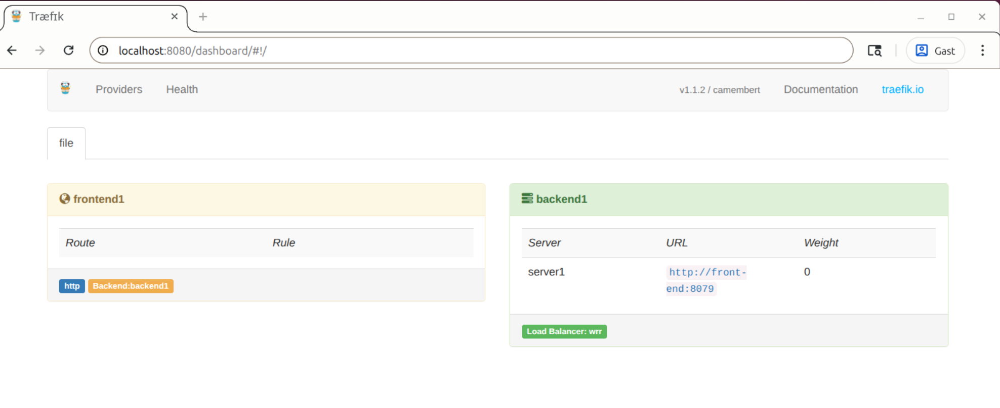
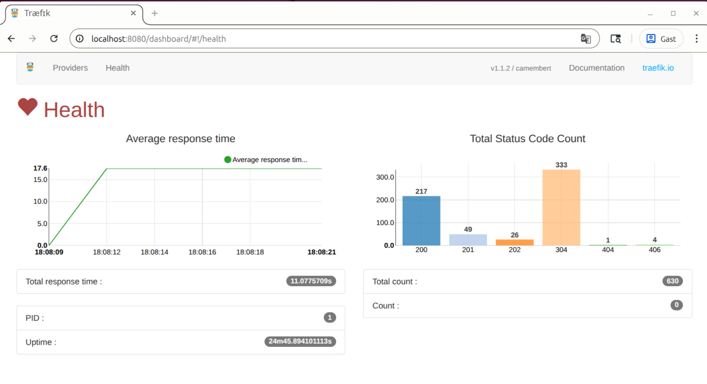
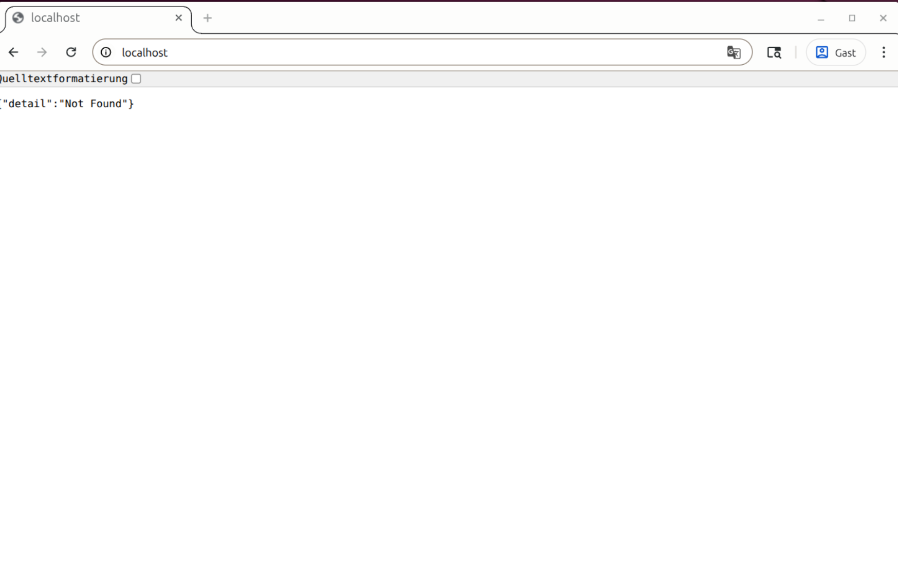
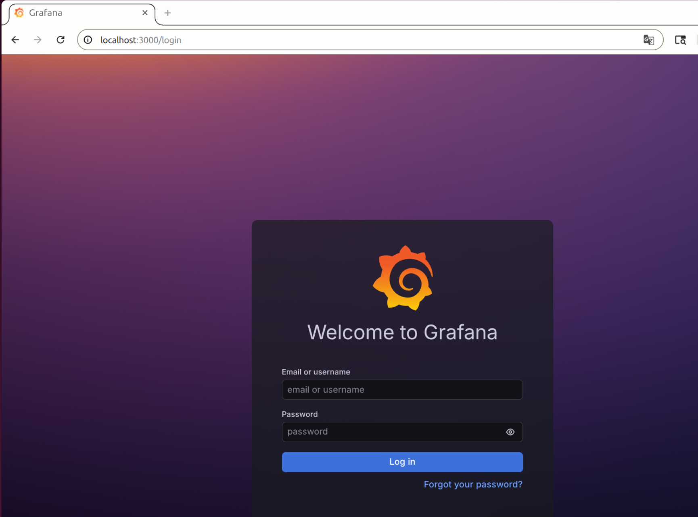
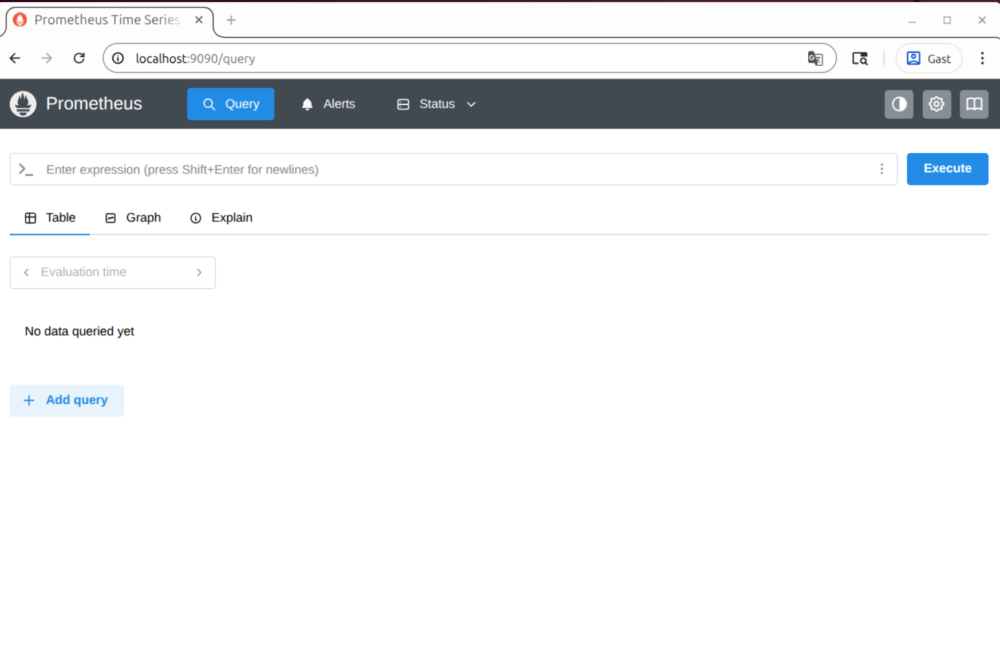
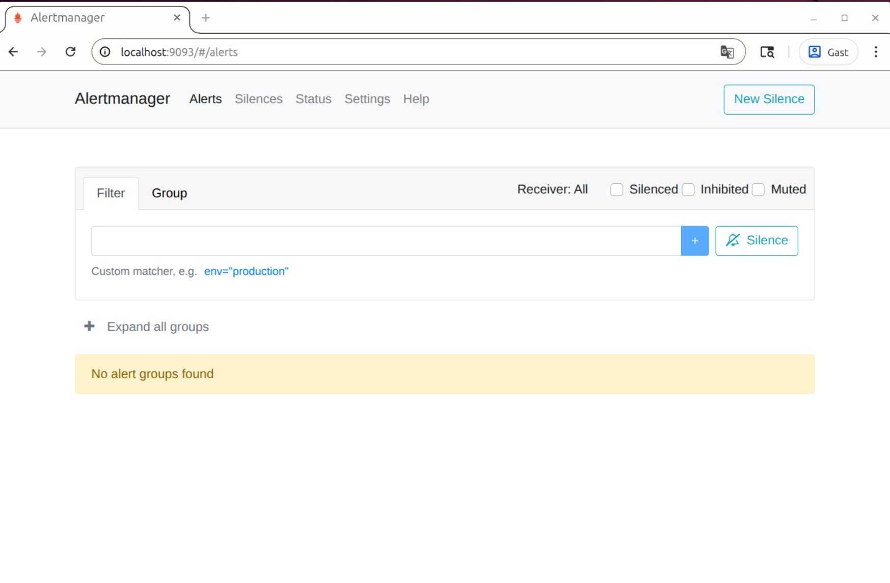
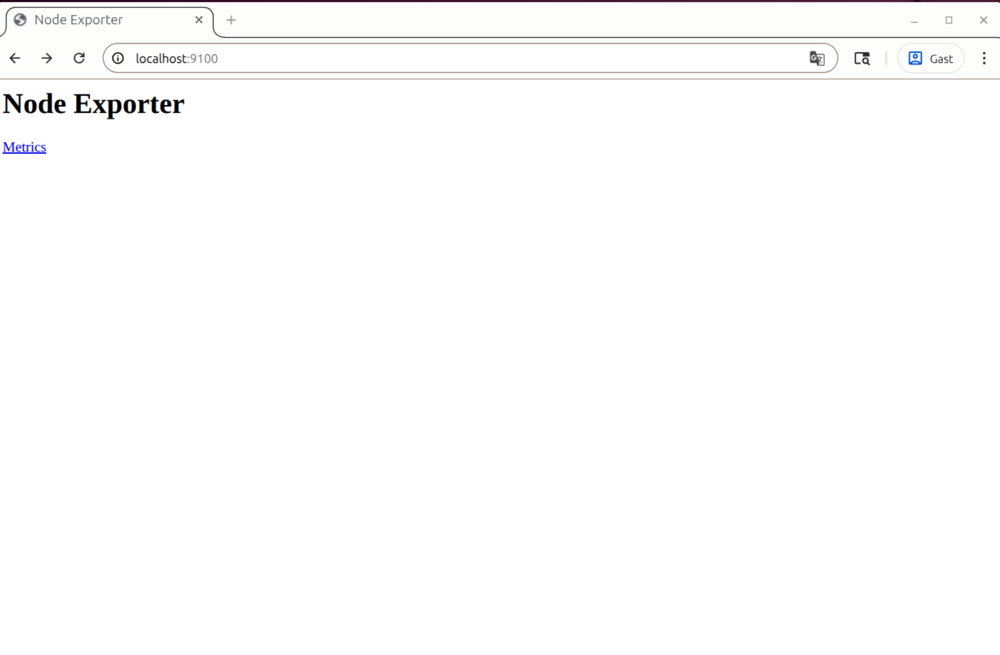

# 🧱 Implementation Log — Phase 00 (Baseline): Local poke-around + repo mapping

> ## 👤 About
> This document is my personal implementation log ("build diary") for **Phase 00 (Baseline)**.  
> It was written while setting up and validating the repo locally, to keep milestones, decisions, and commands reproducible.  
> For a "TL;DR command checklist and quick setup guide", see: **[00-baseline/RUNBOOK.md](RUNBOOK.md)**.

---

## 📌 Index (top-level)
- [Goal / Purpose](#goal--purpose)
- [Preconditions](#preconditions)
- [Step 0 — Sanity check: fork + remotes](#step-0--sanity-check-fork--remotes)
- [Step 1 — Inventory: Quick repo reconnaissance](#step-1--inventory-quick-repo-reconnaissance-which-deploy-stacks-already-exist)
- [Step 2 — Start the core stack with Docker Compose](#step-2--start-the-core-stack-with-docker-compose)
- [Step 3 — Determine entrypoints](#step-3--determine-entrypoints-storefront--router-admin-ui)
- [Step 4 — Diagnose and fix storefront reachability](#step-4--diagnose-and-fix-storefront-reachability-local-host-port-conflict)
- [Step 5 — Identify stateful components + persistence](#step-5--identify-stateful-components--persistence-dr-relevance)
- [Step 6 — Clean shutdown - stop & cleanup](#step-6--clean-shutdown---stop--cleanup)
- [Step 7 — Baseline observations and evidence](#step-7---baseline-observations-and-evidence-phase-00)
- [Sources](#sources)

---

## Goal / Purpose

**Baseline evidence and findings from local execution:** 

The baseline captures 
- that the forked repo is set up correctly (git remotes, branch, clean working tree),
- that the application can be started locally via Docker Compose (baseline run),
- what runs locally (containers + ports), 
- which deployment assets already exist (Kubernetes manifests/Helm, monitoring, policies, terraform), 
- and which issues block a working storefront entrypoint. 

The output (terminal outputs, conclusions, evidence artifacts like logs/screenshots etc.) is used for documentation, to justify decisions and to support project defense.

---

## Preconditions
- Repo fork exists and is cloned locally (`k8s-ecommerce-microservices-app`)
- Docker Engine + Docker Compose v2 available (`docker compose ...`)
- Commands are executed from `deploy/docker-compose/` (compose files live there)

**Local environment note:** host port `:80` may be occupied/intercepted (e.g., k3s); see **Step 4** for the local workaround.

---

## Step 0 — Sanity check: fork + remotes

**Rationale:** Ensures work happens on the fork (`origin`), while keeping the original repo (`upstream`) available as a read-only reference for optional updates.

### Check status + remotes 

~~~bash
$ git clone git@github.com:mayinx/k8s-ecommerce-microservices-app.git
$ cd k8s-ecommerce-microservices-app

$ git status
On branch master
Your branch is up to date with 'origin/master'.

$ git branch -vv
master 863ef7d [origin/master] Update README.md

$ git remote -v
origin  git@github.com:mayinx/k8s-ecommerce-microservices-app.git (fetch)
origin  git@github.com:mayinx/k8s-ecommerce-microservices-app.git (push)
~~~

Expected:
- `origin` points to the fork repo (`git@github.com:mayinx/k8s-ecommerce-microservices-app.git`)
- working tree clean

---

### Add upstream (source repo) + disable pushing to it

**Rationale:** Enables optional fetching of upstream changes while preventing accidental pushes to the source repo.

~~~bash
$ git remote add upstream git@github.com:DataScientest/microservices-app.git
$ git remote set-url --push upstream no_push
$ git remote -v
origin git@github.com:mayinx/k8s-ecommerce-microservices-app.git (fetch)
origin git@github.com:mayinx/k8s-ecommerce-microservices-app.git (push)
upstream git@github.com:DataScientest/microservices-app.git (fetch)
upstream no_push (push)
~~~

**Expected:**
- `upstream` fetch URL is present
- `upstream` push URL is `no_push`

---

## Step 1 — Inventory: Quick repo reconnaissance (which deploy stacks already exist?)

**Rationale:** Identifies what already exists (compose, Kubernetes manifests/Helm, monitoring/policies) so later work focuses on ownership, reproducibility, environments, CI/CD, IaC, and validation — not re-creating boilerplate. 

---

### Status (manual inspection)

The project has a local compose setup under `deploy/docker-compose/` and several K8s options available (Helm + manifests) as well as monitoring/policy manifests present:

#### Key paths 
- **Docker Compose:** 
    - `deploy/docker-compose/`
- **Kubernetes (Helm + manifests):** 
    - `deploy/kubernetes/helm-chart/`  
    - `deploy/kubernetes/manifests/`
- **Monitoring/Alerting (K8s):** 
    - `deploy/kubernetes/manifests-monitoring/`  
    - `deploy/kubernetes/manifests-alerting/`
- **NetworkPolicies (K8s):** 
    - `deploy/kubernetes/manifests-policy/`

#### To decide (later)
- Preferred Kubernetes deploy approach:  Helm vs manifests

---

## Step 2 — Start the core stack with Docker Compose

**Rationale:** Confirms the application runs in containers and exposes entrypoints (host ports) for initial troubleshooting (router/dashboard) and later documentation.

~~~bash
# The repo contains a compose deployment under `deploy/docker-compose/ 
$ cd deploy/docker-compose

# Start the core stack (services) in background (`-d` = detached)
$ docker compose -f docker-compose.yml up -d

# Show running containers/services, status + port mappings
$ docker compose ps
WARN[0000] The "MYSQL_ROOT_PASSWORD" variable is not set. Defaulting to a blank string. 
WARN[0000] /home/mayinx/PROJECTS/DataScientest/CAPSTONE/k8s-ecommerce-microservices-app/deploy/docker-compose/docker-compose.yml: the attribute `version` is obsolete, it will be ignored, please remove it to avoid potential confusion 
SERVICE         IMAGE                                    PORTS (host -> container)
edge-router     weaveworksdemos/edge-router:0.1.1        80->80, 8080->8080
grafana         grafana/grafana                          3000->3000
prometheus      prom/prometheus                          9090->9090
alertmanager    prom/alertmanager                        9093->9093
nodeexporter    quay.io/prometheus/node-exporter:v1.1.2  9100->9100
front-end       weaveworksdemos/front-end:0.3.12         (internal: 8079/tcp)
catalogue-db    weaveworksdemos/catalogue-db:0.3.0       (internal: 3306/tcp)
carts-db        mongo:3.4                                (internal: 27017/tcp)
orders-db       mongo:3.4                                (internal: 27017/tcp)
user-db         weaveworksdemos/user-db:0.4.0            (internal: 27017/tcp)
~~~

**Observed warnings (local):**
- **`MYSQL_ROOT_PASSWORD not set`**: 
  - The provided compose setup allows an empty MySQL root password for local convenience... 
  - This will be replaced with Secrets-managed credentials in the Kubernetes phase (and no empty-password allowance).
- **Obsolete `version`-key warning in `docker-compose.yml`**: 
  - This is informational only and has no functional impact; can be removed later to reduce noise  
- These warnings are acceptable for now, because this phase is baseline observation - not hardening (remediation is planned in the Kubernetes phase)

### Baseline service inventory (compose)

**Rationale:** A compact service inventory is reused later for Kubernetes deployment planning (service boundaries, dependencies, stateful components) and for the defense narrative.

~~~bash
$ docker compose ps --services
alertmanager
carts
carts-db
catalogue
catalogue-db
edge-router
front-end
grafana
orders
orders-db
payment
queue-master
rabbitmq
shipping
user
user-db
nodeexporter
prometheus
~~~

**Observed (grouped):**
- Router: `edge-router` (Traefik)
- App services: `front-end`, `catalogue`, `carts`, `orders`, `payment`, `shipping`, `user`, `queue-master`
- Datastores: `carts-db` (MongoDB), `orders-db` (MongoDB), `user-db` (MongoDB), `catalogue-db` (MySQL)
- Monitoring: `prometheus`, `grafana`, `alertmanager`, `nodeexporter`

### Service map 

The following service map summarizes responsibilities, dependencies, and which components are reachable via host ports vs. internal-only container networking (used later as a reference for Kubernetes resources and environment separation).

| Service | Role | Exposed on host | Depends on | Notes |
|--------|------|------------------|------------|------|
| edge-router | router / entrypoint | 80, 8080 | front-end | Traefik dashboard on 8080 |
| front-end | storefront UI | via edge-router | (n/a) | internal port 8079 |
| catalogue | catalogue API | (n/a) | catalogue-db | |
| catalogue-db | MySQL | (n/a) | (n/a) | root password warning in compose |
| carts | carts API | (n/a) | carts-db | |
| carts-db | MongoDB | (n/a) | (n/a) | |
| orders | orders API | (n/a) | orders-db | |
| orders-db | MongoDB | (n/a) | (n/a) | |
| user | user API | (n/a) | user-db | |
| user-db | MongoDB | (n/a) | (n/a) | |
| payment | payment API | (n/a) | (n/a) | |
| shipping | shipping API | (n/a) | (n/a) | |
| queue-master | queue orchestration | (n/a) | rabbitmq | |
| rabbitmq | message broker | (n/a) | (n/a) | |
| prometheus | metrics store | 9090 | scrape targets | |
| grafana | dashboards | 3000 | prometheus | |
| alertmanager | alert routing | 9093 | (n/a) | |
| nodeexporter | node metrics | 9100 | (n/a) | |

### Findings (baseline run)

To summarize the key outcomes of the local Docker Compose baseline run, including the container status output and the service inventory:

- Containers/services start successfully via Docker Compose (no crash loops observed in the provided `docker compose ps` output).
- `edge-router` exposes host ports `80->80` and `8080->8080` (entrypoint + Traefik dashboard).
- Monitoring endpoints are already part of the local stack (Grafana `3000`, Prometheus `9090`, Alertmanager `9093`, node-exporter `9100`).
- `front-end` is present but only exposes an internal container port (`8079/tcp`) and is expected to be reached via the router (`edge-router`).

### Requirements alignment note: Dockerize (baseline interpretation)

**Rationale:** The application is already containerized in upstream form (Docker Compose starts containers and pulls images successfully). The project contribution therefore focuses on **reproducibility and ownership** rather than creating containerization from scratch.    

Deliverables that satisfy the “Dockerize” requirement end-to-end (planned for later phases):
- **Baseline proof:** local container run via Docker Compose (this Step 2).
- **Owned build + publish:** build and push images to an owned registry via CI/CD (e.g., GHCR).
- **Environment separation:** dev/prod separation in Kubernetes with different configuration.
- **IaC:** infrastructure provisioning for the Proxmox-based target environment.
- **Operate like production:** monitoring, security measures, and DR/rollback evidence on the chosen target environment.
- **Optional extension (after all mandatory requirements are met):** add an owned service (e.g., `order-guard`) with its own Dockerfile, tests, image build, and deployment pipeline.

---

## Step 3 — Determine entrypoints (storefront + router admin ui)

**Rationale:** Compose only reveals which container ports are exposed on the host, not what each port does / what they are for. We need to determine which exposed ports correspond to (a) the application entrypoint and (b) router/admin UI, and confirm whether the storefront is reachable. 

The entrypoints are determined by observing behavior (browser redirect) and confirming with router logs/config.

### 3.1 Discover what port `:8080` actually serves (admin UI)

### 3.1.1 Confirm port purpose via Browser + curl

Opening `http://localhost:8080/` in a browser redirects to `http://localhost:8080/dashboard/#!/`, revealing that `:8080` serves the router admin UI (Traefik dashboard).

Terminal confirmation:
~~~bash
$ curl -i http://localhost:8080/
HTTP/1.1 302 Found
Location: /dashboard/
Content-Type: text/html; charset=utf-8

<a href="/dashboard/">Found</a>.

$ curl -s http://localhost:8080/dashboard/ | head -n 5
<!doctype html>
<html ng-app="traefik">
  <head>
    <meta charset="utf-8">
    <title>Træfɪk</title>
~~~

Notes:
- http://localhost:8080/ performs a redirect and serves the Traefik dashboard as expected. The actual dashboard UI is served under `/dashboard/` and uses hash routing (`#!/`) in the browser (http://localhost:8080/dashboard/#!/).

---

**Evidence:**
- Screenshots of Traefik dashboard showing the current frontend/route + health state.

*Figure 1: Traefik dashboard (router admin UI) reachable on port 8080 (http://localhost:8080/dashboard/#!/)*

*Figure 2: Traefik dashboard health/status view ([port 8080](http://localhost:8080/dashboard/#!/health))*

---

### 3.1.2 Confirm router implementation + bound ports via logs (baseline evidence)

**Rationale:** Record baseline router facts from the running container (router implementation, bound ports, and active config source) so later steps can rely on them without guessing.

> **Info: Traefik**
> Traefik is a reverse proxy/router (“edge router”) that receives HTTP requests and forwards them to internal services based on routing rules. In this repo, the edge-router container is expected to run Traefik and expose (a) an HTTP entrypoint and (b) a dashboard/API — the logs below confirm the exact ports and config source.

~~~bash
# Display logs of edge-router service 
$ docker compose logs -f --tail=200 edge-router
WARN[0000] The "MYSQL_ROOT_PASSWORD" variable is not set. Defaulting to a blank string. 
WARN[0000] /home/mayinx/PROJECTS/DataScientest/CAPSTONE/k8s-ecommerce-microservices-app/deploy/docker-compose/docker-compose.yml: the attribute `version` is obsolete, it will be ignored, please remove it to avoid potential confusion 
edge-router-1  | ... level=info msg="Traefik version v1.1.2 built on 2016-12-15_10:21:15AM" 
edge-router-1  | ... level=info msg="Using TOML configuration file /etc/traefik/traefik.toml" 
edge-router-1  | ... level=info msg="Preparing server http &{Network: Address::80 TLS:<nil> Redirect:<nil> Auth:<nil> Compress:false}" 
edge-router-1  | ... level=info msg="Starting provider *provider.File {\"Watch\":true,\"Filename\":\"/etc/traefik/traefik.toml\",\"Constraints\":null}" 
edge-router-1  | ... level=info msg="Starting provider *main.WebProvider {\"Address\":\":8080\",\"CertFile\":\"\",\"KeyFile\":\"\",\"ReadOnly\":false,\"Auth\":null}" 
edge-router-1  | ... level=info msg="Starting server on :80" 
edge-router-1  | ... level=info msg="Server configuration reloaded on :80" 
edge-router-1  | ... level=warning msg="Error checking new version: Get https://update.traefik.io/repos/containous/traefik/releases: x509: certificate signed by unknown authority" 
~~~

**Observed (from logs):** 

Notable log lines which confirm which ports Traefik binds and which config file is active:

- **Router implementation:** 
  - edge-router runs Traefik (reverse proxy/router).
- **Storefront entrypoint**:
  - `Preparing server http ... Address::80` + `Starting server on :80`: 
  - → Traefik’s HTTP entrypoint binds container `:80` (storefront traffic should enter here).
- **Admin UI / API**:
  - `Starting ... WebProvider ... Address ":8080"`:
  -  → Traefik dashboard/API binds `:8080`.
- **Routing config source:**
  - `Using TOML configuration file /etc/traefik/traefik.toml`:
  -  → Traefik loads routing config from this file (baseline config source).

**Additional note (non-functional for routing):**  
- `x509: certificate signed by unknown authority`:
   → only affects Traefik’s update check, not local routing function.

### 3.2 Check storefront reachability on `:80` (initial attempt)

~~~bash
$ curl -I http://localhost
HTTP/1.1 404 Not Found
Content-Type: application/json
Server: uvicorn
...

$ curl -s http://localhost
{"detail":"Not Found"}
~~~

**Observed:**
- `:8080` serves the router admin UI/ (Traefik dashboard under `/dashboard/#!/`).
- **But:** `http://localhost/` on host port `:80` does not reach the storefront (returns 404 with JSON `{"detail":"Not Found"}`).
  - **uvicorn → not Traefik:** The response header indicate `Server: uvicorn`, which strongly suggests the request did not hit Traefik at all (Traefik would typically not identify as uvicorn).
  - **Conclusion** (since Traefik seems not to be involved at all): This looks like a *host-level port interception/conflict* on `:80`, not an application routing issue inside Traefik.

*Figure 3: Storefront not reachable on http://localhost host port 80 (unexpected response; request does not hit Traefik but is processed by uvicorn)*

### 3.3. Fazit: Entry points snapshot 

- Storefront entrypoint on host port `80` (initially expected, but broken): `http://localhost/` (host port 80 later found to be intercepted by local k3s, see Step 4)  
- Router admin UI: `http://localhost:8080/dashboard/#!/`  
- Grafana: `http://localhost:3000/`  
- Prometheus: `http://localhost:9090/`  
- Alertmanager: `http://localhost:9093/`  
- Node exporter: `http://localhost:9100/`
---

## Step 4 — Diagnose and fix storefront reachability (local host port conflict)

**Rationale:** The router (Traefik) is running (dashboard reachable on :8080), but the host request to http://localhost/ on :80 returns JSON with Server: uvicorn, suggesting the request is not hitting Traefik at all - i.e. host port `:80` traffic is not reaching Docker’s published port and is being intercepted by another local component (in this local environment: k3s/CNI hostport rules). The goal is to (a) prove the mismatch and (b) apply a minimal local workaround for “poke-around mode”.

### 4.1 Prove that Traefik serves the storefront inside the Docker network

**Rationale:** In this setup, `edge-router` (Traefik) listens on container port `:80` as the HTTP entrypoint and is expected to forward requests to the storefront service on `front-end:8079`. We verify both paths: 
- (1) Via Traefik (`edge-router:80` → `front-end:8079`)  
- (2) Directly (`front-end:8079`). 
Both should return storefront HTML if routing + service health are OK.

~~~bash
# Inside the 'edge-router' container: request Traefik on 127.0.0.1:80
# -> proves Traefik is listening on :80 AND successfully forwards to the storefront (returns storefront HTML)
$ docker compose exec edge-router sh -lc 'wget -qO- http://127.0.0.1:80/ | head -n 5'
<!DOCTYPE html>
<html lang="en">

<head>

# Inside the 'edge-router' container: request the storefront service directly via Compose DNS
# -> proves the front-end service is reachable and serving HTML on front-end:8079
$ docker compose exec edge-router sh -lc 'wget -qO- http://front-end:8079/ | head -n 5'
<!DOCTYPE html>
<html lang="en">

<head>
~~~

**Observed:**
- Both commands return HTML (`<!DOCTYPE html> ...`) → (1) Traefik routing inside the compose network works + (2) `front-end` is reachable directly: 
  - (1) wget (inside `edge-router`) → Traefik entrypoint `127.0.0.1:80` → forwards to `front-end:8079` → returns HTML
  - (2) wget (inside `edge-router`) → direct to `front-end:8079` → returns HTML
- Therefore, the missing storefront on host `:80` is *not* caused by Traefik routing rules nor a broken front-end-container.

### 4.2 Prove interception: Docker publishes :80 to edge-router, but localhost :80 responds from elsewhere

**Rationale:** Identify where Docker actually forwards host `:80` and whether host-level NAT rules override that forwarding.

~~~bash
# Which process currently owns host TCP/80?
# Show which process is listening on host TCP port 80 (usually docker-proxy when Docker publishes a container port).
# (if successful, confirms log evidence from Step 3.1.2 that Traefik binds :80)
$ sudo ss -ltnp | grep ':80 '
LISTEN 0      4096         0.0.0.0:80         0.0.0.0:*    users:(("docker-proxy",pid=504519,fd=7))  

# Which container IP:port is host TCP/80 forwarded to?
# (Use the PID from the previous output.)
# Print the docker-proxy command line so we can see which container IP:port host :80 is forwarded to.
$ sudo tr '\0' ' ' < /proc/504519/cmdline; echo
/usr/bin/docker-proxy -proto tcp -host-ip 0.0.0.0 -host-port 80 -container-ip 172.20.0.9 -container-port 80 -use-listen-fd
~~~

> **docker-proxy** is a small Docker helper process that binds a host port and forwards traffic to a container IP:port when ports are published (e.g., 0.0.0.0:80 -> 172.20.0.9:80). To be precise: docker-proxy is Docker’s userland port-forwarding helper; the daemon can enable/disable this behavior via --userland-proxy.
> On some systems, Docker may also rely more on iptables/nftables NAT; either way, the goal here is to confirm where host :80 should go.

**Observed:**
- **docker-proxy forwards host `0.0.0.0:80` → `172.20.0.9:80` (edge-router container).**

**Direct container-IP access works:**

~~~bash
# Direct request to the edge-router container IP (bypasses localhost routing on the host)
# --noproxy '*' ensures this request does not go through any HTTP proxy settings
$ curl --noproxy '*' -s http://172.20.0.9:80/ | head -n 5
<!DOCTYPE html>
...
~~~

**But localhost port 80 behaves differently:**
~~~bash
# Hit local port 80 directly:
$ curl --noproxy '*' -I http://127.0.0.1/
HTTP/1.1 404 Not Found
Server: uvicorn
...
~~~

**Conclusion:** Host traffic to 127.0.0.1:80 is not reaching Docker’s published port mapping - it is intercepted/rewritten before reaching docker-proxy / the container.

### 4.3 Optional: Identify the interceptor (local k3s hostport NAT)

Strictly speaking, we can work around the issue locally by switching to `8081:80` without inverstigating the cause any further (see the following Step 4.4). This step is optional and documents why host `:80` did not reach Docker on this machine.

**Rationale:** After Step 4.2 we know Docker publishes host `:80` to the `edge-router` container, but `curl http://127.0.0.1/` still hits `uvicorn`.  
That mismatch strongly suggests a **host-level NAT/DNAT rule** rewrites traffic to `:80` before it reaches Docker’s forwarding path.

**Suspect:** On this machine, `k3s` is installed and running, and Kubernetes networking (CNI) can install hostport/service NAT rules that affect host ports like `:80`.

> **What is “CNI NAT”?** 
> CNI = Container Network Interface: the networking layer/plugin used by Kubernetes distributions (like k3s) to wire pods/services to the host network.
> NAT / DNAT = Network Address Translation / Destination NAT: rules that can rewrite “traffic to host :80” into “traffic to some other internal IP:port”.

~~~bash
# Is k3s running on this machine?
# - systemctl list-units --type=service → lists running services  
# - grep -Ei 'k3s' checks whether k3s is active (case-insensitive, extended regex) 
$ sudo systemctl list-units --type=service | grep -Ei 'k3s'
k3s.service loaded active running Lightweight Kubernetes

# Show K8s CNI NAT rules involving TCP dport 80 (k3s/CNI + docker)
# - nft list ruleset → prints the active nftables ruleset (filter + NAT tables).
# - grep -nE '...' → filters for lines relevant to port 80 / DNAT and shows line numbers (-n) using extended regex (-E).
$ sudo nft list ruleset | grep -nE 'CNI-HOSTPORT|KUBE-|tcp dport 80' | head -n 80
...
83:     chain KUBE-SERVICES {
140:    chain CNI-HOSTPORT-SETMARK {
148:    chain CNI-HOSTPORT-DNAT {

154:            ip saddr 127.0.0.1 tcp dport 80 counter packets 0 bytes 0 jump CNI-HOSTPORT-SETMARK
155:            tcp dport 80 counter packets 0 bytes 0 dnat to 10.42.0.154:80
...

~~~

**Observed:**
- `k3s.service ... Lightweight Kubernetes` is active (Kubernetes networking is present on this host).
- `CNI-HOSTPORT-*` and `KUBE-*` chains exist (installed by Kubernetes/k3s networking).
- `nftables` shows a `CNI HOSTPORT DNAT` rule for `tcp dport 80` (e.g. `dnat to 10.42.x.x:80`).
- This supports the hypothesis that host :80 can be intercepted by k3s/CNI rules, explaining why 127.0.0.1:80 did not reach Docker’s published port in the initial attempt.

> **KUBE, HOSTPORT, SETMARK?**
> KUBE = Kubernetes-related iptables/nftables chains that Kubernetes installs to implement Services (ClusterIP/NodePort), load-balancing to pods + NAT/masquerading rules
> HOSTPORT = feature where a pod can bind a port on the host (e.g. host :80) and forward to a pod.
> SETMARK = sets a packet “mark” (a tiny tag) so later rules can treat those packets specially (often to apply NAT/masquerading consistently).
> CNI-HOSTPORT-SETMARK = “mark traffic that is going through Kubernetes hostport handling”
> CNI-HOSTPORT-DNAT = “rewrite destination from host:port → podIP:port”

### 4.4 Minimal local workaround: change host port mapping for edge-router (keep container port 80)

**Rationale:** On this machine, host port `:80` is intercepted by local Kubernetes/k3s networking rules, so the Docker-published port is not reached. For local poke-around, the simplest fix is to avoid host port `:80` entirely and publish the edge-router container’s port 80 on a different host port (e.g., `8081`), exposing the storefront on `http://localhost:8081/`. This avoids changing the application and avoids stopping k3s.

> This is a quick proof-of-fix by directly editing docker-compose.yml. In Step 4.5 we switch to a local override file to keep the upstream/default compose file unchanged

**Proof-of-fix - change `edge-router` port mapping (temporary compose change):**

~~~yaml
  # deploy/docker-compose/docker-compose.yml
  # ...
  edge-router:
    image: weaveworksdemos/edge-router:0.1.1
    ports:
      - '8081:80'    # local-only: avoid host :80 interception/conflict
      - '8080:8080'  # Traefik dashboard (unchanged)
      # ...
~~~

Apply the change by recreating only the router container:

~~~bash
$ docker compose up -d --force-recreate edge-router
~~~

Verify:

~~~bash
$ curl -s http://127.0.0.1:8081/ | head -n 3; echo
<!DOCTYPE html>
<html lang="en">
~~~

**Expected:**
- **HTML output (`<!DOCTYPE html> ...`)**
- **Storefront reachable at `http://localhost:8081/`**:

**Evidence:**

*Figure 4: Storefront reachable via local workaround port 8081 (http://localhost:8081/)*

---

### 4.5 Be a pro — use `docker-compose.local.yml` (for local-only override)

**Rationale:** The upstream default compose file expects the storefront on host port `:80`. On this machine, host `:80` is intercepted (k3s/CNI hostport rules), so the safest approach is a **local-only** override file that changes only the host port mapping for local execution — without permanently modifying the upstream `docker-compose.yml`.

#### 4.5.1 Create local override file

- Revert the `ports:`-change from Step 4.4 in `docker-compose.yml` back to the upstream default (`80:80` + `8080:8080`) 
- Create the override file `deploy/docker-compose/docker-compose.local.yml`:

~~~yaml
services:
  edge-router:
    ports:
      - "8081:80"    # local-only: avoid host :80 interception/conflict
      - "8080:8080"  # Traefik dashboard (unchanged)
~~~

Notes:
- This override changes only the `edge-router` port publishing (container ports stay unchanged).
- Docker Compose automatically merges multiple compose files when listed via the `-f`-flag; later files override earlier ones. This can be used to apply the override only locally: 

#### 4.5.2 Start stack with the local override

Run compose locally with **both** files:

~~~bash
$ cd deploy/docker-compose
$ docker compose -f docker-compose.yml -f docker-compose.local.yml up -d
~~~

#### 4.5.3 Verify storefront on the workaround port

~~~bash
$ curl -s http://127.0.0.1:8081/ | head -n 3; echo
<!DOCTYPE html>
<html lang="en">
~~~

#### 4.5.4 (Optional) Stop with the same file set

~~~bash
$ docker compose -f docker-compose.yml -f docker-compose.local.yml down
~~~

**Outcome:** When it comes to `docker-compose.yml`, the repo remains identical to its upstream/default version, while local poke-around uses `docker-compose.local.yml` to expose the storefront on http://localhost:8081/.”.

---

## Step 5 — Identify stateful components + persistence (DR relevance)

**Rationale:** Disaster Recovery (DR) depends on stateful components (databases/queues) and whether data is persisted via volumes.

### Identified stateful services (from compose + running stack)

**Observed stateful components:**
- MongoDB: `carts-db`, `orders-db`, `user-db`
- MySQL: `catalogue-db`
- RabbitMQ: `rabbitmq`

### Check where volumes are used
**Rationale:** Quickly reveals which services persist data or mount host resources. 

~~~bash
# Use grep to inspect compose files for volumes 
grep -n "volumes:" docker-compose*.yml || true
docker-compose.monitoring.yml:7:        volumes:
docker-compose.monitoring.yml:24:        volumes:
docker-compose.monitoring.yml:36:        volumes:
docker-compose.monitoring.yml:58:      volumes:
docker-compose.yml:114:    volumes:
~~~

**Observed:**
- Volumes are present (including docker socket mount for `queue-master`, and volumes in monitoring compose).

To record after baseline: 
- Whether DB uses **named volumes (persistence) or ephemeral storage**

---

## Step 6 — Clean shutdown - stop & cleanup 

**Rationale:** Leaves the machine in a known state. Default stop keeps volumes; reset removes volumes.

### Default stop (keeps volumes)
~~~bash
$ cd deploy/docker-compose
$ docker compose -f docker-compose.yml down
~~~

### Full reset (also removes named volumes)
~~~bash
$ docker compose -f docker-compose.yml down -v
~~~

If monitoring/logging overlays were started, include them in the down command (optional):
~~~bash
$ docker compose -f docker-compose.yml -f docker-compose.monitoring.yml down
$ docker compose -f docker-compose.yml -f docker-compose.logging.yml down
~~~

## Step 7 - Baseline observations and evidence (Phase 00)

### Observations
- Router admin UI (Traefik dashboard) is reachable at `http://localhost:8080/dashboard/#!/`.
- Monitoring endpoints are reachable when monitoring services are running:
  - Grafana `http://localhost:3000/`
  - Prometheus `http://localhost:9090/`
  - Alertmanager `http://localhost:9093/`
  - Node exporter `http://localhost:9100/`

- **Storefront on host port `:80` was initially not reachable** on this machine (`{"detail":"Not Found"}` with `Server: uvicorn`).
- **Root cause:** Local k3s/CNI hostport rules intercept host `:80` (DNAT), so host traffic does not reach Docker’s published port.
- **Local workaround for baseline poke-around:** Publish edge-router container port 80 on host port `8081` (via local docker compose override - see `docker-compose.local.yml`) → **storefront now reachable at `http://localhost:8081/`**. 

### Evidence (monitoring endpoints)

*Figure 5: Grafana reachable on port 3000 (http://localhost:3000/)*

*Figure 6: Prometheus reachable on port 9090 (http://localhost:9090/)*

*Figure 7: Alertmanager reachable on port 9093 (http://localhost:9093/)*

*Figure 8: node-exporter reachable on port 9100 (http://localhost:9100/)*

### Evidence summary (Phase 00)

#### Repo setup (fork + remotes):

- `git clone git@github.com:mayinx/k8s-ecommerce-microservices-app.git` (fork)
- `git status`
- `git branch -vv`
- `git remote -v`
- `git remote add upstream git@github.com:DataScientest/microservices-app.git`
- `git remote set-url --push upstream no_push`
- `git remote -v` (verify upstream fetch + no_push push)

#### Startup + baseline inventory:

- `cd deploy/docker-compose`
- `docker compose -f docker-compose.yml up -d`
- `docker compose ps`
- `docker compose ps --services`

#### Router/admin UI verification:
- `curl -i http://localhost:8080/`
- `curl -s http://localhost:8080/dashboard/ | head -n 5`

#### Storefront check (initial attempt on host :80):
- `curl -I http://localhost`
- `curl -s http://localhost`

#### Internal proof (storefront works inside compose network):
- `docker compose exec edge-router sh -lc 'wget -qO- http://127.0.0.1:80/ | head -n 5'`
- `docker compose exec edge-router sh -lc 'wget -qO- http://front-end:8079/ | head -n 5'`

#### Host port conflict proof (Docker publishes :80 but host traffic is intercepted):
- `sudo ss -ltnp | grep ':80 '`
- `sudo tr '\0' ' ' < /proc/<docker-proxy-pid>/cmdline; echo`
  - use docker-proxy-pid resulting from `sudo ss -ltnp | grep ':80 '` - e.g.: `sudo tr '\0' ' ' < /proc/504519/cmdline; echo`
- `curl --noproxy '*' -s http://<edge-router-container-ip>:80/ | head -n 5`
- `sudo systemctl list-units --type=service | grep -Ei 'k3s'`
- `sudo nft list ruleset | grep -nE 'CNI-HOSTPORT|KUBE-|tcp dport 80' | head -n 80`

#### Local-only workaround applied (storefront on :8081):
- `docker compose -f docker-compose.yml -f docker-compose.local.yml up -d`
- `curl -s http://127.0.0.1:8081/ | head -n 3; echo`

#### Endpoints verified:
  - `http://localhost:8081/` (storefront, local workaround port)
  - `http://localhost:8080/dashboard/#!/` (Traefik dashboard)
  - `http://localhost:3000/` (Grafana)
  - `http://localhost:9090/` (Prometheus)
  - `http://localhost:9093/` (Alertmanager)
  - `http://localhost:9100/` (node-exporter)

#### Artifacts captured:
  - Screenshots under `docs/00-baseline/evidence/`

---

## Sources

### Docker Compose (multiple files / overrides)
- Docker Docs — Using multiple Compose files (overview + patterns):  
  https://docs.docker.com/compose/how-tos/multiple-compose-files/
- Docker Docs — Merge Compose files (why later files override earlier ones; `-f` workflow):  
  https://docs.docker.com/compose/how-tos/multiple-compose-files/merge/

### Docker port publishing + docker-proxy / userland proxy
- Docker Docs — `dockerd` CLI reference (includes `--userland-proxy` / userland-proxy behavior):  
  https://docs.docker.com/reference/cli/dockerd/
- (Linux) `ss(8)` man page — what `ss -ltnp` shows and what the flags mean:  
  https://man7.org/linux/man-pages/man8/ss.8.html  

### Traefik v1 (edge-router) + TOML config format
- Traefik v1 docs — File backend/provider config (frontends/backends/routes; TOML examples):  
  https://doc.traefik.io/traefik/v1.7/configuration/backends/file/
- Traefik v1 docs — Global configuration / commons (context + option structure):  
  https://doc.traefik.io/traefik/v1.7/configuration/commons/
- TOML format (what TOML is; syntax basics):  
  https://toml.io/en/

### Kubernetes / k3s networking: CNI, hostport, NAT chains (`CNI-HOSTPORT-*`, `KUBE-*`)
- CNI `portmap` plugin docs (explains hostport DNAT/SNAT and chains like `CNI-HOSTPORT-DNAT` / `CNI-HOSTPORT-SETMARK`; matches the `nft` output shown in Step 4.3):  
  https://www.cni.dev/plugins/current/meta/portmap/
- kube-proxy / iptables chain deep dive (explains chains like `KUBE-SERVICES`, `KUBE-NODEPORTS`, etc.):  
  https://learncloudnative.com/blog/2023-05-31-kubeproxy-iptables
- nftables reference (what `nft list ruleset` is; how NAT rules are represented):  
  https://www.netfilter.org/projects/nftables/manpage.html

### Git (fork workflow / upstream remote / preventing pushes)
- `git-remote` manual (add/list remotes; `set-url`):  
  https://git-scm.com/docs/git-remote

### MySQL “root password” warning context (why empty passwords are a local-only convenience)
- Docker Official Image docs — MySQL environment variables incl. `MYSQL_ROOT_PASSWORD`:  
  https://hub.docker.com/_/mysql/  