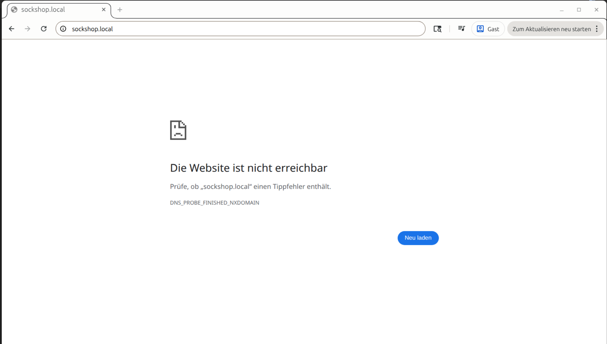

# 🧱 Implementation Log — Phase 02 (Ingress Baseline): Host-based Traefik routing to the Sock Shop storefront

> ## 👤 About
> This document is the implementation log and detailed project build diary for **Phase 01 (Ingress Baseline)**.  
> It records the full implementation path including rationales, key observations, corrections, verification steps, and evidence pointers so the work remains auditable and reproducible.  
> For a shorter, reproducible "TL;DR command checklist and quick setup guide", see: **[02-ingress-baseline/RUNBOOK.md](RUNBOOK.md)**.

---

## 📌 Index (top-level)

- [**Purpose / Goal**](#purpose--goal)
- [**Definition of done (Phase 02)**](#definition-of-done-phase-02)
- [**Preconditions**](#preconditions)
- [**Step 0 — Re-confirm the Phase 01 baseline**](#step-0--re-confirm-the-phase-01-baseline)
- [**Step 1 — Triage the ingress surface before changing anything**](#step-1--triage-the-ingress-surface-before-changing-anything)
- [**Step 2 — Create a minimal local ingress manifest**](#step-2--create-a-minimal-local-ingress-manifest)
- [**Step 3 — Apply the ingress and inspect the created object**](#step-3--apply-the-ingress-and-inspect-the-created-object)
- [**Step 4 — Verify host-based routing before editing `/etc/hosts`**](#step-4--verify-host-based-routing-before-editing-etchosts)
- [**Step 5 — Add local name resolution for browser use**](#step-5--add-local-name-resolution-for-browser-use)
- [**Step 6 — Cleanup / rollback**](#step-6--cleanup--rollback)
- [**Baseline observations and evidence (Phase 02)**](#baseline-observations-and-evidence-phase-02)
- [**Sources**](#sources)

---

## Purpose / Goal

### Transition from Port-Based to Host-Based Access (NodePort => Ingress)

- The goal is to utilize **Ingress** to implement a **single production-grade storefront entrypoint**, which requires **host-based routing** via **standard HTTP/HTTPS ports (`80`/`443`)**. 
- This transitions the architecture from **restricted port-based access (NodePort)** to a **professional domain-driven storefront (`http://sockshop.local/`)**, mimicking real-world DNS environments. 
- Host-based routing (e.g. `sockshop.local`) provides a **stable, domain-like access path on `:80`** and eliminates “port juggling” when managing NodePorts.
- Host-based routing with standard HTTP(S)-ports can't be achieved with a simple **ISO/OSI-Layer 4 NodePort**, which lacks the advanced **ISO/OSI-Layer 7 routing capabilities** necessary for host-matching and is restricted to non-standard port-ranges (`30000`+)    

### Technical Implementation: Layer 7 Routing via Traefik Ingress

- Utilizing **Ingress** with the pre-installed **k3s Traefik Ingress Controller** gives us **ISO/OSI-Layer 7 Traffic Control**, enabling the host-matching required to route traffic based on domain names (HTTP Host headers) rather than just IP/Port combinations.
- At the same time, we profit from the fact, that Ingress is "Namespace-aware": Ingress resources live inside their specific namespace. Using Ingress solves the lack of isolation NodePort suffers with its collision-prone cluster-wide NodePort allocations.   
- This gives us a single "Front Door" (Port 80), making it conflict-safe and production-like.
- Phase 02 implements this production-like entrypoint by **routing the Sock Shop `front-end` service** through the **local k3s Traefik Ingress controller** 

### Keep NodePort `30001` as a proven fallback

- We will maintain the solution from the previous phase (NodePort 30001) as a proven fallback entrypoint.
- This ensures the transition is low-risk and rollback-friendly; the Ingress layer can be modified or removed without disrupting the already functional baseline.

> **🛡️ Security Note (for production): NodePort must be patched to ClusterIP** 
> 
> While NodePort is essential for the local validation phase, it is considered a temporary "bridge." 
> In a finalized production environment (e.g., Proxmox or Cloud), this Service must be patched to type: ClusterIP to "close the hole" and ensure all traffic is strictly governed by the Ingress Controller.

> **🧩 Info box — Ingress & host-based routing**
>
> An **Ingress** is a **Kubernetes API object for HTTP(S) routing to Services** that works in combination with an **Ingress controller** (in our case, Traefik). While the object acts as a "routing manifest", the actual routing decision & traffic redirection is performed by an Ingress controller. This controller "watches" the cluster for new Ingress and Service manifests; when it detects a relevant configuration, it automatically updates its internal rules to handle the traffic. 
>
> In this implementation phase, we are going to utilize **host-based routing**, based on a new `front-end`-ingress-manifest: Traefik inspects the HTTP `Host` header (`sockshop.local`) of an incoming request and forwards the request - based on the mapping defined in the manifest - to the associated backend Service (`front-end:80`). 
>
> This approach is more conflict-safe than NodePort because it routes traffic based on domain names and paths. This allows multiple services (e.g., the storefront, an API, or a dashboard) to share the same standard ports (80/443) without requiring unique, cluster-wide port allocations.

---

## Definition of done (Phase 02)

- A **Kubernetes `Ingress` object exists** in the `sock-shop` namepace
- The Ingress uses the **`traefik` ingress class** explicitly
- **Requests with host `sockshop.local`** are routed to the **`front-end` Service on port `80`**
- **Browser access works via `http://sockshop.local/`** 
- **Rollback/Fallback** is documented and leaves the Phase 01 NodePort fallback intact

---

## Preconditions

- Phase 01 baseline already works (`http://localhost:30001/` returns the storefront) 
- k3s Traefik is running in the cluster
- The chosen host name (`sockshop.local`) is not already used by another Ingress rule in the cluster

---

## Step 0 — Re-confirm the Phase 01 baseline

**Rationale:** Before adding ingress / a new routing layer we confirm quickly that the previous baseline (Phase 01 - Local k3s basline NordPort) still works. 

~~~bash
# Confirm the cluster is reachable
kubectl get nodes -o wide

# Confirm Sock Shop workloads still run in the dedicated namespace
kubectl get pods -n sock-shop

# Confirm the storefront Service still exists on the known NodePort
kubectl get svc -n sock-shop front-end -o wide

# Confirm the known fallback entrypoint still works
curl -I http://localhost:30001/
curl -s http://localhost:30001/ | head -n 5
~~~

**Observed result:**

- The local k3s node was `Ready`
- All Sock Shop pods in namespace `sock-shop` were `Running`
- `front-end` was still exposed as `80:30001/TCP`
- `curl` returned `HTTP/1.1 200 OK` and storefront HTML

**Conclusion:**

The application baseline remains healthy. It is safe to proceed with ingress:

---

## Step 1 — Triage the ingress surface before changing anything

**Rationale:** First we confirm that Traefik really is the active ingress controller on this k3s node and that no conflicting Ingress resources already exist.

~~~bash
# Show available ingress classes
kubectl get ingressclass

# Confirm Traefik components exist
kubectl get pods -A | grep -i traefik
kubectl get svc -A | grep -i traefik

# Show current Ingress resources across the cluster
kubectl get ingress -A -o wide

# Test what currently answers on port 80 with an unknown Host header
curl -I -H 'Host: does-not-exist.local' http://127.0.0.1/
curl -I -H 'Host: does-not-exist.local' http://192.168.178.57/
~~~

**Observed result:**

- `kubectl get ingressclass` showed `traefik`
- Traefik was running in `kube-system`
- The Traefik Service was present as a `LoadBalancer` and advertised external IP `192.168.178.57`
- `kubectl get ingress -A -o wide` returned **no existing Ingress resources**
- Requests to port `80` with an unknown Host returned **`HTTP/1.1 404 Not Found`** on both `127.0.0.1` and `192.168.178.57`

**Conclusion:**

This was the expected pre-change signal: port `80` was already answered by Traefik, but no matching ingress rule existed yet. The ingress surface was therefore clean and ready for one minimal host-based rule.

---

## Step 2 — Create a minimal local ingress manifest

**Rationale:** To avoid changing the existing `front-end` Service for this local ingress-baseline, we need to create a dedicated `front-end-ingress.yml`-manifest file  
This keeps the upstream defaults as is - and preserves the Phase 01 NodePort fallback.

We place this new "local-only" ingress manifest file in `deploy/kubernetes/manifests-local/phase-02-front-end-ingress.yaml` with the following contents:

~~~yaml
# deploy/kubernetes/manifests-local/phase-02-front-end-ingress.yaml

apiVersion: networking.k8s.io/v1
kind: Ingress
metadata:
  name: front-end                 # Ingress object name (identifies this HTTP routing rule inside the namespace)
  namespace: sock-shop            # Creates the Ingress in the same namespace as the front-end Service (must match)
spec:
  ingressClassName: traefik       # Identifies which Ingress controller should handle this resource (here: Traefik)
  rules:
    - host: sockshop.local        # Host-based routing rule: matches only requests with the HTTP Host header "sockshop.local"
      http:
        paths:
          - path: /               # Root path rule / catch-all: covers the application from "/" onward
            pathType: Prefix      # Prefix match: matches any URL starting with the defiend path "/" (all sub-paths are routed here)
            backend:
              service:
                name: front-end   # The target Service to forward traffic to: the existing front-end Service (defined in 10-front-end-svc.yaml)
                port:
                  number: 80      # The internal Service port (NOT the NodePort) to forward traffic to (Traefik -> Service:80 -> Pod:8079 per upstream svc)

~~~

**Key points:**

- the **intended traefik controller is set** (`ingressClassName: traefik`)
- the backend points to the existing `front-end` **Service port `80`** (not to the NodePort `30001`)
- Host-based routing rule is defined (`sockshop.local`)

---

## Step 3 — Apply the ingress and inspect the created object

**Rationale:** After applying the manifest, inspect the created Ingress object before testing browser access. This proves the object was created with the intended host, class, and backend.

~~~bash
kubectl apply -f deploy/kubernetes/manifests-local/phase-02-front-end-ingress.yaml
kubectl get ingress -n sock-shop -o wide
kubectl describe ingress -n sock-shop front-end
kubectl get events -n sock-shop --sort-by=.metadata.creationTimestamp
~~~

**Observed result:**

- `ingress.networking.k8s.io/front-end created`
- `kubectl get ingress -n sock-shop -o wide` showed:
  - name: `front-end`
  - class: `traefik`
  - host: `sockshop.local`
  - address: `192.168.178.57`
  - port: `80`
- `kubectl describe ingress -n sock-shop front-end` showed backend `/ -> front-end:80`
- no warning events were reported in `sock-shop`

**Conclusion:**

The Ingress object was accepted by the API and bound correctly to Traefik.

---

## Step 4 — Verify host-based routing 

Now we test the new routing rule both terminal based via curl and browser-based 

This keeps the test surface narrow: the request is sent directly to `127.0.0.1`, while the required `Host` header is injected manually.

~~~bash
# sent the request directly to `127.0.0.1` and provide the required `Host` header .
curl -I -H 'Host: sockshop.local' http://127.0.0.1
curl -s -H 'Host: sockshop.local' http://127.0.0.1 | head -n 10
~~~

Opening a browser and entering `sockshop.local` in the adress bar produces a different result:

*Figure 3: Storefront not reachable on http://sockshop.local due to a Non-Existent Domain Error (DNS_PROBE_FINISHED_NXDOMAIN)*

**Observed result:**

- terminal based request via curl:
  - `curl -I` returned **`HTTP/1.1 200 OK`**
  - the response headers included `X-Powered-By: Express`
  - the HTML output started with `<!DOCTYPE html>` and the Sock Shop storefront metadata
- Browser: 
  - A browser issued request to the same host produced a Non-Existent Domain Error (`DNS_PROBE_FINISHED_NXDOMAIN`)    

**Conclusion**

Looking at the curl results, it is obvious, that the ingress route itself is already working at this point - but only because the `curl`-command injected 'manually' all  required infromation needed by Traefik to successful route the request to the storefornt / fdron-end-service: 

1. the destination IP / socket (`http://127.0.0.1`)
2. the host name used for routing (`-H 'Host: sockshop.local'`)
    
Yet entering the hostname `sockshop.local` into a browser window doesn't have the same effect - since no infromation is available that would allow to resolve that host name to an IP address.

So what the browser still lacks is **local name resolution** for `sockshop.local`, which can be applied utilizing the `/etc/hosts` file:

---

## Step 5 — Add local name resolution for browser use in `/etc/hosts`

**Rationale:** A browser request to `http://sockshop.local/` needs the operating system to resolve `sockshop.local` to an IP address first. For this local single-node setup, a manual `/etc/hosts` entry is the simplest reproducible solution.

To edit the hosts file manually via nano f.i.:

~~~bash
sudo nano /etc/hosts
~~~

Now we add a local mapping to resolve `host sockshop.local` to `localhost` / `127.0.0.1` :

~~~bash
# --- K8S CAPSTONE PROJECT: SOCK SHOP ---
# Routes local traffic to the Traefik Ingress Controller
127.0.0.1   sockshop.local
# ----------------------------------------
~~~

Re-check local resolution and the browser-facing URL:

~~~bash
host sockshop.local
getent hosts sockshop.local
curl -I http://sockshop.local/
curl -s http://sockshop.local/ | head -n 10
~~~

Opening a browser and entering `sockshop.local` in the adress bar produces now the desired result:

*Figure 3: Storefront now reachable on http://sockshop.local after `/etc/hosts`-edit*

**Observed result:**

- before the hosts entry, `host sockshop.local` returned `NXDOMAIN`
- after the hosts entry, `host sockshop.local` resolved to `localhost` / `127.0.0.1`
- `getent hosts sockshop.local` returned `127.0.0.1 sockshop.local`
- `curl -I http://sockshop.local/` returned **`HTTP/1.1 200 OK`**
- `curl -s http://sockshop.local/ | head -n 10` returned storefront HTML
- the browser then loaded the storefront successfully via `http://sockshop.local/`

**Conclusion:**

The only missing piece between the successful Host-header test and successful browser access was local host name resolution.

---

## Step 6 — Cleanup / rollback

**Rationale:** Phase 02 must be reversible without breaking the proven Phase 01 fallback path.

Delete the ingress resource:

~~~bash
kubectl delete -f deploy/kubernetes/manifests-local/phase-02-front-end-ingress.yaml
kubectl get ingress -A -o wide
~~~

Remove the manual hosts entry by editing `/etc/hosts` again:

~~~bash
sudo nano /etc/hosts
~~~

Then verify the fallback still works:

~~~bash
curl -I http://localhost:30001/
curl -s http://localhost:30001/ | head -n 5
~~~

**Expected rollback result:**

- the Ingress object is gone
- `sockshop.local` no longer resolves locally
- the storefront remains reachable through the Phase 01 NodePort fallback on `http://localhost:30001/`

---

## Baseline observations and evidence (Phase 02)

### What was deployed / changed

- One new local manifest file was added:
  - `deploy/kubernetes/manifests-local/phase-02-front-end-ingress.yaml`
- One new Kubernetes object was created:
  - `Ingress/front-end` in namespace `sock-shop`
- No changes were made to the upstream Sock Shop manifests in `deploy/kubernetes/manifests/`
- The existing Phase 01 NodePort Service remained unchanged as fallback

### What was verified

- Phase 01 storefront baseline still worked on `http://localhost:30001/`
- Traefik was present and active as the k3s ingress controller
- No other Ingress resources existed before applying the new rule
- The new Ingress correctly routed `sockshop.local` to `front-end:80`
- The routing path worked via manual Host-header `curl` before browser/DNS-style access was enabled
- Browser access worked after adding a local `/etc/hosts` entry

### Evidence index

- Browser screenshot before local name mapping:
  - `project-docs/02-ingress-baseline/evidence/[2026-03-19]-sockshop.local-Storefront-1_before-hosts-edit_not-found.png`
- Browser screenshot after local name mapping:
  - `project-docs/02-ingress-baseline/evidence/[2026-03-19]-sockshop.local-Storefront-2_after-hosts-edit_found.png`

### Key terminal evidence used in this phase

- `kubectl get ingress -n sock-shop -o wide`
- `kubectl describe ingress -n sock-shop front-end`
- `curl -I -H 'Host: sockshop.local' http://127.0.0.1`
- `getent hosts sockshop.local`
- `curl -I http://sockshop.local/`

---

## Sources

- Kubernetes documentation — Ingress concept: https://kubernetes.io/docs/concepts/services-networking/ingress/
- Kubernetes documentation — Ingress controllers / `ingressClassName`: https://kubernetes.io/docs/concepts/services-networking/ingress-controllers/
- K3s documentation — Networking services (Traefik + ServiceLB): https://docs.k3s.io/networking/networking-services
- K3s documentation — Packaged components: https://docs.k3s.io/installation/packaged-components

 
 