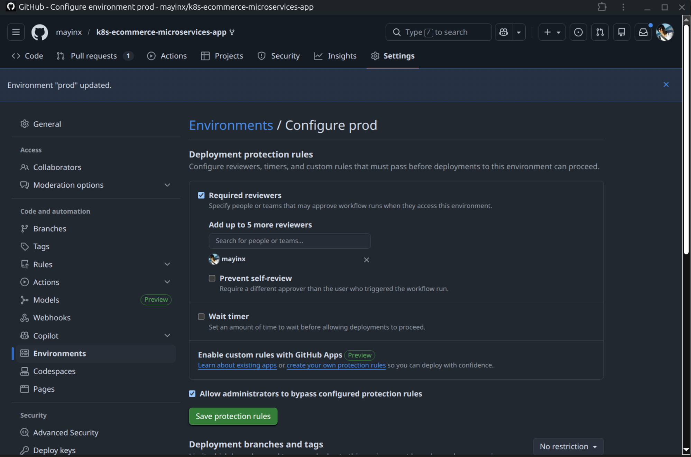
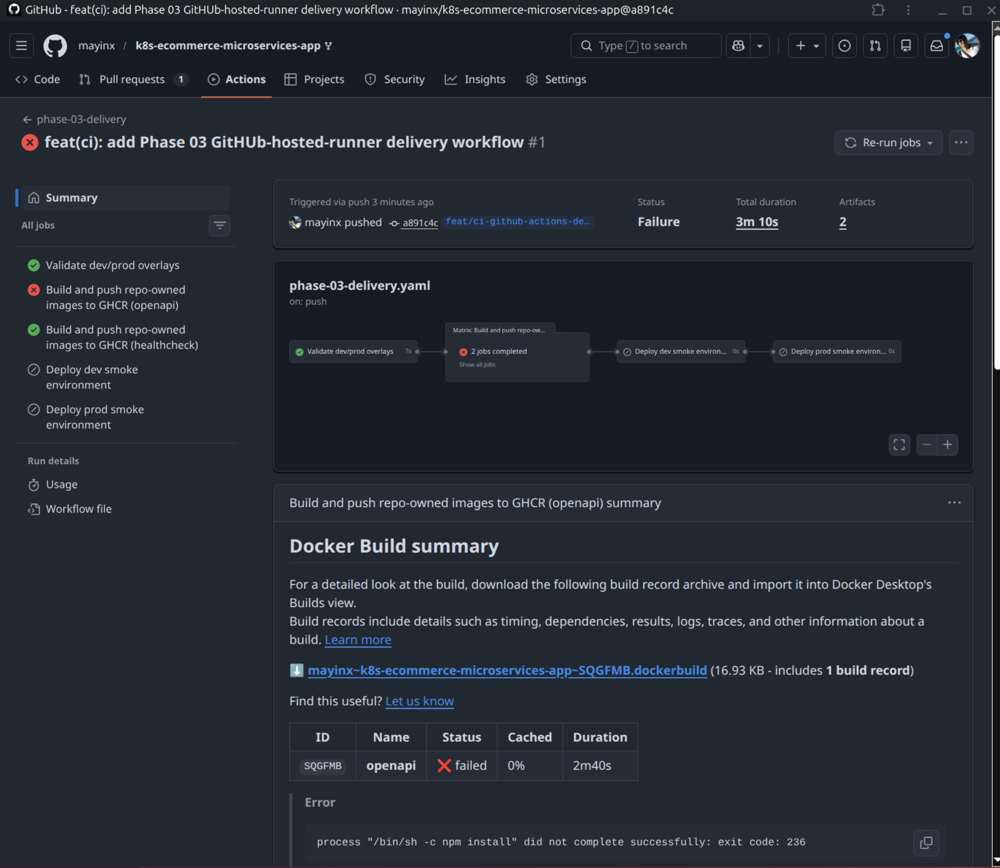
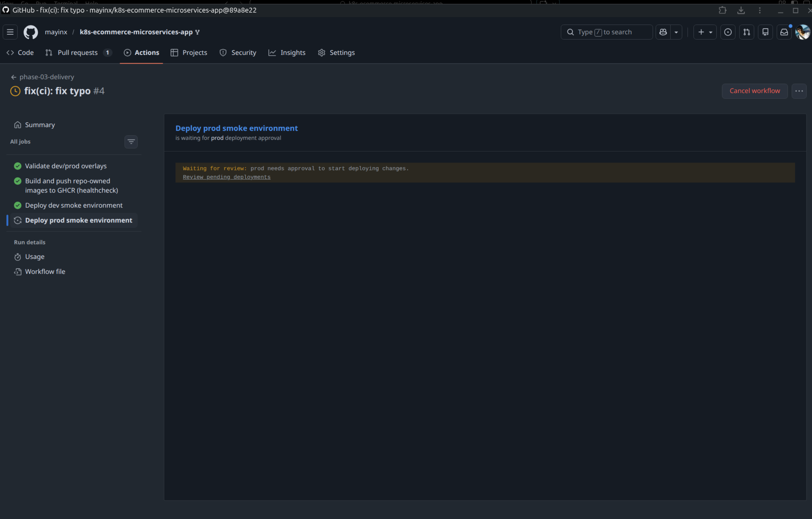
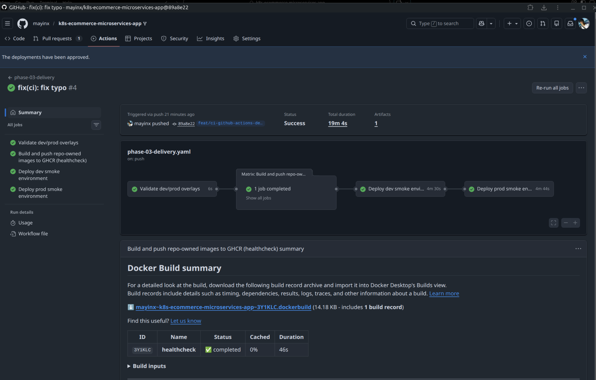

# Phase 03 baseline = GitHub Actions + raw manifests + dev/prod namespaces

# 🧱 Implementation Log — Phase 03 (CI/CD Baseline): GitHub Actions delivery smoke path for dev/prod

> ## 👤 About
> This document is the implementation log and detailed project build diary for **Phase 03 (CI/CD Baseline)**.  
> It records the full implementation path including rationales, key observations, corrections, verification steps, and evidence pointers so the work remains auditable and reproducible.  
> For a shorter, reproducible **TL;DR command checklist / rerun guide**, see: **[03-ci-cd-baseline/RUNBOOK.md](RUNBOOK.md)**.

---

## 📌 Index (top-level)

- [**Purpose / Goal**](#purpose--goal)
- [**Definition of done (Phase 03)**](#definition-of-done-phase-03)
- [**Preconditions**](#preconditions)
- [**Step 0 — Evaluate Helm as an optional deployment path**](#step-0--evaluate-helm-as-an-optional-deployment-path)
- [**Step 1 — Add an environment-specific deployment layer with Kustomize**](#step-1--add-an-environment-specific-deployment-layer-with-kustomize)
- [**Step 2 — Prove the manual dev deployment baseline before automation**](#step-2--prove-the-manual-dev-deployment-baseline-before-automation)
- [**Step 3 — Prepare GitHub environments for dev and prod**](#step-3--prepare-github-environments-for-dev-and-prod)
- [**Step 4 — Create a dedicated GitHub Actions delivery workflow**](#step-4--create-a-dedicated-github-actions-delivery-workflow)
- [**Step 5 — Run the first workflow and triage the openapi failure**](#step-5--run-the-first-workflow-and-triage-the-openapi-failure)
- [**Step 6 — Re-run the workflow and prove the dev smoke deployment**](#step-6--re-run-the-workflow-and-prove-the-dev-smoke-deployment)
- [**Step 7 — Prove the prod approval gate and prod smoke deployment**](#step-7--prove-the-prod-approval-gate-and-prod-smoke-deployment)
- [**Cleanup / rollback notes**](#cleanup--rollback-notes)
- [**Baseline observations and evidence (Phase 03)**](#baseline-observations-and-evidence-phase-03)
- [**Sources**](#sources)

---

## Purpose / Goal

### Build a valid CI/CD baseline before moving to the real target environment

- The goal of Phase 03 is to add a **working CI/CD baseline** that proves **build/push automation**, **Kubernetes deployment automation**, **environment separation**, and an **approval-gated production flow**.
- This phase intentionally focuses on the **delivery mechanics first**, not yet on the final long-lived Proxmox target.
- A clean CI/CD baseline will already provide real DevOps value:
  - pipeline mechanics
  - deployment automation
  - Kubernetes deploy reproducibility
  - environment modeling
  - approval flow

### GitHub-hosted runners + Kind (instead of a self-hosted runner)

- This repository is a **public fork**, so using a self-hosted runner attached to a personal machine would introduce an unnecessary security risk for this phase. This was a deliberate risk-reduction choice for the CI/CD baseline, not a limitation of GitHub Actions itself.
- GitHub-hosted runners are a better fit here because they run workflow jobs in fresh hosted VMs, while `kind` provides a clean temporary Kubernetes target that is explicitly suited to local development and CI.
- This gives us a strong **delivery smoke-test path** now, while keeping the later transition to Proxmox straightforward.

### Why not move directly to Proxmox in this phase

- Going directly to Proxmox here would stack too many moving parts at once:
  - new target infrastructure
  - cluster setup
  - networking / firewall / ingress concerns
  - CI/CD logic
- A more disciplined DevOps move is to validate the **pipeline + deploy mechanics** first in a clean temporary Kubernetes target, then retarget the same delivery flow later to the real environment.

> [!NOTE] **🧩 Info box — CI/CD pipeline**
>
> A **CI/CD pipeline** is an automated workflow that runs defined delivery steps after a trigger such as a push or a manual start.  
> In this phase, the important elements are:
> - validation of the Kubernetes overlays
> - image build and registry push
> - deployment smoke tests for `dev` and `prod`
> - an approval gate before the `prod` deployment step

> [!NOTE] **🧩 Info box — GitHub-hosted runner**
>
> A **GitHub-hosted runner** is a GitHub-provided VM used to run workflow jobs.  
> In this phase, hosted runners are used for all jobs because the repository is public and the goal is to avoid attaching a self-hosted runner to a personal machine.

> [!NOTE] **🧩 Info box — kind**
>
> `kind` = **Kubernetes in Docker**.  
> `kind` creates a temporary Kubernetes cluster inside Docker containers and is explicitly designed for local development and CI.  
> In this phase, `kind` is used as a **clean deployment smoke-test target** for `dev` and `prod`.

> [!NOTE] **🧩 Info box — GHCR**
>
> **GHCR** = **GitHub Container Registry**.  
> It stores container images under the GitHub account / repository ecosystem and can be used directly from GitHub Actions with `GITHUB_TOKEN`.

---

## Definition of done (Phase 03)

- A dedicated GitHub Actions workflow exists at `.github/workflows/phase-03-delivery.yaml`
- The workflow validates both Kustomize overlays
- The workflow builds and pushes at least one repo-owned support image to GHCR
- The workflow deploys the **dev smoke environment** successfully
- The workflow pauses before the **prod smoke environment** and requires approval
- The **prod smoke environment** also deploys successfully after approval
- The deployment path remains compatible with a later retargeting to Proxmox

---

## Preconditions

- The proven raw Kubernetes manifest baseline from earlier phases exists
- Phase 03 Kustomize overlays for `dev` and `prod` exist
- GitHub environments `dev` and `prod` are configured in the repository settings
- `prod` uses required reviewers for the approval gate
- The workflow file exists in `.github/workflows/phase-03-delivery.yaml`

---

## Step 0 — Evaluate Helm as an optional deployment path

**Rationale:** Before choosing the deployment mechanism for Phase 03, we need to evaluate whether the existing Helm chart is usable out of the box for dev/prod automation.

### Inspecting the repository’s existing Helm chart files 

The repository already contains a Helm chart in `deploy/kubernetes/helm-chart/`, so Helm is a legitimate option to evaluate first.

A quick chart inspection shows:

(1) **`Chart.yaml`** confirms that the repository does contain a dedicated Helm chart for Sock Shop.
~~~yaml
# deploy/kubernetes/helm-chart/Chart.yaml
apiVersion: v1
description: A Helm chart for Sock Shop
name: helm-chart
version: 0.3.0
~~~

(2) **Inspecting the Helm dependencies in `requirements.yaml`** shows that the chart still uses the older dependency mechanism and expects an external `nginx-ingress` dependency.
~~~yaml
# deploy/kubernetes/helm-chart/requirements.yaml
dependencies:
  - name: nginx-ingress
    version: 0.4.2
    repository: https://helm.nginx.com/stable
~~~

### Validating Helm

To verify whether the chart is really usable as-is, the next realistic step is to lint and render it, then try a test install into the `dev` namespace:

~~~bash
# Lint the Helm chart for obvious chart/template issues
$ helm lint deploy/kubernetes/helm-chart
==> Linting deploy/kubernetes/helm-chart
[INFO] Chart.yaml: icon is recommended
[WARNING] ... chart directory is missing these dependencies: nginx-ingress

# Render the chart for the dev namespace without installing it
$ helm template sock-shop-dev deploy/kubernetes/helm-chart --namespace sock-shop-dev
Error: An error occurred while checking for chart dependencies. You may need to run `helm dependency build` to fetch missing dependencies: found in Chart.yaml, but missing in charts/ directory: nginx-ingress
~~~

Because Helm itself explicitly points to missing chart dependencies, the next realistic step is to follow that hint and fetch them:

~~~bash
# Fetch/build the missing Helm chart dependencies
$ helm dependency build deploy/kubernetes/helm-chart
Getting updates for unmanaged Helm repositories...
...Successfully got an update from the "https://helm.nginx.com/stable" chart repository
Saving 1 charts
Downloading nginx-ingress from repo https://helm.nginx.com/stable
Deleting outdated charts

# Re-render the chart after dependency build
$ helm template sock-shop-dev deploy/kubernetes/helm-chart --namespace sock-shop-dev | sed -n '1,120p'
# Source: helm-chart/charts/nginx-ingress/templates/controller-serviceaccount.yaml
apiVersion: v1
kind: ServiceAccount
metadata:
  name: sock-shop-dev-nginx-ingress
  namespace: sock-shop-dev
...

# Try a real install/upgrade into the dev namespace
$ helm upgrade --install sock-shop-dev deploy/kubernetes/helm-chart --namespace sock-shop-dev --create-namespace
Release "sock-shop-dev" does not exist. Installing it now.
Error: unable to build kubernetes objects from release manifest: [resource mapping not found ...
no matches for kind "CustomResourceDefinition" in version "apiextensions.k8s.io/v1beta1"
...
no matches for kind "ClusterRole" in version "rbac.authorization.k8s.io/v1beta1"
...
]
~~~

**Observed result:**

- The repository contains a Helm chart, so Helm is therefore a valid option to evaluate.
- But the chart is **not usable out of the box** for this phase: 
  - The first blocker was the missing `nginx-ingress` chart dependency.
  - After running `helm dependency build`, that dependency was successfully fetched and the chart could be rendered.
  - However, the actual install path still failed:
    - the pulled `nginx-ingress` subchart uses deprecated Kubernetes API versions
    - these include `apiextensions.k8s.io/v1beta1` and `rbac.authorization.k8s.io/v1beta1`
    - those resources are not compatible with the current cluster API surface
  - So even after the obvious dependency-recovery step, Helm still does not provide a clean, low-friction deployment baseline for this phase.

All in all, the dependency setup appears **older and incomplete**, which would introduce extra setup and troubleshooting work before a reliable dev/prod delivery path could be documented:

**Conclusion:**

Helm is **deferred, not rejected** in favor of a **manifest + Kustomize** path

For this Phase 03 baseline and since Helm is optional for this project, the already proven raw Kubernetes manifest path is the stronger choice, especially when it is combined  with a **Kustomize layer for `dev` and `prod`**:

- This avoids spending the phase on modernizing a legacy Helm dependency chain
- gives us a lower-friction baseline
- & reaches environment separation in form of an usable `dev` / `prod` baseline faster

Helm remains a valid **later enhancement candidate** once the CI/CD baseline is stable.

> [!NOTE] **🧩 Info box — Helm vs "raw manifests"**
>
>
> **Helm** is a Kubernetes package manager and templating layer. A Helm chart bundles related Kubernetes resources into one reusable package, adds values-based configuration, and can make multi-resource application deployment much easier to repeat across environments.  
>
> That is why Helm is often preferred in larger projects:
> - it groups many resources into one installable unit
> - it supports configurable values per environment
> - it is convenient for repeated deployments and reuse
>
> Plain **raw manifests** are direct Kubernetes YAML resources without that packaging / templating layer.
>
> Raw manifests can still be the better choice when:
> - the manifest path is already proven and understood
> - the Helm chart introduces extra dependency or compatibility friction
> - the fastest defensible goal is a clean baseline, not packaging sophistication
>
> In this phase, the manifest-based path is preferred because it is already proven in this repository and reaches a reliable baseline faster.

---

## Step 1 — Add an environment-specific deployment layer with Kustomize

**Rationale:** Since Helm is not a viable option for deployment right now, we take the proven path via plain Kubernetes manifests. But: The proven raw manifest baseline from the earlier phases is still a single-environment deployment path. For Phase 03, which operates on multipel environments, we need a thin environment layer for `dev` and `prod`. This is done by adding a thin Kustomize environment layer on top of the upstream manifests, so the original manifest set does not have to be rewritten or duplicated.

To achieve that, a **Kustomize overlay layer** is implemented on top of the already proven manifest set - in form of a small set of new environment-specific files:

### Resulting repository structure

~~~bash
deploy/
└── kubernetes
    ├── kustomize
    │   └── overlays
    │       ├── dev
    │       │   ├── kustomization.yml
    │       │   ├── namespace.yaml
    │       │   └── patches
    │       │       └── front-end-svc-clusterip.yaml
    │       └── prod
    │           ├── kustomization.yml
    │           ├── namespace.yaml
    │           └── patches
    │               └── front-end-svc-clusterip.yaml
    ├── Makefile
    └── manifests
        ├── 00-sock-shop-ns.yaml
        ├── ...
        └── kustomization.yaml
~~~

**Functional overview:**

- **Base Kustomize entrypoint:** `deploy/kubernetes/manifests/kustomization.yaml`
  - turns the already proven raw manifest set into one reusable Kustomize base
- **`dev` overlay:** `deploy/kubernetes/kustomize/overlays/dev/kustomization.yml`
  - applies only the `dev`-specific namespace and patching rules for `sock-shop-dev` on top of that base
- **`prod` overlay:** `deploy/kubernetes/kustomize/overlays/prod/kustomization.yml`
  - mirrors the same pattern for `sock-shop-prod`
- **Namespace manifests:**
  - `deploy/kubernetes/kustomize/overlays/dev/namespace.yaml`
  - `deploy/kubernetes/kustomize/overlays/prod/namespace.yaml`
- **Storefront Service patch:**
  - `deploy/kubernetes/kustomize/overlays/dev/patches/front-end-svc-clusterip.yaml`
  - `deploy/kubernetes/kustomize/overlays/prod/patches/front-end-svc-clusterip.yaml`

This avoids copying or rewriting the whole upstream manifest set for each environment

### Relevant excerpts of the added configuration

**Base entrypoint — `deploy/kubernetes/manifests/kustomization.yaml`**  
This file turns the already proven manifest set into a reusable Kustomize base by listing the resources that belong to the deployment:

~~~yaml
# deploy/kubernetes/manifests/kustomization.yaml
apiVersion: kustomize.config.k8s.io/v1beta1
kind: Kustomization

resources:
  - 01-carts-dep.yaml
  - 02-carts-svc.yml
  - 03-carts-db-dep.yaml
  - 04-carts-db-svc.yaml
  - 05-catalogue-dep.yaml
  - 06-catalogue-svc.yaml
  - 07-catalogue-db-dep.yaml
  - 08-catalogue-db-svc.yaml
  - 09-front-end-dep.yaml
  - 10-front-end-svc.yaml
  ...
~~~

The file name `kustomization.yaml` is the conventional Kustomize configuration entrypoint used by the kustomize tool.

**`dev` overlay — `deploy/kubernetes/kustomize/overlays/dev/kustomization.yml`**  
This file reuses the proven base, switches the target namespace to `sock-shop-dev`, and applies a patch to the storefront Service:

~~~yaml
# deploy/kubernetes/kustomize/overlays/dev/kustomization.yml
apiVersion: kustomize.config.k8s.io/v1beta1
kind: Kustomization

resources:
  - namespace.yaml
  - ../../../manifests

namespace: sock-shop-dev

patches:
  - target:
      kind: Service
      name: front-end
    path: patches/front-end-svc-clusterip.yaml
~~~

**Namespace manifest — `deploy/kubernetes/kustomize/overlays/dev/namespace.yaml`**  
This file codifies namespace creation so the workflow no longer depends on a manual namespace pre-step:

~~~yaml
# deploy/kubernetes/kustomize/overlays/dev/namespace.yaml
apiVersion: v1
kind: Namespace
metadata:
  name: sock-shop-dev
~~~

**Storefront Service patch — `deploy/kubernetes/kustomize/overlays/dev/patches/front-end-svc-clusterip.yaml`**  
This patch removes the fixed NodePort behavior and switches the storefront Service to `ClusterIP` for the environment-based deployment path:

~~~yaml
# deploy/kubernetes/kustomize/overlays/dev/patches/front-end-svc-clusterip.yaml
- op: replace
  path: /spec/type
  value: ClusterIP
- op: remove
  path: /spec/ports/0/nodePort
~~~

Concretely, this is done through a JSON Patch applied to the `front-end` Service: the Service type is changed from `NodePort` to `ClusterIP`, and the explicit `nodePort` value is removed from the first port entry.

**The benefit of this patch:** 
- The environment-based smoke deployments no longer depend on the original fixed NodePort storefront exposure. 
- For the `dev` / `prod` CI/CD path, the storefront only needs an internal Kubernetes Service, so `ClusterIP` is the cleaner and less collision-prone choice here.

**Conclusion:**

This demonstrates how the single-environment baseline was turned into a reusable `dev` / `prod` deployment input **without duplicating the whole manifest set**.

The purpose of these overlays is not to redesign the application, but to apply a few environment-specific adjustments only - thus acting as thin environment layer on top of the already proven manifest path:

- switch from the original shared namespace to an environment-specific namespace
- codify namespace creation so deployment no longer depends on a manual pre-step
- patch the storefront exposure where needed so the two environments do not depend on the same fixed NodePort behavior

### Render Kustomize layer  

Once this Kustomize layer is in place, the next check is whether the `dev` overlay can be rendered cleanly into final Kubernetes YAML:

~~~bash
# Render the final Kubernetes YAML produced by the dev overlay
$ kubectl kustomize deploy/kubernetes/kustomize/overlays/dev
apiVersion: v1
kind: Namespace
metadata:
  name: sock-shop-dev
---
apiVersion: v1
kind: Service
~~~

`kubectl kustomize <path>` **renders** the final Kubernetes YAML produced by the base + overlay combination. It does **not** deploy anything. In this step, it is used as a quick validation check before the real deployment via `kubectl apply -k ...`.

**Observed result:**

- The `dev` overlay renders successfully and produces the expected namespace-specific resources, including `sock-shop-dev`.

### Why Kustomize matters for the CI/CD workflow

This Kustomize layer is not just a local configuration convenience. It becomes the actual **deployment definition layer** used later by the GitHub Actions workflow.

The workflow uses it in two places:

- **Validation**
  - `kubectl kustomize deploy/kubernetes/kustomize/overlays/dev`
  - `kubectl kustomize deploy/kubernetes/kustomize/overlays/prod`
  - Here the overlays are rendered to verify that they produce usable final Kubernetes YAML.

- **Deployment**
  - `kubectl apply -k deploy/kubernetes/kustomize/overlays/dev`
  - `kubectl apply -k deploy/kubernetes/kustomize/overlays/prod`
  - Here the overlays become the actual deploy input for the `dev` and `prod` smoke environments.

Without Kustomize, the workflow would have needed a weaker alternative such as:

- duplicating raw manifests per environment
- keeping manual namespace creation and manual edits outside the workflow
- or patching manifests ad hoc inside the CI/CD jobs

Kustomize is what makes the `dev` / `prod` pipeline path clean, reproducible, and reviewable.

**Conclusion:**

Kustomize is working as the right minimal environment layer for this phase:
- It reuses the already proven raw manifests
- keeps upstream manifests untouched
- adds `dev` / `prod` separation in a minimal and reviewable way

> **🧩 Info box — Kustomize**
>
> **Kustomize** is a **Kubernetes-native configuration tool** used to **customize a base set of Kubernetes resources** without copying and rewriting all manifests. 
> In this phase, it is used to turn the already proven raw manifest baseline into reusable environment-specific deployment inputs for `dev` and `prod`. Kubernetes documents Kustomize explicitly in terms of bases, overlays, resources, and patches.

> [!NOTE] **🧩 Info box — Kustomize overlay**
>
> A **Kustomize overlay** is a thin customization layer on top of a base set of Kubernetes resources.  
> In this phase, the overlays are used to:
> - add namespace manifests so the deploy path is reproducible
> - switch from the original shared namespace to environment-specific namespaces
> - codify namespace creation (`sock-shop-dev` / `sock-shop-prod`)
> - patch the `front-end` Service from fixed `NodePort` to `ClusterIP` to avoid cross-environment port collisions

---

## Step 2 — Prove the manual dev deployment baseline before automation

**Rationale:** Before automating the deployment path in GitHub Actions, prove manually that the `dev` overlay can recreate the namespace and deploy the stack from scratch.

~~~bash
# Delete the dev namespace so the overlay has to recreate it from scratch
$ kubectl delete namespace sock-shop-dev
namespace "sock-shop-dev" deleted

# Recreate namespace + resources in one command
$ kubectl apply -k deploy/kubernetes/kustomize/overlays/dev
namespace/sock-shop-dev created
deployment.apps/carts created
service/carts created
...
deployment.apps/front-end created
service/front-end created
...

# Inspect the recreated dev resources
$ kubectl get deploy,pods,svc -n sock-shop-dev -o wide
NAME           READY   UP-TO-DATE   AVAILABLE   AGE
front-end      1/1     1            1           ...
catalogue      1/1     1            1           ...
payment        1/1     1            1           ...
user           1/1     1            1           ...
...

# Confirm the key storefront rollout
$ kubectl rollout status deployment/front-end -n sock-shop-dev
deployment "front-end" successfully rolled out
~~~

**Observed result:**

- The dev namespace could be recreated from scratch via the overlay.
- The overlay path proved that namespace creation no longer depended on a manual pre-step.
- The dev stack converged successfully.
- Some services (`catalogue`, `payment`, `user`) were slower to become ready, but they did eventually converge successfully.

**Conclusion:**

The manual **dev deployment baseline** was proven before automation.  
This made the later GitHub Actions implementation much more defensible: the automation step reuses a path that was already known to work manually.

---

## Step 3 — Prepare GitHub environments for dev and prod

**Rationale:** Phase 03 needs **explicit environment modeling** and a **production approval gate**. Because the workflow uses `environment: dev` and `environment: prod`, these environments must be configured in the GitHub repository settings itself, not only in the YAML workflow file. GitHub environments are the place where deployment protection rules such as **required reviewers** are configured. 

**GitHub UI preparation:**

- Go to: **Repository → Settings → Environments**
- Create:
  - `dev`
  - `prod`
- In `prod`:
  - enable **Required reviewers**
  - add one reviewer (in this case: the repository owner)

Why this matters:

- `dev` is intended to stay the faster unprotected smoke path
- `prod` should not deploy automatically without an explicit human checkpoint
- GitHub environments provide that checkpoint directly through protection rules
- GitHub documents that an environment can require reviewers, and that only one listed reviewer approval is needed for the job to proceed. 

Why the repository owner was set as reviewer here:

- this is a solo repository, not a team-maintained production repo
- the goal in Phase 03 is to **prove the approval-gate mechanism itself**
- in a real team setup, the reviewer would typically be another engineer or a team
- here, setting the repository owner as the required reviewer is the smallest workable proof of the gate in a solo project context

**Observed result:**

- `dev` is now the unprotected smoke environment
- `prod` is now the approval-gated smoke environment
- the workflow can later bind deployment jobs to these named environments through `environment: dev` and `environment: prod`

**Production environment configuration in GitHub**

*Figure 1: GitHub `prod` environment configuration with the approval-related setup used for the production smoke deployment.*

**Conclusion:**

This establishes the **manual promotion checkpoint** between `dev` and `prod`, and it does so in the place where GitHub actually enforces deployment protection rules: the repository’s environment settings.

> **🧩 Info box — GitHub Environment**
>
> A **GitHub Environment** is a named deployment target in GitHub Actions, such as `dev` or `prod`.  
> It can hold protection rules like required reviewers and is used here to pause the `prod` smoke deployment until it is explicitly approved.

---

## Step 4 — Create a dedicated GitHub Actions delivery workflow

**Rationale:** The repository already contains an upstream GitHub Actions workflow at `.github/workflows/main.yaml`. Inspecting this file produces several useful hints:

- GitHub Actions is already established in this repo
- `kind` (Kubernetes in Docker) is already used in CI to create a temporary Kubernetes cluster inside Docker containers  
- the upstream workflow already uses an upstream/downstream job structure
- A separate image-build job exists for `openapi` / `healthcheck`

Phase 03 needs now a **separate, cleaner delivery workflow for the project-specific dev/prod CI/CD path** that reuses relevant elements from the upstream workflow pattern - like `kind` as a **clean deployment smoke-test target** for `dev` and `prod`.

### Workflow files in the repository

~~~bash
.github/
└── workflows
    ├── main.yaml
    └── phase-03-delivery.yaml
~~~

To achieve this, a new workflow file is created at:

- `.github/workflows/phase-03-delivery.yaml`

### Relevant workflow excerpt

The most important parts of `.github/workflows/phase-03-delivery.yaml` are:

~~~yaml
# Excerpt of .github/workflows/phase-03-delivery.yaml

name: phase-03-delivery

on:
  workflow_dispatch:
  push:
    branches:
      - master
      - feat/ci-github-actions-dev-prod-gate

permissions:
  contents: read
  packages: write

jobs:
  validate-overlays:
    runs-on: ubuntu-latest

  build-push-support-images:
    needs: validate-overlays
    runs-on: ubuntu-latest

  deploy-dev-smoke:
    needs: build-push-support-images
    runs-on: ubuntu-latest
    environment: dev

  deploy-prod-smoke:
    needs: deploy-dev-smoke
    if: github.ref == 'refs/heads/master'
    runs-on: ubuntu-latest
    environment: prod
~~~

### Key characteristics of the new workflow

This new workflow ...

- uses **GitHub-hosted runners only**
- uses an **upstream/downstream job order** via `needs`
- validates both **Kustomize overlays**
- builds and pushes **repo-owned support images** to the **container registry (GHCR)**
- enforces an explicit **separation between `dev` and `prod`**
- implements **manual and push-based triggers**
- deploys the **`dev` smoke environment** automatically
- deploys the **`prod` smoke environment** only after approval (the `prod` job is gated both by branch condition and by the GitHub environment approval rules)

### Relevant workflow elements + actions

#### Workflow elements

- **`on:`** defines how the workflow starts:
  - `push` for normal branch-driven execution
  - `workflow_dispatch` for manual reruns from GitHub
- **`permissions:`** limits the workflow token to what is needed here:
  - read repository contents
  - write container packages to GHCR
- **`needs:`** creates the upstream/downstream job order:
  - validation first
  - then build/push
  - then deploy smoke tests
- **`environment:`** binds the deployment jobs to GitHub environments:
  - `dev` for the unprotected smoke path
  - `prod` for the approval-gated smoke path
- **`runs-on: ubuntu-latest`** keeps the whole workflow on GitHub-hosted runners in this phase

#### Common actions used in this workflow

- **`actions/checkout`**
  - checks out the repository content into the runner workspace so later steps can read files from the repo
- **`docker/login-action`**
  - authenticates the workflow to a container registry
  - here: GHCR via `ghcr.io`
- **`docker/build-push-action`**
  - builds the Docker image and pushes it to the target registry
- **`engineerd/setup-kind`**
  - creates a temporary `kind` Kubernetes cluster inside the workflow job

These actions are reusable GitHub Actions building blocks used to keep workflows shorter and more maintainable. The upstream workflow in this repository already follows the same general pattern of reusing actions instead of scripting everything manually. 

### Workflow logic

At a high level, the workflow follows a simple delivery chain:

1. **Validate the deployment input (Kustomize overlays)**
   - Before building images or starting any smoke deployment, the workflow renders both Kustomize overlays to verify both overlays render successfully
   - This checks whether the `dev` and `prod` deployment definitions are structurally usable.
   - Result: Rendering the overlays early is a cheap validation step. It helps catch broken environment configuration before the workflow spends time on image build or deployment jobs.

2. **Build and publish the repo-owned support image**
   - The workflow then builds the support image and pushes it to GHCR.
   - At this point, the selected repo-owned image target is **`healthcheck`**, because the workflow matrix has been reduced to `repo: [healthcheck]` after `openapi` was deferred.

3. **Create a temporary Kubernetes target for smoke deployment**
   - Instead of deploying to a long-lived cluster already, the workflow starts a temporary `kind` cluster on a GitHub-hosted runner.
   - This gives the phase a clean and reproducible Kubernetes smoke-test target.
   - Result: The workflow needs a Kubernetes target to prove that the deployment path actually works. In this phase, `kind` provides that target in a disposable CI-friendly way, without depending on the final Proxmox environment yet.

4. **Deploy by applying the overlays**
   - The `dev` and `prod` jobs do not hardcode raw manifests directly.
   - They use the Kustomize overlays as the actual deployment input via `kubectl apply -k ...`.
   - Result: The overlays are utrilized as the actual deployment input because they already encode the environment-specific namespace and storefront Service behavior. That makes them the correct deployment definition for `dev` and `prod`.

So the workflow first proves that the deployment input is valid, then creates a disposable Kubernetes target, and then applies the environment-specific deployment definition to that target.

### Interaction between workflow and the Kustomize layer

Instead of hardcoding raw Kubernetes manifests directly inside the CI/CD jobs, the new workflow **uses the Kustomize layer created in Step 1** as its deployment definition.

That interaction between workflow and this Kustomize layer happens on two stages:

- **Validation stage (`validate-overlays`)**
  - runs:
    - `kubectl kustomize deploy/kubernetes/kustomize/overlays/dev`
    - `kubectl kustomize deploy/kubernetes/kustomize/overlays/prod`
  - purpose:
    - verify that both overlays render into valid final Kubernetes YAML before any deployment job starts

- **Deployment stages (`deploy-dev-smoke` / `deploy-prod-smoke`)**
  - run:
    - `kubectl apply -k deploy/kubernetes/kustomize/overlays/dev`
    - `kubectl apply -k deploy/kubernetes/kustomize/overlays/prod`
  - purpose:
    - use those overlays as the actual deploy input for the `dev` and `prod` smoke environments

Ergo: The Kustomize layer is the bridge between:
- the already proven raw manifest baseline
- and the new GitHub Actions delivery workflow

> **🧩 Info box — workflow_dispatch**
>
> `workflow_dispatch` is the **GitHub Actions event** for **manual workflow starts** from the GitHub UI. For this event inputs/values are optional - i.e. the key can be present without nested values. It only receives events when the workflow file is on the default branch.

> **🧩 Info box — "upstream" vs "downstream" (workflow graph)**
>
> In the workflow graph, **upstream jobs** run earlier and **downstream jobs** depend on them via `needs:`.  
> Example: if `build-push-support-images` fails, the deploy jobs are downstream and do not run.

---

## Step 5 — Run the first workflow and triage the `openapi` failure

**Rationale:** The first GitHub Actions workflow run should show whether the selected image-build targets are actually usable in the Phase 03 baseline.

The first `build-push-support-images` workflow run produces a mixed result in the GitHub Actions workflow (excerpt from the GitHub Actions log output)

~~~bash
# Relevant workflow result signal from the first run
Build and push repo-owned images to GHCR (openapi)
ERROR: failed to build: failed to solve: process "/bin/sh -c npm install" did not complete successfully: exit code: 236
~~~

The excerpt below is taken from the GitHub Actions log output of the first `build-push-support-images` workflow run.

**First failed Phase 03 workflow run**

*Figure 2: First `phase-03-delivery` workflow run. The pipeline stops before the deploy jobs because the `openapi` image build fails.*

Relevant workflow signal from the GitHub Actions build log:

- the overlay validation succeeds
- the repo-owned `healthcheck` image builds and pushes successfully
- but the also repo-owned `openapi` image build fails during `npm install`

> **🧩 Info box — repo-owned image target**
> A **repo-owned image target** is a Docker build target defined inside this repository itself (for example `healthcheck/` or `openapi/`), rather than one of the main Sock Shop runtime images that are pulled from an external upstream registry.
> - both healthcheck and openapi are build contexts/directories that live inside this repository (see `healthcheck/Dockerfile` + `openapi/Dockerfile`), they are not external images that can be pulled as upstream images during the smoke deployment
> - they are auxiliary images that can be built and published by the workflow

**Observed result 1:**

- `healthcheck` built and pushed successfully
- `openapi` failed during `npm install`
- because the build matrix was not fully successful, the downstream deploy jobs did not run yet

To decide whether this should block the whole phase, the next question is what role `openapi` actually plays in this repository.

**Observed result 2:**

- `openapi` is **not** one of the main Sock Shop runtime services
- it is a **repository-owned auxiliary test/build target**
  - its `package.json` describes it as:
    - `microservices-demo-api-test` 
    - “Verify microservices API endpoints against the specification”
  - its README describes it as a **Dredd-based API testing** directory
  - its build/runtime setup is clearly legacy:
    - `node: "6"`
    - `npm: "3"`
    - Docker base image: `mhart/alpine-node:6.17`
- The actual Phase 03 delivery goal (`dev` / `prod` smoke deployment of the application path) does not depend on `openapi` 

 
**Conclusion:**

- For Phase 03, `openapi` is excluded to unblock the actual CI/CD baseline. 
- `openapi` is deferred for later follow-up, and the workflow is reduced to the support image that is actually usable in this phase (`healthcheck`).

Reasoning:

- the phase goal is to prove the **CI/CD delivery baseline** 
- `openapi` is **not** part of the main storefront deployment path being proven in this phase
- the failure comes from a **legacy auxiliary test/build target**, not from the actual `dev` / `prod` smoke deployment path
- keeping `healthcheck` preserves enough proof of:
  - repo-owned image build
  - GHCR push
  - workflow-controlled registry publishing
---

## Step 6 — Re-run the workflow and prove the dev smoke deployment

**Rationale:** After removing `openapi` from the matrix, the workflow should be able to complete the `dev` smoke deployment path.

**Observed result:**

- overlay validation succeeded
- `healthcheck` build/push to GHCR succeeded
- `deploy-dev-smoke` started a fresh `kind` cluster
- the `dev` overlay was applied successfully
- the key rollouts succeeded

**Conclusion:**

The GitHub Actions workflow now proved a complete **dev smoke delivery path**:
- validate
- build/push
- deploy
- verify

---

## Step 7 — Prove the prod approval gate and prod smoke deployment

**Rationale:** Phase 03 is only fully convincing if the `prod` environment gate is also exercised successfully.

During feature-branch testing, the `prod` job was temporarily allowed to run from the active Phase 03 feature branch so that the approval gate could be tested before merge. After the proof succeeded, this temporary branch allowance was removed again to restore the job condition to `master` only.

**Production approval gate waiting for review**

*Figure 3: The `prod` environment gate pauses the workflow and waits for explicit approval before the production smoke deployment starts.*

**Successful production smoke deployment**

*Figure 4: Successful `prod` smoke deployment after manual approval through the GitHub environment gate.*

**Observed result:**

- the workflow paused before `deploy-prod-smoke`
- GitHub required explicit approval through the `prod` environment
- after approval, the `prod` smoke deployment succeeded as well

**Conclusion:**

Phase 03 proved:
- automatic `dev` smoke deployment
- approval-gated `prod` smoke deployment
- a realistic CI/CD promotion model without yet depending on the final Proxmox target

---

## Cleanup / rollback notes

- The temporary feature-branch allowance for the `prod` smoke job was reverted after the proof succeeded.
- The workflow keeps the final intended behavior:
  - `dev` smoke deploy on the active workflow path
  - `prod` smoke deploy only on `master` and only after approval
- `openapi` remains excluded from the workflow for now and is tracked as a later legacy follow-up item.

---

## Baseline observations and evidence (Phase 03)

### What was implemented

- A new phase-specific workflow was added:
  - `.github/workflows/phase-03-delivery.yaml`
- A Kustomize-based environment layer was added for:
  - `sock-shop-dev`
  - `sock-shop-prod`
- Namespace creation was moved into the overlay path so the deploy baseline became reproducible
- A GitHub-hosted-runner-only delivery path was chosen for this phase
- `openapi` was excluded from the workflow after a documented legacy build failure

### What was verified

- Helm was evaluated and deferred with a documented rationale
- Kustomize overlays render successfully
- The dev namespace can be recreated from scratch via the overlay
- The full dev smoke path works in GitHub Actions
- The prod approval gate works
- The prod smoke deployment also succeeds after approval

### Evidence index

**GitHub / workflow evidence**
- `project-docs/03-ci-cd-baseline/evidence/gh/01-nsp-empty-github.png`
  - GitHub namespace overview before creating the environments

- `project-docs/03-ci-cd-baseline/evidence/gh/02-nsp-creation-dev.png`
  - creation of the `dev` GitHub environment

- `project-docs/03-ci-cd-baseline/evidence/gh/03-NSPC.png`
  - intermediate GitHub environment configuration state

- `project-docs/03-ci-cd-baseline/evidence/gh/04-gh-config-prod.png`
  - `prod` environment configuration, including the approval-related setup

- `project-docs/03-ci-cd-baseline/evidence/gh/05-gh-nspcs-overview.png`
  - overview showing both GitHub environments

- `project-docs/03-ci-cd-baseline/evidence/gh/06-runenrs-empty.png`
  - repository runner overview showing that no self-hosted runner is used here

- `project-docs/03-ci-cd-baseline/evidence/gh/07-gh-workflows actions-empty.png`
  - workflow area before the new Phase 03 workflow appears

- `project-docs/03-ci-cd-baseline/evidence/gh/08-gh-workflows-actionsa-phase-03-delivery.png`
  - new `phase-03-delivery` workflow visible in GitHub Actions

- `project-docs/03-ci-cd-baseline/evidence/gh/09-gh-pipeline-running.png`
  - workflow run in progress

- `project-docs/03-ci-cd-baseline/evidence/gh/10-gh-pipeline-failed.png`
  - first failed workflow run, before the `openapi` scope correction

- `project-docs/03-ci-cd-baseline/evidence/gh/11-gh-pipeline-succceeded.png`
  - successful workflow run overview

- `project-docs/03-ci-cd-baseline/evidence/gh/12-gh-pipeline-succeeded-deatils.png`
  - successful workflow details view

- `project-docs/03-ci-cd-baseline/evidence/gh/13-gh-pipeline-graph.png`
  - workflow graph showing the job structure and execution order

- `project-docs/03-ci-cd-baseline/evidence/gh/14-gh-pipeline-success-awaiting-review-prod.png`
  - successful upstream jobs with the workflow paused before `prod`

- `project-docs/03-ci-cd-baseline/evidence/gh/15-gh-success-bigger.png`
  - larger successful workflow view

- `project-docs/03-ci-cd-baseline/evidence/gh/16-gh-actions-overview.png`
  - GitHub Actions overview after successful runs

- `project-docs/03-ci-cd-baseline/evidence/gh/17-gh-prod-.waiting-for-review.png`
  - `prod` deployment waiting for manual approval

- `project-docs/03-ci-cd-baseline/evidence/gh/18-review-prod-and-deploy.png`
  - review / approval dialog before the production smoke deployment

- `project-docs/03-ci-cd-baseline/evidence/gh/18-gh-deploying-to-prod.png`
  - `prod` deployment in progress after approval

- `project-docs/03-ci-cd-baseline/evidence/gh/19-gh-prod-success.png`
  - successful `prod` smoke deployment

- `project-docs/03-ci-cd-baseline/evidence/gh/20-gh-success-oevrview.png`
  - final successful workflow overview

### Deferred follow-ups captured during this phase

- `openapi` build surface excluded for now because it still depends on legacy Node 6 / npm 3
- GitHub Actions runtime warnings about Node.js 20 deprecation were noted for later action/runtime cleanup
- Kubernetes manifests still use deprecated `beta.kubernetes.io/os` node selector labels and should later switch to `kubernetes.io/os`
- GitHub Actions hardening remains a later step:
  - tighten allowed actions
  - pin third-party actions to full SHAs
  - add workflow protection such as CODEOWNERS once the pipeline is stable

---

## Sources

### Helm
- Helm Docs — Charts  
  https://helm.sh/docs/topics/charts/
- Helm Docs — `helm dependency build`  
  https://helm.sh/docs/helm/helm_dependency_build/

### Kubernetes / Kustomize
- Kubernetes Docs — Declarative management of Kubernetes objects using Kustomize  
  https://kubernetes.io/docs/tasks/manage-kubernetes-objects/kustomization/
- kubectl reference — `kubectl kustomize`  
  https://kubernetes.io/docs/reference/kubectl/generated/kubectl_kustomize/

### GitHub Actions / GitHub environments / GHCR / runners / registry
- GitHub Docs — Workflow syntax for GitHub Actions  
  https://docs.github.com/en/actions/reference/workflows-and-actions/workflow-syntax
- GitHub Docs — Deploying to a specific environment  
  https://docs.github.com/en/actions/how-tos/write-workflows/choose-what-workflows-do/deploy-to-environment
- GitHub Docs — Managing environments for deployment  
  https://docs.github.com/en/actions/how-tos/deploy/configure-and-manage-deployments/manage-environments
- GitHub Docs — GitHub-hosted runners  
  https://docs.github.com/en/actions/concepts/runners/github-hosted-runners
- GitHub Docs — Adding self-hosted runners  
  https://docs.github.com/en/actions/how-tos/manage-runners/self-hosted-runners/add-runners
- GitHub Docs — Working with the Container registry  
  https://docs.github.com/en/packages/working-with-a-github-packages-registry/working-with-the-container-registry

### Action references used while shaping the workflow
- `actions/checkout`  
  https://github.com/actions/checkout
- `docker/login-action`  
  https://github.com/docker/login-action
- `docker/build-push-action`  
  https://github.com/docker/build-push-action
- `engineerd/setup-kind`  
  https://github.com/engineerd/setup-kind

### kind
- kind documentation — Quick Start  
  https://kind.sigs.k8s.io/docs/user/quick-start/
- kind documentation — Overview  
  https://kind.sigs.k8s.io/

### Repository references used during implementation (evidence / pattern references, not external sources)
- Upstream workflow reference: `.github/workflows/main.yaml`