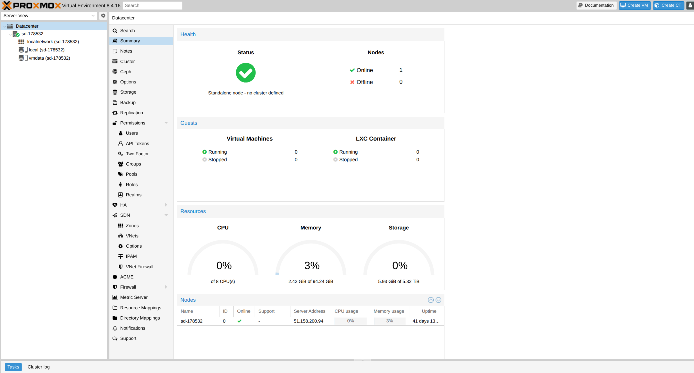
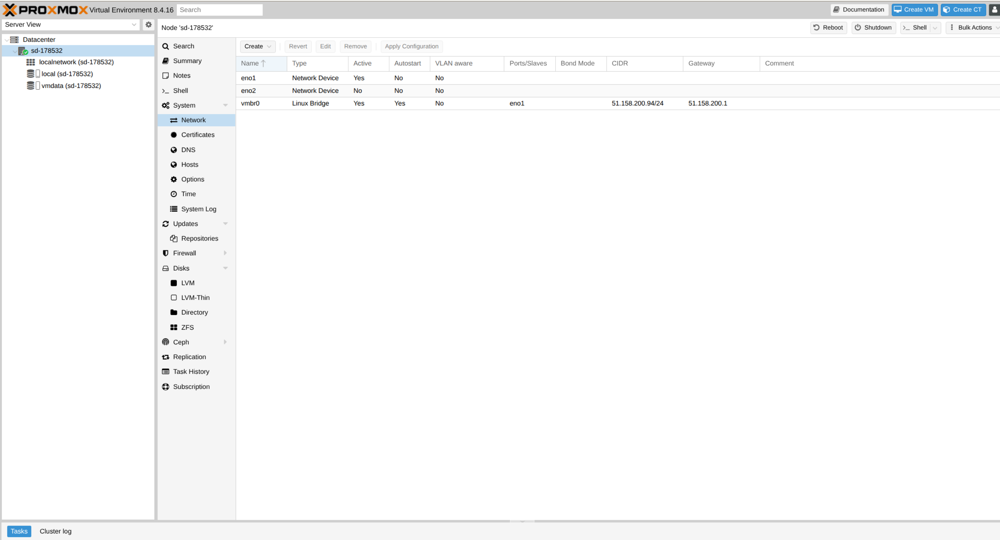
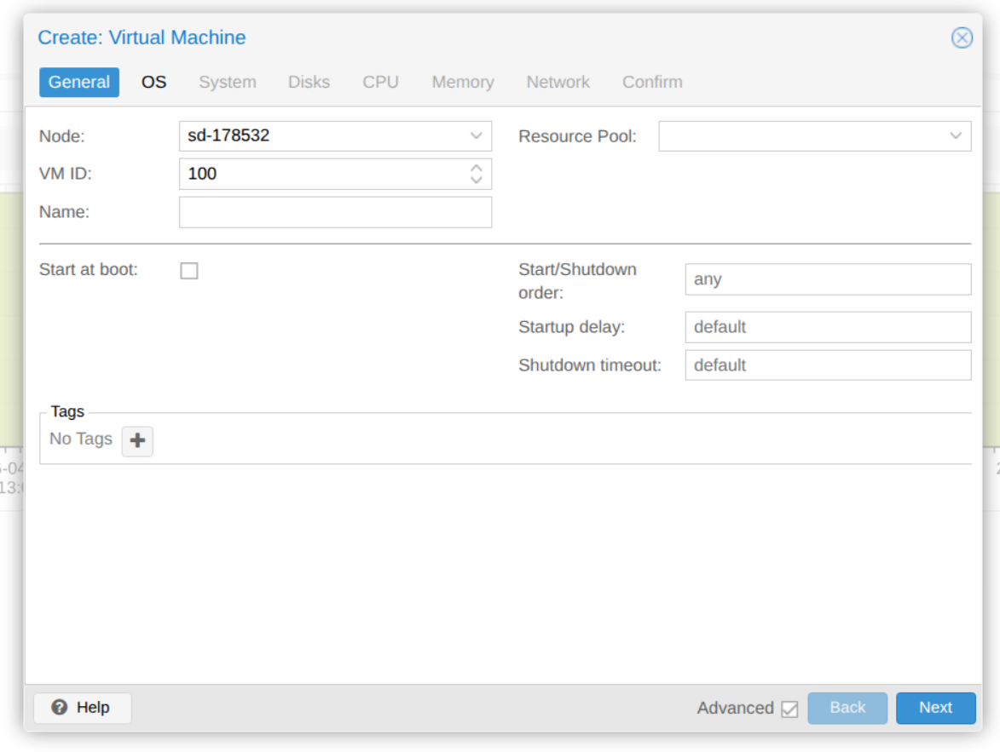

# 🔎 Discovery — Phase 04 (Proxmox VM Baseline): target host, template options, and chosen VM path

> ## 👤 About
> This document records the discovery work that established the **technical starting point** for **Phase 04 (Proxmox VM Baseline)**.  
> It shows how the provided Proxmox target host was inspected, which relevant template and guest options were available, and why the final **VM template -> smoke VM** path was chosen for this phase.  
>
> For the final proven implementation path, see: **[IMPLEMENTATION.md](IMPLEMENTATION.md)**.  
> For the shorter rerun guide, see: **[RUNBOOK.md](RUNBOOK.md)**.  
> For phase-scoped rationale and outcomes, see: **[DECISIONS.md](DECISIONS.md)**.  
> For top-level project navigation, see: **[../INDEX.md](../INDEX.md)**.

---

## 📌 Index (top-level)

- [**Purpose / Goal**](#purpose--goal)
- [**Step 0 — Discover the target host technical baseline via shell**](#step-0--discover-the-target-host-technical-baseline-via-shell)
- [**Step 1 — Discover Proxmox runtime, storage and template availability via shell**](#step-1--discover-proxmox-runtime-storage-and-template-availability-via-shell)
- [**Step 2 — Discover the relevant Proxmox GUI surfaces**](#step-2--discover-the-relevant-proxmox-gui-surfaces)
- [**Step 3 — Chosen Phase 04 path**](#step-3--chosen-phase-04-path)
- [**Evidence index**](#evidence-index)
- [**Sources**](#sources)

---

## Purpose / Goal

Before creating a reusable VM template and a smoke VM on the provided Proxmox target, the following questions had to be answered:

- What kind of host are we working on?
- Which Proxmox storage targets are actually available?
- Are reusable VM templates already present?
- Are downloadable **CT templates** the right base for this phase?
- Does the Proxmox GUI already expose a ready-made VM path that fits the documentation and repeatability goals of this phase?

The purpose of this discovery work is therefore simple:  
**understand the real target environment and choose a clear, reproducible VM baseline path before implementation starts.**

---

## Step 0 — Discover the target host technical baseline via shell

### Rationale

The first discovery step is to understand the **actual target machine (node)** behind the Proxmox UI:

- host operating system +  kernel
- hardware virtualization
- CPU and memory capacity
- filesystem and storage layout
- network layout / exposure
- whether obvious host-side port conflicts/host-side web listeners already exist  

The Proxmox UI provides shell access into the existing node. 

### Action

The following checks via the host shell establish the basic host profile:

~~~bash
# Identify host OS and kernel
# - /etc/os-release = Linux distribution identity
# - uname -a = kernel, architecture, and host name ("a" = all standard fields)
$ cat /etc/os-release && uname -a
PRETTY_NAME="Debian GNU/Linux 12 (bookworm)"
NAME="Debian GNU/Linux"
VERSION_ID="12"
VERSION="12 (bookworm)"
Linux sd-178532 6.8.12-18-pve #1 SMP PREEMPT_DYNAMIC PMX 6.8.12-18 x86_64 GNU/Linux

# Check CPU and hardware virtualization support
# - lscpu = "list CPU architecture information"
# - this summarizes CPU model, core/thread topology, and virtualization flags
$ lscpu
Architecture:                x86_64
CPU(s):                      8
Model name:                  Intel(R) Xeon(R) CPU E5-1410 v2 @ 2.80GHz
Thread(s) per core:          2
Core(s) per socket:          4
Socket(s):                   1
Virtualization:              VT-x

# Check memory headroom
# - free = show RAM and swap usage
# - -h = human-readable units
$ free -h
               total        used        free      shared  buff/cache   available
Mem:            94Gi       2.4Gi        90Gi        53Mi       1.8Gi        91Gi
Swap:          1.0Gi          0B       1.0Gi

# Check mounted filesystems and major storage layout
# - df = disk free / mounted filesystem overview
# - -h = human-readable sizes
# - -T = include filesystem type
$ df -hT
Filesystem     Type      Size  Used Avail Use% Mounted on
/dev/md1       ext4       52G  6.0G   43G  13% /
/dev/md0       ext4      469M  189M  251M  43% /boot
zpve           zfs       5.3T  128K  5.3T   1% /zpve

# Check block-device layout
# - lsblk = list block devices (physical disks, RAID devices, partitions, virtual disks)
# - -f = include filesystem / label / UUID information
$ lsblk -f
NAME    FSTYPE       FSVER LABEL UUID                                 MOUNTPOINTS
md0     ext4         1.0         5434bca5-36ba-465a-bd2d-6765961c46bc /boot
md1     ext4         1.0         f5221d61-5b93-4350-9c9b-88f8f82544c7 /
sda5    zfs_member   5000  zpve  9479252990969773238
sdb5    zfs_member   5000  zpve  9479252990969773238

# Check host-side network layout
# - ip = Linux networking CLI
# - -c = colored output
# - a = show all addresses/interfaces
$ ip -c a
2: eno1: <BROADCAST,MULTICAST,UP,LOWER_UP> mtu 1500 ... master vmbr0
4: vmbr0: <BROADCAST,MULTICAST,UP,LOWER_UP> mtu 1500 ...
    inet 51.158.200.94/24 scope global vmbr0

# Check the active routing table
# - shows which interface carries default outbound traffic
$ ip route
default via 51.158.200.1 dev vmbr0 proto kernel onlink
51.158.200.0/24 dev vmbr0 proto kernel scope link src 51.158.200.94

# Check whether obvious host-side listeners already bind common web ports
# - ss = socket statistics / listening sockets
# - -t = TCP, -u = UDP, -l = listening, -p = process, -n = numeric
# - grep restricts the output to ports :80, :443, and :8006 to check common web/UI ports precisely
$ ss -tulpn | grep -E ':(80|443|8006)\b'
tcp   LISTEN 0 4096 *:8006 *:* users:(("pveproxy worker",pid=...,fd=6),("pveproxy",pid=1123,fd=6))
~~~

> [!NOTE] **🧩 Block devices**
>
> **Block devices** are storage devices that the operating system reads and writes in fixed-size blocks, for example physical disks, RAID devices, partitions, or virtual disks.  

### Result

The target host baseline established for this phase is:

- **Debian 12 (bookworm)** with a **Proxmox kernel** (`6.8.12-18-pve`)
- **8 CPUs** visible to the host on an Intel Xeon platform
- **hardware virtualization support** is present as **VT-x** (Intel Virtualization Technology)
- **large free memory headroom** is available for a baseline VM
- the **main data pool** is **ZFS (Zettabyte File System) backed** as `zpve`. 
  - This large (5.3 T) host-side storage pool will be the storage foundation behind the Proxmox VM disk target used later in the phase. It provides the capacity to accomodate both the reusable VM template disk and the smoke-VM disk, instead of pushing those onto the much smaller root filesystem.
- the host-side bridge is **`vmbr0`**, which carries the **public host address**
- **ports `80` + `443` are free to use** - only `8006` is taken:
  - Proxmox exposes its **Proxmox web interface** on **TCP `8006`** (`ss` shows a listening socket on `*:8006` owned by **`pveproxy`** - the Proxmox web/API proxy service)

That gives the phase a clear starting point: the host is real, online, reasonably provisioned, and suitable for creating guest VMs.

---

## Step 1 — Discover Proxmox runtime, storage and template availability via shell

### Rationale

After understanding the basic host node profile, the next discovery step is to inspect the Proxmox-specific VM and template surfaces from the Shell:

- Proxmox version
- existing VMs or containers
- active Proxmox storage targets
- exsiting downloadable Ubuntu templates 
- locally staged templates or ISO images 

The Proxmox documentation reveals which **CLI tools** deliver the relevant information:

- `qm`: The Proxmox QEMU/KVM virtual machine manager CLI
  - `qm list` = VM inventory
- `pct`: The Proxmox Container Toolkit CLI
  - `pct list` = LXC container inventory
- pvesm: The Proxmox Virtual Environment Storage Manager CLI 
  - `pvesm status` = current Proxmox storage targets (local, vmdata)
- `pveam`: Proxmox Virtual Environment Appliance Manager
  - `pveam available` = list downloadable (Ubuntu) system templates
  - `pveam list local` = list locally available / cached templates
- `/var/lib/vz/template/cache`;  = conventional Proxmox local directory-storage path for CT Templates
- `/var/lib/vz/template/iso`: ditto for ISO images

### Action

The following commands inspect the relevant Proxmox runtime and template surfaces:

~~~bash
# Check Proxmox version
# - pveversion = Proxmox Virtual Environment version report
# - -v = verbose package/version inventory
$ pveversion -v
proxmox-ve: 8.4.0 (running kernel: 6.8.12-18-pve)
pve-manager: 8.4.16
qemu-server: 8.4.5
pve-container: 5.3.3

# Check whether VMs already exist
# - qm = Proxmox QEMU/KVM virtual machine manager CLI
# - list = current VM inventory
$ qm list
# no VMs listed

# Check whether containers already exist
# - pct = Proxmox Container Toolkit CLI
# - list = current LXC container inventory
$ pct list
# no containers listed

# Check active Proxmox storage targets
# - pvesm = Proxmox Virtual Environment Storage Manager CLI
# - status = configured storage backends and their usable capacity
$ pvesm status
Name     Type     Status           Total            Used       Available        %
local    dir      active        53733704         6215284        44756488   11.57%
vmdata   zfspool  active      5653921792             468      5653921324    0.00%

# Check which downloadable Ubuntu system templates are available
# - pveam = Proxmox Virtual Environment Appliance Manager
# - available --section system = query the remote catalog of downloadable system templates 
$ pveam available --section system | grep -i ubuntu
system          ubuntu-18.04-standard_18.04.1-1_amd64.tar.gz
system          ubuntu-20.04-standard_20.04-1_amd64.tar.gz
system          ubuntu-22.04-standard_22.04-1_amd64.tar.zst
system          ubuntu-24.04-standard_24.04-2_amd64.tar.zst
system          ubuntu-24.10-standard_24.10-1_amd64.tar.zst
system          ubuntu-25.04-standard_25.04-1.1_amd64.tar.zst

# Check whether container templates are already cached locally
# - pveam list local = list template artifacts already present on local template storage
$ pveam list local
# no container templates listed

# Check the conventional local cache directory for CT templates
# - /var/lib/vz/template/cache is the standard cache location for downloaded CT templates on local directory storage
$ ls -lah /var/lib/vz/template/cache
total 8.0K
drwxr-xr-x 2 root root 4.0K ...
drwxr-xr-x 4 root root 4.0K ...

# Check whether ISO images are already staged locally
# - /var/lib/vz/template/iso is the standard local ISO storage path on Proxmox directory storage
$ ls -lah /var/lib/vz/template/iso
total 8.0K
drwxr-xr-x 2 root root 4.0K ...
drwxr-xr-x 4 root root 4.0K ...
~~~

### Result

This discovery step establishes the following:

- the node runs **Proxmox VE 8.4**
- there were **no pre-existing VMs**
- there were **no pre-existing containers**
- the **active storage targets** relevant for this phase are:
  - `local`
  - `vmdata`
- **Ubuntu templates are downloadable via Proxmox**
- but those downloadable Ubuntu entries are **CT templates** for **containers**, not ready-made reusable **QEMU/KVM VM templates**
- **no CT templates were already cached locally**
- **no ISO images were already staged locally**
- therefore, there was **no pre-existing reusable VM template** for this phase target

**Conclusion:** This implementation phase cannot simply reuse an already-available VM template, so it needs to create its own **Cloud-Init-enabled VM template** explicitly.

---

## Step 2 — Discover the relevant Proxmox GUI surfaces

### Rationale

The shell gives the system facts, but the Proxmox GUI shows the **actual operational surfaces** available to a normal operator:

- datacenter and node views
- storage presentation
- network view
- Create VM wizard
- CT Templates view
- ISO Images view

### Action

The GUI inspection confirmed the following:

- the provided Proxmox node is visible and healthy in the datacenter
- the relevant storage targets are visible in the storage view
- the network surface of the node is visible in the node network tab
- Proxmox exposes a **Create VM** wizard
- under **CT Templates**, the GUI offers:
  - `Upload`
  - `Download from URL`
  - `Templates`
- under **ISO Images**, the GUI offers:
  - `Upload`
  - `Download from URL`

The GUI inspection also clarified an important distinction:

- the **CT Templates** area is specifically for **container templates**
- the **Create VM** wizard exists as a general VM creation surface
- but this discovery step did **not** attempt to prove a full GUI-equivalent Cloud-Init-image -> VM-template workflow end to end

So the direct GUI finding here is narrower and safer:

- Proxmox clearly exposes both **container-template** and **VM-creation** surfaces
- the downloadable Ubuntu templates visible under **CT Templates** are **not** the same thing as a reusable QEMU/KVM VM template

**Datacenter summary**

***Figure 1.*** *Datacenter summary view used during the initial reconnaissance of the provided Proxmox environment.*

**Node summary**

***Figure 2.*** *Node summary view confirming the concrete Proxmox execution target used for the phase.*

**Node network view**

***Figure 3.*** *Node network view showing the bridge-based host network layout available on the provided node.*

**Datacenter storage view**

***Figure 4.*** *Datacenter storage view showing the relevant storage targets surfaced in the GUI.*

**Create VM wizard**

***Figure 5.*** *Create VM wizard available in the Proxmox GUI. It was inspected during discovery, but the phase baseline is still standardized on the CLI-driven template path documented in the implementation log.*

### Result

The GUI discovery confirms two important things:

1. Proxmox offers the normal operational surfaces expected for VM, storage, and template-related work.
2. The discovery work distinguishes clearly between:
   - **container-template** surfaces
   - and **VM-creation** surfaces

What this step does **not** claim is that the GUI could never reach the same technical result.  
For this phase, it simply remained necessary to choose **one documented baseline path**, and that documented baseline was standardized later on the CLI-driven Cloud-Init template workflow.

---

## Step 3 — Chosen Phase 04 path

### Rationale

The discovery results now have to be turned into one **clear implementation choice**.

### Action

Based on the shell and GUI discovery above, the Phase 04 baseline path is standardized as follows:

- use a **QEMU/KVM VM template**
- not a **CT template**
- base it on an **Ubuntu 24.04 Cloud-Init image**
- create that template explicitly via **`qm`**
- then clone a **reference smoke VM** from it

This also clarifies the role of the Proxmox **Create VM** modal:

- it is a valid operational UI for VM work
- but Phase 04 standardizes on the **CLI-driven `qm` path** as the documented baseline

That choice is based on documentation and repeatability, not on a claim that the GUI is invalid.

For this phase, the `qm` path is the better fit because it makes the baseline:

- more explicit step by step
- easier to reproduce exactly
- easier to verify from the host side
- and easier to align later with automation / Infrastructure as Code work

### Result

The final chosen Phase 04 path is therefore:

- **Ubuntu 24.04 cloud image**
- imported into Proxmox
- converted into reusable **VM template `9000`**
- cloned into reference **smoke VM `9100`**

That is the baseline implemented in **[IMPLEMENTATION.md](IMPLEMENTATION.md)**.

---

## Evidence index

- `evidence/px/01-PX-Datacenter_Summary-dash.png`
- `evidence/px/03-PX-Node_Summary-dash.png`
- `evidence/px/04-PX-Node_Network.png.png`
- `evidence/px/06-PX-Datacenter_Storage.png`
- `evidence/px/08-PX-Create VM-Wizard.png`

---

## Sources

- Proxmox Cloud-Init support:
  - https://pve.proxmox.com/wiki/Cloud-Init_Support

- Proxmox `qm(1)` command reference:
  - https://pve.proxmox.com/pve-docs/qm.1.html

- Proxmox `pveam(1)` container-template reference:
  - https://pve.proxmox.com/pve-docs/pveam.1.html

- Proxmox VE Storage / `pvesm`:
  - https://pve.proxmox.com/pve-docs/chapter-pvesm.html

- Ubuntu 24.04 LTS released cloud image index:
  - https://cloud-images.ubuntu.com/releases/noble/release/

- Proxmox `pveproxy(8)`:
  - https://pve.proxmox.com/pve-docs/pveproxy.8.html

- `lsblk(8)` Linux manual page:
  - https://man7.org/linux/man-pages/man8/lsblk.8.html