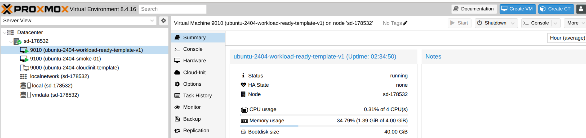
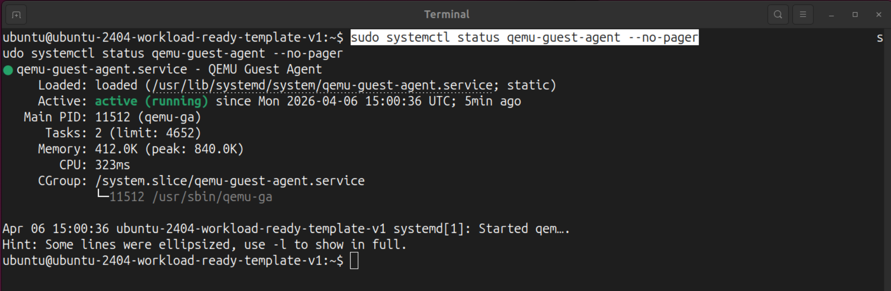
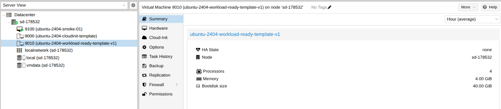

# 🧱 Implementation Log — Phase 04 (Proxmox VM Baseline): Generic Ubuntu VM Template, smoke VM, and workload-ready VM template

> ## 👤 About
> This document is the implementation log and detailed project build diary for **Phase 04 (Proxmox VM Baseline)**.  
> It records the **final proven implementation path** for the first reusable Proxmox-backed VM baseline in this project.  
>
> For the earlier **discovery and environment audit** that informed this implementation path, see: **[DISCOVERY.md](DISCOVERY.md)**.  
> For local/workstation preparation and SSH access to the Proxmox host, see: [SETUP.md](SETUP.md).
> For the shorter, reproducible TL;DR **command checklist / rerun guide**, see: **[RUNBOOK.md](RUNBOOK.md)**.  
> For phase-scoped **rationale and outcome notes**, see: **[DECISIONS.md](DECISIONS.md)**.  
> For top-level project navigation, see: **[../INDEX.md](../INDEX.md)**.

---

## 📌 Index (top-level)

- [**Purpose / Goal**](#purpose--goal)
- [**Definition of done (Phase 04)**](#definition-of-done-phase-04)
- [**Preconditions**](#preconditions)
- [**Step 0 — Confirm the Proxmox target host and storage layout**](#step-0--confirm-the-proxmox-target-host-and-storage-layout)
- [**Step 1 — Stage the Ubuntu 24.04 cloud image on the Proxmox host**](#step-1--stage-the-ubuntu-2404-cloud-image-on-the-proxmox-host)
- [**Step 2 — Create the reusable base VM template (`9000`) from the host-staged cloud image**](#step-2--create-the-reusable-base-vm-template-9000-from-the-host-staged-cloud-image)
- [**Step 3 — Create the reference smoke VM (`9100`) from the template**](#step-3--create-the-reference-smoke-vm-9100-from-the-template)
- [**Step 4 — Verify the reference smoke VM from inside the guest**](#step-4--verify-the-reference-smoke-vm-from-inside-the-guest)
- [**Step 5 — Extend the generic baseline VM template into a workload-ready prep VM (`9010`)**](#step-5--extend-the-generic-baseline-vm-template-into-a-workload-ready-prep-vm-9010)
- [**Step 6 — Qualify the workload-ready prep VM from inside the guest**](#step-6--qualify-the-workload-ready-prep-vm-from-inside-the-guest)
- [**Step 7 — Persist the private guest network and finalize the workload-ready template (`9010`)**](#step-7--persist-the-private-guest-network-and-finalize-the-workload-ready-template-9010)
- [**Cleanup / rerun notes**](#cleanup--rerun-notes)
- [**Baseline observations and evidence (Phase 04)**](#baseline-observations-and-evidence-phase-04)
- [**Sources**](#sources)

---

## Purpose / Goal

### Establish the first reusable Proxmox-backed VM baseline

- The goal of Phase 04 is to establish and verify the first **reusable Proxmox-backed VM baseline** on the provided host.
- The phase now concludes with **three explicit baseline artifacts**:
  - **(1) generic Ubuntu 24.04 Cloud-Init VM template `9000`**
  - **(2) reference smoke VM `9100` cloned from that template**
  - **(3) workload-ready baseline template variant `9010` as the Phase-05 starting point**
- The phase also proves the baseline at both required verification layers:
  - **hypervisor-side verification** on the Proxmox host itself
  - **guest-side verification** inside the guest operating system

### Establish a CLI-driven template workflow (instead of GUI-based VM creation)

This phase follows the official Proxmox **[Cloud-Init](https://pve.proxmox.com/wiki/Cloud-Init_Support) template workflow**:

- (1) Use a **Cloud-Init-capable Ubuntu image** 
- (2) Turn this image into a **reusable VM template** on the Proxmox host
- (3) Clone guest VMs from that template 

That is the workflow Proxmox itself recommends for rolling out new VM instances efficiently. The Proxmox documentation explicitly recommends converting a prepared **Cloud-Init image** into a **VM template** and then using that template to create **linked clones** quickly.

The Proxmox GUI wizard is a valid operational surface for VM creation and was inspected during discovery. For this phase, however, the baseline is documented via the **CLI-driven template path** because it makes the chosen workflow ...

- easier to reproduce exactly
- easier to verify from the host and from inside the guest
- and easier to align later with automation and Infrastructure as Code work

The implementation therefore standardizes on one clear documented path:

- create a reusable **Cloud-Init VM template**
- clone a **reference smoke VM**
- verify the result from both the **Proxmox host** and **inside the guest**

### Prove the VM at both verification layers (host + guest)

- A new Proxmox sidebar entry for a new VM/VM-Template is not enough to count as success.
- This phase therefore verifies the VM at two distinct levels:
  - on the **Proxmox host** (`qm`, `pvesm`, inventory, disk objects, runtime state)
  - and inside the **guest operating system** itself
- The guest must boot, accept login, finish Cloud-Init initialization, expose a usable root filesystem, and prove outbound connectivity.

### Phase 04 follows a two-layer qualification path

- The first qualification layer establishes the generic reusable Ubuntu cloud-image baseline.
  - This proves the Proxmox Cloud-Init template workflow itself: image staging, template creation, clone creation, Cloud-Init bootstrap, serial-console access, disk growth, guest login, and basic outbound smoke connectivity.
- The second qualification layer tests and verifies whether that baseline is already suitable as the actual deployment platform for later target-side work.
  - Phase 04 therefore concludes by preparing, validating, and finalizing a workload-ready template variant (`9010`) from the generic baseline before Phase 05 begins.  

> [!NOTE] **🧩 Phase-04 artifact roles**
>
> - `9000` = generic Ubuntu cloud-image baseline template
> - `9100` = initial smoke-validation clone from the generic baseline
> - `9010` = workload-ready baseline template variant finalized during Phase 04

---

## Definition of done (Phase 04)

- The provided **Proxmox host** is confirmed as a usable guest VM target.
- A reusable Ubuntu 24.04 **Cloud-Init VM template** exists as **VM/template `9000`**.
- A **reference smoke VM `9100`** can be cloned from that template.
  - The smoke VM boots successfully.
  - Guest login works.
  - `cloud-init status --wait` returns `status: done`.
  - The guest root filesystem is confirmed at a usable size after hypervisor-side disk enlargement.
  - Outbound connectivity works from inside the guest.
- A **workload-ready baseline template variant `9010`** exists as base for Phase 05.
  - The guest uses a **private host-bridged network path** via `vmbr1`.
  - The guest has a **stable private IPv4 address** and **default route**.
  - DNS resolution and outbound HTTPS work for later bootstrap endpoints such as GitHub, `get.k3s.io`, and common container registries.
  - The guest-side **QEMU Guest Agent** is active and reachable from the Proxmox host.
  - The host-side `vmbr1` + NAT design is persisted.
  - Cloud-Init instance state is cleaned before template conversion.

---

## Preconditions

- Valid access to the provided Proxmox web UI and host shell
- The Proxmox node is online
- The relevant storage targets are available for template and clone work
- The Ubuntu 24.04 released cloud image is reachable from the Proxmox host

---

## Step 0 — Confirm the Proxmox target host and storage layout

### Rationale

Before creating the reusable template and the first smoke VM, a confirmation is needed 
- that the provided **Proxmox host** is actually usable for this phase 
- and that the required **storage targets** are present.

This step is the hypervisor-side starting point for the whole phase:
- the **host** is the physical machine running Proxmox
- the later **VM** will run on that host as a **guest**
- the **storage targets** must already exist before a cloud image can be imported and turned into a reusable template

This implementation step builds on the broader **target-host reconnaissance** captured separately in **[DISCOVERY.md](DISCOVERY.md)**.

### Action

**Node summary on the target Proxmox host**

***Figure 1.*** *Node summary view showing the provided Proxmox host online and ready for VM work. This establishes the real execution target for the phase.*

**Datacenter storage view**

***Figure 2.*** *Datacenter storage view showing the available storage targets used for the template and smoke VM workflow.*

**Investigate Proxmox storage targets via host shell**

Using the Proxmox Storage Manager `pvesm` in the host shell shows, that **both expected Proxmox storage targets are present and active**, so the host is ready for the template-and-clone workflow used in this phase:

~~~bash
# pvesm = Proxmox VE Storage Manager CLI
# Show configured Proxmox storage targets and confirm that usable VM disk storage is available
$ pvesm status
Name     Type     Status           Total            Used       Available        %
local     dir     active        53733704         6215284        44756488   11.57%
vmdata zfspool     active      5653921792             468      5653921324    0.00%
~~~

> [!NOTE] **🧩 `local` vs `vmdata`**  
> In this phase, `local` is the **host-side file storage** typically used for helper assets such as templates, ISOs, snippets, and backups.  
> `vmdata` is the **Proxmox storage target backed by the host ZFS pool `zpve`**. In this phase it is used for the imported root disk, the reusable template base disk, the Cloud-Init drive, and the smoke clone disk.  
> So `vmdata` is not a vague “virtual reserve area”; it is the real storage location where the VM disk artifacts for this phase live.

---

## Step 1 — Stage the Ubuntu 24.04 cloud image on the Proxmox host

### Rationale

Now that the Proxmox host and storage targets are confirmed, the next step is to **stage a Ubuntu 24.04 cloud image** on the Proxmox host.

- This **cloud image** is the **raw operating-system base** from which the reusable **CloudInit VM template** will be built. In the case of Ubuntu, that cloud image is provided at https://cloud-images.ubuntu.com.
- So instead of installing Ubuntu interactively from scratch, this phase uses a **prebuilt cloud image** and **converts it into a Proxmox template**. This is much faster and fits the later **template -> clone** workflow.
- A **temporary `.part` file** is used first so the download can be verified before it is moved into place as the real import source.

### Action

~~~bash
# Create a dedicated working directory for staging the cloud image
mkdir -p /root/pve-images
cd /root/pve-images

# Download the Ubuntu 24.04 released cloud image into a temporary file first
wget -c \
  -O ubuntu-24.04-server-cloudimg-amd64.img.part \
  https://cloud-images.ubuntu.com/releases/noble/release/ubuntu-24.04-server-cloudimg-amd64.img

# Verify that the temporary download exists and has a plausible non-zero size
$ ls -lh ubuntu-24.04-server-cloudimg-amd64.img.part
-rw-r--r-- 1 root root 601M Mar 23 19:31 ubuntu-24.04-server-cloudimg-amd64.img.part

# Move the validated download into place as the real import source
$ mv ubuntu-24.04-server-cloudimg-amd64.img.part \
   ubuntu-24.04-server-cloudimg-amd64.img
~~~

### Result

The cloud image was downloaded and successfully staged on the Proxmox host.

> [!NOTE] **🧩 Cloud Image**  
> A cloud image is a prebuilt operating-system image designed for automated first boot, typically with Cloud-Init support already present.  
> That makes it a good fit for a Proxmox **template -> clone -> configure** workflow.

---

## Step 2 — Create the reusable base VM template (`9000`) from the host-staged cloud image

### Rationale

With the Ubuntu 24.04 cloud image staged on the Proxmox host, the next step is to turn that image into a reusable **Proxmox CloudInit VM template**.

- This is done via Proxmox’s command-line VM manager (`qm`).  
- The result of this step is **a VM template as reusable base artifact** from which later smoke or application VMs can be cloned quickly and consistently.

### Action

> [!NOTE] **🧩 Template vs Clone**  
> The template is the reusable base artifact.  
> Real guest VMs are created as clones from that base.  
> This corresponds with the standard Proxmox Cloud-Init **template -> clone** workflow.

The template uses the following settings:

- VM ID `9000` (following a suggested Cloud-Init convention from the Proxmox docs, to use high numbered VM IDs for reusable VM base templates) 
- `virtio-scsi-pci` as the SCSI controller (Proxmox recommends VirtIO-based storage controllers for modern Linux guests when performance and maintainability matter)
- `l26` as the Proxmox guest operating-system type for a modern Linux guest (a Proxmox-specific selector for Linux Kernel from 2.6 through 6.x)
- Guest Shell access (`serial0: socket` + `vga: serial0`) for straightforward guest verification: This configuration redirects the VM’s primary console output to the first virtual serial port, allowing the guest to be accessed and verified directly from the host via `qm terminal <vmid>` instead of relying on a graphical GUI console.

> [!NOTE] **🧩 `qm`, QEMU, and KVM**  
> In short: `qm` is the Proxmox VM manager, QEMU provides the virtual machine, and KVM provides the hardware-assisted virtualization underneath it:
>
> Proxmox manages virtual machines through the `qm` command - Proxmox’s command-line manager for QEMU/KVM virtual machines:
> - **QEMU** (**Quick Emulator**) provides the virtual machine itself, meaning the emulated virtual hardware seen by the guest.
> - **KVM** (**Kernel-based Virtual Machine**) is the Linux kernel virtualization layer that accelerates those virtual machines using the host CPU’s hardware-virtualization features.
> - **`qm`** is the Proxmox tool that creates, configures, starts, stops, clones, and templates those VMs.

> [!NOTE] **🧩 Cloud-Init drive**  
> A **Cloud-Init drive** is a small virtual CD-ROM-like disk that Proxmox attaches to the VM on `ide2`.  
> It does not hold the Ubuntu operating system itself. Proxmox uses it instead to write the VM’s first-boot configuration on it, f.i.:
> - the initial user name (`ciuser`)
> - the initial password (`cipassword`) or SSH keys 
> - network settings (`ipconfig0`)
> - other Cloud-Init metadata
>
> The real operating system lives on the root disk (`scsi0`).  
> The Cloud-Init drive only provides the configuration data that the guest reads during its first boot.

~~~bash
# --- (1) Create the base VM shell ---
# Create the base VM object that will become the reusable template
# qm = Proxmox QEMU/KVM virtual-machine manager CLI
$ qm create 9000 \
  --name ubuntu-2404-cloudinit-template \
  --memory 2048 \
  --cores 2 \
  --ostype l26 \
  --scsihw virtio-scsi-pci

# --- (2) Import the Ubuntu cloud image and add the Cloud-Init drive ---

# Import the Ubuntu cloud image as the real root disk on vmdata
$ qm set 9000 \
  --scsi0 vmdata:0,import-from=/root/pve-images/ubuntu-24.04-server-cloudimg-amd64.img
update VM 9000: -scsi0 vmdata:0,import-from=/root/pve-images/ubuntu-24.04-server-cloudimg-amd64.img
transferred 3.5 GiB of 3.5 GiB (100.00%)
scsi0: successfully created disk 'vmdata:vm-9000-disk-0,size=3584M'

# Attach the Cloud-Init drive
$ qm set 9000 --ide2 vmdata:cloudinit
update VM 9000: -ide2 vmdata:cloudinit
ide2: successfully created disk 'vmdata:vm-9000-cloudinit,media=cdrom'
generating cloud-init ISO

# Restrict boot to the imported root disk
$ qm set 9000 --boot order=scsi0

# Redirect the primary guest console to the first serial interface
$ qm set 9000 --serial0 socket --vga serial0

# --- (3) Verify the VM object before converting it into a template ---
$ qm config 9000
boot: order=scsi0
cores: 2
ide2: vmdata:vm-9000-cloudinit,media=cdrom
memory: 2048
meta: creation-qemu=9.2.0,ctime=<redacted>
name: ubuntu-2404-cloudinit-template
ostype: l26
scsi0: vmdata:vm-9000-disk-0,size=3584M
scsihw: virtio-scsi-pci
serial0: socket
smbios1: uuid=<redacted>
vga: serial0
vmgenid: <redacted>

$ qm list --full
VMID NAME                            STATUS   MEM(MB) BOOTDISK(GB) PID
9000 ubuntu-2404-cloudinit-template  stopped     2048         3.50 0

$ pvesm list vmdata
Volid                    Format  Type            Size VMID
vmdata:vm-9000-cloudinit raw     images       4194304 9000
vmdata:vm-9000-disk-0    raw     images    3758096384 9000

# --- (4) Convert the VM into a reusable VM template ---
$ qm template 9000

# --- (5) Verify the final template result ---
$ qm config 9000
boot: order=scsi0
cores: 2
ide2: vmdata:vm-9000-cloudinit,media=cdrom
memory: 2048
meta: creation-qemu=9.2.0,ctime=<redacted>
name: ubuntu-2404-cloudinit-template
ostype: l26
scsi0: vmdata:base-9000-disk-0,size=3584M
scsihw: virtio-scsi-pci
serial0: socket
smbios1: uuid=<redacted>
template: 1
vga: serial0
vmgenid: <redacted>

$ qm list --full
VMID NAME                            STATUS   MEM(MB) BOOTDISK(GB) PID
9000 ubuntu-2404-cloudinit-template  stopped     2048         3.50 0

$ pvesm list vmdata
Volid                    Format  Type            Size VMID
vmdata:base-9000-disk-0  raw     images    3758096384 9000
vmdata:vm-9000-cloudinit raw     images       4194304 9000
~~~

### Result

The Ubuntu 24.04 cloud image was successfully converted into a **reusable Proxmox CloudInit VM template**.

The successful end state is shown by these concrete signals:

- `qm config 9000` now  
  - shows a Cloud-Init drive `vmdata` on `ide2` 
  - includes `template: 1` 
  - shows `boot: order=scsi0`
  - shows a real `scsi0` root disk - as `vmdata:base-9000-disk-0,...` (instead of `vmdata:vm-9000-disk-0,...`)
- `qm list --full` still shows a non-zero boot disk
- `pvesm list vmdata` shows the expected template-side storage objects:
  - `vmdata:base-9000-disk-0`
  - `vmdata:vm-9000-cloudinit`
 
**Reusable base template created**

***Figure 3.*** *Proxmox inventory view showing the reusable Ubuntu 24.04 base VM template after successful creation. This proves that the imported cloud image and attached Cloud-Init drive were turned into a reusable template artifact.*

---

## Step 3 — Create the reference smoke VM (`9100`) from the template

### Rationale

Once the reusable template exists, the next step is to create the **minimal verification VM** from it - and prove that the template can be turned into a working guest with the intended first-boot settings.

This step establishes the first working VM baseline that later phases can build on for deployment and automation work.

### Action

> [!NOTE] **🧩 "Smoke VM"**  
> A **minimal validation VM** created from a reusable template used to prove that the baseline works before heavier deployment steps are added on top.  
> In this phase, `9100` is the **smoke VM** used to validate the reusable template path

The smoke VM uses:

- the reusable template `9000` as its source
- `9100` as its own VM ID
- a Cloud-Init user and password
- a virtio NIC (`net0: virtio`) without bridge attachment - to use the documented default guest VM network path for DHCP, DNS, and outbound access (unbridged QEMU user-mode NAT - reasoning see below "Guest NIC without bridge attachment") 
- a larger root disk before first boot

> [!NOTE] **🧩 NIC (Network Interface Card)**
> A **NIC** is the **network adapter** a system uses to connect to a network.
>
> In this phase, the smoke VM does **not** use a physical NIC directly.  
> Instead, Proxmox presents the guest VM with a **virtual NIC**, configured here as:
>
> - `net0: virtio`
>
> `net0` = the VM’s first network interface.  
> `virtio` = a paravirtualized virtual NIC designed for virtualization, with lower overhead and better performance than older emulated adapter types such as `e1000`.
>
> Inside the Ubuntu guest, that virtual NIC appears as `eth0`.  
> In this phase, the NIC is intentionally configured **without a bridge** (i.e. without `bridge=vmbr0`), so the guest uses for outbound connectivity QEMU user-mode NAT (a built-in VM networking mode provided by QEMU on the host side).

To proceed, we again utilize Proxmox' QEMU/KVM virtual-machine manager CLI tool `qm`: 

~~~bash
# --- (1) Clone the smoke VM from the reusable base template ---
$ qm clone 9000 9100 --name ubuntu-2404-smoke-01
create full clone of drive ide2 (vmdata:vm-9000-cloudinit)
create linked clone of drive scsi0 (vmdata:base-9000-disk-0)

# --- (2) Configure guest networking and Cloud-Init login values ---
# Use the documented guest NIC path: virtio NIC without bridge attachment
$ qm set 9100 --net0 virtio
update VM 9100: -net0 virtio

$ qm set 9100 --ciuser ubuntu
update VM 9100: -ciuser ubuntu

$ qm set 9100 --cipassword 'SECURE_TEMP_PASSWORD'
update VM 9100: -cipassword <hidden>

$ qm set 9100 --ipconfig0 ip=dhcp
update VM 9100: -ipconfig0 ip=dhcp

# --- (3) Enlarge the guest root disk before first boot ---
$ qm resize 9100 scsi0 16G

# --- (4) Verify the smoke VM object before booting ---
$ qm config 9100
boot: order=scsi0
cipassword: **********
ciuser: ubuntu
cores: 2
ide2: vmdata:vm-9100-cloudinit,media=cdrom,size=4M
ipconfig0: ip=dhcp
memory: 2048
meta: creation-qemu=9.2.0,ctime=<redacted>
name: ubuntu-2404-smoke-01
net0: virtio=<redacted-mac>
ostype: l26
scsi0: vmdata:base-9000-disk-0/vm-9100-disk-0,size=16G
scsihw: virtio-scsi-pci
serial0: socket
smbios1: uuid=<redacted>
vga: serial0
vmgenid: <redacted>

$ qm cloudinit pending 9100
cur cipassword: **********
cur ciuser: ubuntu

$ qm list --full
      VMID NAME                 STATUS   MEM(MB) BOOTDISK(GB) PID
      9000 ubuntu-2404-cloudinit-template stopped    2048          3.50 0
      9100 ubuntu-2404-smoke-01          stopped    2048         16.00 0

# --- (5) Start the smoke VM and confirm runtime state ---
$ qm start 9100
Use of uninitialized value in split at /usr/share/perl5/PVE/QemuServer/Cloudinit.pm line 115.
generating cloud-init ISO
WARN: Interface 'tap9100i0' not attached to any bridge.
Task finished with 1 warning(s)!

$ qm list --full
VMID NAME                 STATUS   MEM(MB) BOOTDISK(GB) PID
9000 ubuntu-2404-cloudinit-template stopped    2048          3.50 0
9100 ubuntu-2404-smoke-01          running    2048         16.00 <redacted-pid>
~~~

### Result

The **smoke VM (`9100`) was successfully created** from the reusable Proxmox VM template. The template can be turned into a working guest with the intended first-boot settings.

**Hypervisor-side verification points:**

The successful end state is shown by these concrete post-conversion signals:

- `qm config 9100` shows:
  - `net0: virtio=...` with **no** bridge parameter
  - `ipconfig0: ip=dhcp`
  - `ide2: ...cloudinit...`
  - `scsi0: ... size=16G`
- `qm cloudinit pending 9100` shows the configured Cloud-Init values queued for the guest
- `qm list --full` first shows the VM in `stopped` state with `BOOTDISK(GB)` at `16.00`, and then in `running` state after boot
- the warning `Interface 'tap9100i0' not attached to any bridge.` appears during start and is expected here, because the reference smoke VM intentionally uses the documented unbridged guest path for the first generic-baseline validation pass

> [!NOTE] **🧩 Guest NIC without host bridge attachment**
>
> In this first qualification layer, the smoke VM NIC is intentionally configured as `virtio` **without** bridge attachment (no `bridge=vmbr0`) so the guest uses the documented default unbridged QEMU user-mode NAT path.
>
> That makes this network model **acceptable for generic smoke validation** in Phase 04:
> - the template/clone mechanics are proven
> - Cloud-Init bootstrap is proven
> - the guest reaches the outside successfully
>
> But this is not a suitable workload-ready target baseline: Phase 04 later extends this generic baseline into a private host-bridged workload-ready VM template as base  for Phase 05.

**Smoke VM created**

***Figure 4.*** *Proxmox inventory view showing the reference smoke VM cloned from the base template and running. This proves that the template is reusable and that the final reference guest path was established successfully.*

---

## Step 4 — Verify the reference smoke VM from inside the guest

### Rationale

At this point the **VM exists and is running in Proxmox**, but the hypervisor-side inventory alone is still not enough.

To complete the verification, we now log into the guest VM itself and prove that the machine is not only present in Proxmox but also usable from inside the operating system.

The goal is to verify that the guest:

- accepts login
- finishes Cloud-Init initialization
- exposes the enlarged root filesystem
- provides outbound connectivity

### Action

The guest OS is accessed through the configured serial console from the host:

~~~bash
# Open the VM's serial console from the Proxmox host to log into the guest operating system
qm terminal 9100
~~~

Inside the guest, we perform the following checks:

~~~bash
# Confirm the guest login identity and Cloud-Init completion
$ whoami
ubuntu

$ hostname
ubuntu-2404-smoke-01

$ cloud-init status --wait
status: done

# Confirm the guest addressing and routing
$ ip -brief address
lo               UNKNOWN        127.0.0.1/8 ::1/128
eth0             UP             10.0.2.15/24 metric 100 fec0::be24:11ff:fe4d:da17/64 fe80::be24:11ff:fe4d:da17/64

$ ip route
default via 10.0.2.2 dev eth0 proto dhcp src 10.0.2.15 metric 100
10.0.2.0/24 dev eth0 proto kernel scope link src 10.0.2.15 metric 100
10.0.2.2 dev eth0 proto dhcp scope link src 10.0.2.15 metric 100
10.0.2.3 dev eth0 proto dhcp scope link src 10.0.2.15 metric 100

# Confirm that the enlarged root filesystem is visible inside the guest
$ df -h /
Filesystem      Size  Used Avail Use% Mounted on
/dev/sda1        15G  2.2G   13G  16% /

# Confirm outbound connectivity
$ ping -c 2 1.1.1.1
PING 1.1.1.1 (1.1.1.1) 56(84) bytes of data.
64 bytes from 1.1.1.1: icmp_seq=1 ttl=255 time=1.84 ms
64 bytes from 1.1.1.1: icmp_seq=2 ttl=255 time=1.94 ms

--- 1.1.1.1 ping statistics ---
2 packets transmitted, 2 received, 0% packet loss, time 1002ms
rtt min/avg/max/mdev = 1.840/1.889/1.938/0.049 ms

$ curl -I --max-time 10 https://example.com
HTTP/2 200
date: Thu, 02 Apr 2026 20:10:18 GMT
content-type: text/html
server: cloudflare
last-modified: Tue, 24 Mar 2026 22:07:32 GMT
allow: GET, HEAD
accept-ranges: bytes
age: 4589
cf-cache-status: HIT
cf-ray: 9e6279e8d9136d1d-AMS
~~~

### Result

**The final successful results are:**

- `whoami` -> `ubuntu`
- `hostname` -> `ubuntu-2404-smoke-01`
- `cloud-init status --wait` -> `status: done`
- `ip -brief address` -> `eth0` with `10.0.2.15/24`
- `ip route` -> default route via `10.0.2.2`
- `df -h /` -> `/dev/sda1` visible at roughly `15G`
- `ping -c 2 1.1.1.1` -> successful outbound IP connectivity
- `curl -I --max-time 10 https://example.com` -> successful DNS resolution plus outbound HTTPS connectivity

**Guest login, Cloud-Init, and disk verification success**

***Figure 5.*** *Guest-side verification inside the reference smoke VM. This proves successful login, successful Cloud-Init completion, and a healthy enlarged root filesystem inside the guest.*

---

## Step 5 — Extend the generic baseline VM template into a workload-ready prep VM (`9010`)

### Rationale

The first qualification layer established that the generic Proxmox template workflow works cleanly on the provided host.

The next question for the same phase is narrower and more practical:
- Can this baseline also serve as the actual deployment base for later target-side work (i.e. Proxmox deployment)?

To answer that, Phase 04 now **extends the generic baseline into a workload-ready prep VM**:

- **private guest bridge** instead of the earlier unbridged smoke path
- stable **private guest addressing**
- **explicit/deterministic DNS resolver** 
- **larger root disk**
- more practical **CPU and memory baseline**
- **guest-agent capability** for later **host-side interaction**

### Action

> [!NOTE] **🧩 Private Linux bridge `vmbr1`**
>
> `vmbr1` is a **private Linux bridge** created on the Proxmox host.
> A Linux bridge acts like a small virtual Layer-2 switch inside the host:
> - guest NICs can be attached to it
> - the bridge can also hold its own host-side IP address
>
> In this Phase-04 setup, `vmbr1` is **not** attached to a physical NIC.
> Instead:
> - the **host-side bridge address `<redacted-gateway-ip>`** acts as the **guest default gateway**
> - the guest remains on the private subnet `10.10.10.0/24`
> - host-side forwarding + NAT then let guest traffic leave through the existing public bridge `vmbr0`

> [!NOTE] **🧩 NAT and masquerading**
>
> **NAT** (**Network Address Translation**) means that the **host rewrites outgoing guest traffic** so it can **leave the private guest subnet** by using the **host's public-side network path**.
>
> In this Phase-04 setup, Linux **masquerading** is the concrete NAT technique used on the host:
> - traffic from the private guest subnet `10.10.10.0/24` leaves through `vmbr0`
> - the host rewrites that traffic so it appears to come from the host-side uplink path instead of directly from the guest's private address
>
> That is why the guest can stay on a private subnet while still reaching package, bootstrap, and registry endpoints on the outside.

> [!NOTE] **🧩 Deterministic/explicit DNS resolver**
>
> A **DNS resolver** is the **DNS server** a system asks when it needs to **translate host names** such as `github.com` **into IP addresses**.
>
> In this Phase-04 setup, the **guest is given the explicit DNS resolver `1.1.1.1`**.
> That makes DNS behavior **deterministic/explicit** here - i.e. the **guest does not depend on an unknown or changing DNS resolver source**; the intended DNS server is set explicitly in the VM's first-boot configuration.

> [!NOTE] **🧩 Chosen guest IP and gateway**
>
> `<redacted-gateway-ip>0/24` is a chosen private guest address inside the private subnet `10.10.10.0/24`.
>
> `<redacted-gateway-ip>` is used as the guest gateway because the host-side bridge `vmbr1` itself holds that address.
> In this design, the guest therefore sends traffic for outside destinations to the host-side bridge address, which then forwards and NATs that traffic onward through `vmbr0`.

To extend the generic baseline VM into a workload-ready prep VM we need  

- to build the temporary **private guest bridge **
- and **clone** the workload-ready prep VM :

~~~bash
# --- (1) Create a private guest bridge on the host for the workload-ready VM ---

# Check first whether a bridge named vmbr1 already exists.
# ip     = Linux networking CLI
# -br    = brief output format
# link   = show network links/interfaces
$ ip -br link show vmbr1
Device "vmbr1" does not exist.

# Create a new Linux bridge named vmbr1.
# type bridge = create a software bridge device rather than a normal interface.
$ ip link add name vmbr1 type bridge

# Assign the host-side gateway address to the bridge.
# <redacted-gateway-ip>/24 means:
# - bridge address = <redacted-gateway-ip>
# - subnet mask    = /24 = 255.255.255.0
$ ip addr add <redacted-gateway-ip>/24 dev vmbr1

# Bring the new bridge interface up so it can actually carry traffic.
$ ip link set vmbr1 up

# Enable IPv4 forwarding on the host.
# sysctl = kernel runtime parameter tool
# -w     = write the given value immediately
$ sysctl -w net.ipv4.ip_forward=1
net.ipv4.ip_forward = 1

# Add a NAT masquerading rule for traffic leaving the private guest subnet through vmbr0.
# iptables      = Linux packet-filter / firewall CLI
# -t nat        = use the NAT table
# -A POSTROUTING = append a rule to the POSTROUTING chain
# -s            = source subnet to match
# -o            = outgoing interface
# -j MASQUERADE = apply source NAT using the host-side outgoing path
$ iptables -t nat -A POSTROUTING -s 10.10.10.0/24 -o vmbr0 -j MASQUERADE

# Allow guest traffic to leave the private bridge toward the public-side bridge.
# -A FORWARD = append to the forwarding chain
# -i         = incoming interface
# -o         = outgoing interface
# -j ACCEPT  = allow the matched traffic
$ iptables -A FORWARD -i vmbr1 -o vmbr0 -j ACCEPT

# Allow established return traffic back from vmbr0 to vmbr1.
# -m conntrack                = use connection-tracking state matching
# --ctstate ESTABLISHED,RELATED = allow replies to already allowed outbound traffic
$ iptables -A FORWARD -i vmbr0 -o vmbr1 -m conntrack --ctstate ESTABLISHED,RELATED -j ACCEPT

# Confirm that vmbr1 now exists and has the expected host-side bridge address.
$ ip -br addr show vmbr1
vmbr1            UNKNOWN        <redacted-gateway-ip>/24 ...

# --- (2) Clone the workload-ready prep VM from the generic baseline template ---
$ qm clone 9000 9010 --name ubuntu-2404-workload-ready-template-v1 --full 1

# Attach the guest NIC to the private bridge
$ qm set 9010 --net0 virtio,bridge=vmbr1

# Set Cloud-Init bootstrap values
$ qm set 9010 --ciuser ubuntu
$ qm set 9010 --cipassword 'CHANGE_TO_A_FRESH_TEMP_PASSWORD'
$ qm set 9010 --ipconfig0 ip=<redacted-gateway-ip>0/24,gw=<redacted-gateway-ip>
$ qm set 9010 --nameserver 1.1.1.1

# Enable the guest-agent feature on the Proxmox side
$ qm set 9010 --agent enabled=1

# Raise the baseline disk / CPU / RAM profile
$ qm resize 9010 scsi0 40G
$ qm set 9010 --cores 4 --memory 4096

# Inspect the resulting prep-VM config
$ qm config 9010
$ qm cloudinit pending 9010
$ qm list --full
~~~

**Workload-ready prep VM created on the private guest bridge**

***Figure 6.*** *Proxmox inventory view showing the workload-ready prep VM `9010` created from the generic baseline and attached to `vmbr1`. This proves that the second qualification layer starts from the existing template path (rather than from a fresh manual VM build).*

### Result

The **generic baseline has now been extended** into a **workload-ready prep VM candidate** with these host-side features:

- **`vmbr1`** exists as a **private bridge** with **host-side address `<redacted-gateway-ip>/24`**
- **host-side forwarding + masquerading rules** exist for `10.10.10.0/24`
- **`9010`** exists as a **full clone from `9000`**
- **`9010`** is configured with:
  - `bridge=vmbr1`
  - static private guest IP `<redacted-gateway-ip>0/24`
  - gateway `<redacted-gateway-ip>`
  - explicit DNS resolver `1.1.1.1`
  - guest-agent feature enabled
  - `40G` root disk
  - `4` CPU cores
  - `4096 MB` RAM

> [!NOTE] **🧩 Notable features of workload-ready template path `9010`**
>
> - private host-bridged guest network via `vmbr1`
> - host-side NAT, with forwarding and masquerading out through `vmbr0`
> - stable private guest addressing (`<redacted-gateway-ip>0/24`) and deterministic routing via default gateway `<redacted-gateway-ip>`
> - deterministic DNS via resolver `1.1.1.1`
> - working outbound HTTPS reachability for later bootstrap, package-retrieval, and target-side setup tasks
> - guest-agent capability
> - more practical disk / CPU / memory baseline
> - cleaned Cloud-Init state before template conversion
> - persisted host-side `vmbr1` network configuration and NAT rules

---

## Step 6 — Qualify the workload-ready prep VM from inside the guest

### Rationale

At this point, the prep VM already exists with the intended hypervisor-side configuration, i.e.:
- the Proxmox host-side VM definition
- VM hardware settings: NIC attachment/private guest network, disk size, CPU, and memory
- Cloud-Init values queued in the VM config

Now verification is needed, that the workload-ready prep VM is not only configured correctly on the Proxmox side, but also behaves like a **usable deployment base** that is suitable for later target-side work:  

- private guest addressing works
- the default route works
- DNS resolution works
- outbound HTTPS bootstrap reachability works
- container registry reachability works
- the enlarged disk and practical CPU / memory baseline are visible inside the guest
 
After that guest-side verification, that must be performed from **inside the guest operating system**, the phase also adds the small reusable helper layer needed for later target-side work:

- QEMU Guest Agent
- basic HTTPS / DNS / JSON troubleshooting tools

### Action

**Boot `9010` and verify the guest network/bootstrap baseline**

~~~bash
# Start the prep VM and open the serial console
$ qm start 9010
$ qm terminal 9010
~~~

After the first-boot Cloud-Init activity finishes, run inside the guest:

~~~bash
# Wait until Cloud-Init finishes all first-boot initialization work.
# --wait blocks until the final state is available.
$ cloud-init status --wait
status: done

# Confirm guest identity / currently logged-in guest user.
$ whoami
ubuntu

# Confirm the guest hostname set through the VM / Cloud-Init path.
$ hostname
ubuntu-2404-workload-ready-template-v1

# Confirm private guest addressing and routing by showing 
# the main guest interface in compact form.
# - ip -brief     = short interface summary
# - show dev eth0 = restrict output to the primary NIC
$ ip -brief address show dev eth0
eth0             UP             <redacted-gateway-ip>0/24 ...

# Identify primary outbound paths to verify network connectivity:
# - Default route (the "Gateway" to other networks)
# - Primary local route (the directly connected private subnet)
$ ip route | head -n 2
default via <redacted-gateway-ip> dev eth0 proto static
10.10.10.0/24 dev eth0 proto kernel scope link src <redacted-gateway-ip>0

# Confirm DNS resolution by displaying the current DNS settings 
# and server status via systemd-resolved
$ resolvectl status
...
Current DNS Server: 1.1.1.1
DNS Servers: 1.1.1.1

# Confirm gateway and raw outbound IPv4 reachability
# Confirm that the guest can reach its own host-side gateway and then an outside IPv4 address.
# -c 2 sends exactly two ICMP echo requests.
$ ping -c 2 <redacted-gateway-ip>
$ ping -c 2 1.1.1.1

# Confirm DNS resolution for later bootstrap endpoints
# Resolve later bootstrap (k3s, github, etc.) host names through the configured resolver.
# getent = query the system name-service switch
# ahosts = return address information
# awk 'NR==1 { print }' = print only the first returned line
$ getent ahosts github.com | awk 'NR==1 { print }'
140.82.121.3    STREAM github.com

$ getent ahosts get.k3s.io | awk 'NR==1 { print }'
104.21.56.122   STREAM get.k3s.io

# Confirm outbound HTTPS reachability without downloading full response bodies.
# curl -I       = HEAD request / headers only
# --max-time 15 = fail rather than hanging too long
$ curl -I --max-time 15 https://get.k3s.io | head -n 6
HTTP/2 200
...

$ curl -I --max-time 15 https://github.com/k3s-io/k3s/releases/latest | head -n 6
HTTP/2 302
...

# Confirm common registry endpoint reachability.
# 401 / 405 here still count as useful proof that the endpoint is reachable over HTTPS.
$ curl -I --max-time 15 https://registry-1.docker.io/v2/
HTTP/2 401

$ curl -I --max-time 15 https://ghcr.io/v2/
HTTP/2 405

# Confirm that the resized root filesystem is visible inside the guest.
# df   = disk free / mounted-filesystem usage
# -h   = human-readable sizes
# /    = show only the root filesystem
$ df -h /
Filesystem      Size  Used Avail Use% Mounted on
/dev/sda1        38G  2.2G   36G   6% /

# Confirm how many CPU cores the guest sees.
# nproc = print the number of available processing units
$ nproc
4

# Confirm usable guest memory in human-readable form.
# free -h = memory summary with human-readable units
$ free -h | head -n 3
               total        used        free ...
Mem:           3.8Gi ...

# Confirm time synchronization health.
$ timedatectl status
...
System clock synchronized: yes
~~~

The guest-side network and bootstrap checks above confirm that the **prep VM now behaves like a usable target-side baseline**. 

But a **reusable helper layer** is still missing, that provides the guest with **QEMU Guest Agent** and a few **basic troubleshooting tools**, useful for host-side interaction and target-side debugging:

**Install reusable baseline helper tools and validate guest-agent communication**

~~~bash
# Refresh package metadata and install the small reusable helper set
$ sudo apt-get update
$ sudo apt-get install -y qemu-guest-agent curl ca-certificates jq dnsutils vim

# Enable the guest-agent service inside the VM
$ sudo systemctl enable --now qemu-guest-agent

# Confirm that the service is active
$ sudo systemctl status qemu-guest-agent --no-pager
~~~

Back on the Proxmox host, the next check confirms that the newly enabled guest-agent service is not only active inside the VM, but is also **reachable from the host through the Proxmox guest-agent channel**:

~~~bash
# Ask the QEMU Guest Agent for the guest network-interface data from the Proxmox host side.
# qm guest cmd <vmid> <command> forwards a supported guest-agent command into the VM.
# network-get-interfaces returns the interface data as seen from inside the guest.
$ qm guest cmd 9010 network-get-interfaces
[
  ...
  {
    "name": "eth0",
    "ip-addresses": [
      {
        "ip-address": "<redacted-gateway-ip>0",
        "ip-address-type": "ipv4",
        "prefix": 24
      }
    ]
  }
]
~~~

**Guest-agent and baseline helper tools verified**

***Figure 7.*** *Guest-side proof that the workload-ready prep VM is no longer only a generic smoke clone. The guest has stable private addressing, working bootstrap reachability, and an active QEMU Guest Agent that is reachable from the Proxmox host.*

### Result

The **workload-ready prep VM** is now **qualified inside the guest**.

The guest-side acceptance criteria are:

- `eth0` uses `<redacted-gateway-ip>0/24`
- the default route points to `<redacted-gateway-ip>`
- `resolvectl` shows `1.1.1.1`
- DNS resolution works for GitHub and `get.k3s.io`
- outbound HTTPS works for later bootstrap endpoints
- common registry endpoints are reachable
- the resized `40G` root disk is visible inside the guest
- the guest sees `4` CPU cores and about `4 GiB` RAM
- time synchronization is healthy
- the QEMU Guest Agent is active inside the guest and reachable from the host

---

## Step 7 — Persist the private guest network and finalize the workload-ready template (`9010`)

### Rationale

The prep VM has now proven the real target-side groundwork needed for later deployment work.

Before converting it into a reusable template, two final things are still needed:

- the **private bridge **+ NAT model must be made persistent on the host
- the **prep VM must be rebooted once** after the package/kernel activity, **re-validated** briefly, **cleaned**, and only then templated

This produces the **final workload-ready VM template** from a prep VM that has already been rebooted, rechecked, and cleaned for reuse.

### Action

**Persist the private guest bridge + NAT model on the host**

The temporary bridge and forwarding/NAT rules used during prep must now be written into the host's persistent network configuration so the workload-ready baseline can be recreated reliably after host reboot.

~~~bash
# Back up the host network config before editing it
$ cp /etc/network/interfaces /etc/network/interfaces.bak.$(date +%F-%H%M%S)

# Append the persistent vmbr1 bridge definition
$ cat <<'EOF' >> /etc/network/interfaces

auto vmbr1
iface vmbr1 inet static
    address <redacted-gateway-ip>/24
    bridge_ports none
    bridge_stp off
    bridge_fd 0

    post-up echo 1 > /proc/sys/net/ipv4/ip_forward
    post-up iptables -t nat -A POSTROUTING -s '10.10.10.0/24' -o vmbr0 -j MASQUERADE
    post-up iptables -A FORWARD -i vmbr1 -o vmbr0 -j ACCEPT
    post-up iptables -A FORWARD -i vmbr0 -o vmbr1 -m conntrack --ctstate ESTABLISHED,RELATED -j ACCEPT

    post-down iptables -t nat -D POSTROUTING -s '10.10.10.0/24' -o vmbr0 -j MASQUERADE
    post-down iptables -D FORWARD -i vmbr1 -o vmbr0 -j ACCEPT
    post-down iptables -D FORWARD -i vmbr0 -o vmbr1 -m conntrack --ctstate ESTABLISHED,RELATED -j ACCEPT
EOF

# Persist IPv4 forwarding at the sysctl level
$ cat <<'EOF' > /etc/sysctl.d/99-proxmox-vmbr1-nat.conf
net.ipv4.ip_forward = 1
EOF

# Apply the sysctl setting and confirm the config contains exactly one vmbr1 stanza
$ sysctl --system | grep net.ipv4.ip_forward
$ grep -n "iface vmbr1 inet static" /etc/network/interfaces
$ grep -n -A 20 -B 2 "iface vmbr1 inet static" /etc/network/interfaces
~~~

**Reboot, re-validate briefly, clean, and convert `9010` into a template**

Inside the guest:

~~~bash
# Reboot once after the package/kernel activity
$ sudo reboot
~~~

Back on the Proxmox host:

~~~bash
# Reattach to the guest after reboot
$ qm terminal 9010
~~~

Inside the guest:

~~~bash
# Reconfirm the key guest acceptance signals after reboot
$ cloud-init status --wait
$ ip -brief address show dev eth0
$ ip route | head -n 2
$ getent ahosts github.com | awk 'NR==1 { print }'
$ curl -I --max-time 15 https://get.k3s.io | head -n 6
$ uname -r

# Clean instance-specific state before templating
$ sudo cloud-init clean --logs
$ sudo cloud-init clean --machine-id

# Shut the guest down cleanly
$ sudo shutdown -h now
~~~

Back on the Proxmox host:

~~~bash
# Wait until the guest is fully stopped, then convert it into a template
$ qm wait 9010
$ qm template 9010

# Confirm the final template state
$ qm config 9010
$ qm list --full
~~~

**Workload-ready template finalized**

***Figure 8.*** *Final Proxmox inventory view showing `9010` as the workload-ready baseline template variant created from the generic Phase-04 baseline. This is the template Phase 05 starts from for real target-side application deployment.*

### Result

Phase 04 delivers a **finalized workload-ready baseline template variant** in addition to the **original generic baseline template and smoke VM**.

The final-state features are:

- `vmbr1` is persisted in `/etc/network/interfaces`
- the host-side IPv4 forwarding + NAT model is persisted
- `9010` survives reboot with the same private address, route, and bootstrap reachability
- the updated kernel is active after reboot
- Cloud-Init instance state is cleaned before templating
- `qm template 9010` succeeds
- `qm config 9010` shows `template: 1`

Phase 04 ends with the following artifacts:
- generic template `9000`
- smoke clone `9100`
- workload-ready baseline template `9010` - from which Phase 05 can start its real target-side deployment work.

---

## Cleanup / rerun notes

### Stop the reference smoke VM cleanly

~~~bash
# Stop the smoke VM cleanly
qm stop 9100
qm wait 9100
~~~

### Recreate the smoke VM from the template

If the smoke VM needs to be recreated, the final proven path is:

~~~bash
# Remove the existing smoke VM first if it already exists
qm stop 9100
qm wait 9100
qm destroy 9100

# Recreate the smoke VM from the reusable template
qm clone 9000 9100 --name ubuntu-2404-smoke-01
qm set 9100 --net0 virtio
qm set 9100 --ciuser ubuntu
qm set 9100 --cipassword 'CHANGE_TO_A_FRESH_TEMP_PASSWORD'
qm set 9100 --ipconfig0 ip=dhcp
qm resize 9100 scsi0 16G
qm start 9100
~~~

### Recreate the workload-ready baseline variant

~~~bash
# Remove the existing workload-ready prep VM first if it already exists
qm stop 9010
qm wait 9010
qm destroy 9010

# Recreate the workload-ready prep VM from the generic baseline template
qm clone 9000 9010 --name ubuntu-2404-workload-ready-template-v1 --full 1
qm set 9010 --net0 virtio,bridge=vmbr1
qm set 9010 --ciuser ubuntu
qm set 9010 --cipassword 'CHANGE_TO_A_FRESH_TEMP_PASSWORD'
qm set 9010 --ipconfig0 ip=<redacted-gateway-ip>0/24,gw=<redacted-gateway-ip>
qm set 9010 --nameserver 1.1.1.1
qm set 9010 --agent enabled=1
qm resize 9010 scsi0 40G
qm set 9010 --cores 4 --memory 4096
qm start 9010
~~~

---

## Baseline observations and evidence (Phase 04)

### What was established

Phase 04 now ends with **two qualification layers**:

- **(1) Generic reusable baseline established**
  - reusable Ubuntu 24.04 Cloud-Init template `9000`
  - smoke-validation clone `9100`
  - host-side and guest-side proof of the generic template/clone mechanics: 
    - smoke VM boots successfully 
    - Guest login works 
    - Cloud-Init finishes successfully
    - Outbound connectivity works from inside the guest

- **(2) Workload-ready baseline finalized**
  - private guest bridge `vmbr1` with host-side NAT
  - workload-ready prep VM `9010`
  - stable private guest addressing and routing
  - deterministic DNS and outbound bootstrap reachability
  - guest-agent capability
  - cleaned and finalized workload-ready template `9010`

### Artifact roles at the end of Phase 04

- `9000` = generic Ubuntu cloud-image baseline template
- `9100` = initial smoke-validation clone from the generic baseline
- `9010` = workload-ready baseline template variant - as base for Phase 05 

### Evidence index

- `evidence/px/03-PX-Node_Summary-dash.png`
- `evidence/px/06-PX-Datacenter_Storage.png`
- `evidence/px/09-PX-Base-VM-Template-Image-9000-created.png`
- `evidence/px/10-PX-Smoke-Test-VM-Clone-9100-created.png`
- `evidence/px/11-PX-Smoke-VM-9100_guest-login-and-cloud-init-success.png`
- `evidence/px/12-PX-Workload-Ready-Prep-VM-9010-created-on-vmbr1.png`
- `evidence/px/13-PX-Workload-Ready-Prep-VM-9010_guest-agent-and-baseline-tools-success.png`
- `evidence/px/14-PX-Workload-Ready-Template-9010-finalized.png`

More evidence can be found in the `evidence` folder of this phase.

### What this phase proves

Phase 04 proves:

- the generic Proxmox Cloud-Init template workflow works on the provided host
- the resulting generic baseline can be validated through a smoke clone
- the baseline was then qualified for real target-side use during the same phase
- Phase 05 therefore starts from a workload-ready template variant 

---

## Sources

- Proxmox Cloud-Init support:
  - https://pve.proxmox.com/wiki/Cloud-Init_Support

- Proxmox `qm(1)` command reference:
  - https://pve.proxmox.com/pve-docs/qm.1.html

- Proxmox `qm.conf(5)` configuration reference:
  - https://pve.proxmox.com/pve-docs/qm.conf.5.html

- Proxmox VE Storage / `pvesm`:
  - https://pve.proxmox.com/pve-docs/chapter-pvesm.html

- Proxmox Resize disks reference:
  - https://pve.proxmox.com/wiki/Resize_disks

- Ubuntu 24.04 LTS released cloud image index:
  - https://cloud-images.ubuntu.com/releases/noble/release/

- Proxmox network configuration and masquerading / private-subnet examples:
  - https://pve.proxmox.com/wiki/Network_Configuration

- Proxmox QEMU Guest Agent:
  - https://pve.proxmox.com/wiki/Qemu-guest-agent

- Cloud-Init CLI reference (`clean`, `--logs`, `--machine-id`):
  - https://docs.cloud-init.io/en/latest/reference/cli.html

