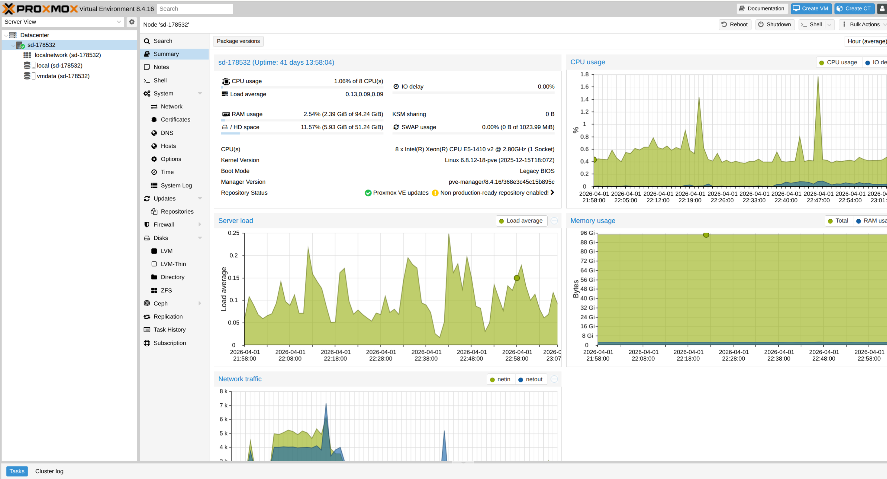
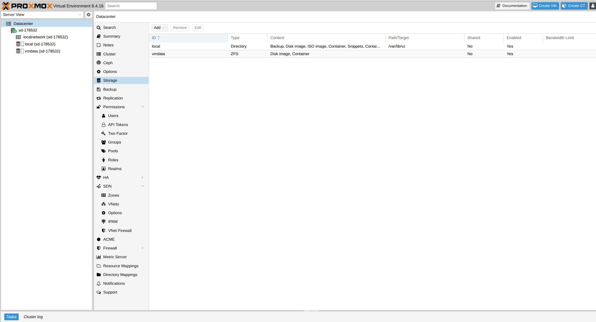
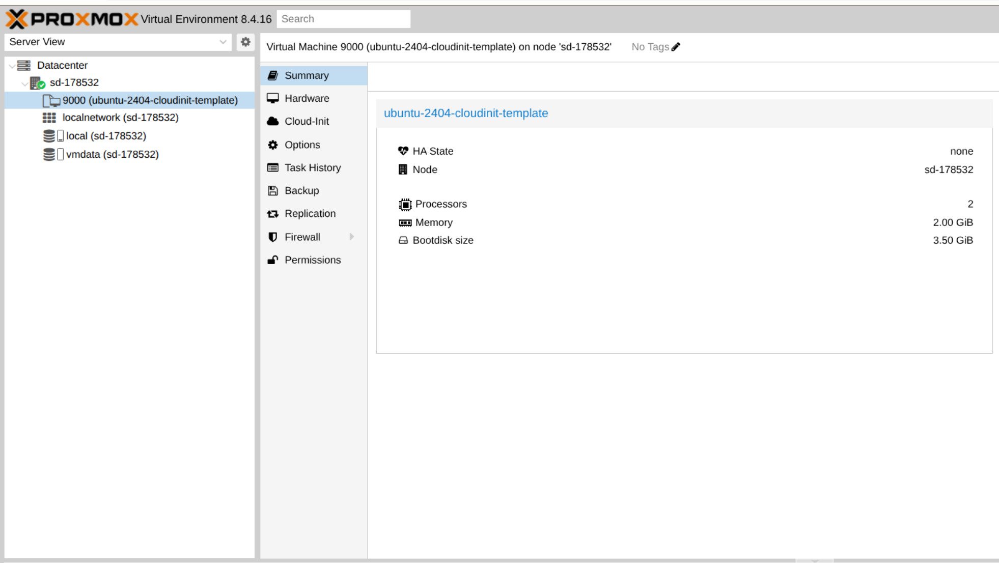
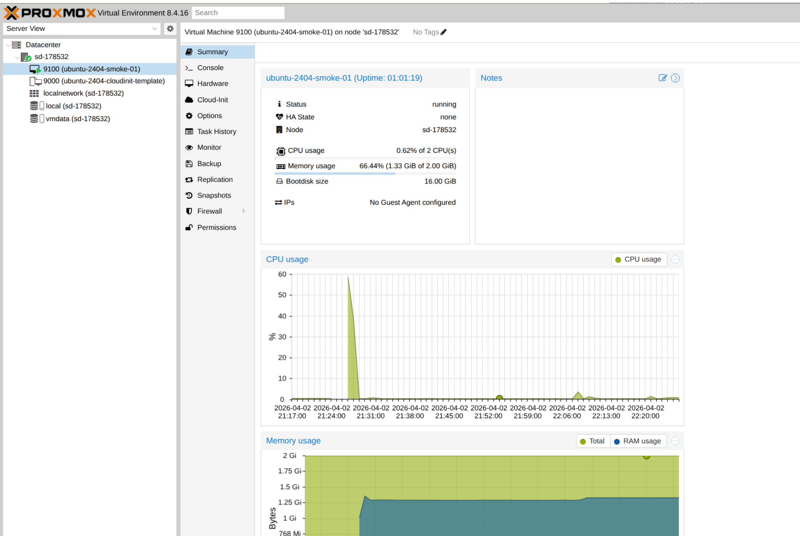
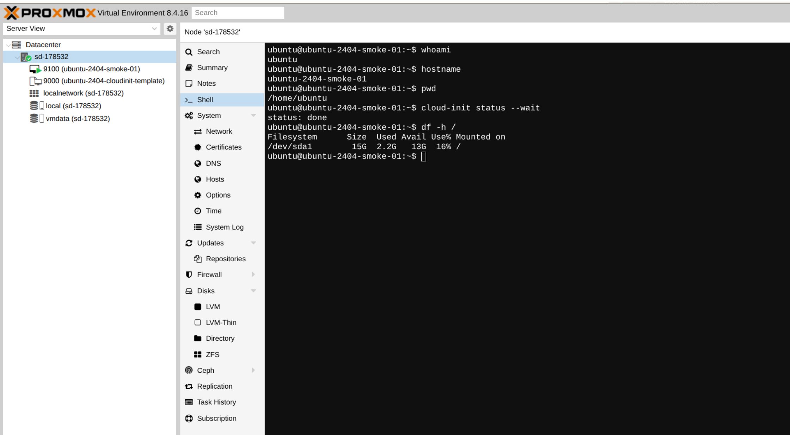

# 🧱 Implementation Log — Phase 04 (Proxmox IaC Baseline): Proxmox template + canonical NAT smoke VM baseline

> ## 👤 About
> This document is the implementation log and detailed project build diary for **Phase 04 (Proxmox IaC Baseline)**.  
> It records the **validated implementation path** that produced the first stable Proxmox-backed target baseline for this capstone phase.  
> For environment preparation and prerequisite setup, see: **[SETUP.md](SETUP.md)**.  
> For the shorter, reproducible **TL;DR rerun path**, see: **[RUNBOOK.md](RUNBOOK.md)**.  
> For phase-scoped decisions and rationale snapshots, see: **[DECISIONS.md](DECISIONS.md)**.  
> For top-level project navigation, see: **[../INDEX.md](../INDEX.md)**.

---

## 📌 Index (top-level)

- [**Purpose / Goal**](#purpose--goal)
- [**Definition of done (Phase 04)**](#definition-of-done-phase-04)
- [**Preconditions**](#preconditions)
- [**Step 0 — Confirm the Proxmox target host and storage layout**](#step-0--confirm-the-proxmox-target-host-and-storage-layout)
- [**Step 1 — Stage the Ubuntu 24.04 cloud image on the Proxmox host**](#step-1--stage-the-ubuntu-2404-cloud-image-on-the-proxmox-host)
- [**Step 2 — Create the reusable base VM template (`9000`)**](#step-2--create-the-reusable-base-vm-template-9000)
- [**Step 3 — Create the canonical smoke VM (`9100`) from the template**](#step-3--create-the-canonical-smoke-vm-9100-from-the-template)
- [**Step 4 — Verify the canonical smoke VM from inside the guest**](#step-4--verify-the-canonical-smoke-vm-from-inside-the-guest)
- [**Baseline observations and evidence (Phase 04)**](#baseline-observations-and-evidence-phase-04)
- [**Sources**](#sources)

---

## Purpose / Goal

### Establish the first stable Proxmox-backed target baseline
- The purpose of this phase is to prove the first **real target-environment baseline** on the provided Proxmox host rather than relying only on local or temporary smoke targets.
- The concrete deliverable is a **reusable Ubuntu 24.04 Cloud-Init VM template** plus a **canonical smoke VM** cloned from that template.

### Validate a reproducible VM bootstrap path
- This phase is designed to prove a baseline that can later be **codified and automated**.
- The immediate goal is not full Terraform/IaC yet, but rather to establish the **stable bootstrap layer** that Terraform or other automation can later target.

### Prove the guest end-to-end, not just the hypervisor object
- Success in this phase is defined by more than a Proxmox inventory entry.
- The guest must boot, accept the configured login, finish Cloud-Init initialization, expose a usable root filesystem, and provide outbound connectivity.

---

> **🧩 Info box — Cloud image**
> A cloud image is not the same thing as a desktop installer ISO.  
> It is a prebuilt operating-system image designed for automated first boot, typically with **Cloud-Init** support already present.  
> That makes it a strong fit for a Proxmox **template -> clone -> configure** workflow.

---

## Definition of done (Phase 04)

- The provided Proxmox host is confirmed as a usable VM target.
- A reusable **Ubuntu 24.04 Cloud-Init VM template** exists as VM/template `9000`.
- A canonical smoke VM `9100` can be cloned from that template.
- The smoke VM boots successfully.
- Guest login works.
- `cloud-init status --wait` returns `status: done`.
- The guest root filesystem is confirmed at a usable size after hypervisor-side disk enlargement.
- Outbound connectivity works from inside the guest.

---

## Preconditions

- Valid access to the provided Proxmox web UI and host shell
- The Proxmox node is online
- The target storage for active VM disks is available
- The Ubuntu 24.04 released cloud image is reachable from the Proxmox host

---

## Step 0 — Confirm the Proxmox target host and storage layout

**Rationale:** Before creating any VM artifacts, the first step is to verify that the Proxmox host is online and that the expected storage targets are available for the template and clone workflow.

**Proxmox node overview**

***Figure 1.*** *Node summary view showing the target Proxmox host online and ready for VM work. This establishes the real execution target for the phase and confirms that the baseline starts from an available host.*

**Proxmox storage overview**

***Figure 2.*** *Datacenter storage view showing the available Proxmox storage targets. This confirms the host-side storage layout used for the template disk and the canonical smoke clone.*

On the Proxmox host, the storage inventory was verified with:

~~~bash
# Show Proxmox storage status and confirm that active VM disk storage is available
pvesm status
~~~

> **🧩 Info box — `local` vs `vmdata`**
> In this phase, `local` is the host-side file storage typically used for helper assets such as templates, ISOs, snippets, and backups.  
> `vmdata` is the active VM disk storage used for the imported root disk, the template base disk, and the canonical smoke clone disk.  
> Keeping those roles separate is important for later verification and automation.

---

## Step 1 — Stage the Ubuntu 24.04 cloud image on the Proxmox host

**Rationale:** The reusable base template depends on a real, non-empty Ubuntu cloud image staged on the Proxmox host. A temporary `.part` file is used first so the download can be validated before it is promoted into place as the actual import source.

~~~bash
# Create a dedicated working directory for image staging
mkdir -p /root/pve-images
cd /root/pve-images

# Download the Ubuntu 24.04 released cloud image into a temporary file first
wget -c \
  -O ubuntu-24.04-server-cloudimg-amd64.img.part \
  https://cloud-images.ubuntu.com/releases/noble/release/ubuntu-24.04-server-cloudimg-amd64.img

# Verify that the downloaded file is non-empty before using it
test -s ubuntu-24.04-server-cloudimg-amd64.img.part

# Human-readable size check
ls -lh ubuntu-24.04-server-cloudimg-amd64.img.part

# Promote the validated download into place as the real import source
mv ubuntu-24.04-server-cloudimg-amd64.img.part \
   ubuntu-24.04-server-cloudimg-amd64.img
~~~

This step matters because the later Proxmox disk import only makes sense if the image file is real and non-empty.

---

## Step 2 — Create the reusable base VM template (`9000`)

**Rationale:** The first reusable artifact in this phase is a Proxmox VM template built from the Ubuntu 24.04 cloud image. This establishes the stable base that later clones can reuse quickly and consistently.

The template uses:

- VM ID `9000`
- `virtio-scsi-pci` as the SCSI controller
- `l26` as the guest operating-system type for a modern Linux guest
- a serial-console-based interaction model for straightforward guest verification

~~~bash
# Create the base VM shell that will become the reusable template
qm create 9000 \
  --name ubuntu-2404-cloudinit-template \
  --memory 2048 \
  --cores 2 \
  --ostype l26 \
  --scsihw virtio-scsi-pci

# Import the Ubuntu cloud image as the real root disk on vmdata
qm set 9000 \
  --scsi0 vmdata:0,import-from=/root/pve-images/ubuntu-24.04-server-cloudimg-amd64.img

# Attach the Cloud-Init drive
qm set 9000 --ide2 vmdata:cloudinit

# Restrict boot to the imported root disk
qm set 9000 --boot order=scsi0

# Use a serial-console-first guest interaction model
qm set 9000 --serial0 socket --vga serial0

# Verify the VM object before converting it into a template
qm config 9000
qm list --full
pvesm list vmdata

# Convert the VM into a reusable Proxmox template
qm template 9000

# Verify the template result
qm config 9000
qm list --full
pvesm list vmdata
~~~

The verification gates here were explicit:

- `qm config 9000` had to show a real `scsi0` root disk, a Cloud-Init drive on `ide2`, and `boot: order=scsi0`
- `qm list --full` had to show a non-zero boot disk
- `pvesm list vmdata` had to show both the disk objects and the template-backed storage result

A Proxmox inventory entry alone was **not** treated as sufficient proof.

**Base VM template created**

***Figure 3.*** *Proxmox inventory view showing the reusable Ubuntu 24.04 base template after successful creation. This proves that the imported cloud image and attached Cloud-Init drive were turned into a reusable template artifact.*

> **🧩 Info box — template vs clone**
> The template is the reusable read-only base artifact.  
> Real guest VMs are created as **clones** from that base.  
> This matches the standard Proxmox **Cloud-Init template -> clone** workflow and keeps the phase aligned with later automation goals.

---

## Step 3 — Create the canonical smoke VM (`9100`) from the template

**Rationale:** Once the template exists, the next step is to create a canonical smoke VM from it and apply the proven baseline guest settings.

The canonical smoke VM uses:

- VM ID `9100`
- the reusable template `9000` as its source
- a Cloud-Init user and password
- a no-bridge `net0: virtio` guest NIC
- a larger root disk before first boot

The guest NIC intentionally omits the bridge parameter. This produces a **QEMU user-mode NAT** path, which is the validated guest networking baseline for this phase on the provided host.

~~~bash
# Clone the canonical smoke VM from the reusable base template
qm clone 9000 9100 --name ubuntu-2404-smoke-01

# Use a no-bridge guest NIC to get the proven user-mode NAT path
qm set 9100 --net0 virtio

# Configure Cloud-Init guest login values
qm set 9100 --ciuser ubuntu
qm set 9100 --cipassword 'CHANGE_TO_A_FRESH_TEMP_PASSWORD'
qm set 9100 --ipconfig0 ip=dhcp

# Enlarge the guest root disk before first boot
qm resize 9100 scsi0 16G

# Verify the canonical smoke VM before boot
qm config 9100
qm cloudinit pending 9100
qm list --full

# Start the canonical smoke VM
qm start 9100
qm list --full
~~~

The key verification points on the Proxmox side were:

- `qm config 9100` showed:
  - `net0: virtio=...` with **no** bridge parameter
  - `ipconfig0: ip=dhcp`
  - `ide2: ...cloudinit...`
  - `scsi0: ... size=16G`
- `qm list --full` showed the VM running with a non-zero `BOOTDISK(GB)`

**Canonical smoke VM created**

***Figure 4.*** *Proxmox inventory view showing the canonical smoke VM cloned from the base template. This proves that the template is reusable and that the canonical guest path was established from the verified template artifact.*

> **🧩 Info box — user-mode NAT**
> In this phase, the canonical smoke VM uses a no-bridge guest NIC.  
> That means the guest is not attached directly to a Proxmox Linux bridge like `vmbr0`, but instead uses QEMU’s built-in **user-mode NAT** path.  
> For this provided host, that was the stable baseline for guest DHCP, DNS, and outbound connectivity.

---

## Step 4 — Verify the canonical smoke VM from inside the guest

**Rationale:** A running Proxmox VM is not enough. The guest itself must prove that it booted correctly, accepted the Cloud-Init-created login, finished initialization, exposed the enlarged root filesystem, and has working outbound connectivity.

The guest was accessed through the configured serial console:

~~~bash
# Open the guest serial console from the Proxmox host
qm terminal 9100
~~~

Inside the guest, the following checks were used:

~~~bash
# Confirm the guest login identity and Cloud-Init completion
whoami
hostname
cloud-init status --wait

# Confirm the guest addressing and routing
ip -brief address
ip route

# Confirm that the enlarged root filesystem is visible inside the guest
df -h /

# Confirm outbound connectivity
ping -c 2 1.1.1.1
ping -c 2 example.com || true
curl -I --max-time 10 https://example.com || true
~~~

The final successful results were:

- `whoami` -> `ubuntu`
- `hostname` -> `ubuntu-2404-smoke-01`
- `cloud-init status --wait` -> `status: done`
- `ip -brief address` -> `eth0` with `10.0.2.15/24`
- `ip route` -> default route via `10.0.2.2`
- `df -h /` -> `/dev/sda1` visible at roughly `15G`
- `ping -c 2 1.1.1.1` -> success
- `curl -I --max-time 10 https://example.com` -> success

**Guest login, Cloud-Init, and filesystem verification success**

***Figure 5.*** *Guest-side verification inside the canonical smoke VM. This proves successful login, successful Cloud-Init completion, and a healthy enlarged root filesystem inside the guest.*

---

## Baseline observations and evidence (Phase 04)

### What was established
- A reusable Ubuntu 24.04 Proxmox template exists as `9000`
- A canonical smoke VM exists as `9100`
- The canonical smoke VM uses the validated no-bridge user-mode NAT path
- The canonical smoke VM boots successfully
- Guest login works
- Cloud-Init finishes successfully
- The guest root filesystem reflects the enlarged hypervisor-side disk
- Outbound connectivity works from inside the guest

### Evidence index
- `evidence/px/03-PX-Node_Summary-dash.png`
- `evidence/px/06-PX-Datacenter_Storage.png`
- `evidence/px/09-PX-Base-VM-Template-Image-9000-created.png`
- `evidence/px/10-PX-Smoke-Test-VM-Clone-9100-created.png`
- `evidence/px/11-PX-Smoke-VM-9100_guest-login-and-cloud-init-success.png`

### What this phase does and does not prove
This phase proves the first stable **Proxmox-backed guest baseline** for the target environment.

It does **not yet** prove:
- Terraform-managed Proxmox provisioning
- application deployment to this guest
- external public service exposure through the final long-lived delivery path

Those remain later follow-up layers.

---

## Sources

- Proxmox Cloud-Init support:
  - https://pve.proxmox.com/wiki/Cloud-Init_Support

- Proxmox QEMU/KVM configuration reference:
  - https://pve.proxmox.com/pve-docs/qm.conf.5.html

- Proxmox QEMU/KVM virtual machine documentation:
  - https://pve.proxmox.com/pve-docs/chapter-qm.html

- Proxmox disk resize reference:
  - https://pve.proxmox.com/wiki/Resize_disks

- Ubuntu 24.04 released cloud image index:
  - https://cloud-images.ubuntu.com/releases/noble/release/