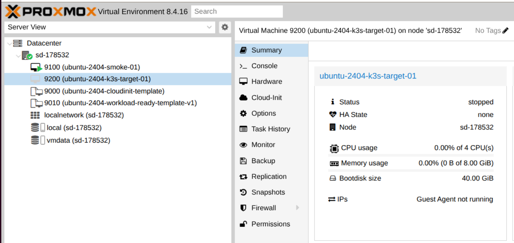
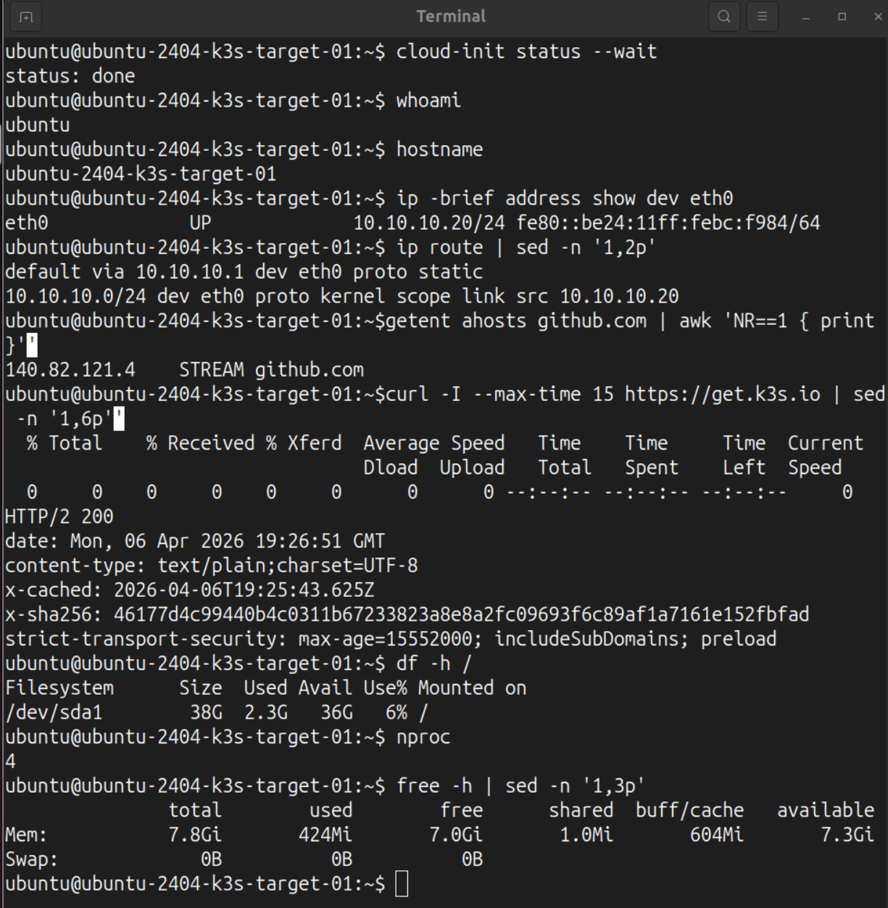
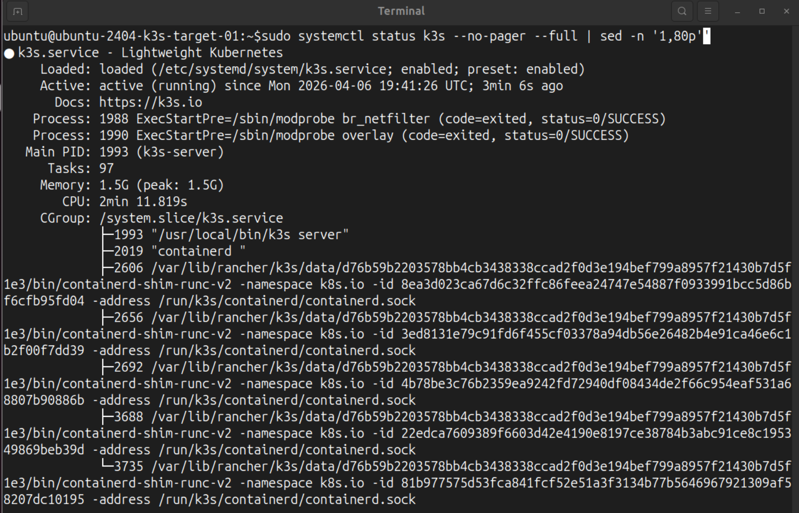

# 📑 Subphase 05-A — Target VM Bootstrap & First Cluster Setup

---
> [!TIP] **Navigation**  
> **[⬅️ 🏠 Phase 05 Home](../IMPLEMENTATION.md)** | **[Next: Phase 05-B ➡️](./PHASE-05-B.md)**
---

## 🎯 Subphase goal

Create the real Proxmox-backed target VM, validate the guest baseline, install K3s, and bring the target to its first usable cluster state.

## 📌 Index

- [Step 1 — Create the real target VM `9200` from the workload-ready template `9010`](#step-1--create-the-real-target-vm-9200-from-the-workload-ready-template-9010)
- [Step 2 — Boot VM `9200` and prove the cloned target inherited the expected baseline](#step-2--boot-vm-9200-and-prove-the-cloned-target-inherited-the-expected-baseline)
- [Step 3 — Install a helper package baseline on the target VM](#step-3--install-a-helper-package-baseline-on-the-target-vm)
- [Step 4 — Install K3s on VM `9200` as a single-node server and prove the node came up correctly](#step-4--install-k3s-on-vm-9200-as-a-single-node-server-and-prove-the-node-came-up-correctly)
- [Step 5 — Clone the project repository onto the target VM](#step-5--clone-the-project-repository-onto-the-target-vm)
- [Sources](#sources)

---
 

# Step 1 — Create the real target VM `9200` from the workload-ready template `9010`

## Rationale

Phase 04 concluded with the **workload-ready Proxmox VM template `9010`**. The next logical move is to **create the real delivery target cloned from this template**.

This step **creates VM `9200` as the first real K3s target instance**, while **changing only the instance-specific values** that should differ from the reusable template baseline:

- VM identity
- runtime resources
- Cloud-Init access values
- static guest IP configuration
- DNS resolver

> [!NOTE] **🧩 Template values vs instance values**
>
> The template `9010` provides the reusable baseline.
> The clone `9200` keeps that baseline, but receives its own runtime identity and network settings.
>
> That separation keeps the template reusable while allowing the real target VM to behave as an independent deployment node.

## Action

### Proxmox host

~~~bash
# Clone a real target VM from the finalized workload-ready template.
$ qm clone 9010 9200 --name ubuntu-2404-k3s-target-01 --full 1
create full clone of drive ide2 (vmdata:vm-9010-cloudinit)
create full clone of drive scsi0 (vmdata:base-9010-disk-0)
transferred 40.0 GiB of 40.0 GiB (100.00%)

# Give the target VM more runtime headroom than the template baseline.
$ qm set 9200 --memory 8192 --cores 4
update VM 9200: -cores 4 -memory 8192

# Set explicit Cloud-Init access values for the real target VM.
$ qm set 9200 --ciuser ubuntu
update VM 9200: -ciuser ubuntu

$ qm set 9200 --cipassword '********'
update VM 9200: -cipassword <hidden>

# Assign a distinct stable private IPv4 address and gateway for this clone.
$ qm set 9200 --ipconfig0 ip=<redacted-vm-ip>/24,gw=<redacted-gateway-ip>
update VM 9200: -ipconfig0 ip=<redacted-vm-ip>/24,gw=<redacted-gateway-ip>

# Keep explicit DNS for deterministic name resolution.
$ qm set 9200 --nameserver 1.1.1.1
update VM 9200: -nameserver 1.1.1.1

# Inspect the final target VM config before first boot.
$ qm config 9200
agent: enabled=1
boot: order=scsi0
ciuser: ubuntu
cores: 4
ide2: vmdata:vm-9200-cloudinit,media=cdrom,size=4M
ipconfig0: ip=<redacted-vm-ip>/24,gw=<redacted-gateway-ip>
memory: 8192
name: ubuntu-2404-k3s-target-01
nameserver: 1.1.1.1
net0: virtio=<redacted>,bridge=vmbr1
scsi0: vmdata:vm-9200-disk-0,size=40G
serial0: socket
vga: serial0

# Inspect the Cloud-Init values that will be applied at first boot.
$ qm cloudinit pending 9200
cur cipassword: **********
cur ciuser: ubuntu
cur nameserver: 1.1.1.1

# Show the VM inventory after target creation.
$ qm list --full
VMID  NAME                                      STATUS   MEM(MB)  BOOTDISK(GB)
9000  ubuntu-2404-cloudinit-template            stopped    2048          3.50
9010  ubuntu-2404-workload-ready-template-v1    stopped    4096         40.00
9100  ubuntu-2404-smoke-01                      stopped    2048         16.00
9200  ubuntu-2404-k3s-target-01                 stopped    8192         40.00
~~~

## Result

The first real **Proxmox-backed K3s target VM `9200` (`ubuntu-2404-k3s-target-01`) was created successfully** from the workload-ready VM template `9010`.

The successful end state is shown by these signals / verification points:

- `qm clone 9010 9200 ...` completed successfully as a full clone
- `qm config 9200` showed:
  - `memory: 8192`
  - `cores: 4`
  - `net0: ... bridge=vmbr1`
  - `ipconfig0: ip=<redacted-vm-ip>/24,gw=<redacted-gateway-ip>`
  - `nameserver: 1.1.1.1`
  - `agent: enabled=1`
- `qm cloudinit pending 9200` showed the expected pending Cloud-Init values
- `qm list --full` showed `9200` as a stopped VM with an attached 40 GB boot disk

**Target VM created from workload-ready template**

***Figure 1*** *Proxmox inventory view showing the newly cloned VM `9200` (`ubuntu-2404-k3s-target-01`) as the K3s deployment target created from the workload-ready Phase 04 template.*

---
 

# Step 2 — Boot VM `9200` and prove the cloned target inherited the expected baseline

## Rationale

Before K3s is installed, the cloned VM should first prove that it inherited the expected baseline correctly.

This is the **first guest-side validation of the new target VM** and should confirm that the **clone already provides the core runtime prerequisites** needed **for later cluster bootstrap**, namely:

- working guest login
- stable private IP addressing
- default routing
- DNS resolution
- outbound HTTPS reachability
- expected CPU / memory / disk sizing

## Action

### Proxmox host

~~~bash
# Start the real target VM.
$ qm start 9200
generating cloud-init ISO
...

# Open the serial console of the target VM.
$ qm terminal 9200
starting serial terminal on interface serial0 (press Ctrl+O to exit)
...
~~~

### Target VM `9200`

~~~bash
# Wait until Cloud-Init has finished on the target VM.
$ cloud-init status --wait
status: done

# Confirm the expected guest user.
$ whoami
ubuntu

# Confirm the target VM hostname.
$ hostname
ubuntu-2404-k3s-target-01

# Show the main guest interface.
$ ip -brief address show dev eth0
eth0   UP   <redacted-vm-ip>/24 fe80::<redacted>/64

# Show the relevant IPv4 routes.
$ ip route | sed -n '1,2p'
default via <redacted-gateway-ip> dev eth0 proto static
10.10.10.0/24 dev eth0 proto kernel scope link src <redacted-vm-ip>

# Prove DNS resolution works on the cloned target VM.
$ getent ahosts github.com | awk 'NR==1 { print }'
140.82.121.4    STREAM github.com

# Prove HTTPS reachability to the K3s bootstrap endpoint.
$ curl -I --max-time 15 https://get.k3s.io | head -n 6
HTTP/2 200
...

# Confirm the root filesystem size.
$ df -h /
Filesystem   Size  Used  Avail  Use%
/dev/sda1     38G  2.3G    36G    6%

# Confirm the CPU count seen by the guest.
$ nproc
4

# Confirm memory seen by the guest.
$ free -h | head -n 3
               total        used        free      shared  buff/cache   available
Mem:           7.8Gi       424Mi       7.0Gi       1.0Mi       604Mi       7.3Gi
Swap:             0B          0B          0B
~~~

## Result

The cloned target VM inherited the expected workload-ready baseline successfully.

The successful end state is shown by these signals / verification points:

- `cloud-init status --wait` returned:
  - `status: done`
- `whoami` returned:
  - `ubuntu`
- `hostname` returned:
  - `ubuntu-2404-k3s-target-01`
- `ip -brief address show dev eth0` showed:
  - `<redacted-vm-ip>/24`
- `ip route` showed:
  - `default via <redacted-gateway-ip>`
- `getent ahosts github.com` returned a valid IP line
- `curl -I https://get.k3s.io` returned an HTTP response
- `df -h /` showed a usable root filesystem of about 38 GB
- `nproc` returned:
  - `4`
- `free -h` showed about:
  - `7.8 GiB` RAM

**Cloned target baseline verified inside the guest**

***Figure 2*** *Guest-side verification of the cloned target VM, confirming stable networking, routing, outbound bootstrap reachability, and the expected runtime resources.*

---

# Step 3 — Install a helper package baseline on the target VM 

## Rationale

With the guest baseline confirmed, the target VM can now receive a small **helper package set** needed for the next stages.

The purpose here is not to turn the VM into a large custom image, but only to ensure the few tools needed for K3s bootstrap, repository work, and host/guest observability are present:

- `curl` + `ca-certificates` (needed for secure HTTPS bootstrap)
- `git` (needed to clone the project repo)
- `qemu-guest-agent` (ensures the target VM is fully manageable and the Proxmox host can communicate with the running guest through the QEMU Guest Agent)

## Action

### Target VM `9200`

~~~bash
# Refresh package metadata on the target VM.
sudo apt-get update

# Install the small helper set needed for K3s bootstrap and repo work.
sudo apt-get install -y qemu-guest-agent curl ca-certificates git

# Start the guest-agent service inside the target VM.
sudo systemctl start qemu-guest-agent

# Confirm the guest-agent service is active.
sudo systemctl status qemu-guest-agent --no-pager
● qemu-guest-agent.service - QEMU Guest Agent
     Loaded: loaded (/usr/lib/systemd/system/qemu-guest-agent.service; static)
     Active: active (running) since Mon 2026-04-06 19:23:09 UTC; ...
   Main PID: 785 (qemu-ga)
~~~

### Proxmox host

~~~bash
# Confirm the host can communicate with the guest agent on the target VM.
qm guest cmd 9200 network-get-interfaces
[
  {
    "name": "lo",
    "ip-addresses": [
      { "ip-address": "127.0.0.1", "ip-address-type": "ipv4", "prefix": 8 },
      { "ip-address": "::1", "ip-address-type": "ipv6", "prefix": 128 }
    ]
  },
  {
    "name": "eth0",
    "hardware-address": "<redacted>",
    "ip-addresses": [
      { "ip-address": "<redacted-vm-ip>", "ip-address-type": "ipv4", "prefix": 24 },
      { "ip-address": "<redacted>", "ip-address-type": "ipv6", "prefix": 64 }
    ]
  }
]
~~~

## Result

The helper package baseline was confirmed successfully on the target VM.

The successful end state is shown by these signals / verification points:

- `apt-get update` completed without error
- `apt-get install -y ...` completed without error
- the key helper packages were present on the VM
- `systemctl status qemu-guest-agent --no-pager` showed the service as active/running
- `qm guest cmd 9200 network-get-interfaces` returned guest interface data including:
  - `eth0`
  - `<redacted-vm-ip>/24`

This also confirms that the Proxmox host could communicate with the running guest through the QEMU Guest Agent path.

---

# Step 4 — Install and verify K3s on VM `9200` as a single-node server  

## Rationale

Once the target VM has proven its runtime baseline and helper tooling, the next milestone is to **turn the VM into a real Kubernetes node**.

This step **installs and verifies K3s as a single-node server** and keeps the initial configuration explicit and minimal. The goal is not cluster complexity yet, but a **clean first cluster baseline on the real Proxmox VM target**.

The step validates also the cluster-side health signals:

- active K3s service
- registered node
- working core system pods
- working built-in Traefik installation

## Action

### Target VM `9200`

> [!NOTE] **🧩 `write-kubeconfig-mode: "0644"`**
>
> K3s writes its kubeconfig to `/etc/rancher/k3s/k3s.yaml`.
> Setting `write-kubeconfig-mode: "0644"`makes the file readable outside the root-only default path.
>
> This is useful later when the cluster access is prepared for external verification and CI/CD integration.

~~~bash
# Create the K3s config directory.
sudo mkdir -p /etc/rancher/k3s

# Write a minimal K3s config file 
# write-kubeconfig-mode: "0644" makes that config file readable 
# outside the root-only default path (relevant fdor CI/CD integration)
sudo tee /etc/rancher/k3s/config.yaml >/dev/null <<'EOF'
write-kubeconfig-mode: "0644"  
EOF

# Install K3s as a single-node server.
curl -sfL https://get.k3s.io | sudo sh -
[INFO]  Finding release for channel stable
[INFO]  Using v1.34.6+k3s1 as release
[INFO]  Downloading hash https://github.com/k3s-io/k3s/releases/download/v1.34.6%2Bk3s1/sha256sum-amd64.txt
[INFO]  Downloading binary https://github.com/k3s-io/k3s/releases/download/v1.34.6%2Bk3s1/k3s
[INFO]  Verifying binary download
[INFO]  Installing k3s to /usr/local/bin/k3s
[INFO]  Creating /usr/local/bin/kubectl symlink to k3s
[INFO]  systemd: Creating service file /etc/systemd/system/k3s.service
[INFO]  systemd: Enabling k3s unit
[INFO]  systemd: Starting k3s

# Show the K3s service state.
$ sudo systemctl status k3s --no-pager --full | sed -n '1,20p'
● k3s.service - Lightweight Kubernetes
     Loaded: loaded (/etc/systemd/system/k3s.service; enabled; preset: enabled)
     Active: active (running) since Mon 2026-04-06 19:41:26 UTC; ...
       Docs: https://k3s.io
   Main PID: 1993 (k3s-server)

# Confirm that the node registered successfully.
$ sudo kubectl get nodes -o wide
NAME                        STATUS   ROLES           AGE     VERSION        INTERNAL-IP   EXTERNAL-IP   OS-IMAGE             KERNEL-VERSION      CONTAINER-RUNTIME
ubuntu-2404-k3s-target-01   Ready    control-plane   7m11s   v1.34.6+k3s1   <redacted-vm-ip>   <none>        Ubuntu 24.04.4 LTS   6.8.0-107-generic   containerd://2.2.2-bd1.34

# Confirm that the core K3s system pods are healthy.
# Long-running components should be Running; one-shot install jobs may show Completed.
$ sudo kubectl get pods -A
NAMESPACE     NAME                                      READY   STATUS      RESTARTS   AGE
kube-system   coredns-76c974cb66-72tfw                  1/1     Running     0          8m4s
kube-system   local-path-provisioner-8686667995-bvnmj   1/1     Running     0          8m4s
kube-system   metrics-server-c8774f4f4-9dhf6            1/1     Running     0          8m4s
kube-system   traefik-c5c8bf4ff-pvlz9                   1/1     Running     0          7m36s
kube-system   svclb-traefik-4f73496a-bd5wp              2/2     Running     0          7m36s
kube-system   helm-install-traefik-crd-mczsm            0/1     Completed   0          8m3s
kube-system   helm-install-traefik-jmxfd                0/1     Completed   1          8m3s

# Confirm the built-in Traefik service exposure.
$ sudo kubectl get svc traefik -n kube-system -o wide
NAME      TYPE           CLUSTER-IP    EXTERNAL-IP   PORT(S)                      
traefik   LoadBalancer   10.43.9.204   <redacted-vm-ip>   80:30890/TCP,443:30286/TCP    
~~~

## Result

**K3s was installed successfully on the target VM, and the single-node control plane came up correctly.**

The successful end state is shown by these signals / verification points:

- the install script completed without download or bootstrap failure
- a `k3s` systemd service was created
- the K3s server was enabled and started automatically
- `systemctl status k3s` showed the service as:
  - `active (running)`
- `sudo kubectl get nodes -o wide` showed one registered node:
  - `ubuntu-2404-k3s-target-01`
  - `STATUS: Ready`
  - `ROLES: control-plane`
  - `INTERNAL-IP: <redacted-vm-ip>`
- `sudo kubectl get pods -A` showed the expected core K3s system pods in a healthy state, including:
  - `coredns`
  - `local-path-provisioner`
  - `metrics-server`
  - `traefik`
  - `svclb-traefik`
- the built-in Traefik path was already active and assigned the target VM address:
  - `<redacted-vm-ip>`

At this point, the target VM had moved from a prepared Ubuntu baseline to a **real single-node Kubernetes control-plane host**.

**K3s node ready on the real Proxmox-backed target**

***Figure 3*** *K3s node verification on VM `9200`, confirming that the target registered successfully as a Ready control-plane node and that the core system pods, including Traefik, were running.*

---

# Step 5 — Clone the project repository onto the target VM

## Rationale

With the target cluster running, the **application source now needs to be cloned from the remote repository onto the target VM** so the deployment path can continue from the repository state.

This keeps the later deployment work grounded in source control rather than in ad-hoc copied files.

## Action

### Target VM `9200`

~~~bash
# Move to the home directory first.
cd ~

# Clone the public project fork onto the target VM.
git clone https://github.com/mayinx/k8s-ecommerce-microservices-app.git

# Enter the project directory.
cd ~/k8s-ecommerce-microservices-app

# Show the repository status.
git status

# Show local and remote branches.
git branch -a
~~~

## Result

The project repository was cloned successfully onto the real target VM.

The successful end state is shown by these signals / verification points:

- `git clone ...` completed without error
- the repository directory exists under:
  - `~/k8s-ecommerce-microservices-app`
- `git status` showed a clean checkout on:
  - `master`
- `git branch -a` showed the expected remote branch references

This establishes the target-side repository checkout that later deployment and reconciliation steps could now use directly.

---

## Sources

- [Proxmox VE `qm` manual](https://pve.proxmox.com/pve-docs/qm.1.html)  
  `qm clone`, `qm config`, `qm cloudinit pending`, and other VM lifecycle commands used in the target-VM provisioning flow.

- [Proxmox VE Administration Guide](https://pve.proxmox.com/pve-docs/pve-admin-guide.html)  
  Proxmox VM administration concepts, including VM configuration and guest integration.

- [K3s Quick-Start Guide](https://docs.k3s.io/quick-start)  
  Basic K3s installation path, generated kubeconfig location, installed utilities, and single-node bootstrap expectations.

- [K3s Configuration Options](https://docs.k3s.io/installation/configuration)  
  Configuration-file driven K3s setup and early cluster configuration patterns.

- [K3s Server CLI Reference](https://docs.k3s.io/cli/server)  
  `write-kubeconfig-mode` and server-side configuration options (relevant to the initial K3s setup).

- [K3s Cluster Access](https://docs.k3s.io/cluster-access)  
  Default admin kubeconfig path + cluster-access behavior.

- [Kubernetes Service](https://kubernetes.io/docs/concepts/services-networking/service/)  
  Cluster networking concepts that appear once K3s and system components are up.

---

> [!TIP] **Navigation**  
> **[⬅️ 🏠 Previous: Phase 05 Home](../IMPLEMENTATION.md)** | **[⬆️ Top (Index)](#index)** | **[Next: Phase 05-B ➡️](./PHASE-05-B.md)**

---