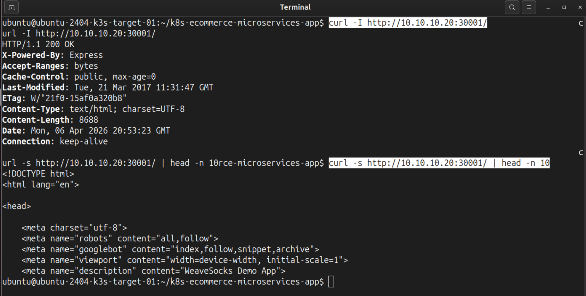

# 📑 Subphase 05-B — First Application Deployment, Runtime Compatibility Fix, and Initial Target-Side Proof

---
> [!TIP] **Navigation**  
> **[⬅️ Phase 05-A](./PHASE-05-A.md)** | **[🏠 Phase 05 Home](../IMPLEMENTATION.md)** | **[Next: Phase 05-C ➡️](./PHASE-05-C.md)**
---

## 🎯 Subphase goal

Deploy the application for the first time on the real target cluster, isolate and fix the MongoDB compatibility blocker, and prove the storefront on the real Proxmox-backed node.

## 📌 Index

- [Step 6 — Deploy the Sock Shop raw manifest baseline to the real target cluster and verify the initial application state](#step-6--deploy-the-sock-shop-raw-manifest-baseline-to-the-real-target-cluster-and-verify-the-initial-application-state)
- [Step 7 — Triage the two crashing MongoDB-backed pods](#step-7--triage-the-two-crashing-mongodb-backed-pods)
- [Step 8 — VM Hotfix: Confirm the MongoDB image mismatch and cause, patch both MongoDB-backed deployments to `mongo:3.4`, and verify full application convergence](#step-8--vm-hotfix-confirm-the-mongodb-image-mismatch-and-cause-patch-both-mongodb-backed-deployments-to-mongo34-and-verify-full-application-convergence)
- [Step 9 — Persist the MongoDB image pin in source control and realign the target checkout](#step-9--persist-the-mongodb-image-pin-in-source-control-and-realign-the-target-checkout)
- [Step 10 — Prove that the storefront responds on the real target via NodePort](#step-10--prove-that-the-storefront-responds-on-the-real-target-via-nodeport)
- [Step 11 — Render the storefront in the local browser through an SSH tunnel](#step-11--render-the-storefront-in-the-local-browser-through-an-ssh-tunnel)
- [Sources](#sources)

---

 

# Step 6 — Deploy the Sock Shop raw manifest baseline to the real target cluster and verify the initial application state

## Rationale

With the **Proxmox VM provisioned, K3s running, and the repository successfully cloned**, the infrastructure is fully prepared. The next milestone is to actually **deploy the Sock Shop microservices to this new target cluster**.

The goals of this step are to:
- Create the required **application namespace `sock-shop`**.
- **Deploy the core application baseline** directly from the cloned repository files **onto the Proxmox VM `9200`**.
- Verify the **first real application state** immediately after deployment, so any remaining blockers are isolated early

Because we already restructured our manifests to use Kustomize back in Phase 03 (CI/CD Baseline), we won't apply individual raw YAML files here. Instead, the **correct deployment entrypoint is the Kustomize base directory**.

## Action

### Target VM `9200`

~~~bash
# Create the application namespace first.
$ sudo kubectl create namespace sock-shop
namespace/sock-shop created

# Apply the Sock Shop raw manifest baseline through the Kustomize base entrypoint.
$ sudo kubectl apply -k deploy/kubernetes/manifests

# Show the application pods in the Sock Shop namespace.
$ sudo kubectl get pods -n sock-shop
NAME                            READY   STATUS             RESTARTS       AGE
carts-5f5859c84b-xlkgb          1/1     Running            0              28m
carts-db-544c5bc9c8-2jtgs       0/1     CrashLoopBackOff   10 (57s ago)   28m
catalogue-cd4ff8c9f-g2ngc       1/1     Running            0              28m
catalogue-db-74885c6d4c-5849q   1/1     Running            0              28m
front-end-7467866c7b-rxjh5      1/1     Running            0              28m
orders-6b8dd47986-6nlsh         1/1     Running            0              28m
orders-db-5d7db99c6-7bmtb       0/1     CrashLoopBackOff   10 (70s ago)   28m
payment-c5fbdbc6-pqrqm          1/1     Running            0              28m
queue-master-7f965677fb-frlkc   1/1     Running            0              28m
rabbitmq-59955f8bff-8nlbz       2/2     Running            0              28m
session-db-5d89f4b5bb-wxflc     1/1     Running            0              28m
shipping-868cd6587d-5gvp8       1/1     Running            0              28m
user-67488ff854-gncsg           1/1     Running            0              28m
user-db-7bd86cdcd-p4pjt         1/1     Running            0              28m

# Show the services in the namespace, including the storefront NodePort.
$ sudo kubectl get svc -n sock-shop -o wide
NAME           TYPE        CLUSTER-IP      EXTERNAL-IP   PORT(S)             AGE   SELECTOR
carts          ClusterIP   10.43.125.139   <none>        80/TCP              29m   name=carts
carts-db       ClusterIP   10.43.60.105    <none>        27017/TCP           29m   name=carts-db
catalogue      ClusterIP   10.43.4.118     <none>        80/TCP              29m   name=catalogue
catalogue-db   ClusterIP   10.43.33.139    <none>        3306/TCP            29m   name=catalogue-db
front-end      NodePort    10.43.47.143    <none>        80:30001/TCP        29m   name=front-end
orders         ClusterIP   10.43.168.25    <none>        80/TCP              29m   name=orders
orders-db      ClusterIP   10.43.79.68     <none>        27017/TCP           28m   name=orders-db
payment        ClusterIP   10.43.45.230    <none>        80/TCP              28m   name=payment
queue-master   ClusterIP   10.43.192.121   <none>        80/TCP              28m   name=queue-master
rabbitmq       ClusterIP   10.43.248.63    <none>        5672/TCP,9090/TCP   28m   name=rabbitmq
session-db     ClusterIP   10.43.40.173    <none>        6379/TCP            28m   name=session-db
shipping       ClusterIP   10.43.79.80     <none>        80/TCP              28m   name=shipping
user           ClusterIP   10.43.37.168    <none>        80/TCP              28m   name=user
user-db        ClusterIP   10.43.192.108   <none>        27017/TCP           28m   name=user-db

# Confirm that the storefront deployment itself rolled out successfully.
$ sudo kubectl rollout status deployment/front-end -n sock-shop
deployment "front-end" successfully rolled out
~~~

## Result

The **core application baseline was successfully applied to the persistent target cluster,** though it **revealed a specific issue** requiring immediate attention.

**1. Verified Successes** The majority of the application stack converged successfully on the first target-side deployment. This is confirmed by the following signals:
- The `sock-shop` namespace was created without issues.
- `sudo kubectl apply -k` completed without any fatal Kustomize errors.
- The expected application resources (Deployments and Services) were successfully provisioned in the namespace.
- `sudo kubectl get svc` confirmed the `front-end` storefront was correctly mapped as a `NodePort` on `80:30001/TCP`.
- `sudo kubectl rollout status` confirmed the storefront deployment itself successfully rolled out.
- The vast majority of the microservice pods successfully entered the `Running` state.

**2. Isolated Issues (MongoDB Blocker)** At the same time, this initial verification successfully **isolated the only remaining blocker in the deployment**:
- Both **`carts-db` and `orders-db` pods failed to start**, entering a **`CrashLoopBackOff`** state:
~~~bash
NAME                            READY   STATUS             RESTARTS       AGE
...
carts-db-544c5bc9c8-2jtgs       0/1     CrashLoopBackOff   10 (57s ago)   28m
...
orders-db-5d7db99c6-7bmtb       0/1     CrashLoopBackOff   10 (70s ago)   28m
...
~~~

Because the rest of the application stack is running perfectly, this **narrows the remaining issue down to the two MongoDB-backed services**, ruling out a cluster-wide failure or a general manifest syntax error. 

---

# Step 7 — Triage the two crashing MongoDB-backed pods

## Rationale

With the overall application stack mostly healthy, it is time to investigate the remaining blockers. The goal now is to determine if the **CrashLoopBackOff** was caused by:

- **Node Memory Pressure:** Lack of sufficient RAM on the underlying Proxmox VM, which could cause a K8s OOM (Out of Memory) which can terminate pods 
- **Configuration Errors:** Misaligned environment variables or connection strings within the pod spec of the Deployment manifest.
- **Image/Runtime Compatibility:** A mismatch between the containerized binary and the host CPU architecture (e.g., missing instruction sets).

> [!IMPORTANT] **🔍 What is a CrashLoopBackOff and how to debug it?**
>
> **CrashLoopBackOff** is not a specific error itself, but a state. It means the container is successfully starting, but then immediately crashing. 
>
> 1. **The Crash:** The application inside the container exits with an error code.
> 2. **The Loop:** Kubernetes sees the failure and tries to restart the pod automatically.
> 3. **The BackOff:** Because the pod keeps failing, Kubernetes starts waiting longer and longer between restart attempts (e.g., 10s, 20s, 40s...) to avoid hammering the node's CPU.
>
> To find the *actual* cause, it is necessary to look "inside" the loop using:
> - `kubectl logs --previous`: To see why the last attempt failed.
> - `kubectl describe pod`: To see if the system (Kubelet) killed it due to memory or setup issues.

## Action

### Target VM `9200`

~~~bash
# (1) Capture the crashing pod names into environment vars for cleaner access.
# -o name: Returns only the 'pod/name-string' without the header or status columns.
export CARTS_DB_POD=$(sudo kubectl get pods -n sock-shop -o name | grep carts-db)     # => pod/carts-db-<pod-id>
export ORDERS_DB_POD=$(sudo kubectl get pods -n sock-shop -o name | grep orders-db)   # => pod/orders-db-<pod-id>

# (2) Inspect the current + previous pod logs from carts-db + orders-db.
# --previous: Retrieves logs from the container that just crashed / the last failed instance; 
#   essential for debugging crashes that happen immediately on startup (like 'CrashLoopBackOff').
$ sudo kubectl logs -n sock-shop $CARTS_DB_POD
WARNING: MongoDB 5.0+ requires a CPU with AVX support, and your current system does not appear to have that!
  see https://jira.mongodb.org/browse/SERVER-54407

$ sudo kubectl logs -n sock-shop $CARTS_DB_POD --previous
WARNING: MongoDB 5.0+ requires a CPU with AVX support, and your current system does not appear to have that!
  see https://jira.mongodb.org/browse/SERVER-54407

$ sudo kubectl logs -n sock-shop $ORDERS_DB_POD
WARNING: MongoDB 5.0+ requires a CPU with AVX support, and your current system does not appear to have that!
  see https://jira.mongodb.org/browse/SERVER-54407

$ sudo kubectl logs -n sock-shop $ORDERS_DB_POD --previous
WARNING: MongoDB 5.0+ requires a CPU with AVX support, and your current system does not appear to have that!
  see https://jira.mongodb.org/browse/SERVER-54407

# (3) Check for Node-level resource issues.
# -`describe node`: Provides a detailed report of the host's health.
# - sed: Strips the output to show only the 'Conditions' section (Memory, Disk, and PID pressure).
sudo kubectl describe node ubuntu-2404-k3s-target-01 | sed -n '/Conditions:/,/Addresses:/p'
  Type             Status  Reason                       Message
  ----             ------  ------                       -------
  MemoryPressure   False   KubeletHasSufficientMemory   kubelet has sufficient memory available
  DiskPressure     False   KubeletHasNoDiskPressure     kubelet has no disk pressure
  PIDPressure      False   KubeletHasSufficientPID      kubelet has sufficient PID available
  Ready            True    KubeletReady                 kubelet is posting ready status
~~~

## Result

The triage successfully isolated the cause: this was **not** a resource exhaustion problem (RAM/Disk), but a **hardware-level compatibility conflict**.

**Verification points:**

- both failing pods were clearly identified as `carts-db` + `orders-db`
- both log returned the same MongoDB warning:
  - `MongoDB 5.0+ requires a CPU with AVX support`
  - The error confirmed that the "latest" MongoDB image was attempting to use CPU instructions (AVX - Advanced Vector Extensions) not supported or exposed by the virtualized CPU host type.
- the node condition block showed:
  - `MemoryPressure=False`
  - `DiskPressure=False`
  - `PIDPressure=False`
  - `Ready=True`

These signals showed that:

- the cluster itself is healthy
- the node had sufficient resources
- the blocker is specific to the MongoDB runtime path on the current VM CPU feature set

**Conclusion:** The problem is a specific **CPU instruction set mismatch**. We need to downgrade the MongoDB version to a release that does not require AVX.

---

# Step 8 — VM Hotfix: Confirm the MongoDB image mismatch and cause, patch both MongoDB-backed deployments to `mongo:3.4`, and verify full application convergence

## Rationale

The triage in Step 7 identified the root cause of the failure: a fatal error stating `MongoDB 5.0+ requires a CPU with AVX support`. While the Proxmox VM CPU model either does not support or expose these instructions (so that a presumed **pull of MongoDB 5.0+ caused the crash of the two services**), the **application worked during local verification**.  

To **resolve this mismatch**, an audit of the repository must be performed to **identify discrepancies between the local and remote deployment specifications and behaviors**:

**1. The "Original Blueprint" (Docker Baseline):**

Both MongoDB-based database services are pinned to v3.4 in the Docker-specifications, which predates the AVX requirement and worked perfectly in Phase 01 (Local Baseline):

**Evidence from the Local Baseline (Phase 01):**
~~~yaml
# deploy/docker-compose/docker-compose.yml
services:
  carts-db:
    image: mongo:3.4
  orders-db:
    image: mongo:3.4    
~~~

**2. The Kubernetes Manifests**

An audit of the Kubernetes manifests reveals both a Configuration Drift between the different deployment specifications (Docker Compose vs K8s Deployment Manifests) - and the source of the failure. Both `carts-db` + `orders-db` services are left with a **generic, unpinned reference**:

**Intended Kubernetes Baseline:**
~~~yaml
# deploy/kubernetes/manifests/03-carts-db-dep.yaml
containers:
  - name: carts-db
    image: mongo # unpinned - causes "latest" pull (MongoDB 5.x) -> AVX Crash on the VM

# deploy/kubernetes/manifests/13-orders-db-dep.yaml
containers:
  - name: orders-db
    image: mongo # ditto
~~~

Due to this configuration, the cluster pulled the latest MongoDB image (7.0+), which caused the AVX crash on the VM. 

Locally, this was not an issue as modern workstations typically fulfill the AVX requirement:

~~~bash
# local verification of AVX support 
$ grep -E 'avx|avx2' /proc/cpuinfo
flags           : fpu vme de pse ... xsave avx f16c ... bmil avx2 smep... 
...
~~~

**3. Conclusion** 

To resolve this, we align the deployment with the project's Docker specifications, which used **v3.4**. This version predates the AVX requirement and is known to be stable for this application, since it already worked locally in Phase 01 (Local Baseline). By pinning both Mongo DB backed services to `3.4`, we lower the "Hardware Floor" of the application, ensuring it runs on virtualized hardware without needing advanced CPU instructions.

This keeps the remediation path compact and traceable:

- confirm the current image state on the VM  
- patch both deployments on the VM as quick Hotfix 
- verify that the application now converges fully on the real target cluster

## Action

> [!NOTE] 🧩 Source-controlled fix vs live-cluster patch
> 
> A `kubectl set image ..`. change applied directly to a running cluster like done below only changes the live workload. It does not update the manifests in the repository. 
> Once this live cluster patch is proven as success path, a source-controlled update is still mandatory to update the manifest files themselves, so every later deploy uses the corrected image version automatically.

### Target VM `9200`

~~~bash
# 1. Confirm the current image mismatch.

# Show the current container image used by the carts-db + orders-db deployments
# This confirms the cluster is running 'mongo' (latest) instead of the intended 'mongo:3.4'.
$ sudo kubectl get deployment carts-db -n sock-shop -o jsonpath='{.spec.template.spec.containers[0].image}{"\n"}'
mongo

$ sudo kubectl get deployment orders-db -n sock-shop -o jsonpath='{.spec.template.spec.containers[0].image}{"\n"}'
mongo

# 2. Apply the VM Hotfix.

# Patch the live deployments of carts-db+ orders-db to the known compatible version.
$ sudo kubectl set image deployment/carts-db -n sock-shop carts-db=mongo:3.4
deployment.apps/carts-db image updated

$ sudo kubectl set image deployment/orders-db -n sock-shop orders-db=mongo:3.4
deployment.apps/orders-db image updated

# 3. Verify the rollout.

# Wait for both patched deployments to roll out successfully.
$ sudo kubectl rollout status deployment/carts-db -n sock-shop
deployment "carts-db" successfully rolled out

$ sudo kubectl rollout status deployment/orders-db -n sock-shop
deployment "orders-db" successfully rolled out

# Show the final application pod state in the Sock Shop namespace.
$ sudo kubectl get pods -n sock-shop
NAME                            READY   STATUS    RESTARTS   AGE
carts-5f5859c84b-xlkgb          1/1     Running   0          51m
carts-db-568c6d98bc-m7sj6       1/1     Running   0          96s
catalogue-cd4ff8c9f-g2ngc       1/1     Running   0          51m
catalogue-db-74885c6d4c-5849q   1/1     Running   0          51m
front-end-7467866c7b-rxjh5      1/1     Running   0          51m
orders-6b8dd47986-6nlsh         1/1     Running   0          51m
orders-db-54745d69b9-lpw76      1/1     Running   0          85s
payment-c5fbdbc6-pqrqm          1/1     Running   0          51m
queue-master-7f965677fb-frlkc   1/1     Running   0          51m
rabbitmq-59955f8bff-8nlbz       2/2     Running   0          51m
session-db-5d89f4b5bb-wxflc     1/1     Running   0          51m
shipping-868cd6587d-5gvp8       1/1     Running   0          51m
user-67488ff854-gncsg           1/1     Running   0          51m
user-db-7bd86cdcd-p4pjt         1/1     Running   0          51m

# 4. Verify successful startup in the logs.

# 4.1 Capture pod names into variables for clean verification.
export CARTS_DB_POD=$(sudo kubectl get pods -n sock-shop -o name | grep carts-db)
export ORDERS_DB_POD=$(sudo kubectl get pods -n sock-shop -o name | grep orders-db)

# 4.2 Check the current carts-db- + orders-db pod-logs for this success signals: 
# - "db version v3.4.24" 
# - "waiting for connections on port..." 
$ sudo kubectl logs -n sock-shop $CARTS_DB_POD | grep -E "version|waiting"
2026-04-06T20:46:27.098+0000 I CONTROL  [initandlisten] MongoDB starting : pid=1 port=27017 dbpath=/data/db 64-bit host=carts-db-568c6d98bc-m7sj6
2026-04-06T20:46:27.099+0000 I CONTROL  [initandlisten] db version v3.4.24
2026-04-06T20:46:27.484+0000 I NETWORK  [thread1] waiting for connections on port 27017

$ sudo kubectl logs -n sock-shop $ORDERS_DB_POD | grep -E "version|waiting"
2026-04-06T20:46:27.128+0000 I CONTROL  [initandlisten] MongoDB starting : pid=1 port=27017 dbpath=/data/db 64-bit host=orders-db-54745d69b9-lpw76
2026-04-06T20:46:27.128+0000 I CONTROL  [initandlisten] db version v3.4.24
2026-04-06T20:46:27.494+0000 I NETWORK  [thread1] waiting for connections on port 27017
~~~

## Result

The **MongoDB image mismatch was confirmed, the deployments were patched on the VM to the compatible `3.4` baseline** (without requiring any infrastructure-level change to the VM or to the Proxmox CPU model), and the **full Sock Shop stack converged successfully**.

**Verification Highlights:**
- **Image Confirmation:** Triage confirmed the deployments were using the unpinned `mongo` tag, which defaulted to an AVX-dependent version (7.0+).
- **Successful Convergence:** `kubectl get pods` now shows a 100% `Running` state across all 14 microservices.
- **Log Proof:** Internal logs confirm `MongoDB starting... db version v3.4.24`, proving the hardware compatibility issue is resolved.

**Note on permanence:** 
- While the `kubectl set image` commands resolved the issue on the live VM as a **runtime hotfix**, the **deployment path is still not yet reproducible from source control**. 
- The next step therefore **persists the same MongoDB image pin in the repository manifests** to prevent "Configuration Drift" during future CI/CD pipeline runs and realigns the target checkout with that updated branch state.

---

# Step 9 — Persist the MongoDB image pin in source control and realign the target checkout

## Rationale

At this point, the MongoDB issue has already been solved once on the live target by patching the running deployments. That proves the operational fix, but it does not yet make the deployment path reproducible.

Before moving on to Tailscale, Cloudflare Tunnel, or workflow retargeting, it is therefore necessary to **persist that image pin in source control and align the target VM checkout with the Phase-05 branch**. 

Otherwise, the Configuration Drift remains and the next redeploy risks reintroducing the same MongoDB/AVX failure and the target VM would continue to drift away from the repository state.

## Action

**The goal now is**  
- to **persist the MongoDB image pin locally in Git**, commit it on the new Phase-05 feature branch, and push that branch to GitHub. 
- to **update the target VM checkout to the same branch** so the **next deployment comes from source** rather than from a one-off live patch

### Local Workstation

Checking the relevant k8s deployment manifest files for the `carts-db` + `orders-db` services reveals the unpinned Mongo image entries:  

~~~yaml
# `deploy/kubernetes/manifests/03-carts-db-dep.yaml`
containers:
  - name: carts-db
    image: mongo
~~~

~~~yaml
# `deploy/kubernetes/manifests/13-orders-db-dep.yaml`
containers:
  - name: orders-db
    image: mongo
~~~

To pin those two MongoDB services to the required version the relevant k8s manifest files must be changed accordingly:

~~~yaml
# `deploy/kubernetes/manifests/03-carts-db-dep.yaml`
containers:
  - name: carts-db
    image: mongo:3.4
~~~

to:

~~~yaml
# `deploy/kubernetes/manifests/13-orders-db-dep.yaml`
containers:
  - name: orders-db
    image: mongo:3.4
~~~
 
Then we stage, commit + push thosee changes:

~~~bash
# Stage only the two MongoDB manifest changes.
git add deploy/kubernetes/manifests/03-carts-db-dep.yaml deploy/kubernetes/manifests/13-orders-db-dep.yaml

# Commit the source-controlled MongoDB image pin.
git commit -m "fix(k8s): pin sock-shop MongoDB deployments to mongo:3.4"

# Push the new Phase-05 branch so the target VM can sync to it.
git push -u origin feat/proxmox-target-delivery
~~~

### Target-VM `9200` checkout alignment

After the branch is pushed, the repository checkout on the K3s target VM needs to be updated so it matches the new Phase-05 branch exactly.

From the repository checkout on the target VM `9200`:

~~~bash
# cd into the project folder

# Fetch the newest branch state from GitHub.
git fetch origin

# Switch the target checkout to the new Phase-05 branch.
git checkout feat/proxmox-target-delivery

# Align the target checkout exactly to the remote branch state.
# --hard is intentional here because this VM checkout is deployment-only.
git reset --hard origin/feat/proxmox-target-delivery
~~~

## Expected result / success criteria

This step is successful if:

- both manifest files now contain `image: mongo:3.4`, teh changes are successfully committed and pushed from the local workstation to the remote
- the target VM checkout aligns with the remote branch 

---

# Step 10 — Prove that the storefront responds on the real target via NodePort

## Rationale

With the full application stack now converged, the next useful proof is the **first successful storefront response from the real target VM itself**.

This confirms that the front-end is not only deployed, but **also actually reachable through its exposed NodePort path on the Proxmox VM K3s node**.

## Action

### Target VM `9200`

~~~bash
# Check the storefront via the target VM's NodePort.
$ curl -I http://<redacted-vm-ip>:30001/
HTTP/1.1 200 OK
X-Powered-By: Express
Content-Type: text/html; charset=UTF-8
Content-Length: 8688
...

# Fetch the first lines of the storefront HTML.
$ curl -s http://<redacted-vm-ip>:30001/ | head -n 10
<!DOCTYPE html>
<html lang="en">

<head>

    <meta charset="utf-8">
    <meta name="robots" content="all,follow">
    <meta name="googlebot" content="index,follow,snippet,archive">
    <meta name="viewport" content="width=device-width, initial-scale=1">
    <meta name="description" content="WeaveSocks Demo App">
~~~

## Result

The storefront responded successfully on the real Proxmox-backed K3s target via NodePort.

The successful end state is shown by these signals / verification points:

- `curl -I http://<redacted-vm-ip>:30001/` returned:
  - `HTTP/1.1 200 OK`
- the response headers showed the expected Express-powered front-end response
- `curl -s http://<redacted-vm-ip>:30001/ | head -n 10` returned real Sock Shop HTML starting with:
  - `<!DOCTYPE html>`

**Storefront reachable on the real target via NodePort**

***Figure 4*** *Terminal-side proof that the Sock Shop storefront responded successfully on the real target node through `http://<redacted-vm-ip>:30001/`, confirming that the application was reachable after the MongoDB image fix.*

---

# Step 11 — Render the storefront in the local browser through an SSH tunnel

## Rationale

The NodePort proof already showed that the application responds successfully on the real target VM. The final proof for this first delivery segment is a browser rendering from the laptop.

Because the target VM sits behind the Proxmox host on the private bridge, the clean local access path is an SSH tunnel from the laptop to the NodePort exposed on the target VM.

> [!NOTE] **🧩 Why the SSH tunnel uses an explicit IPv4 bind**
>
> An initial local tunnel attempt worked but triggered an IPv6 bind issue on `::1`.
> Binding the forward explicitly to `127.0.0.1` avoids that ambiguity and creates a stable local browser path for the verification screenshot. 
> This is necessary because many modern operating systems resolve localhost to the IPv6 address `::1` by default, whereas the K3s NodePort on the target VM is listening exclusively on the IPv4 stack.

## Action

### Local workstation

~~~bash
# Open a local-only SSH tunnel from the laptop to the target VM NodePort through the Proxmox host.
# -4: Forces IPv4 to match the K3s listener.
# -N: Opens the tunnel without starting a remote shell session.
# -L: Maps the local laptop address to the private bridge IP of the target VM 9200.
ssh -4 -N -o ExitOnForwardFailure=yes \
  -L 127.0.0.1:30001:<redacted-vm-ip>:30001 \
  <SSH alias>
~~~

Then open the following URL in the local browser:

~~~text
http://127.0.0.1:30001
~~~

**Storefront rendered in the local browser via SSH tunnel**

***Figure 5*** *Browser-side proof of the Sock Shop storefront rendered locally through an SSH tunnel to the real Proxmox-backed K3s target VM, completing the first end-to-end target rendering validation.*

## Result

The storefront rendered successfully in the local laptop browser through the SSH tunnel.

The successful end state is shown by these signals / verification points:

- the SSH tunnel stayed open successfully
- the local browser path:
  - `http://127.0.0.1:30001`
  rendered the Sock Shop storefront
- the first full browser-rendered proof of the real Proxmox-backed target was captured successfully

---

## Sources

- [Declarative Management of Kubernetes Objects Using Kustomize](https://kubernetes.io/docs/tasks/manage-kubernetes-objects/kustomization/)  
  `kustomization.yaml`-based deployment + use of `kubectl kustomize` / `kubectl apply -k`.

- [kubectl kustomize](https://kubernetes.io/docs/reference/kubectl/generated/kubectl_kustomize/)  
  Rendering a kustomization target from a directory.

- [Kubernetes Service](https://kubernetes.io/docs/concepts/services-networking/service/)  
  Service behavior, including the Service model used by the Sock Shop deployment.

- [Using a Service to Expose Your App](https://kubernetes.io/docs/tutorials/kubernetes-basics/expose/expose-intro/)  
  Service exposure types (`ClusterIP` + `NodePort`).

- [kubectl rollout status](https://kubernetes.io/docs/reference/kubectl/generated/kubectl_rollout/kubectl_rollout_status/)  
  Rollout verification of Kubernetes Deployments.

- [MongoDB Production Notes for Self-Managed Deployments](https://www.mongodb.com/docs/manual/administration/production-notes/)  
  Official MongoDB reference for platform/runtime requirements, including the AVX requirement introduced for MongoDB 5.0+ on x86_64.

- [Kubernetes Deployments](https://kubernetes.io/docs/concepts/workloads/controllers/deployment/)  
  Deployment behavior and rollout semantics.

---  

> [!TIP] **Navigation**  
> **[⬅️ Previous: Phase 05-A](./PHASE-05-A.md)** | **[⬆️ Top (Index)](#index)** | **[Next: Phase 05-C ➡️](./PHASE-05-C.md)**

---