# 📑 Subphase 05-D — Public Edge Exposure via Cloudflare and CI/CD Workflow Retargeting to the Real Target Cluste

---
> [!TIP] **Navigation**  
> **[⬅️ Phase 05-C](./PHASE-05-C.md)** | **[🏠 Phase 05 Home](../IMPLEMENTATION.md)**
---

## 🎯 Subphase goal

Complete the real target-delivery path by exposing both environments through Cloudflare Tunnel and retargeting GitHub Actions to the private Proxmox-backed cluster.

## 📌 Index

- [Step 21 — Cloudfare: Publish the public `dev` and `prod` hostnames through a Cloudflare Tunnel and point them at the existing Traefik entrypoint](#step-21--cloudfare-publish-the-public-dev-and-prod-hostnames-through-a-cloudflare-tunnel-and-point-them-at-the-existing-traefik-entrypoint)
- [Step 22 — Prepare the GitHub-side Deployment Access Path (Tailscale OAuth, K8s Config & Secrets)](#step-22--prepare-the-github-side-deployment-access-path-tailscale-oauth-k8s-config--secrets)
- [Step 23 — Create a dedicated Phase-05 workflow and prove the real target delivery path: automated `dev` deployment plus approval-gated `prod` deployment on the Proxmox-backed cluster](#step-23--create-a-dedicated-phase-05-workflow-and-prove-the-real-target-delivery-path-automated-dev-deployment-plus-approval-gated-prod-deployment-on-the-proxmox-backed-cluster)

---

# Step 21 — Cloudfare: Publish the public `dev` and `prod` hostnames through a Cloudflare Tunnel and point them at the existing Traefik entrypoint

## Rationale

Both application environments now have a **working ingress path through Traefik on the target VM**. What is still missing is the **public edge** that makes those two **environments reachable from the Internet without opening inbound ports** directly to the VM.

A **Cloudflare Tunnel** fits this ingress requirement well because its `cloudflared` daemon (installed on the VM) creates **outbound-only connections from the VM to Cloudflare**. Incde transformed into a an **"outbound-only device"**, the **VM won't accept any inbound traffic** and **doesn't expose a public IP** to the internet. With Cloudflare, all traffic is routet through the Cloudfare Tunnel, which exposes only a Cloudflare edge IP, keeping the VM's origin IP completely hidden.      

> [!NOTE] **🧩 Cloudflare**
>
> **Cloudflare** is a **global edge network** that acts as a **secure "front door" for web traffic**. 
> Instead of exposing a home network or server directly to the public internet, **Cloudflare sits in the middle** to 
> - proxy requests, 
> - provide DNS routing, 
> - and enforce security. 
>
> The implementation of a **Cloudflare Tunnel** transforms the ingress architecture from a traditional 'open-door' policy to a **Zero-Trust** model:
> - **Outbound-Only Connectivity:** Traditional **Inbound Port Forwarding** requires "opening a window" (Port 80/443) and waiting for requests to hit the VM's firewall. By contrast, the `cloudflared` daemon (which is installed on the VM/Server) initiates an **outbound-only connection** — effectively "calling out" to Cloudflare from the inside; the firewall remains entirely closed to external requests.
> - **IP Cloaking:** Because the VM initiates the connection, the **private IP remains hidden**. The public internet only sees Cloudflare’s IP address, making the Proxmox host a "ghost" on the wire that cannot be targeted directly.
> - **Threat Neutralization:** This architecture effectively **neutralizes DDoS attacks** and **unauthorized port scanning** (automated attempts to find open doors). Since there are no open inbound ports, scanners see only an unresponsive void, and malicious traffic is filtered by Cloudflare's global infrastructure before it ever reaches your local network.
>
> By using a Cloudflare tunnel, we achieve **"Security by Obscurity"** (the VM cannot be found) and **"Security by Design"** (no inbound entry points exist).

In this step, 

- the **public hostnames are first aligned with the Kubernetes Ingress rules**, 
- and those **hostnames will be published** through a remotely managed Cloudflare Tunnel. **dashboard-managed Cloudflare Tunnel**.

> [!NOTE] **🧩 Remotely Managed Architecture**
>
> This step uses Cloudflare's remotely managed flow:
>
> - **the tunnel** and **public hostname routes** are configured centrally in the web UI (the **Cloudflare Zero Trust dashboard**) 
> - only a **single connector daemon** is run on the target VM. 
> - no local `cloudflared` config file is needed.

## Action

The goal now is:

- to **replace the temporary local ingress hostnames** with the **real public hostnames**  
- to **apply those updated ingress rules** on the target cluster on the VM `9200`
- to **create one Cloudflare Tunnel** in the dashboard
- to **publish public hostnames** for **`dev`** and one for **`prod`**
- to **point both public hostnames** at the already working **Traefik entrypoint on `10.10.10.20:80`**

### Local Workstation

The current ingress manifests still use the temporary local verification hostnames:

- `dev.sockshop.local`
- `prod.sockshop.local`

Those host values now need to be **replaced with the real hostnames**, that shall later be **managed by Cloudflare as public hostnames** - here using a existingh domain `cdco.dev` with two env-specific subdomains):

- `dev-sockshop.cdco.dev`
- `prod-sockshop.cdco.dev`

> [!IMPORTANT] **Subdomain Naming Convention: `dev-sockshop` instead of `dev.sockshop`"**
> We are using **hyphenated names** (`dev-sockshop.cdco.dev`) instead of nested subdomains (`dev-sockshop.cdco.dev`). This ensures **compatibility with Cloudflare's free-tier Universal SSL certificates**, which do **not support multi-level wildcards**. Such support would requrie a paid subscription.  

~~~yaml
# `deploy/kubernetes/kustomize/overlays/dev/front-end-ingress.yaml`
apiVersion: networking.k8s.io/v1
kind: Ingress
metadata:
  name: front-end
  namespace: sock-shop-dev
spec:
  ingressClassName: traefik   
  rules:
    - host: dev-sockshop.cdco.dev
# ...
~~~          

~~~yaml
# `deploy/kubernetes/kustomize/overlays/prod/front-end-ingress.yaml`
apiVersion: networking.k8s.io/v1
kind: Ingress
metadata:
  name: front-end
  namespace: sock-shop-dev
spec:
  ingressClassName: traefik   
  rules:
    - host: prod-sockshop.cdco.dev
# ...
~~~
             
After the hostnames are updated lcoally, we continue with the normal Git flow:

~~~bash
# Stage only the two ingress manifest updates.
git add deploy/kubernetes/kustomize/overlays/dev/front-end-ingress.yaml deploy/kubernetes/kustomize/overlays/prod/front-end-ingress.yaml

# Commit the public-hostname switch for both ingress rules.
git commit -m "feat(target-delivery): switch ingress hosts to public Cloudflare names"

# Push the updated Phase-05 branch.
git push
~~~

### Target VM `9200`

Once the branch is pushed, the target VM checkout need to be updated accordingly and both overlays must be re-applied so the new hostnames are active in the cluster:

~~~bash
# Fetch the newest branch state from GitHub.
$ git fetch origin

# Align the target checkout to the latest remote Phase-05 branch state.
$ git reset --hard origin/feat/proxmox-target-delivery

# Apply the updated dev overlay.
$ sudo kubectl apply -k deploy/kubernetes/kustomize/overlays/dev
namespace/sock-shop-dev unchanged
service/carts unchanged
...
deployment.apps/carts unchanged
...
ingress.networking.k8s.io/front-end configured

# Apply the updated prod overlay.
$ sudo kubectl apply -k deploy/kubernetes/kustomize/overlays/prod
namespace/sock-shop-prod unchanged
service/carts unchanged
...
deployment.apps/carts unchanged
...
ingress.networking.k8s.io/front-end configured

# Show the dev ingress after the hostname update.
$ sudo kubectl get ingress -n sock-shop-dev
NAME        CLASS     HOSTS                   ADDRESS       PORTS   
front-end   traefik   dev-sockshop.cdco.dev   10.10.10.20   80      

# Show the prod ingress after the hostname update.
$ sudo kubectl get ingress -n sock-shop-prod
NAME        CLASS     HOSTS                    ADDRESS       PORTS  
front-end   traefik   prod-sockshop.cdco.dev   10.10.10.20   80     

~~~

Before Cloudflare is introduced, a local verification is used to ensure that Traefik already accepts the new public hostnames.

~~~bash
# Check the updated dev hostname against the local Traefik entrypoint.
# Schema: curl -I -H 'Host: <DEV_PUBLIC_HOSTNAME>' http://10.10.10.20/
$ curl -I -H 'Host: dev-sockshop.cdco.dev' http://10.10.10.20/
HTTP/1.1 200 OK

# Check the updated prod hostname against the local Traefik entrypoint.
# Schema: curl -I -H 'Host: <PROD_PUBLIC_HOSTNAME>' http://10.10.10.20/
$ curl -I -H 'Host: prod-sockshop.cdco.dev' http://10.10.10.20/
HTTP/1.1 200 OK

~~~

### Cloudflare dashboard

To proceed, it is necessary to have both a Target Domain with the necessary DNS-Setup ready as well as a Cloudfare account, to **enable an Tunnel via Cloudflare's Zero Trust Dashboard**:  

> [!INFO] **🌍 Cloudflare Zero Trust: Secure Edge Orchestration**
> 
> Cloudflare's Zero Trust Dashboard is a Cloudflare feature that serves as the **centralized control plane for enterprise-grade secure networking**. It facilitates the creation of **encrypted, outbound-only tunnels** that **bridge private infrastructure** with **Cloudflare’s global edge network**.
> 
> ⚠️ Mandatory Prerequisite:
> Before proceeding with the application-level ingress verification below, the underlying Cloudflare infrastructure must be fully operational. This includes:
> 
> Domain Delegation: Transitioning cdco.dev to Cloudflare authoritative nameservers.
> 
> Tunnel Connectivity: Establishing the cloudflared connector service on the Target VM.
> 
> Failure to complete these infrastructure-level tasks will result in failed handshakes and routing errors during verification.
> 
> 📘 For a detailed walkthrough of the domain onboarding process and installation of the `cloudflared` connector service on the VM, see the [Cloudflare Infrastructure Setup Guide](./SETUP.md). 

A **successful installtion of the `cloudflared` connector on the target VM** can be verified in the GUI and via the VM's Terminal:  

~~~bash
# Show the Cloudflare connector service state on the VM.
$ sudo systemctl status cloudflared --no-pager
● cloudflared.service - cloudflared
     Loaded: loaded (/etc/systemd/system/cloudflared.service; enabled; preset: enabled)
     Active: active (running) ...
   Main PID: ... (cloudflared)
      Tasks: ...
     Memory: 14.9M (peak: 18.8M)
        CPU: 1.955s
     CGroup: /system.slice/cloudflared.service

# Show the installed cloudflared version.
$ cloudflared --version
cloudflared version 2026.3.0 (built 2026-03-09-14:08 UTC)
~~~

Once the tunnel is healthy, the following **Public Hostname** routes must be added to the tunnel configuration (which is also adderssed in the [Cloudflare Infrastructure Setup Guide](./SETUP.md)):

| Subdomain | Domain | Service Type | Internal URL |
| :--- | :--- | :--- | :--- |
| `dev-sockshop` | `cdco.dev` | HTTP | `10.10.10.20:80` |
| `prod-sockshop` | `cdco.dev` | HTTP | `10.10.10.20:80` |

**Cloudflare Tunnel Connector Handshake**

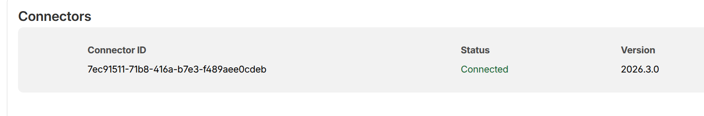

***Figure 7*** *Verification of the active cloudflared handshake within the setup wizard, confirming the connector version and successful connectivity between the Proxmox VM and the Cloudflare Edge.*

**Cloudflare Zero Trust Tunnel Inventory**

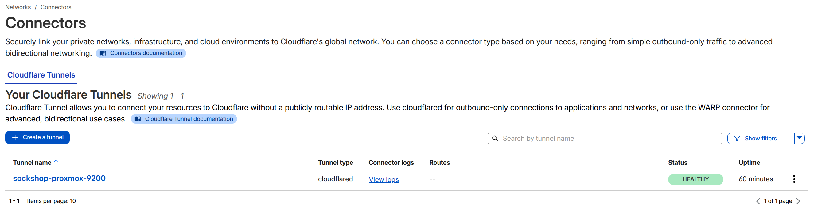

***Figure 8*** *Global overview of managed tunnels within the Zero Trust dashboard, highlighting the 'Healthy' operational status of the sockshop-proxmox-9200 instance.*

**Published Application Hostname Mapping**

***Figure 9*** *Configuration of the public-to-private routing table, mapping external subdomains to the internal Traefik Ingress controller, including the 404 catch-all safety rule.*

### Public verification

Once the Cloudflare dashboard shows the tunnel connector as healthy and the hostname routes are saved, verify both public URLs.

#### Terminal (Local Workstation)

~~~bash
# Check the public dev hostname through Cloudflare.
# Schema: curl -I https://<DEV_PUBLIC_HOSTNAME>
$ curl -I https://dev-sockshop.cdco.dev
HTTP/2 200 
...
server: cloudflare

# Check the public prod hostname through Cloudflare.
# Schema: curl -I https://<PROD_PUBLIC_HOSTNAME>
$ curl -I https://prod-sockshop.cdco.dev
HTTP/2 200 
...
server: cloudflare
~~~

#### HTTP Client

Finally we verify both URLs in the browser:

**Public Environment Validation: Side-by-Side Comparison**

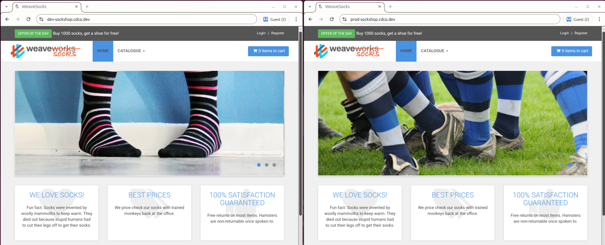

***Figure 10*** *Successful HTTPS resolution of both Development and Production environments through the Cloudflare Tunnel, demonstrating correct Traefik ingress routing and SSL termination.*

---

> [!NOTE] **🔒 HTTPS and SSL Offloading**
>
> In the Cloudflare Tunnel configuration, the public routes are intentionally pointed to unencrypted HTTP on port 80 (`http://10.10.10.20:80`). 
>
> It is not necessary to configure TLS certificates locally because Cloudflare performs **SSL Offloading**, meaning Cloudflare carries the "burden of HTTPS" (i.e. the computational heavy lifting etc. required to handle HTTPS) - thus offloading that task from the VM. 
> - Cloudflare **automatically provisions and serves a valid public HTTPS certificate** to the end user.
> - The **traffic** travels from Cloudflare to the VM **through a heavily encrypted outbound tunnel**.
> - The **final handoff** from the **`cloudflared` daemon inside the VM to Traefik** happens **over HTTP** (yes, unencrypted), but because this hop is **entirely internal** to the local network, it is **secure**.
>
> This architecture **removes the burden of managing and renewing Let's Encrypt certificates locally** on the cluster.
>
> **💡 Closing the "Final Gap" (Next Steps):**
> While this setup is production-ready for most use cases, the "Gold Standard" of security is **End-to-End Encryption**. Currently, the **hop between the `cloudflared` connector and Traefik remains unencrypted (HTTP)**. To achieve a **"Full (Strict)"** security posture, the next logical step is to implement **cert-manager** within the cluster. This would allow Traefik to handle its own Let's Encrypt certificates locally, ensuring that traffic is encrypted from the user all the way to the application pod, leaving no part of the data path exposed.

## Result

- both Kubernetes Ingress objects were aligned to the final public hostnames:
  - `dev-sockshop.cdco.dev`
  - `prod-sockshop.cdco.dev`
- `kubectl get ingress -A` on the target VM finally showed:
  - `sock-shop-dev    front-end   traefik   dev-sockshop.cdco.dev`
  - `sock-shop-prod   front-end   traefik   prod-sockshop.cdco.dev`
- local host-header verification against the Traefik entrypoint returned successful HTTP responses for both environments
- `cloudflared` was installed successfully on the target VM
- `cloudflared --version` returned:
  - `cloudflared version 2026.3.0`
- `sudo systemctl status cloudflared --no-pager` showed the connector service as active and running
- the Cloudflare Zero Trust dashboard showed:
  - a connected / healthy tunnel
  - published application routes for both public hostnames
- the final public HTTPS verification succeeded:
  - `curl -I https://dev-sockshop.cdco.dev` returned `HTTP/2 200`
  - `curl -I https://prod-sockshop.cdco.dev` returned `HTTP/2 200`
- browser-side verification also succeeded for both environments through the Cloudflare-managed public URLs

These signals show that:

- the Kubernetes ingress layer is now aligned with the real public hostname strategy
- the Cloudflare Tunnel connector is working as the public edge for the target VM
- both application environments are now publicly reachable over HTTPS without exposing inbound ports directly on the VM
- the remaining Phase-05 work is no longer about ingress or public reachability, but about GitHub Actions access and real target-side automated deployment

## 🛠️ Troubleshooting/Issues: Guest Session Persistence Issue

During final verification of the `dev` and `prod` environments, a **legacy application bug** was identified regarding **anonymous (guest) session handling**: 

The "Add to Cart" feature fails to persist items in the UI for anonymous (guest) users, despite the network returning a `201 Created` status. The **UI fails to update the cart counter**, and the **cart remains empty upon manual refresh**.

**Quick Summary:**
- **Root Cause:** A legacy application bug in the `front-end` Node.js code. The app crashes when attempting to set session cookies behind the double reverse proxy (Cloudflare + Traefik).
- **Infrastructure Verification:** Direct MongoDB queries and authenticated user tests confirm that the Ingress, Service Mesh, and Database layers are 100% functional.
- **Resolution:** Out of Scope. The issue is localized to the legacy application source code - and restricted to guest session handling:   
    - System integrity was further validated using a **persistent user account**. By logging in, the application bypasses the buggy anonymous session logic. In this state, the cart functions perfectly. 
    - As the core infrastructure (K8s, Ingress, Tunnel, and Persistence) is confirmed healthy, patching the upstream Node.js source code for this legacy demo was deemed **Out of Scope** for this deployment phase.

> [!IMPORTANT] **Deep-Dive Investigation**
> For the full technical breakdown, including terminal logs and database evidence, see the **[Phase 05 Debug Log Entries](./DEBUG-LOG.md#issue-01-guest-session-persistence)**.

# Step 22 — Prepare the GitHub-side Deployment Access Path (Tailscale OAuth, K8s Config & Secrets)

## Rationale

The public ingress configuration is now complete: both **app environments are reachable through Cloudflare and Traefik on the target VM**, providing a live destination for our CI/CD pipeline.

But establishing a CI/CD-based delivery to that target has further requirements: What is still missing is the **secure administrative route** that **allows GitHub Actions to reach the k8s cluster API** for real deployments. Right now, GitHub Actions can't access our Tailnet to reach the Proxmox VM `9200` - nor has it the needed information regarding the whereabouts of the k8s cluster or the administrative rights to manipulate that cluster.    

Before the existing GitHub Actions baseline workflow from Phase 03 is retargeted to the Proxmox-backed cluster, GitHub must first be given a **secure, minimal way to join the tailnet** 
- and a **valid kubeconfig** for the target cluster.

This step therefore **prepares the GitHub-side prerequisites** only:

- **Tailscale Identity** (Tailscale tag and OAuth client) for the GitHub runners
- Target Cluster **kubeconfig** (the administrative credential file from `~/.kube/config-proxmox-dev.yaml`), also needed by the GitHub runners 
- **GitHub Actions secrets** on GitHub that contain the Tailscale Identity and the kubeconfig for **Tailscale and Kubernetes access**

Note: The **necessary Workflow YAML adjustments** will be made later on (the current workflow still uses f.i. a temporary `kind` cluster as its smoke target etc.). Those adjustments will rely directly on the results of this step:

- Tailscale identity
- Target Cluster kubeconfig
- GitHub Actions secrets 

> [!NOTE] **🗝️ What is a Kubeconfig?**
> A `kubeconfig` is the administrative credential and connection file used to control a Kubernetes cluster. It combines two important pieces of information **necessary for k8s cluster access and manipulation**:
> 
> 1. **The Map** which contains the cluster's API URL - i.e. the **exact address of the cluster's API server** - in our case `https://100.72.5.85:6443`:
    - **Target VM Tailscale IP**: `100.72.5.85`
    - **Kubernetes API port**: `6443`
> 2. **The Master Key** which contains the **cryptographic admin certificates and tokens** that proves that the owner of this key acts a **cluster administrator**.
> 
> Providing the kubenconfig to GitHub allows the CI/CD pipeline to seamlessly "log in" and deploy the sockshop microservices on the cluster.

## Action

The goal now is:

- To prepare a **Tailscale identity** for GitHub Actions (i.e., the **Tailscale OAuth client secrets**). These function as the **VPN Access Keys**, allowing the ephemeral GitHub runners to communicate with our Proxmox VM over the private Tailscale VPN.
- To capture the **Kubernetes Cluster Master Key / Target Cluster Kubeconfig** (from `~/.kube/config-proxmox-dev.yaml`). This allows GitHub Actions to authenticate against the k8s cluster and execute the actual deployments to the Proxmox-backed environment.
- To **store all those secrets** securely as **GitHub Secrets** in the repository (i.e., the Tailscale OAuth client secrets as `TS_OAUTH_CLIENT_ID` and `TS_OAUTH_SECRET`, and the Kubernetes Cluster Master Key as `KUBECONFIG_PROXMOX_TARGET`).

### Tailscale admin console (UI)

- To prepare a Tailnet identity for GitHub Actions, we need to open the **Tailscale admin console** under [https://login.tailscale.com/admin/](https://login.tailscale.com/admin/).
- In the admin console, the nav item **Access Controls** (top navbar) offers a Visual Editor view and a JSON Editor view to edit Access Controls and Policies. 
- We are going to use the JSON Editor view to declare for GitHub Action runner nodes a **Tailscale ID badge in the form of a tag** - here the tag `tag:ci` as CI tag owner - and ensure it has **permission** to hit the **Tailscale IP of the VM 9200** on the **default Kubernetes API port `6443`** (i.e. `100.72.5.85:6443`):

#### 1. Define the CI tag owner

**Steps:**

- In Tailscale, a tag is sort of an official ID Badge 
- A tag cannot be used by an OAuth client unless its ownership is explicitly declared in the Access Controls.
- In the JSON Editor, we nee to create a **tag (ID Badge) for ephemeral GitHub Actions runner nodes** if it does not already exist:

- `tag:ci`

To do so, we need to find the **`"tagOwners"`** block in the JSON editor and change it to this:

~~~json
    // Define the tags which can be applied to devices and by which users.
	"tagOwners": {
		"tag:ci": ["autogroup:admin"],
	},
~~~    

#### 2. Check access policy for the CI tag

**Steps:**

- Next it is necessary to ensure that the `tag:ci` identity will be able to reach the target cluster API on the Proxmox VM.
- For this phase, the important destination is:
    - **Target VM Tailscale IP**: `100.72.5.85`
    - **Kubernetes API port**: `6443`
- Find the `**"grants"`-section** in the JSON-editor
- If the tailnet policy is already using the default grant here :
~~~json
// Allow all connections.
// Comment this section out if you want to define specific restrictions.
{"src": ["*"], "dst": ["*"], "ip": ["*"]},
~~~
...this access is already permitted and we are good.
- **But if the tailnet policy is restricted**, we need to **explicitly add or confirm a rule** that allows:
    - source: `tag:ci`
    - destination: `100.72.5.85:6443`
.. i.e. like this::
~~~json
`{"src": ["tag:ci"], "dst": ["100.72.5.85:6443"]}`
~~~

#### 3. Create the OAuth client

> [!NOTE] **🔑 What is OAuth - and why is it needed here?**
> **OAuth (Open Authorization)** is an industry-standard protocol that **allows a service (like GitHub Actions) to securely interact with another service (like Tailscale)** without needing actual username and password credentials. 
> 
> **Details** Every time a GitHub Action workflow runs, it spins up a brand new, empty, ephemeral server. To deploy to the Proxmox VM, this temporary server needs to join the existing private Tailscale VPN that was established earlier between the local Workstation and the Proxmox VM. Instead of giving GitHub the master Tailscale password, it receives a **scoped OAuth Client ID and Secret**. 
> The GitHub runner uses these keys to automatically authenticate, generate a temporary device auth key, and join the tailnet with the `tag:ci` badge, then disappears when the job is done.

**Steps:**

- In the Tailscale admin console, we need create an **OAuth client and record**.
- The relevant section can be found via **Settings** (top nav) > **Trust Credentials** (sidenav) 
- Select **Create Credentials** > "OAuth" adn enter a desciption (f.i. "GitHub Actions CI Runner for Proxmox CICD") before hitting **"Continue"**
- The **"Scopes" section** appears, where we can now edit the permission scope of the new OAuth Client. Leave all settings as is - with **two exceptions**: 
    - **(1) Select/Expand "Devices"** and **enable "Write" for the first entry ("Core")**
        - **Add the `tag:ci`** to that core-entry   
    - **(2) Select/Expand "Keys"** and **enable "Write" for the second entry ("Auth Keys")**
        - Also *aAdd the `tag:ci`** to that Auth-Keys-entry (it should havew been auto-added already)   
- Hit the **"Generate Credential"** button when done, whcih will genertate the OAuth Client Secrets:  
- A success modal appears ("Credentails created") **displaying the OAuth Client ID and OAuth Client Secret**. These must be **copied imemdiately** and kept somehwre tempoarily without saving them - they will never be displayed in full again - but needed in the GitHub repo later on!     

> [!IMPORTANT] **OAuth client scope and tag permission**
>
> This OAuth client must be able to create the ephemeral GitHub Actions runner node and apply the runner tag.
>
> We must configure the OAuth client in the **"Scopes" section** so that:
>
> - **Devices (Core)** is set to **Write**
> - **Keys (Auth Keys)** is set to **Write**
> - And the Oauth client is explicitly **allowed to assign this tag** to devices:
>   - `tag:ci`
>
> Without that combination, the GitHub Action can fail when it tries to register the ephemeral runner node with the intended CI tag.

### Local workstation

The target kubeconfig that already worked from the workstation in the earlier phase should now be checked one more time before it is copied into GitHub. If the expected remote k8s API endpoint is anchored in the kubeconfig as `server: https://100.72.5.85:6443` and we can access the remote k8s nodes and namespaces using that kubeconfig, we are good to go in that regard:  

~~~bash
# Confirm the current k8s API server line in the prepared workstation kubeconfig.
$ grep 'server:' ~/.kube/config-proxmox-dev.yaml
server: https://100.72.5.85:6443

# Confirm that the kubeconfig still reaches the real target cluster from the workstation.
$ KUBECONFIG=~/.kube/config-proxmox-dev.yaml kubectl get nodes -o wide
NAME                        STATUS   ROLES           INTERNAL-IP   EXTERNAL-IP   OS-IMAGE             KERNEL-VERSION      CONTAINER-RUNTIME
ubuntu-2404-k3s-target-01   Ready    control-plane   10.10.10.20   <none>        Ubuntu 24.04.4 LTS   6.8.0-107-generic   containerd://2.2.2-bd1.34

# Confirm that both application namespaces still exist.
$ KUBECONFIG=~/.kube/config-proxmox-dev.yaml kubectl get namespace sock-shop-dev sock-shop-prod
NAME             STATUS   
sock-shop-dev    Active   
sock-shop-prod   Active   
~~~

### GitHub repository settings

Next we need to adjust the GitHUb repository settings for the sock-shop fork to create the repo secrets necessary for the Tailnet and remote k8s access of GitHub Actions runners. 
As a reminder: We already set up (in phase 03-ci-cd-baseline) the environments `dev` + and protected `prod` with "required reviewers" (see `Settings -> Environments`).

#### Create the repository secrets

The needed repository secrets can be created under **`Settings -> Secrets and variables -> Actions`** adn there by selecting **"New repository secret"**:

---

- `TS_OAUTH_CLIENT_ID`
  - value: the Tailscale OAuth client ID
- `TS_OAUTH_SECRET`
  - value: the Tailscale OAuth client secret
- `KUBECONFIG_PROXMOX_TARGET`
  - value: the full contents of `~/.kube/config-proxmox-dev.yaml` (captured `cat` via from the local workstation)

> [!IMPORTANT] **Kubeconfig secret handling**
>
> The `KUBECONFIG_PROXMOX_TARGET` secret contains live cluster credentials.
>
> It is necessary to copy & paste the full kubeconfig content exactly as-is into the secret value field on GitHub.
>
> This file or its contents must not be commited to the repository!

## Result

The **GitHub-side deployment access path** for the remote target cluster on the Proxmox VM `9200` is now **prepared successfully.**

The successful end state is shown by these signals / verification points:

- `grep 'server:' ~/.kube/config-proxmox-dev.yaml` confirmed that the prepared workstation kubeconfig still points to:
  - `server: https://100.72.5.85:6443`
- `KUBECONFIG=~/.kube/config-proxmox-dev.yaml kubectl get nodes -o wide` returned the real Phase-05 target node:
  - `ubuntu-2404-k3s-target-01`
  - `Ready`
  - `control-plane`
  - internal IP `10.10.10.20`
- `KUBECONFIG=~/.kube/config-proxmox-dev.yaml kubectl get namespace sock-shop-dev sock-shop-prod` confirmed that both planned application environments still exist:
  - `sock-shop-dev   Active`
  - `sock-shop-prod  Active`
- the Tailscale-side CI access preparation was completed successfully:
  - CI tag `tag:ci`
  - OAuth client with device-write capability
  - permission to assign `tag:ci`
- the GitHub-side deployment secrets were prepared successfully for the later workflow retarget:
  - `TS_OAUTH_CLIENT_ID`
  - `TS_OAUTH_SECRET`
  - `KUBECONFIG_PROXMOX_TARGET`

These signals show that:

- the workstation kubeconfig is still valid for the real target cluster
- the target cluster state is still healthy and reachable over the tailnet
- the secure GitHub-side prerequisites for real target deployment are now in place
- the remaining Phase-05 work can now move from access preparation to workflow retargeting

---

# Step 23 — Create a dedicated Phase-05 workflow and prove the real target delivery path: automated `dev` deployment plus approval-gated `prod` deployment on the Proxmox-backed cluster

## Rationale

The public ingress side is now working, both application environments exist on the real target cluster, and the GitHub-side deployment access path has been prepared successfully. We can move on to implement a Phase-05 delivery workflow now. At the same time we will keep the original Phase-03 workflow as a frozen baseline to preserve the chronological build story.

This step therefore will:

- preserve the old Phase-03 workflow as a manual-only historical artifact
- create a new dedicated Phase-05 workflow file for the real target-delivery path
- retarget only the new workflow to the Proxmox-backed cluster and avoid mixing a `phase-03` file with `phase-05` behavior.
- prove the automated `dev` deployment from the current Phase-05 feature branch
- complete the target-delivery proof by executing the approval-gated `prod` deployment once the new workflow runs from `master`

Apart from that, the existing delivery logic from Phase 03 stays at least conceptually the same:
- validate overlays
- build/push the repo-owned helper image
- deploy `dev` automatically
- keep `prod` behind the existing `master`-branch approval logic

## Action

The goal now is:

- to preserve the old Phase-03 workflow without double-triggering it - and freeze it as a manual-only artifact
- to create a new Phase-05 workflow file for the real and active target-delivery path
- to replace the temporary `kind` cluster setup with a secure Tailscale + kubeconfig access path
- to let the first real workflow proof run happen from `feat/proxmox-target-delivery`
- to prove that GitHub Actions can deploy `sock-shop-dev` automatically and `sock-shop-prod` after approval on the real target cluster

### Local workstation

The existing workflow file is preserved first, then duplicated into a new Phase-05 workflow file as working basis:

~~~bash
# Create a dedicated Phase-05 workflow file from the current Phase-03 baseline.
cp .github/workflows/phase-03-delivery.yaml .github/workflows/phase-05-target-delivery.yaml
~~~

### 1. Update the new Phase-05 workflow 

#### 1.1 Freeze the old Phase-03 workflow as manual-only

To avoid conflicts between the old and the new workflows while still keeping the old Phase 03 workflow as a baseline for "historical reasons", we need to freeze the old workflow to be triggered manual-only. 

This is achived by replacing its trigger block accordingly:

~~~yaml
# .github/workflows/phase-03-delivery.yaml
name: Phase 03 - Baseline CI/CD

on:
  workflow_dispatch:
~~~

This keeps the old workflow available for historical review and manual re-run, but prevents it from auto-triggering on every push.

#### 1.2 Update metadata and trigger

- Next, we ensure that not only `master` (the intended final trigger) but temporarily also the current feature branch can trigger the workflow automatically.
- Furthermore, we add `workflow_dispatch` to enable a manual "Run workflow" button in the GitHub UI. This allows for easy retries without needing dummy commits.

~~~yaml
# .github/workflows/phase-05-target-delivery.yaml
name: phase-05-proxmox-target-delivery

on:
  # Branch-driven automatic execution   
  push:
    branches:
      - master # Final intended trigger
      - feat/proxmox-target-delivery # Temporary feature-branch trigger used while proving this phase
  # Optional manual execution 
  workflow_dispatch: # Enables the manual "Run workflow" button in the GitHub UI
~~~

#### 1.3 Replace the temporary `kind` setup in the jobs `deploy-dev-smoke` + `deploy-prod-smoke`

Because we are moving from a local test environment (Phase 03 workflow) to the real Proxmox VM now, the ephemeral kind cluster of phase 03 is no longer needed. Instead, the GitHub runner must securely join our Tailnet VPN and authenticate against the real k8s cluster, using the Tailscale OAuth Client secrets and the k8s Cluster Kubeconfig.

Both smoke deploy jobs (dev + prod) must be updated accordingly by removing their old "Start Kind cluster" and "Wait for cluster readiness" steps.

In **both jobs**, those steps must be replaced with the following:

~~~yaml
      # 1. Join the private Tailnet as an ephemeral CI node using the Tailscale OAuth Client secrets
      - name: Connect runner to tailnet
        uses: tailscale/github-action@v4
        with:
          oauth-client-id: ${{ secrets.TS_OAUTH_CLIENT_ID }}
          oauth-secret: ${{ secrets.TS_OAUTH_SECRET }}
          tags: tag:ci
          ping: 100.72.5.85

      # 2. Provide the Target Cluster Kubeconfig admin keys so kubectl can authorize against the cluster      
      - name: Write target kubeconfig
        run: |
          mkdir -p ~/.kube
          cat > ~/.kube/config <<'EOF'
          ${{ secrets.KUBECONFIG_PROXMOX_TARGET }}
          EOF
          chmod 600 ~/.kube/config
~~~

Next, to **prove the runner has successfully reached the Proxmox VM** before attempting to deploy anything, we add a "Show target cluster access" step right underneath the "Write target kubeconfig" step.

-  In the deploy-dev-smoke job, insert:
~~~yaml
      # 3. Verify the cluster connection and ensure the target namespace exists  
      - name: Show target cluster access
        run: |
          kubectl get nodes -o wide
          kubectl get namespace sock-shop-dev
~~~          

-  And similarily in the `deploy-prod-smoke` job, we insert:
~~~yaml
      # 3. Verify the cluster connection and ensure the target namespace exists  
      - name: Show target cluster access
        run: |
          kubectl get nodes -o wide
          kubectl get namespace sock-shop-prod
~~~          

> [!IMPORTANT] **Tailscale OAuth client requirements**
>
> The OAuth client used by the Tailscale GitHub Action must:
>
> - have the writable `auth_keys` scope
> - be allowed to assign the runner tag `tag:ci`
>
> The `tag:ci` tag itself must already exist in the tailnet.
>
> The GitHub Action creates ephemeral tagged nodes for the workflow run, so without that scope/tag setup, the runner cannot join the tailnet successfully.
>
> It is also necessary that the existing token permissions at the top of the workflow are kept as is, so the runner can pull the deployment files and push images:
> 
> ~~~yaml 
> permissions:
>  contents: read
>  packages: write 
> ~~~  

Finally, instead of hardcoding specific microservices like we did in Phase 03, we will instruct the workflow to **wait until every deployment in the namespace is healthy** by replacing the old "Verify key dev|prod rollouts" steps with these new steps:

- In the deploy-dev-smoke job:

~~~yaml
      # Wait for all dev microservices to become fully available  
      - name: Wait for dev deployments to become available
        run: kubectl wait --namespace sock-shop-dev --for=condition=available deployment --all --timeout=300s
~~~

-  And similarily in the `deploy-prod-smoke` job: 

~~~yaml
      # Wait for all prod microservices to become fully available  
      - name: Wait for prod deployments to become available
        run: kubectl wait --namespace sock-shop-prod --for=condition=available deployment --all --timeout=300s
~~~

### 2. Commit and push the workflow split + retarget

After both workflow files are updated, we continue with the normal Git flow.

~~~bash
# Stage both workflow files.
git add .github/workflows/phase-03-delivery.yaml .github/workflows/phase-05-target-delivery.yaml

# Commit the workflow split and real-target retarget.
git commit -m "feat(target-delivery): add phase-05 workflow for Proxmox cluster"

# Push the updated Phase-05 branch.
git push
~~~

### 3. Prove the automated `dev` deployment in GitHub Actions

Once the push is complete, we can navigate to the GitHub Actions tab and inspect the new run for:

- workflow: `Phase 05 - Proxmox Target Delivery`
- branch: `feat/proxmox-target-delivery`

The expected behavior on this feature branch is:

- the old Phase-03 workflow does **not** auto-trigger anymore
- the new Phase-05 workflow starts automatically
- `validate-overlays` runs
- `build-push-support-images` runs
- `deploy-dev-smoke` runs against the real target cluster
- `deploy-prod-smoke` does **not** run yet, because it still stays behind the current `master`-only condition

**GitHub Actions Workflows Overview**

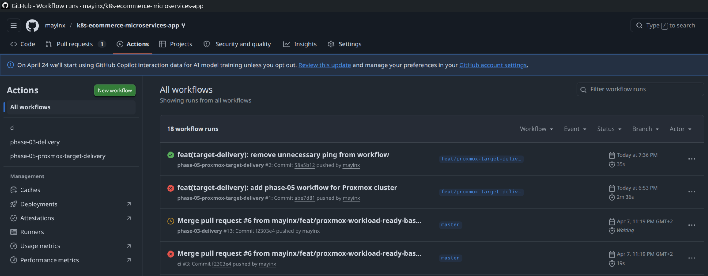

***Figure 11*** *Overview of the GitHub Actions dashboard, showing the preserved Phase 03 baseline workflow alongside the new Phase 05 target delivery workflow. The new Phase 05 Workflow auto-triggered as expected and run successfully, whereas the Phase 03 workflow was not triggered by the same push (last execution of that workflow occured a day before).*

**GitHub Actions Workflows Overview**

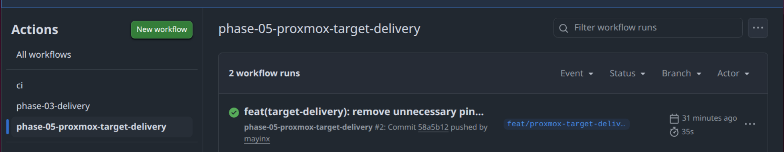

***Figure 12*** *Overview of the GitHub Actions Phase 05 workflow (`phase-05-proxmox-target-delivery`), showing the successfull execution of the last run of that workflow.*

**Phase 05 Workflow Execution Graph**

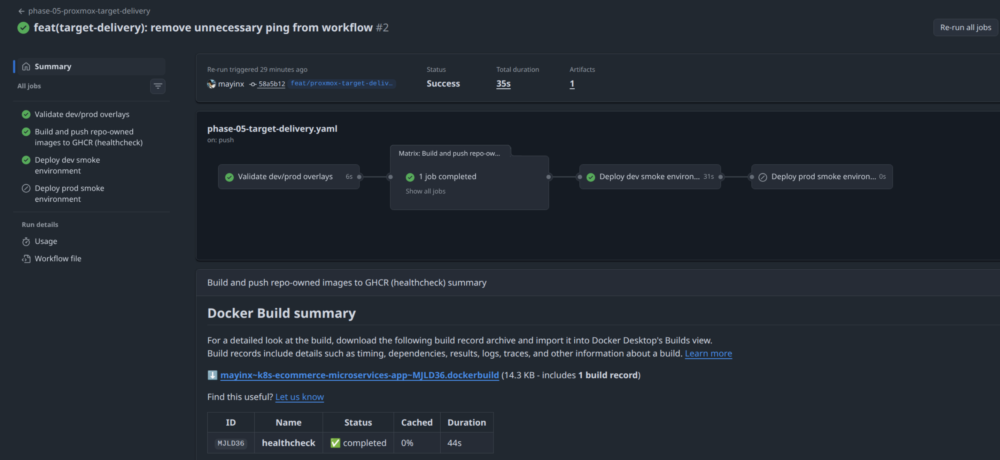

***Figure 13*** *Detailed execution graph for the Phase 05 feature branch, confirming the successful completion of the validation, build, and dev smoke deployment jobs. The `deploy-prod-smoke` does not run yet as expected, since it is still behind the current `master`-only condition*

**Tailnet Connection and Kubeconfig Setup**

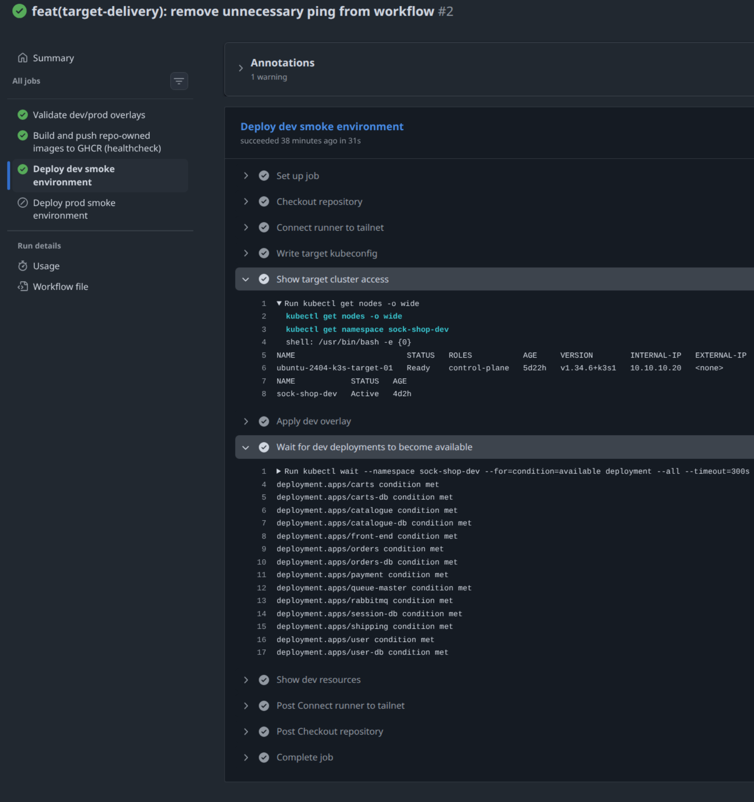

***Figure 14*** *Execution logs from the deploy-dev-smoke job confirming the runner successfully joined the Tailnet and securely wrote the target cluster kubeconfig.*

**Target Cluster Access and Readiness Verification**

***Figure 15*** *Log output demonstrating direct communication with the Proxmox nodes over the Tailnet VPN and the successful wait condition confirming all dev microservices are available on the Target VM.*

### 4. Verify the target cluster after the workflow run

Once the GitHub Actions run finishes successfully, we confirm from the workstation that the real target cluster still looks correct.

~~~bash
# Show the dev namespace resources after the GitHub Actions deployment.
$ KUBECONFIG=~/.kube/config-proxmox-dev.yaml kubectl get deploy,pods,svc -n sock-shop-dev -o wide
NAME                           READY   UP-TO-DATE   AVAILABLE   CONTAINERS  IMAGES                                               
deployment.apps/carts          1/1     1            1           carts       weaveworksdemos/carts:0.4.8                          
deployment.apps/carts-db       1/1     1            1           carts-db    mongo:3.4                                            
...
deployment.apps/front-end      1/1     1            1           front-end   weaveworksdemos/front-end:0.3.12                     
...
deployment.apps/user           1/1     1            1           user        weaveworksdemos/user:0.4.7                           
deployment.apps/user-db        1/1     1            1           user-db     weaveworksdemos/user-db:0.3.0                        

NAME                                READY   STATUS    IP            NODE                        
pod/carts-5f5859c84b-qbrjp          1/1     Running   10.42.0.92    ubuntu-2404-k3s-target-01   
pod/carts-db-6bb589dd85-sdgdh       1/1     Running   10.42.0.73    ubuntu-2404-k3s-target-01   
...
pod/front-end-7467866c7b-qwpvh      1/1     Running   10.42.0.93    ubuntu-2404-k3s-target-01   
...
pod/user-67488ff854-x2wz7           1/1     Running   10.42.0.102   ubuntu-2404-k3s-target-01   
pod/user-db-7bd86cdcd-xwm7b         1/1     Running   10.42.0.103   ubuntu-2404-k3s-target-01   

# Show the dev ingress after the GitHub Actions deployment.
$ KUBECONFIG=~/.kube/config-proxmox-dev.yaml kubectl get ingress -n sock-shop-dev -o wide
NAME        CLASS     HOSTS                   ADDRESS       PORTS   
front-end   traefik   dev-sockshop.cdco.dev   10.10.10.20   80      
~~~

### 5. Complete the real target-delivery proof by executing the approval-gated `prod` deployment from `master`

At this point, the automated `dev` deployment path has already been proven successfully on the target cluster. What still remains is the corresponding `prod` proof on that same target.  

Since the Phase-05 workflow already contains the intended `prod` gate, the only remaining task is to execute that already defined path once from `master`, approve it in GitHub, and verify the resulting `prod` state on the target cluster.

Because the `deploy-prod-smoke` job is intentionally restricted by a current workflow condition this final proof can only happen once the Phase-05 workflow file is present on `master`:

~~~yaml
if: github.ref == 'refs/heads/master'
~~~

#### 5.1 Remove temporary feature-branch-trigger + merge the current feature to trigger the `master`-based workflow run

Now that the feature-branch proof is done, the clean final Phase-05 workflow on master should no longer contain:

~~~yaml
- feat/proxmox-target-delivery # Temporary feature-branch trigger used while proving this phase
~~~

So the trigger block becomes now:

~~~yaml
on:
  push:
    branches:
      - master
  workflow_dispatch:
~~~

To trigger the master-based workflow run, we just need to merge the current Phase-05 feature branch into `master` now. After that's done, we can open the GitHub Actions tab and inspect the new run for:

- workflow: `phase-05-proxmox-target-delivery`
- branch: `master`

The expected behavior on `master` is now:

- `validate-overlays` runs
- `build-push-support-images` runs
- `deploy-dev-smoke` runs automatically
- `deploy-prod-smoke` becomes eligible and waits behind the GitHub `prod` environment approval gate (a "Review deployments" button is visible)

#### 5.2 Approve the `prod` deployment in GitHub

Once the workflow pauses at the `prod` environment gate, we can approve the deployment in the GitHub UI by selecting **"Review deployments"** above the workflow graph and selecting **"Approve and deploy"** in the opening confirmation modal. 

This will allow the workflow to continue into the `deploy-prod-smoke` job, which then:

- joins the Tailnet as an ephemeral CI node
- writes the target kubeconfig
- verifies target-cluster access
- applies the `prod` overlay
- waits until all `prod` deployments become available
- displays the resulting `prod` resources

#### 5.3 Verify the `prod` namespace after approval

Once the GitHub Actions run finishes successfully, confirm from the workstation that the real `prod` environment now looks correct on the target cluster.

~~~bash
# Show the prod namespace resources after the approved GitHub Actions deployment.
$ KUBECONFIG=~/.kube/config-proxmox-dev.yaml kubectl get deploy,pods,svc -n sock-shop-prod -o wide
NAME                           READY   UP-TO-DATE   AVAILABLE   AGE    CONTAINERS   IMAGES                                               
deployment.apps/carts          1/1     1            1           2d9h   carts        weaveworksdemos/carts:0.4.8                          
deployment.apps/carts-db       1/1     1            1           2d9h   carts-db     mongo:3.4                                            
...
deployment.apps/front-end      1/1     1            1           2d9h   front-end    weaveworksdemos/front-end:0.3.12                     
...
deployment.apps/user           1/1     1            1           2d9h   user         weaveworksdemos/user:0.4.7                           
deployment.apps/user-db        1/1     1            1           2d9h   user-db      weaveworksdemos/user-db:0.3.0                        

# Show the prod ingress after the approved GitHub Actions deployment.
$ KUBECONFIG=~/.kube/config-proxmox-dev.yaml kubectl get ingress -n sock-shop-prod -o wide
NAME        CLASS     HOSTS                    ADDRESS       PORTS   
front-end   traefik   prod-sockshop.cdco.dev   10.10.10.20   80      

# Check the public prod hostname after the approved deployment.
$ curl -I https://prod-sockshop.cdco.dev
HTTP/2 200
...
server: cloudflare
~~~

#### 5.4 Expected GitHub-side signals

This final closure proof is successful if:

- the new Phase-05 workflow runs from `master`
- the `deploy-prod-smoke` job appears after the `dev` job
- the workflow pauses for the `prod` approval gate
- manual approval in GitHub releases the `deploy-prod-smoke` job
- the `deploy-prod-smoke` job completes successfully against the real target cluster

**GitHub Actions Phase 05 Workflow — Prod Approval Gate**

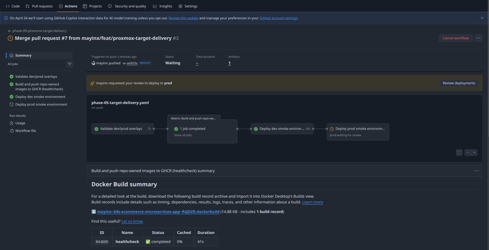

***Figure 16*** *Phase 05 workflow execution on `master`, showing the successsfull workflow execution and the `prod` environment approval gate before the final production deployment job is released.*

**GitHub Actions Phase 05 Workflow — Prod Approval Gate - Confirmation/Reject Modal**

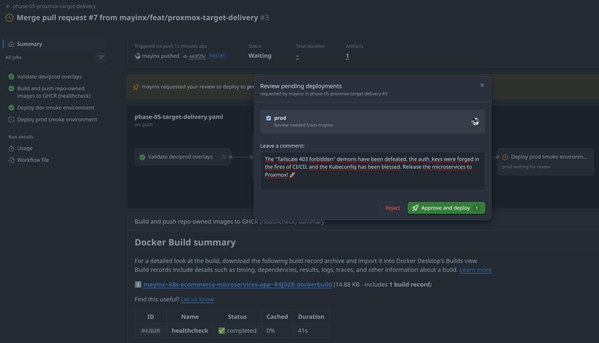

***Figure 17*** *Showing the `prod` environment approval gate confirmation/reject modal.*

**GitHub Actions Phase 05 Workflow — Prod Deployment Running After Approval**

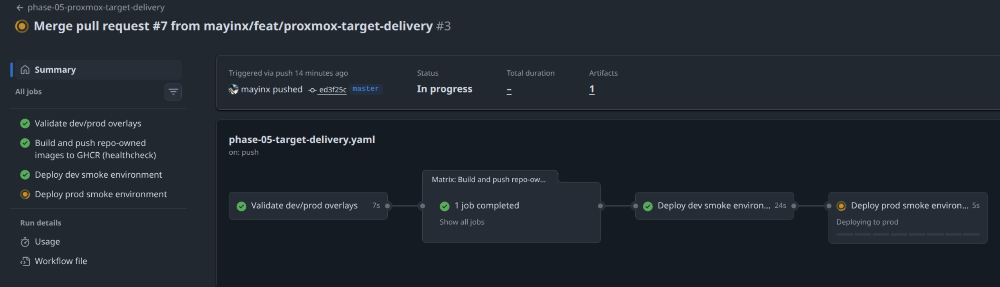

***Figure 18*** *Teh running `deploy-prod-smoke` job after approval.*

**GitHub Actions Phase 05 Workflow — Prod Deployment Success**

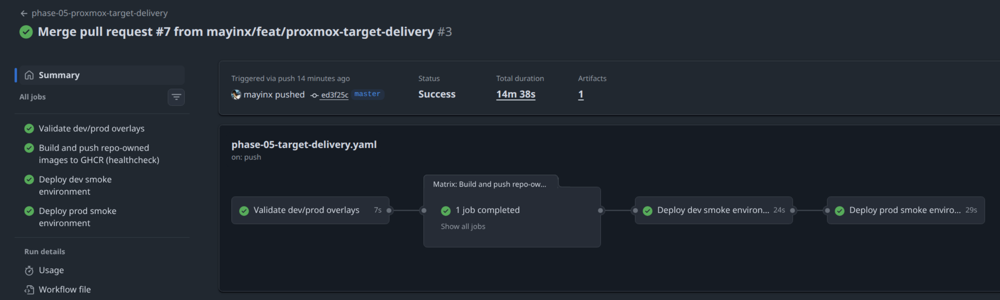

***Figure 19*** *Successful completion of the approval-gated `deploy-prod-smoke` job against the real Proxmox-backed target cluster.*

**Target Cluster — Approved Prod Deployment Verification**

***Figure 18*** *Post-deployment verification of the `sock-shop-prod` namespace after the approved GitHub Actions run, confirming healthy workloads on the real target cluster.*

## Result

This step **successfully established a fully functioning, automated delivery workflow for the Kubernetes-based Sock Shop microservices**, securely bridging GitHub Actions and the private Proxmox VM 9200. It also served as the complete `dev` and `prod` deployment proof on the real target cluster.

The successful end state is shown by these signals / verification points:

- `.github/workflows/phase-03-delivery.yaml` was preserved and converted into a manual-only historical baseline
- `.github/workflows/phase-05-target-delivery.yaml` was created as the active real-target delivery workflow
- the new Phase-05 workflow can trigger on:
  - `master`
  - `feat/proxmox-target-delivery`
- the temporary `kind` setup was removed from both deploy jobs in the new Phase-05 workflow
- both deploy jobs in the new Phase-05 workflow now use:
  - the Tailscale GitHub Action
  - the stored target kubeconfig secret
- the workflow split and push succeeded
- the new Phase-05 workflow started automatically on `feat/proxmox-target-delivery`
- the old Phase-03 workflow did not auto-trigger on that push
- the `deploy-dev-smoke` job succeeded against the real Proxmox-backed cluster
- after the Phase-05 workflow was present on `master`, the same workflow also executed the approval-gated `prod` deployment path
- the `deploy-prod-smoke` job was released only after GitHub environment approval
- the approved `deploy-prod-smoke` job completed successfully against the real target cluster
- the post-run cluster checks showed healthy `sock-shop-dev` and `sock-shop-prod` namespaces on the real target cluster
- the public ingress paths remained valid after the workflow-driven deployments:
  - `https://dev-sockshop.cdco.dev`
  - `https://prod-sockshop.cdco.dev`

These signals show that:

- the earlier Phase-03 CI/CD baseline was preserved as a historical milestone
- the new Phase-05 workflow now represents the active target-delivery path
- automated `dev` deployment and approval-gated `prod` deployment are both proven on the real Proxmox-backed cluster
- **the Phase-05 target-delivery objective is complete**

---

> [!TIP] **Navigation**  
> **[⬅️ Previous: Phase 05-C](./PHASE-05-C.md)** | **[⬆️ Top (Index)](#index)** | **[🏠 Phase 05 Home](../IMPLEMENTATION.md)**

---