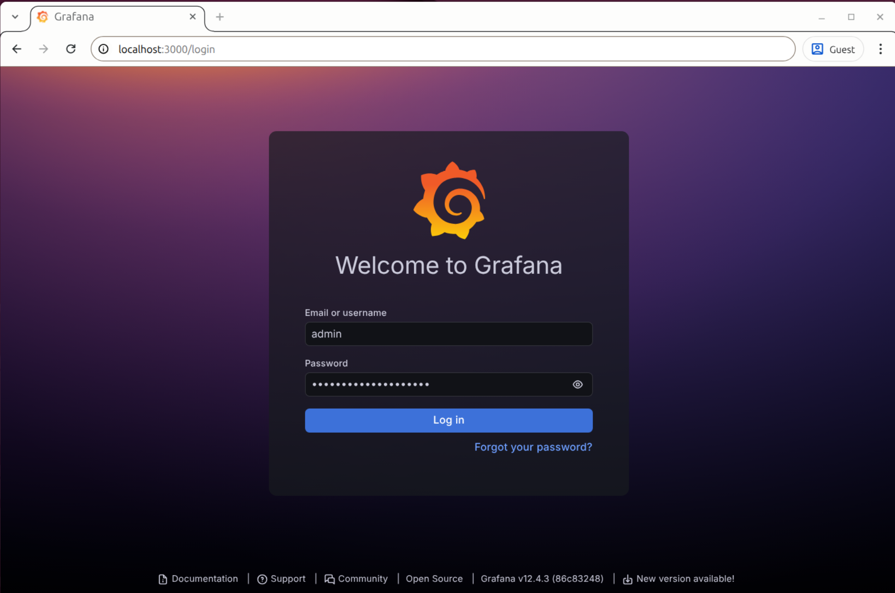
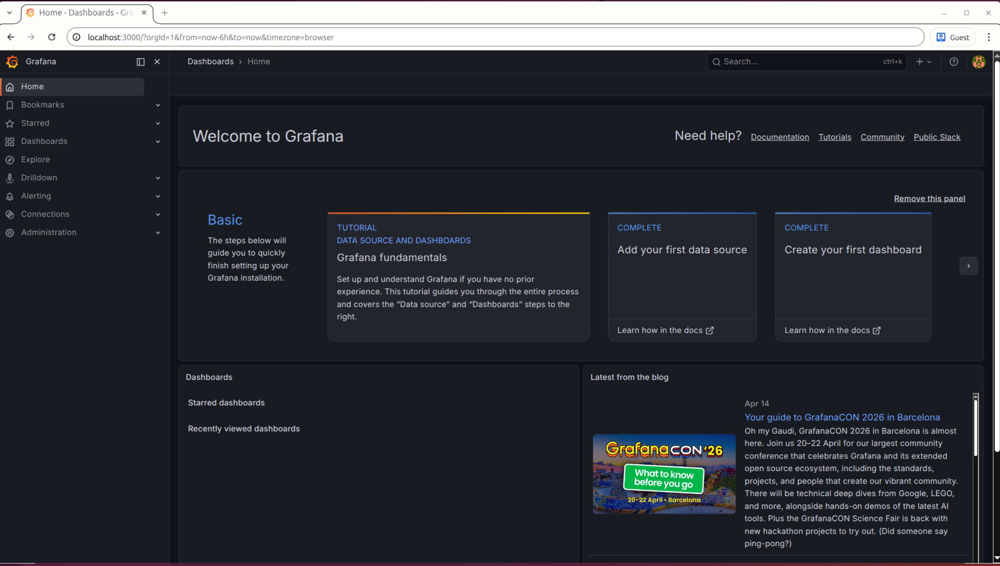
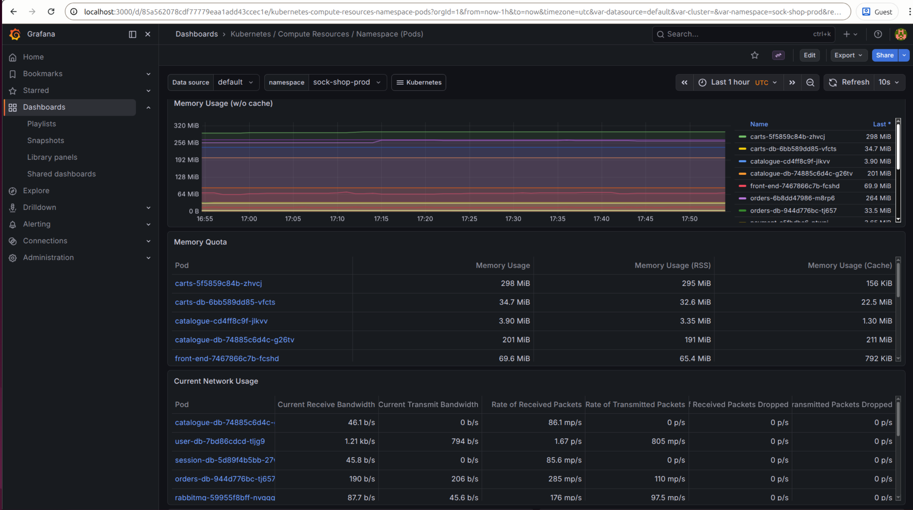
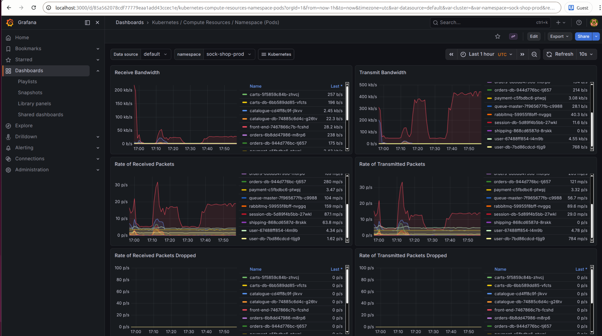
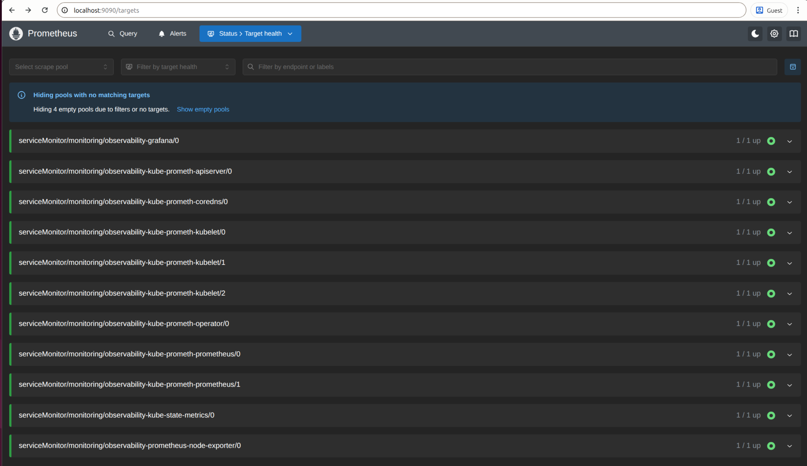

# Phase 06 (Observability & Health): kube-prometheus-stack monitoring baseline on the Proxmox-backed target cluster

# Implementation Log — Phase 06 (Observability & Health): Prometheus + Grafana baseline for the real target cluster

> ## About
> This document is the implementation log and detailed build diary for **Phase 06 (Observability & Health)**.
> It records the full implementation path including rationales, key observations, verification steps, and evidence pointers so the work remains auditable and reproducible.
>
> For top-level project navigation, see: **[INDEX.md](../INDEX.md)**.
> For cross-phase incident and anomaly tracking, see: **[DEBUG-LOG.md](../DEBUG-LOG.md)**.
> For the broader project planning view, see: **[ROADMAP.md](../ROADMAP.md)**.

---

## Index (top-level)

- [**Purpose / Goal**](#purpose--goal)
- [**Definition of done (Phase 06)**](#definition-of-done-phase-06)
- [**Preconditions**](#preconditions)
- [**Step 1 — Install the `kube-prometheus-stack` monitoring chart in the `monitoring` namespace and verify that the monitoring control plane is healthy**](#step-1--install-the-kube-prometheus-stack-monitoring-chart-in-the-monitoring-namespace-and-verify-that-the-monitoring-control-plane-is-healthy)
- [**Step 2 — Access Grafana privately through `kubectl port-forward`, sign in with the chart-managed admin secret, and confirm that the monitoring UI is reachable**](#step-2--access-grafana-privately-through-kubectl-port-forward-sign-in-with-the-chart-managed-admin-secret-and-confirm-that-the-monitoring-ui-is-reachable)
- [**Step 3 — Verify workload visibility in Grafana for `sock-shop-prod` and confirm Prometheus scrape health**](#step-3--verify-workload-visibility-in-grafana-for-sock-shop-prod-and-confirm-prometheus-scrape-health)
- [**Phase 06 outcome summary**](#phase-06-outcome-summary)
- [**Sources**](#sources)

---

## Purpose / Goal

### Add a first real observability baseline on top of the proven target-delivery platform

The goal of Phase 06 is to add a **working observability baseline** on top of the real Proxmox-backed K3s target platform established in Phase 05.

This phase intentionally focuses on implementing a **first useful monitoring layer**, not yet on a broader monitoring setup with long term metric retention, persistent storage, public exposure, or alert-routing complexity.

Nevertheless Phase 06 will provide real DevOps value:

- **Cluster monitoring on the real target** (Proxmox VM 9200)
- **A namespace-isolated monitoring stack** in a dedicated **`monitoring`** namespace, separate from the application namespaces
- **Namespace-level workload visibility** for the development and production application
- **Private operator access** to Grafana and Prometheus
- **Evidence that metrics are being scraped and visualized successfully**
- **A concrete foundation** for later hardening and operational refinement

### Why observability is the next logical capability after Phase 05

After Phase 05 had proven the target-delivery path, the next logical capability is a first **observability baseline**: The project can already deploy and expose the application, but it still **lacks an operational visibility layer** for **checking cluster health, workload behavior, and monitoring health** on the live target.

This makes **observability the next logical DevOps step**: 
- Before moving into later phases such as **Security/Testing**, **Terraform/IaC**, or **DR/Rollback**, the project first **needs a way to inspect what the live platform is actually doing**.
- Without that visibility layer, later phases would partly operate **without a clear basis for verifying cluster state, workload behavior, and monitoring health**.
- Phase 05 proved delivery, while **Phase 06 adds the inspectability needed to operate and validate the platform** more confidently in the following project phases.

### Why `kube-prometheus-stack` in this phase

The upstream repository already contains older monitoring-related material (see below), but this phase uses the well maintained **Helm chart `kube-prometheus-stack`** instead of trying to modernize legacy manifests first. 

For Phase 06, this provides a **faster and more reliable route to a first working observability baseline**, while also fitting better to the project’s current **private-only monitoring access model** than the older NodePort-oriented monitoring path. In Phase 06, Grafana and Prometheus are intended to remain privately accessible only (via `kubectl port-foward` through Tailnet) rather than exposed through a NodePort-oriented monitoring path.

#### What `kube-prometheus-stack` provides in this phase

`kube-prometheus-stack` gives the project a first working observability baseline that is also compatible with the private-only monitoring access model used in this phase:

- **Prometheus** for metrics collection ("scraping") and querying
- **Grafana** for dashboards and visualization
- **Prometheus Operator** for managing the Prometheus stack inside Kubernetes
- **Supporting monitoring components** such as:
  - **kube-state-metrics** for exporting Kubernetes object/state metrics such as Deployments, Pods, and Nodes
  - **node-exporter** for exporting host-level machine metrics such as CPU, memory, filesystem, and network usage

#### Why the older repository material was not used as phase 06 monitoring baseline 

The upstream repository already contains older monitoring-related material:

- `deploy/kubernetes/manifests-monitoring/`
- `deploy/kubernetes/manifests-alerting/`

This older monitoring path is a weaker fit for Phase 06 because it is **more fragmented, more manual, and heavier to set up for a first observability baseline**. It is also **less aligned with the architecture direction already established in earlier phases**, which had already started moving the project away from **NodePort as a primary access model** and toward **Ingress-based and private-only access patterns**. 

In particular:

- The **monitoring setup is split across multiple manual stages and many raw manifests** rather than one maintained install unit - which requires additional manual preparation steps (see `deploy/kubernetes/manifests-monitoring/README.md`):
  - First create the namespace with `00-monitoring-ns.yaml`
  - Then apply the Prometheus manifests (`01-10`)
  - Then apply the Grafana manifests (`20-22`)
  - Then wait until the Grafana pod is running
  - Then apply the separate dashboard import batch job:
    - `23-grafana-import-dash-batch.yaml`
- The monitoring README also documents **NodePort-based exposure for Grafana and Prometheus**:
  - Prometheus on `31090`
  - Grafana on `31300`
- This is less aligned with the project’s current and later direction:
    - Phase 02 already moved the primary access model from **NodePort** to **host-based Ingress**
    - Phase 03 already removed fixed NodePort coupling from the CI/CD delivery path
    - Phase 06 monitoring is intended **private-only**, not via public NodePort exposure
- The alerting setup is separated again under `deploy/kubernetes/manifests-alerting/` and requires a manually created Kubernetes Secret `slack-hook-url`

#### Additional background: Older repository Helm path

The upstream repo also contains an older application Helm chart:

- `deploy/kubernetes/helm-chart/`

But Phase 03 (DI/CD Baseline) had already evaluated that the repository’s legacy Helm path is **not a clean and low-friction baseline for current Kubernetes use**:
- After recovering a missing `nginx-ingress` dependency, **the install still failed** because of **deprecated Kubernetes API versions**.

#### Conclusion for Phase 06

For Phase 06, the well maintained `kube-prometheus-stack` provides the **cleaner and faster route to a first working observability baseline**:
- it **bundles the core monitoring components into one integrated install** 
- it avoids a preliminary **legacy-monitoring cleanup/revival step** and **reduces the amount of manual assembly** required for the first observability rollout
- it fits the **private access model** used in Phase 06, where Grafana and Prometheus are reached via `kubectl port-forward` instead of being exposed publicly through NodePorts
- it keeps the **monitoring stack isolated** in a dedicated **`monitoring` namespace**, separate from the application namespaces, **without requiring a separate manual namespace-creation step** outside the "monitoring install flow" (`helm upgrade --install...` handles this in one go).

All in all, for Phase 06, the logical move is therefore to **use the well maintained `kube-prometheus-stack` chart** instead of first trying to modernize older monitoring manifests or revive the repository’s legacy Helm chain.

### Why this rollout stays intentionally small

The first monitoring rollout is intentionally scoped to:

- Private access only
- Short metric retention
- Ephemeral storage
- Disabled Alertmanager
- Disabled default alert rules
- Conservative "resource requests" and "resource limits" 

This keeps the phase focused on establishing an observability baseline before expanding into broader monitoring, alerting, or long-term operational concerns in later phases. 

> [!NOTE] **🧩 Helm**
>
> Helm is the **package manager for Kubernetes**. It installs and manages Kubernetes applications as versioned packages called **charts**.
>
> A **chart** is a versioned installation package for Kubernetes resources. It bundles the manifests, templates, and configurable settings needed to install an application or platform component into a Kubernetes cluster.
>
> Helm is used here because it provides a **maintained chart for the monitoring stack (`kube-prometheus-stack`)** and makes later upgrades and reconfiguration easier than assembling many separate monitoring manifests by hand.

> [!NOTE] **🧩 `kube-prometheus-stack`**
>
> `kube-prometheus-stack` is a maintained **Helm chart** for Kubernetes monitoring.
>
> It packages the main **monitoring components** needed here into one installable release, especially:
>
> - **Prometheus Operator** — manages Prometheus-related custom resources inside the cluster
> - **Prometheus** — collects, stores, and queries metrics
> - **Grafana** — visualizes metrics in dashboards
>
> This is used here as the **fastest route to a real Kubernetes monitoring baseline** instead of trying to modernize the older legacy monitoring manifests already present in the upstream repository.

> [!NOTE] **🧩 Prometheus**
>
> Prometheus is the **metrics collection and query component** in this monitoring setup.
>
> In this phase, its job is to **scrape** (collect) and retain a small amount of cluster and workload metrics so the project can establish basic monitoring without introducing a larger monitoring setup with long data retention, persistent storage, and alert routing.

> [!NOTE] **🧩 Alertmanager**
>
> Alertmanager is the **component that receives alerts from Prometheus** and **routes them to notification channels** such as email, Slack, or other receivers.
>
> It is intentionally disabled in this first baseline because Phase 06 first focuses on metrics collection and dashboard proof, not yet on alert delivery.

---

## Definition of done (Phase 06)

Phase 06 is considered done when the following conditions are met:

- A dedicated `monitoring` namespace exists on the real Proxmox-backed target cluster
- The `kube-prometheus-stack` chart is installed successfully into that namespace
- The core monitoring components are running, including:
  - Grafana
  - Prometheus Operator
  - kube-state-metrics
  - node-exporter
  - Prometheus
- Grafana is reachable privately through `kubectl port-forward`
- Login to Grafana succeeds with the chart-managed admin credential
- A Kubernetes namespace dashboard in Grafana shows live workload data for:
  - `sock-shop-prod`
- Prometheus is reachable privately through `kubectl port-forward`
- The Prometheus `/targets` page shows the core monitoring targets in the `UP` state
- Browser evidence for Grafana and Prometheus is captured in the phase evidence folder

---

## Preconditions

- The real Proxmox-backed target cluster from Phase 05 exists and is reachable
- The local workstation already has working `kubectl` access through the Tailnet-based kubeconfig path
- The production Sock Shop environment already exists and is reachable at:
  - `https://prod-sockshop.cdco.dev`
- Helm is available on the workstation
- The local repository checkout is on the intended Phase 06 working branch
- The user is able to create one gitignored local secret override file for the Grafana admin password

---

## Step 1 — Install the `kube-prometheus-stack` monitoring chart in the `monitoring` namespace and verify that the monitoring control plane is healthy

### Rationale

With the Proxmox-based target-delivery platform now proven in Phase 05, the next step is to establish the first working monitoring baseline on that real cluster.

This is done by installing the maintained Helm chart **`kube-prometheus-stack`** into a dedicated **`monitoring`** namespace using a deliberately small first-rollout configuration.

That first rollout keeps the scope limited to:

- private access only
- short metric retention
- ephemeral storage
- no Alertmanager yet
- modest resource requests and limits

**The goals of this first step are:**

- Confirm that the workstation can still reach the remote cluster through the existing Tailnet-based kubeconfig path
- Define a **Helm values** file for the **first monitoring rollout**
- Install the **`kube-prometheus-stack`** chart into a dedicated **`monitoring` namespace**
- Verify that the **monitoring control plane comes up cleanly** (as a prerequisite for the later Grafana access and dashboard proof)

This keeps the first observability milestone focused and manageable:

- no public exposure
- no persistent storage yet
- no alerting layer yet
- no custom application metrics yet

---

### Action

### Local Workstation (repo root)

The goal now is:
- create the first monitoring chart configuration, 
- install it with Helm, 
- and verify that the monitoring namespace and core monitoring workloads come up successfully.

~~~bash
# Ensure kubectl comamdns are using the already working Tailnet-based kubeconfig to the real Proxmox-backed cluster:
$ export KUBECONFIG=~/.kube/config-proxmox-dev.yaml

# Confirm that the workstation still reaches the real target cluster 
$ kubectl get nodes -o wide
NAME                        STATUS   ROLES           VERSION        INTERNAL-IP   EXTERNAL-IP   OS-IMAGE             
ubuntu-2404-k3s-target-01   Ready    control-plane   v1.34.6+k3s1   <redacted-vm-ip>   <none>        Ubuntu 24.04.4 LTS   

$ kubectl get namespace sock-shop-dev sock-shop-prod
NAME             STATUS   
sock-shop-dev    Active   
sock-shop-prod   Active   
~~~

**Create a values file for the `kube-prometheus-stack` chart**

Next we need to create a values yaml file to finetune the configuration of the of the `kube-prometheus-stack` chart. 

A values file is a configuration override for a chart such as `kube-prometheus-stack`. This allows us to define which chart features are enabled or disabled in the first rollout, and how much CPU, memory, metric history, and storage the first monitoring baseline should use.

To proceed, we create a dedicated folder for the Phase 06 monitoring input:

- `deploy/kubernetes/observability` 

Inside that folder, we create the values file:

- `deploy/kubernetes/observability/prometheus-values-minimal.yaml`

> [!WARNING] **🔐 Grafana admin password handling**
>
> A real Grafana admin password must not be committed into a repository-tracked values file.
>
> The repository-tracked **values file** below therefore **contains only the non-secret chart settings**. The **live password** is supplied separately through a **gitignored local Helm override file** and merged into the Helm install or upgrade command. No live credential has to be committed into Git.
>
> After installation, the resulting password is stored inside the cluster as a **Kubernetes Secret** created by the chart.
>
> **No Kubernetes `Secret` manifest (yet)**: At this point, this step does **not** use a separate hand-written Kubernetes `Secret` manifest. A broader project-wide secrets strategy will be implemented later in the security phase.

~~~yaml
# deploy/kubernetes/observability/prometheus-values-minimal.yaml  

# Disable the chart's default alert/rule bundle to keep the first rollout smaller
# (reduces CPU overhead + CRD bloat)
defaultRules:
  create: false

# Skip the installation of Alertmanager for this first observability baseline 
# (keeps the scope focused on metrics + dashboards - and saves memory on the target VM)
alertmanager:
  enabled: false

grafana:
  enabled: true

  # Grafana Resource Limits  
  # Keep Grafana modest in the first rollout by introducing explicit resource boundaries
  # to prevent Grafana from blocking the cluster 
  resources:
    requests: # Guaranteed ressoucres
      cpu: 100m # = 100 millicores of CPU cores = 10 % of a CPU core (1000m = 1 full CPU core)
      memory: 128Mi # = 128 Mebibytes of RAM = ~134 MB  
    limits: # upper resources limit  
      cpu: 300m # max 30 % of a CPU core
      memory: 256Mi # max ~268 MB

prometheus:
  prometheusSpec:
    # Keep only a short metrics history for the first proof by restricting 
    # data retention to 2 hours to minimize RAM and disk consumption.
    retention: 2h

    # Ephemeral storage
    # Keep storage ephemeral for now (emptyDir): No persistent volume (PV/PVC)  
    # is introduced in this first monitoring baseline to keep the stack stateless.
    storageSpec: {}

    # Prometheus Resource Limits  
    # Keep Prometheus intentionally small but usable by introducing 
    # strict resource limits to prevent Prometheus from triggering 
    # the OOMKiller on the single-node Proxmox VM.
    resources:
      requests:
        cpu: 200m  
        memory: 512Mi
      limits:
        cpu: 500m
        memory: 1Gi        
~~~ 

**Create a local Helm secret override file** 

For the live installation, the Grafana admin password is supplied separately through a **gitignored local Helm override file inside the repository**. This keeps the published chart configuration free of live credentials while still allowing a real password to be passed to Helm during the install or upgrade.

We create a local secret override file alongside the other observability input files under:

- `deploy/kubernetes/observability/prometheus-local.secrets.yaml`

**Do not track this file via Git!** To ensure thsi file is ignroed, we add a new entry to `.gitignore`:

~~~gitignore
# Local Helm secrets override for Phase 06 observability
deploy/kubernetes/observability/prometheus-local.secrets.yaml
~~~

The local secret override file contains only the sensitive Grafana password input needed for the live install:

~~~yaml
# deploy/kubernetes/observability/prometheus-local.secrets.yaml
#
# local only secrets override - do not commit!

grafana:
  adminPassword: "REPLACE_WITH_LOCAL_GRAFANA_ADMIN_PASSWORD"
~~~

> [!NOTE] **🧩 Why a local YAML override file instead of a `.env` file?**
>
> `.env` files are common for application runtime configuration, especially in web development.
>
> In this step, however, Helm is configuring a Kubernetes chart, and Helm merges YAML values files directly. A local YAML override file is therefore the more direct and natural input format here.

---

> [!NOTE] **🧩 Kubernetes Resource Management: Requests vs. Limits**
>
> * **Requests:** The guaranteed minimum resources reserved for the Pod by the scheduler.
> * **Limits:** The absolute maximum resources the Pod is allowed to use before being throttled or killed.
> 
> **CPU Measurements (Millicores)**
> * Measured in "m" (millicores). `1000m` = 1 full CPU core.
> * `cpu: 100m` means requesting **1/10th of a CPU core**.
> 
> **Memory Measurements (Mi vs. Gi)**
> * Kubernetes uses binary capacity (Base 2), not decimal (Base 10).
> * **Mi (Mebibyte):** 1 Mi = 1.048 MB. 
>   * `128Mi` = ~134 MB.
>   * `256Mi` = ~268 MB.
> * **Gi (Gibibyte):** 1 Gi = 1024 Mi = ~1.07 GB (or ~1073 MB).
> * *Summary:* Requesting `100m / 128Mi` with a limit of `300m / 256Mi` means: "Guarantee 10% of a CPU and ~134MB RAM, but absolutely do not let it exceed 30% CPU and ~268MB RAM."

> [!NOTE] ** 🧩 CRDs & CRD Bloat**
>
> * **CRD (Custom Resource Definition)**. A CDR teaches the Kubernetes API to understand **non-native custom objects** (like a `Prometheus` or a `ServiceMonitor`).
> * **CRD Bloat?** Flooding the API server with hundreds of unused custom objects (e.g., the 150+ default enterprise alerting rules bundled in the Prometheus chart). This wastes API memory and frequently causes Helm timeouts.
> * **The Fix:** Setting `defaultRules: create: false` on small clusters prevents this bloat, keeping the K3s API server fast and lightweight.

> [!NOTE] ** 🧩 Storage, Retention & The OOMKiller**
> 
> * **Data Retention (`retention: 2h`):** Instructs Prometheus to permanently delete metrics older than 2 hours. This prevents the VM's disk and RAM from exhausting over time.
> * **Ephemeral Storage (`emptyDir`):** A temporary directory tied strictly to the Pod's lifecycle. If the Pod dies, the data is wiped. By passing `storageSpec: {}`, we explicitly ask for an `emptyDir`.
> * ****PV (Persistent Volume) / / PVC (Persistent Volume Claim):** The standard K8s method for attaching permanent hard drives. Skipping this keeps the initial monitoring baseline stateless.
> * **OOMKiller (Out Of Memory Killer):** A *Linux kernel defense mechanism*. If a Pod exceeds its memory limit (or the host VM runs out of RAM), Linux instantly "assassinates" the process. Setting strict memory limits prevents Prometheus from triggering an OOM crash on the cluster.

### Terminal (Local Workstation)

With the tracked baseline values file and the local gitignored secret override file in place, the chart can now be added and the first monitoring rollout can be installed from the local workstation against the remote cluster.

~~~bash
# Add and refresh the Prometheus Community Helm repository.
$ helm repo add prometheus-community https://prometheus-community.github.io/helm-charts
"prometheus-community" has been added to your repositories

$ helm repo update
Update Complete. ⎈Happy Helming!⎈

# Install or upgrade the monitoring stack 'kube-prometheus-stack' into its dedicated namespace, using the values + secrets override files for config 
# --install runs an install if teh chart / release doesn't exsist yet  
# --create-namespace creates the namespace if missing.
# --wait waits for resources to become ready.
# --wait-for-jobs also waits for chart jobs to finish.
$ helm upgrade --install observability prometheus-community/kube-prometheus-stack \
  --namespace monitoring \
  --create-namespace \
  -f deploy/kubernetes/observability/prometheus-values-minimal.yaml \
  -f deploy/kubernetes/observability/prometheus-local.secrets.yaml \
  --wait \
  --wait-for-jobs \
  --timeout 10m
NAME: observability
LAST DEPLOYED: Tue Apr 14 22:26:01 2026
NAMESPACE: monitoring
STATUS: deployed
REVISION: 1
TEST SUITE: None
NOTES:
kube-prometheus-stack has been installed ...

# Verify that the monitoring namespace now exists.
$ kubectl get namespace monitoring
NAME         STATUS   AGE
monitoring   Active   2m48s

# Show the monitoring pods after the install.
$ kubectl get pods -n monitoring
NAME                                                  READY   STATUS    RESTARTS   
observability-grafana-6448757446-5qbxq                3/3     Running   0          
observability-kube-prometh-operator-75fb78b59-6g7vq   1/1     Running   0          
observability-kube-state-metrics-7cf68b47dc-ncnzn     1/1     Running   0          
observability-prometheus-node-exporter-pbfk5          1/1     Running   0          
prometheus-observability-kube-prometh-prometheus-0    2/2     Running   0          

# Show the monitoring services to confirm that Grafana and Prometheus endpoints exist.
$ kubectl get svc -n monitoring
NAME                                     TYPE        CLUSTER-IP               EXTERNAL-IP   PORT(S)             
observability-grafana                    ClusterIP   <redacted-cluster-ip>    <none>        80/TCP              
observability-kube-prometh-operator      ClusterIP   <redacted-cluster-ip>    <none>        443/TCP             
observability-kube-prometh-prometheus    ClusterIP   <redacted-cluster-ip>    <none>        9090/TCP,8080/TCP   
observability-kube-state-metrics         ClusterIP   <redacted-cluster-ip>    <none>        8080/TCP            
observability-prometheus-node-exporter   ClusterIP   <redacted-cluster-ip>    <none>        9100/TCP            
prometheus-operated                      ClusterIP   None                     <none>        9090/TCP            

# Show the Helm release state for the installed stack.
$ helm list -n monitoring
NAME            NAMESPACE       REVISION        UPDATED                                         STATUS          CHART                           APP VERSION
observability   monitoring      1               2026-04-14 22:26:01.680294322 +0200 CEST        deployed        kube-prometheus-stack-83.4.2    v0.90.1   
~~~

**Verify Grafana Kubernetes Secret**

The following commands verify if the chart-managed **Grafana Kubernetes Secret** now **really exists inside the cluster** in the `monitoring` namespace: 

~~~bash
# Verify that the chart-managed Grafana Kubernetes Secret exists:
$ kubectl get secret observability-grafana -n monitoring
NAME                    TYPE     DATA   AGE
observability-grafana   Opaque   3      17h

# The current Grafana secret can also be read back (decoded) from the Kubernetes Secret.
$ kubectl get secret observability-grafana -n monitoring \
  -o jsonpath="{.data.admin-password}" | base64 -d ; echo
<redacted-decoded-admin-pw>   
~~~

---

## Result

The `kube-prometheus-stack` monitoring chart was installed successfully into the dedicated `monitoring` namespace on the Proxmox-backed target cluster.

The successful end state is shown by these signals / verification points:

- the workstation still reached the real target cluster through the already proven Tailnet-based kubeconfig path
- the file `deploy/kubernetes/observability/prometheus-values-minimal.yaml` was created successfully as the tracked baseline chart configuration 
- the file `deploy/kubernetes/observability/prometheus-local.secrets.yaml` was created successfully as the gitignored local secret override file
- `helm repo add prometheus-community ...` completed successfully
- `helm repo update` completed successfully
- `helm upgrade --install observability ...` completed successfully with both values files and returned:
  - `STATUS: deployed`
  - `REVISION: 1`
- `kubectl get secret observability-grafana -n monitoring` showed that the chart-managed Grafana Kubernetes Secret exists:
  - `observability-grafana`
  - type `Opaque`
- `kubectl get namespace monitoring` showed:
  - `monitoring   Active`
- `kubectl get pods -n monitoring` showed the core monitoring workloads in `Running`, including:
  - `observability-grafana`
  - `observability-kube-prometh-operator`
  - `observability-kube-state-metrics`
  - `observability-prometheus-node-exporter`
  - `prometheus-observability-kube-prometh-prometheus-0`
- `kubectl get svc -n monitoring` showed the expected monitoring services, including:
  - `observability-grafana`
  - `observability-kube-prometh-prometheus`
- `helm list -n monitoring` showed the deployed release:
  - `observability`
  - chart `kube-prometheus-stack-83.4.2`

At this point, the cluster has:
- a working **monitoring namespace**
- a **running Prometheus/Grafana monitoring** baseline
- a chart-managed **Kubernetes Secret** for the Grafana admin password
- the **service names** needed for the next private-access and dashboard-verification step

## Step 2 — Access Grafana privately through `kubectl port-forward`, sign in with the chart-managed admin secret, and confirm that the monitoring UI is reachable

### Rationale

With the monitoring stack now installed and healthy in the `monitoring` namespace, the next step is to verify that **Grafana can be reached privately** and that the **chart-managed admin credential** works.

Grafana is **not exposed publicly** in this phase:
- Access is **intentionally kept private through `kubectl port-forward`**, which routes securely over the existing **Tailnet VPN connection** from the local workstation to the Grafana service inside the cluster. 
- This avoids introducing additional ingress, DNS, TLS, or authentication complexity/plumbing while the first observability baseline is being verified. 

**The goals of this step are:**

- Open a **private local access path to the Grafana service** through `kubectl port-forward`
- Sign in successfully to the **Grafana UI**
- Confirm that the **Grafana interface is reachable** and ready for **dashboard verification** in the next step

> [!NOTE] **🧩 `kubectl port-forward` & Tailscale**
>
> `kubectl port-forward` is a Kubernetes command that **forwards** one or more **local workstatrion ports** to a **Pod or Service port** inside the cluster. It allows to connect, control, and interact **with internal Kubernetes servers** right from a local workstation.
>
> `kubectl port-forward` creates a **temporary local tunnel from the workstation to a Pod or Service** inside the Kubernetes cluster without exposing that internal   cluster publicly.
>
> In this phase, it is used to access Grafana privately without the need to create  a public ingress route for the monitoring UI.
>
> **How it works:** `kubectl port-forward` does not use SSH. It reads the `kubeconfig` and routes traffic securely over the **Tailscale VPN** directly to the K3s API server on the Proxmox VM. The API server then acts as a secure middleman, forwarding the request directly into the Grafana container. 

> [!NOTE] **🧩 Grafana admin credential**
>
> The Grafana admin password is not stored in the tracked chart values file.
>
> It was passed to the Helm chart through the gitignored local secrets override file in Step 1, and the chart stored the resulting credential inside the cluster as a Kubernetes Secret.

---

### Action

### Local Workstation (repo root)

~~~bash
# Make sure to still use the correct kubeconfig (in case previous steps 
# were executed in another terminal session):
$ export KUBECONFIG=~/.kube/config-proxmox-dev.yaml

# Open a private local tunnel to the Grafana service.
# Keep this terminal running while Grafana is used in the browser.
$ kubectl port-forward -n monitoring svc/observability-grafana 3000:80
Forwarding from 127.0.0.1:3000 -> 3000
Forwarding from [::1]:3000 -> 3000
Handling connection for 3000
...
~~~

Open the browser and navigate to:

- `http://localhost:3000`

Sign in with:

- **Username:** `admin`
- **Password:** <password-from-step-1>  

> [!NOTE] **🧩 Local access issues**
>
> A few local browser and port-forward issues can occur up here:
>
> - If **local port `3000` is already in use** on the workstation, we can use another local port instead, for example:
>
>   ~~~bash
>   $ kubectl port-forward -n monitoring svc/observability-grafana 3001:80
>   ~~~
>
>   Then open: - `http://localhost:3001`
>
> - If **`http://localhost:3000` does not load reliably** in the browser, try: `http://127.0.0.1:3000`
>
> - If the Grafana login page opens but login fails unexpectedly, open Grafana once in a private/incognito window and try again. A cached session or stored browser credential can otherwise interfere with the first login after a password change.

**Grafana login screen**

***Figure 1.*** *Grafana login screen reached successfully through the private `kubectl port-forward` access path to the `observability-grafana` service in the `monitoring` namespace.*

**Grafana home after successful login**

***Figure 2.*** *Grafana home screen shown after successful login with the chart-managed admin account. This confirms that the Grafana UI is reachable and ready for dashboard-based observability checks.*

---

## Result

**Private Grafana access through `kubectl port-forward` worked successfully.**

The successful end state is shown by these signals / verification points:

- `kubectl port-forward -n monitoring svc/observability-grafana 3000:80` started successfully and opened a local tunnel to the Grafana service
- the browser reached the Grafana login page through:
  - `http://localhost:3000`
- login succeeded with:
  - user `admin`
  - the password stored in the local secret override file created in Step 1
- the Grafana UI loaded successfully after login and was ready for dashboard-based observability checks
- the browser evidence for this step was captured in:
  - `01-grafana-login-screen.png`
  - `02-grafana-login-success-dashboard-home.png`

During the browser session, the port-forward terminal showed occasional `broken pipe` / `connection reset by peer` messages. In this context, the tunnel remained usable and Grafana stayed reachable, so the step still completed successfully.

---

## Step 3 — Verify workload visibility in Grafana for `sock-shop-prod` and confirm Prometheus scrape health

### Rationale

With **Grafana now reachable through private port-forward**, the observability baseline still needs **further practical proofs**:

- A **Grafana dashboard proof** showing that the monitoring stack can visualize real workload data from the cluster
- A **Prometheus health proof** showing that the metrics collection path itself is healthy

For this phase, **namespace-level infrastructure visibility** is sufficient. The goal is not yet custom application telemetry, alert routing, or long-term metrics storage.

**The goals of this step are:**

- Traffic: generate some **recent Sock Shop traffic** so the **dashboards can show live workload activity**
- Verify namespace-level visibility in Grafana by opening a **default Grafana Kubernetes dashboard** and **filter** it to the **production namespace**
- Scrape health: confirm that Prometheus targets are being **scraped successfully**
- Evidence: Capture browser-based evidence for both Grafana and Prometheus

---

### Action

### Browser + Local Workstation

**Generate a little recent application activity**

It is useful to generate some traffic on the production environment that we like to collect and monitor via Prometheus and Grafana so the cluster sees recent workload activity. 

This can be done manually by browsing the storefront, or by using the following simple bash helper:

~~~bash
# Optional helper: 
# Generate light repeated storefront traffic (https://prod-sockshop.cdco.dev) until stopped with Ctrl+C.

# Store and reuse session cookies in a temporary local file so repeated requests behave more like one browser session.
COOKIE_JAR=/tmp/sockshop-cookies.txt

while true; do
  echo "------------ $(date '+%H:%M:%S') ------------"

  # Call the Sock Shop storefront endpoints repeatedly to generate visible recent workload activity for the Grafana dashboards.

  # -f = fail on HTTP errors (for example 404 / 500)
  # -s = silent mode (hide normal progress meter)
  # -S = still show an error message if a request fails
  # -A = send a browser-like User-Agent string
  # --cookie = send cookies from the cookie jar file
  # --cookie-jar = update/write cookies back to the cookie jar file
  # -o /dev/null = discard the response body
  # -w = print only the chosen result info here, especially the HTTP status code
  curl -fsS -A "Mozilla/5.0" --cookie "$COOKIE_JAR" --cookie-jar "$COOKIE_JAR" \
    -o /dev/null -w "[prod-sockshop.cdco.dev] home:    %{http_code}\n" \
    https://prod-sockshop.cdco.dev/

  curl -fsS -A "Mozilla/5.0" --cookie "$COOKIE_JAR" --cookie-jar "$COOKIE_JAR" \
    -o /dev/null -w "[prod-sockshop.cdco.dev] category:%{http_code}\n" \
    https://prod-sockshop.cdco.dev/category.html

  curl -fsS -A "Mozilla/5.0" --cookie "$COOKIE_JAR" --cookie-jar "$COOKIE_JAR" \
    -o /dev/null -w "[prod-sockshop.cdco.dev] basket:  %{http_code}\n" \
    https://prod-sockshop.cdco.dev/basket.html

  curl -fsS -A "Mozilla/5.0" --cookie "$COOKIE_JAR" --cookie-jar "$COOKIE_JAR" \
    -o /dev/null -w "[prod-sockshop.cdco.dev] detail:  %{http_code}\n" \
    "https://prod-sockshop.cdco.dev/detail.html?id=3395a43e-2d88-40de-b95f-e00e1502085b"

  curl -fsS -A "Mozilla/5.0" --cookie "$COOKIE_JAR" --cookie-jar "$COOKIE_JAR" \
    -o /dev/null -w "[prod-sockshop.cdco.dev] formal:  %{http_code}\n" \
    "https://prod-sockshop.cdco.dev/category.html?tags=formal"

  sleep 1
done
~~~

Output:

~~~bash
------------ 19:38:28 ------------
[prod-sockshop.cdco.dev] home:    200
[prod-sockshop.cdco.dev] category:200
[prod-sockshop.cdco.dev] basket:  200
[prod-sockshop.cdco.dev] detail:  200
[prod-sockshop.cdco.dev] formal:  200
------------ 19:38:30 ------------
[prod-sockshop.cdco.dev] home:    200
[prod-sockshop.cdco.dev] category:200
[prod-sockshop.cdco.dev] basket:  200
[prod-sockshop.cdco.dev] detail:  200
[prod-sockshop.cdco.dev] formal:  200
------------ 19:38:31 ------------
[prod-sockshop.cdco.dev] home:    200
[prod-sockshop.cdco.dev] category:200
[prod-sockshop.cdco.dev] basket:  200
[prod-sockshop.cdco.dev] detail:  200
[prod-sockshop.cdco.dev] formal:  200
...
...
...
~~~

> [!NOTE] **🧩 Cookie jar**
>
> The variable `COOKIE_JAR` points to a local file used by `curl` to store and reuse cookies between requests.
>
> This makes the traffic a little closer to a real browser session, because session cookies returned by the application can be sent again on later requests instead of treating every request as completely isolated.

**Verify namespace-level visibility in Grafana**

Use the already open Grafana session from Step 2.

**Inside Grafana:**

1. Open **Dashboards**
2. Use the dashboard search - search for:
   - **`Kubernetes / Compute Resources / Namespace (Pods)`**
4. Open that dashboard
5. Set the namespace filter to:
   - `sock-shop-prod`

The dashboard should show now (or after a little delay) some real cluster data for the production namespace, for example:

- pod CPU usage
- pod memory usage
- workload / pod-level resource panels

**Verify Prometheus scrape health**

To verify Verify Prometheus scrape health, a second on the workstation should be used to open a private local tunnel to Prometheus:

~~~bash
# Make sure to use the correct kubeconfig:
$ export KUBECONFIG=~/.kube/config-proxmox-dev.yaml

# Keep this terminal running while Prometheus is used in the browser.
$ kubectl port-forward -n monitoring svc/observability-kube-prometh-prometheus 9090:9090
Forwarding from 127.0.0.1:9090 -> 9090
Forwarding from [::1]:9090 -> 9090
...
~~~

Open the browser and navigating to `http://localhost:9090/targets` should present a targets overview, where at least the core monitoring targets are visible and mostly in the `UP` state, especially the targets related to the monitoring stack itself.

> [!NOTE] **🧩 Local access issues**
>
> Similarily to Grafana, a few local browser and port-forward issues can occur here:
>
> - If local port `9090` is already in use on the workstation, another local port can be used instead, for example:
>
>   ~~~bash
>   $ kubectl port-forward -n monitoring svc/observability-kube-prometh-prometheus 9091:9090
>   ~~~
>
>   Then open: `http://localhost:9091`
>
> - If `http://localhost:9090` does not load reliably in the browser, try:  `http://127.0.0.1:9090`

## Evidence 

### Grafana

**Grafana namespace dashboard — memory and network overview**

***Figure 3.*** *Grafana dashboard `Kubernetes / Compute Resources / Namespace (Pods)` filtered to namespace `sock-shop-prod`. The screenshot shows live workload data for the production namespace, including memory usage, pod-level memory values, and current network usage for several Sock Shop workloads.*

**Grafana namespace dashboard — traffic charts**

***Figure 4.*** *Grafana dashboard `Kubernetes / Compute Resources / Namespace (Pods)` filtered to namespace `sock-shop-prod`, focused on network activity panels such as receive bandwidth, transmit bandwidth, packet rates, and dropped packets. These charts show recent workload activity generated against the production storefront.*

### Promotheus

**Prometheus target health overview**

***Figure 5.*** *Prometheus `/targets` page reached successfully through the private port-forward path. The overview shows multiple monitoring targets in the `UP` state, including Grafana, the Kubernetes API server, CoreDNS, kubelet, Prometheus Operator, Prometheus, kube-state-metrics, and node-exporter.*

---

## Result

**The observability baseline was verified successfully through both Grafana and Prometheus.**

The successful end state is shown by these signals / verification points:

- repeated storefront traffic generation returned successful HTTP responses for all requested production endpoints, including:
  - home
  - category
  - basket
  - product detail
  - filtered category view
- Grafana remained reachable through the private `kubectl port-forward` path to `svc/observability-grafana`
- the Grafana dashboard `Kubernetes / Compute Resources / Namespace (Pods)` loaded successfully with the namespace filter set to:
  - `sock-shop-prod`
- the Grafana dashboard showed live production-namespace workload data, especially in:
  - memory usage panels
  - pod-level memory tables
  - current network usage panels
  - traffic-rate charts
- Prometheus remained reachable through the private `kubectl port-forward` path to `svc/observability-kube-prometh-prometheus`
- the Prometheus `/targets` page loaded successfully
- multiple core monitoring targets were visible in the `UP` state, including:
  - `observability-grafana`
  - `observability-kube-prometh-apiserver`
  - `observability-kube-prometh-coredns`
  - `observability-kube-prometh-kubelet`
  - `observability-kube-prometh-operator`
  - `observability-kube-prometh-prometheus`
  - `observability-kube-state-metrics`
  - `observability-prometheus-node-exporter`

### Non-blocking observations and later follow-up

The observations below did not block successful completion of Phase 06. They remain candidates for later review and refinement if they become relevant in subsequent phases, especially during the security, hardening, or broader operational follow-up work.

- During the **Grafana port-forward session**, the **terminal showed occasional `broken pipe` and `connection reset by peer` messages**. In this context, these messages came from browser connections being opened, refreshed, or closed while the local port-forward tunnel remained active. Grafana stayed reachable, so the step still completed successfully.

- In **Grafana, some top request/quota-related panels showed `No data`**, while lower panels clearly displayed memory and network activity. This indicates that **some dashboard queries had no matching series for the selected namespace or workload metadata**, but the dashboard still provided valid live workload visibility through the populated panels.

- On the **Prometheus `/targets` page**, the **message about hidden pools with no matching targets and several `0/0` pools** (see screenshot) is acceptable in this cluster shape. It indicates that **some scrape pools do not currently match active endpoints in this K3s environment**, while the relevant monitoring targets for the installed stack are still present and healthy.

---

## Phase 06 outcome summary

Phase 06 established succcessfully a **privately accessed observability layer on top of the Proxmox-backed target platform**.

All major observability foundations needed for a first monitoring baseline on the real target were proven:

- The `monitoring` namespace exists and contains a running monitoring stack
- `kube-prometheus-stack` is installed successfully on the real target cluster
- Grafana is reachable privately through `kubectl port-forward`
- Prometheus is reachable privately through `kubectl port-forward`
- Namespace-level workload data for `sock-shop-prod` is visible in Grafana
- Core monitoring scrape targets are visible and healthy in Prometheus
- Browser evidence for the monitoring baseline is captured

This makes Phase 06 the point **where the project moves from “deployable and reachable” toward “observable and inspectable”** on the real target platform.

---

## Sources

- [Prometheus Community Kubernetes Helm Charts](https://prometheus-community.github.io/helm-charts/)  
  Official Prometheus Community chart repository usage, including the repository add/update flow used in this phase.

- [Configure remote_write with Helm and kube-prometheus-stack](https://grafana.com/docs/grafana-cloud/monitor-infrastructure/kubernetes-monitoring/configuration/config-other-methods/prometheus/remote-write-helm-operator/)  
  Official Grafana documentation describing `kube-prometheus-stack` as a Helm-installed Prometheus/Grafana/Prometheus Operator monitoring stack and explaining Helm values-file based configuration.

- [Values Files | Helm](https://helm.sh/docs/chart_template_guide/values_files/)  
  Official Helm explanation of values files and `-f`-based overrides.

- [helm upgrade | Helm](https://helm.sh/docs/helm/helm_upgrade/)  
  Official Helm command reference for `helm upgrade`, including values merging and install/upgrade behavior.

- [Charts | Helm](https://helm.sh/docs/topics/charts/)  
  Official Helm documentation for charts and chart structure.

- [Secrets | Kubernetes](https://kubernetes.io/docs/concepts/configuration/secret/)  
  Official Kubernetes documentation for Secrets as the native mechanism for storing sensitive data such as passwords.

- [Resource Management for Pods and Containers | Kubernetes](https://kubernetes.io/docs/concepts/configuration/manage-resources-containers/)  
  Official Kubernetes documentation for CPU/memory requests and limits and the kernel-enforced behavior of limits.

- [kubectl port-forward | Kubernetes](https://kubernetes.io/docs/reference/kubectl/generated/kubectl_port-forward/)  
  Official `kubectl port-forward` reference used for private access to Grafana and Prometheus.

- [First steps with Prometheus](https://prometheus.io/docs/introduction/first_steps/)  
  Official Prometheus introduction explaining Prometheus as a monitoring platform that collects metrics by scraping monitored targets.

- [curl man page](https://curl.se/docs/manpage.html)  
  Official curl command reference for the HTTP request helper used to generate recent storefront activity.

- [curl - HTTP Cookies](https://curl.se/docs/http-cookies.html)  
  Official curl documentation for cookie jars and the Netscape cookie file format used by the optional traffic helper script.