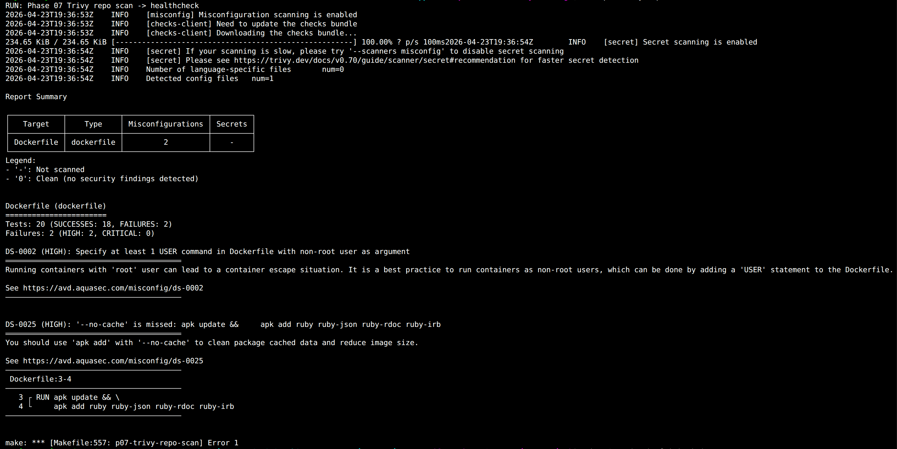
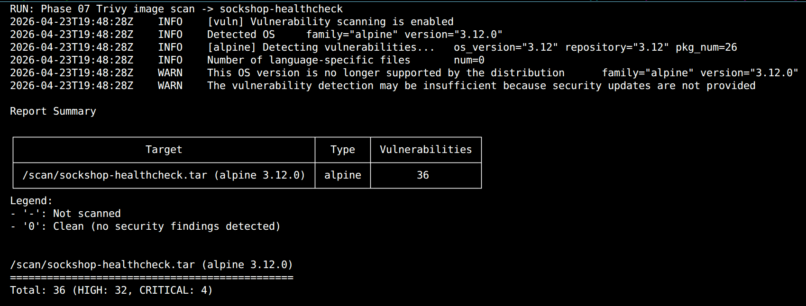
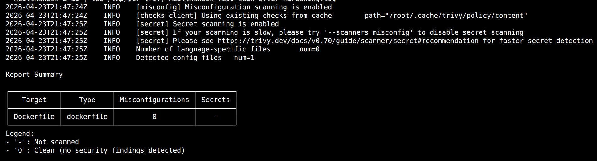
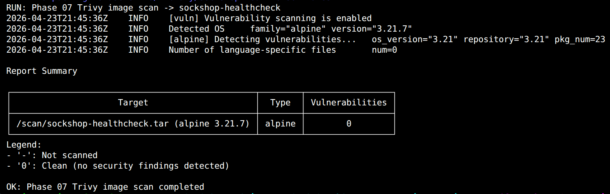
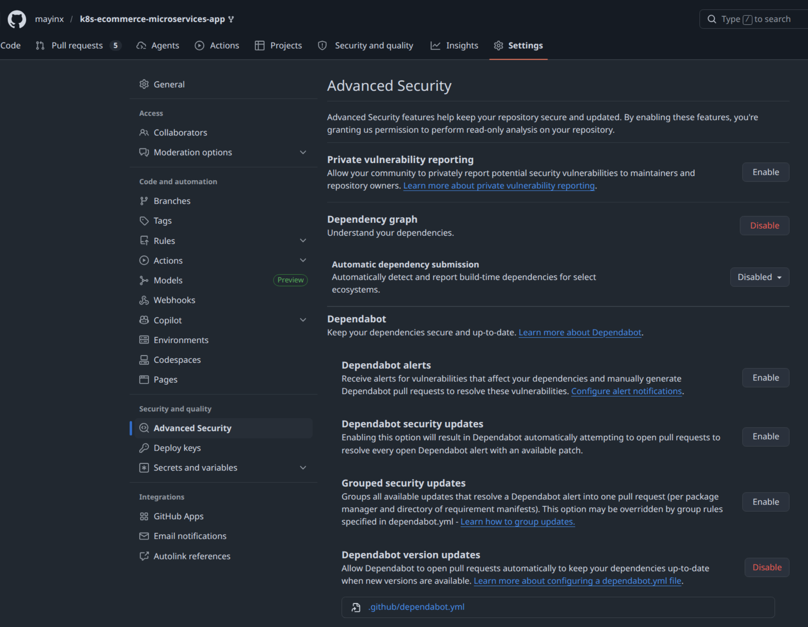
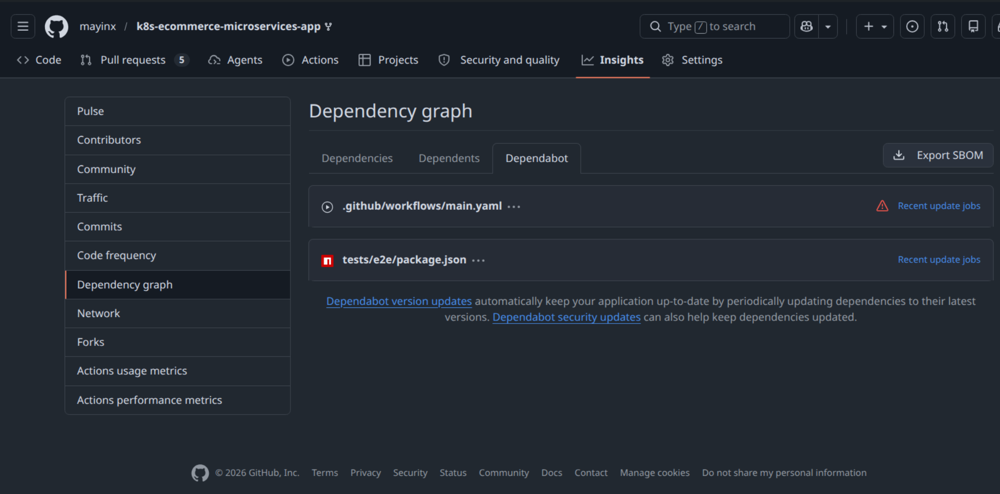
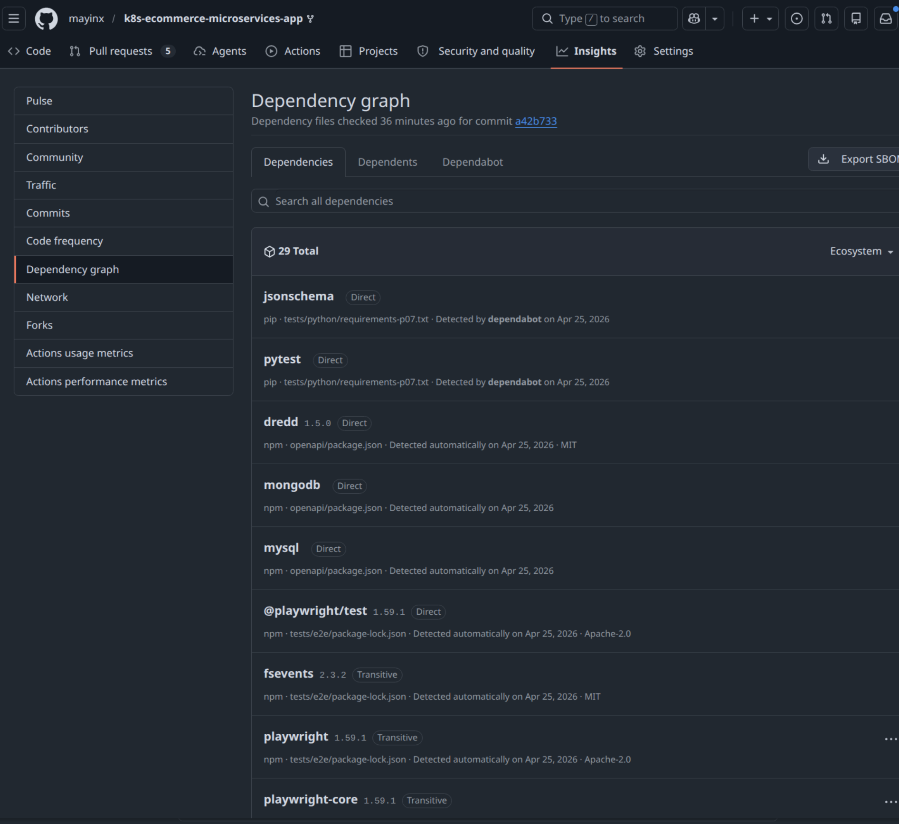
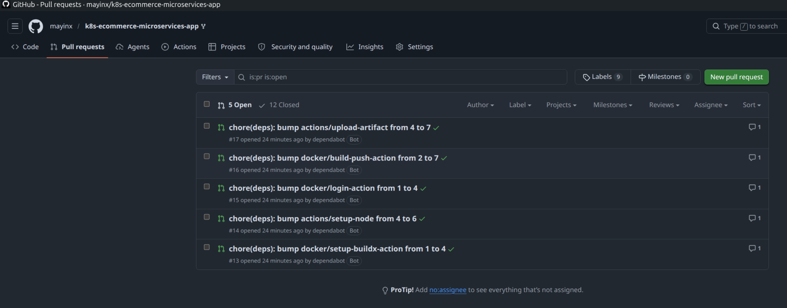
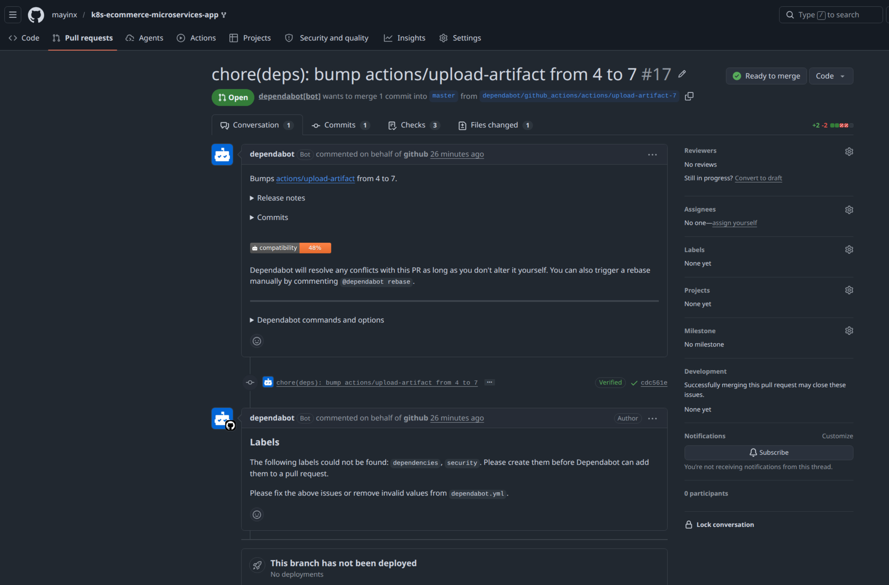

# Implementation — Subphase 03: Trivy security baseline, Healthcheck-image remediation, and CI gate preparation (Steps 8–10)

## Step 8 — Establish a Trivy security-scanning baseline for repo-owned surfaces

### Rationale

Phase 07 already covers four important validation layers:

- **Service health / reachability** through the Ruby healthcheck
- **Observability-helper behavior** through the Bash observability-helper tests
- **API response-shape compatibility** through the Python API contract guard
- **Storefront rendering in a real browser** through the Playwright browser smoke test

What is still missing is a first **security-scanning baseline**.

The next useful addition is therefore a **Trivy-based local security baseline** focused on **repo-owned surfaces** rather than the full inherited upstream application stack.

This choice is deliberate:

- **Trivy** already covers several relevant security categories in one tool:
  - **secret scanning**
  - **misconfiguration scanning**
  - **container image vulnerability scanning**
- The first scope stays **repo-owned** to avoid getting buried immediately in inherited legacy findings from the full (outdated) upstream microservice stack

**Scope**

The scope of this step remains intentionally narrow and practical:

- **filesystem scan** of repo-owned paths for:
  - **misconfigurations**
  - **secrets**
- **image scan** of the repo-owned local `healthcheck` image for:
  - **OS/package vulnerabilities**
- **Makefile helper targets** for short, repeatable execution
- **No immediate full-stack image sweep** across inherited legacy services 

> [!NOTE] **🛡️ Trivy**
>
> **Trivy** is a security scanner that can analyze several different surfaces with one tool. In this phase it is used for three concrete security tasks:
>
> - **filesystem misconfiguration scanning** for owned config/code paths
> - **filesystem secret scanning** for accidentally committed credentials or tokens
> - **container image vulnerability scanning** for the repo-owned `healthcheck` image
>
> This makes Trivy a strong fit for the first security baseline here: one scanner covers the most relevant repo-owned security surfaces without introducing a separate tool for each category.

> [!NOTE] **🧭 Why the first Trivy scope stays repo-owned**
>
> This first security baseline focuses on repo-owned helper/config surfaces and the repo-owned `healthcheck` image.
>
> That keeps the findings explainable and avoids getting buried immediately in inherited legacy findings from the full upstream microservice stack. Broader scanning can still be added later from a working baseline.

### Action

The goal of this step is to establish a first **repo-owned Trivy security baseline** that is runnable locally and reusable in CI later: 
- (1) Defining the scan scope  
- (2) Defining the Makefile helper targets to wrap the complex Trivy commands 
- (3) Running the initial local Trivy filesystem security scan 

#### Defining the first Trivy scan scope

The first security baseline is split into **two complementary scan paths**:

- **(1) Filesystem scan** of repo-owned paths for:
  - **misconfigurations**
  - **secrets**
- **(2) Image scan** of the repo-owned local `healthcheck` image for:
  - **OS/package vulnerabilities**

This split is intentional:

- The **filesystem scan** focuses on owned source/config surfaces such as:
  - `healthcheck/`
  - `scripts/`
  - `deploy/kubernetes/`
  - `.github/`
  - `tests/`
- The **image scan** focuses on the repo-owned Docker build surface:
  - `healthcheck/Dockerfile`
  - local image tag: `sockshop-healthcheck`

This gives Phase 07 a first security baseline across both:

- **repo/config level**
- **built image level**

#### Current `healthcheck` Dockerfile 

The initial Trivy findings in this step are based on the current repo-owned `healthcheck` Dockerfile in the following state:

~~~Dockerfile
FROM alpine:3.12.0

RUN apk update && \
    apk add ruby ruby-json ruby-rdoc ruby-irb

COPY healthcheck.rb healthcheck.rb
ENTRYPOINT ["ruby", "healthcheck.rb"]
~~~

This Dockerfile is intentionally left unchanged in Step 8. The purpose of this step is first to establish the baseline and surface the findings cleanly. The remediation work follows in the next step.

#### Using containerized Trivy with a persistent cache volume

To avoid introducing another workstation-local installation dependency, Trivy is executed through its official container image.

A persistent Docker volume is mounted for the Trivy cache:

- This avoids re-downloading the Trivy databases on every run
- It keeps repeated local scans much faster
- It still keeps the execution model close to later CI usage

> [!NOTE] **🧩 First-run Trivy database download**
>
> The first Trivy run may take noticeably longer than later runs because Trivy needs to download its security databases first.
>
> This is normal. The dedicated cache volume keeps that cost from repeating on every subsequent local run.

#### How Trivy commands work

The Make targets introduced in this step wrap two Trivy command variations:

- A **filesystem scan** with `trivy fs`
- An **image scan** with `trivy image`

A representative raw filesystem command looks like this:

~~~bash
# Run Trivy in a temporary container and remove that container afterward.
docker run --rm \
  # Mount the current repository into the container at /repo (read-only).
  -v "$PWD":/repo:ro \
  # Mount the persistent Trivy cache volume so DB/check downloads are reused.
  -v trivy-cache:/root/.cache/ \
  # Use /repo as the working directory inside the container.
  -w /repo \
  # Use the official Trivy image and run a filesystem scan.
  aquasec/trivy:latest fs \
  # Scan for misconfigurations and leaked secrets.
  --scanners misconfig,secret \
  # Show only HIGH and CRITICAL findings.
  --severity HIGH,CRITICAL \
  # Return exit code 1 if matching findings are detected.
  --exit-code 1 \
  # Skip generated / irrelevant directories that should not influence this scan.
  --skip-dirs tests/e2e/node_modules \
  --skip-dirs tests/venv \
  --skip-dirs .git \
  # Scan only the repo-owned healthcheck path.
  healthcheck
~~~

Notes:

- `docker run --rm`
  - run Trivy in a temporary container and remove that container afterward
- `-v "$PWD":/repo:ro`
  - mount the current repository into the container at `/repo`
  - `:ro` means **read-only**
- `-v trivy-cache:/root/.cache/`
  - mount the persistent Trivy cache volume so databases do not need to be downloaded on every run
- `-w /repo`
  - set `/repo` as the working directory inside the container
- `fs`
  - run a **filesystem scan**
- `--scanners misconfig,secret`
  - scan for **misconfigurations** and **secrets**
- `--severity HIGH,CRITICAL`
  - only show findings with **HIGH** or **CRITICAL** severity
- `--exit-code 1`
  - return a failing exit code when such findings are detected
- `healthcheck`
  - scan only the repo path `healthcheck/`

The image scan follows the same overall pattern, but uses `trivy image` and reads an exported image tar via `--input`:

~~~bash
# Run Trivy in a temporary container and remove that container afterward.
docker run --rm \
  # Mount the directory that contains the exported image tar (read-only).
  -v /tmp/p07-trivy:/scan:ro \
  # Mount the persistent Trivy cache volume so vulnerability DB downloads are reused.
  -v trivy-cache:/root/.cache/ \
  # Use the official Trivy image and run an image scan.
  aquasec/trivy:latest image \
  # Restrict this scan to image vulnerabilities only.
  --scanners vuln \
  # Show only HIGH and CRITICAL findings.
  --severity HIGH,CRITICAL \
  # Read the local exported image tar instead of talking to the Docker socket.
  --input /scan/sockshop-healthcheck.tar  
~~~

Key differences here:

- `image`
  - run an **image vulnerability scan**
- `--scanners vuln`
  - only scan for **vulnerabilities**
- `--input /scan/sockshop-healthcheck.tar`
  - scan the exported local image tar instead of talking to the Docker socket directly

#### Extending the Makefile with Trivy variables and helper targets

To keep the security command flow short, repeatable and easy to use both locally and later in the CI, the root `Makefile` is extended with a small Trivy section. 

##### Phase-07 Make variables

~~~make
P07_TRIVY_IMAGE ?= aquasec/trivy:latest
P07_TRIVY_SEVERITY ?= HIGH,CRITICAL
P07_TRIVY_CACHE_VOLUME := trivy-cache
P07_TRIVY_TMP_DIR := /tmp/p07-trivy
P07_HEALTHCHECK_IMAGE := sockshop-healthcheck
P07_HEALTHCHECK_IMAGE_TAR := $(P07_TRIVY_TMP_DIR)/sockshop-healthcheck.tar
~~~

##### Trivy Make targets

The complex Trivy commands can be wrapped in Make targets that can be used both locally and later in CI:

~~~make
# Trivy security baseline

# Run the broad repo-owned Trivy filesystem baseline.
# (targets healthcheck/, scripts/, deploy/kubernetes/, .github/, tests/)
#
# - Iterate over the selected repo-owned paths one by one (`trivy fs` accepts only one path per run)
# - Scan each path for misconfigurations and leaked secrets
# - Fail fast on HIGH / CRITICAL findings via `--exit-code 1`
# - Reuse the persistent Trivy cache volume to avoid repeated DB/check downloads
p07-trivy-repo-scan:
	@# Run the broad Trivy filesystem baseline across repo-owned paths for misconfigurations and secrets.
	@set -e; \
	for target in healthcheck scripts deploy/kubernetes .github tests; do \
		echo "RUN: Phase 07 Trivy repo scan -> $$target" >&2; \
		docker run --rm \
			-v "$(CURDIR)":/repo:ro \
			-v "$(P07_TRIVY_CACHE_VOLUME)":/root/.cache/ \
			-w /repo \
			$(P07_TRIVY_IMAGE) fs \
			--scanners misconfig,secret \
			--severity $(P07_TRIVY_SEVERITY) \
			--exit-code 1 \
			--skip-dirs tests/e2e/node_modules \
			--skip-dirs tests/venv \
			--skip-dirs .git \
			"$$target"; \
	done
	@echo "OK: Phase 07 Trivy repo scan passed" >&2

# Run a focused repo-level Trivy scan for the owned 'healthcheck/' path only.
# 
# - Scan only `healthcheck/` 
# - Use the same misconfig + secret scan mode as the broad repo scan
# - Keep `--exit-code 1` so the target fails if the path still contains HIGH / CRITICAL findings
p07-trivy-healthcheck-repo-scan:
	@# Run a focused Trivy filesystem scan on the repo-owned healthcheck path only.
	@echo "RUN: Phase 07 Trivy repo scan -> healthcheck" >&2
	@docker run --rm \
		-v "$(CURDIR)":/repo:ro \
		-v "$(P07_TRIVY_CACHE_VOLUME)":/root/.cache/ \
		-w /repo \
		$(P07_TRIVY_IMAGE) fs \
		--scanners misconfig,secret \
		--severity $(P07_TRIVY_SEVERITY) \
		--exit-code 1 \
		--skip-dirs tests/e2e/node_modules \
		--skip-dirs tests/venv \
		--skip-dirs .git \
		healthcheck
	@echo "OK: Phase 07 Trivy healthcheck repo scan passed" >&2

# Build and scan the repo-owned 'healthcheck' container image.
# 
# - Rebuild the local `sockshop-healthcheck` image from `./healthcheck`
# - Export that image to a tar file
# - Scan that tar with Trivy in vulnerability-only mode
# - Avoid Docker-socket coupling by using `--input` on the exported tar
p07-trivy-healthcheck-image-scan:
	@# Build the repo-owned healthcheck image and scan it as an initial vulnerability baseline.
	@echo "RUN: Build repo-owned healthcheck image -> $(P07_HEALTHCHECK_IMAGE)" >&2
	@docker build -t $(P07_HEALTHCHECK_IMAGE) ./healthcheck >/dev/null
	@mkdir -p $(P07_TRIVY_TMP_DIR)
	@docker save -o $(P07_HEALTHCHECK_IMAGE_TAR) $(P07_HEALTHCHECK_IMAGE)
	@echo "RUN: Phase 07 Trivy image scan -> $(P07_HEALTHCHECK_IMAGE)" >&2
	@docker run --rm \
		-v "$(P07_TRIVY_TMP_DIR)":/scan:ro \
		-v "$(P07_TRIVY_CACHE_VOLUME)":/root/.cache/ \
		$(P07_TRIVY_IMAGE) image \
		--scanners vuln \
		--severity $(P07_TRIVY_SEVERITY) \
		--input /scan/sockshop-healthcheck.tar
	@rm -f $(P07_HEALTHCHECK_IMAGE_TAR)
	@echo "OK: Phase 07 Trivy image scan completed" >&2

# Run the full Step-08 Trivy baseline.
# 
# - Execute the broad repo-owned filesystem baseline first
# - Then execute the healthcheck image vulnerability baseline
p07-trivy-scans:
	@# Run the full local Phase 07 Trivy security baseline.
	@$(MAKE_CMD) --no-print-directory p07-trivy-repo-scan
	@$(MAKE_CMD) --no-print-directory p07-trivy-healthcheck-image-scan
~~~

Notes:

- The **filesystem scan** uses `--scanners misconfig,secret`
  - this keeps the first repo scan focused and explainable
  - it avoids pulling in broad dependency-vulnerability noise from the full inherited application tree
- The **filesystem scan** uses `--exit-code 1`
  - this already makes it suitable as a real gate for severe repo-level findings
- The **image scan** is restricted to `--scanners vuln`
  - this keeps the image scan aligned with its intended purpose as a vulnerability baseline
  - it avoids unnecessary secret-scanning noise in the exported image tar
- The **cache volume** is mounted in both Trivy targets
  - this prevents repeated database downloads from slowing down every local run
- Note: After the first repo-scan attempt, the `p07-trivy-repo-scan` target had to be corrected because `trivy fs` accepts exactly one target path per invocation. 
  - The scan failed because `trivy fs` was invoked with multiple target paths at once (`multiple targets cannot be specified`). This was a tooling/integration issue in the new Make target   

#### Running the Trivy filesystem security 

Once the repo-scan Make targets are in place, the broad filesystem scan against the selected repo-owned surfaces can be executed from repo root:

~~~bash
# Run the repo-owned filesystem scan for misconfigurations and secrets.
$ make p07-trivy-repo-scan
RUN: Phase 07 Trivy repo scan -> healthcheck
...
Report Summary

┌────────────┬────────────┬───────────────────┬─────────┐
│   Target   │    Type    │ Misconfigurations │ Secrets │
├────────────┼────────────┼───────────────────┼─────────┤
│ Dockerfile │ dockerfile │         2         │    -    │
└────────────┴────────────┴───────────────────┴─────────┘

Dockerfile (dockerfile)
=======================
Tests: 20 (SUCCESSES: 18, FAILURES: 2)
Failures: 2 (HIGH: 2, CRITICAL: 0)

DS-0002 (HIGH): Specify at least 1 USER command in Dockerfile with non-root user as argument
DS-0025 (HIGH): '--no-cache' is missed: apk update && apk add ruby ruby-json ruby-rdoc ruby-irb
...
make: *** [Makefile:557: p07-trivy-repo-scan] Error 1
~~~

**Actionable Scan Result**

The misconfiguration findings are:

- **DS-0002**: missing non-root `USER`
  - the container currently runs with root privileges instead of using a dedicated unprivileged runtime user to reduce potential damage 
  - If something goes wrong inside the container and the associated process is run by a non-root user insetad, the process has fewer privileges and can cause less harm     
- **DS-0025**: missing `--no-cache` in the Alpine package-install step
  - The `Dockerfile` installs packages without utilizing the `--no-cache` fag - which results in a suboptimal package install that leaves avoidable package-cache data in the image layer
  
These findings are related to the `healthcheck` container path and provide a clear remediation path for the next step. The next scan now checks the corresponding `sockshop-healthcheck` image for package and base-image vulnerabilities.

**Trivy repo scan baseline findings in `healthcheck/Dockerfile`**

*Figure 4: Initial Trivy filesystem scan result for the repo-owned `healthcheck/` path. The visible Dockerfile report surfaces two HIGH-severity misconfiguration findings in the baseline state: **DS-0002** (missing non-root `USER`) and **DS-0025** (missing `--no-cache` in the Alpine package-install step).*

#### Running the Trivy image vulnerability baseline for the repo-owned healthcheck image

The second scan path builds the repo-owned `healthcheck` image locally and scans it as an image artifact:

~~~bash
# Run the repo-owned healthcheck image scan.
$ make p07-trivy-healthcheck-image-scan
RUN: Build repo-owned healthcheck image -> sockshop-healthcheck
RUN: Phase 07 Trivy image scan -> sockshop-healthcheck
...
Detected OS     family="alpine" version="3.12.0"
...
WARN    This OS version is no longer supported by the distribution      family="alpine" version="3.12.0"
WARN    The vulnerability detection may be insufficient because security updates are not provided

Report Summary

┌────────────────────────────────────────────────┬────────┬─────────────────┐
│                     Target                     │  Type  │ Vulnerabilities │
├────────────────────────────────────────────────┼────────┼─────────────────┤
│ /scan/sockshop-healthcheck.tar (alpine 3.12.0) │ alpine │       36        │
└────────────────────────────────────────────────┴────────┴─────────────────┘

/scan/sockshop-healthcheck.tar (alpine 3.12.0)
==============================================
Total: 36 (HIGH: 32, CRITICAL: 4)
...
OK: Phase 07 Trivy image scan completed
~~~

Exporting the image to a tar file keeps the scan simpler: 
- Trivy can scan the image from a normal mounted file, without needing direct access to the host Docker daemon via /var/run/docker.sock, which often causes permission, environment, and CI-runner issues. 

**Trivy healthcheck image vulnerability baseline**

*Figure 5: Initial Trivy vulnerability scan of the repo-owned Ruby healthcheck image. The scan completed successfully and established the first image-security baseline, showing an outdated Alpine 3.12 base image, an unsupported OS warning, and 36 HIGH/CRITICAL vulnerabilities in the current image build.*

**This image scan result shows:**

- The current image is built on **`alpine:3.12.0`**
- This OS version is no longer supported
- The outdated base image is tehrefore the main culprit 

#### Handling false positives, if they appear

The first repo-owned filesystem scan may still report findings that are technically matched by the scanner but are not real secrets or actionable security issues in this project context.

Typical examples could include:

- intentionally fake example credentials in manifests
- dummy test values
- known non-sensitive placeholders

If such a case appears, the response should remain strict and explicit:

- confirm first that the finding is truly non-sensitive
- only then add a focused ignore entry to a committed **`.trivyignore`** file
- keep the actual scan scope and severity policy unchanged unless there is a strong reason to narrow them

This keeps the first security baseline credible without overreacting to obvious dummy values.

#### Running the full local Trivy security baseline

Once both scan paths are working, the full Step-8 security baseline becomes:

~~~bash
# Run the full local Trivy baseline.
$ make p07-trivy-scans
~~~

This aggregate target executes:

- the repo-owned filesystem scan
- the repo-owned healthcheck image scan

#### Local dev + security cycle

The local Phase-07 security loop now becomes:

~~~bash
# Run the broad repo/config security baseline.
$ make p07-trivy-repo-scan

# Run the focused healthcheck-only repo scan.
$ make p07-trivy-healthcheck-repo-scan

# Run the repo-owned image vulnerability baseline.
$ make p07-trivy-healthcheck-image-scan

# Run the full local Trivy baseline.
$ make p07-trivy-scans
~~~

At the same time, the existing deterministic and live validation flows remain unchanged:

~~~bash
# Deterministic local validation layers
$ make p07-tests

# Live smoke validation layers
$ make p07-tests-live
~~~

This keeps the new security layer explicit and separately runnable while the Phase 07 validation surfaces continue to grow in a controlled way.

#### CI readiness of the Trivy Make targets

The Trivy Make targets are already shaped so they can later be reused in CI:

- **Containerized execution:** no separate host-side Trivy installation is required
- **Controlled status output:** short `RUN` / `OK` messages stay visible while recursive Make noise stays suppressed
- **Proper failure behavior:** the repo scan already propagates non-zero exit codes for severe findings
- **Reusable target split:** repo scan and image scan are separately addressable and can later be placed into different CI jobs if needed
- **Persistent cache model:** the cache-volume pattern already anticipates the need to avoid repeated database downloads

At the same time, the Trivy targets are intentionally **not** folded into the deterministic `p07-tests` loop in this step:

- Trivy databases and vulnerability intelligence change over time
- scan findings are therefore not as time-stable as the deterministic code-side tests
- the first local security baseline should remain explicit until the CI fail policy is finalized

### Result

Step 8 successfully established the first **Trivy security-scanning baseline** for repo-owned source/config surfaces and a repo-owned image artifact.

The successful end state is shown by these signals / verification points:

- The root `Makefile` now exposes dedicated helper targets for:
  - **broad repo-owned filesystem baseline scan**
  - **focused `healthcheck/` filesystem scan**
  - **repo-owned healthcheck image scan**
  - **full Trivy baseline**
- The Trivy execution model is now **containerized and cache-backed**
  - no permanent host-side Trivy install is required
  - repeated runs reuse the Docker-based Trivy cache volume
- The initial repo-scan implementation surfaced a **target-shape bug** in the first Make target
  - this was corrected by scanning owned paths one after another instead of passing multiple paths to one `trivy fs` invocation
- The corrected **broad repo scan** surfaced **repo-owned misconfiguration findings in `healthcheck/Dockerfile`**:
  - **DS-0002**: missing non-root `USER`
  - **DS-0025**: missing `--no-cache` in the Alpine package-install step
- The **healthcheck-specific image scan** established a first **repo-owned image vulnerability baseline**:
  - detected OS: **Alpine 3.12.0**
  - unsupported OS warning present
  - **36 vulnerabilities** total:
    - **32 HIGH**
    - **4 CRITICAL**

At this point, the **Phase 07 Test & Security layer** validates: 
- **(1) Service health/reachability** (Ruby) 
- **(2) Helper-script behavior (Traffic Generator)** (Bash) 
- **(3) API Response-shape compatibility** (Python) 
- **(4) Storefront rendering in a real browser** (Playwright / JavaScript)
- **(5) Security-scanning for repo-owned surfaces** (Trivy)

The next step is now clear: **remediate the owned Dockerfile findings and rerun Trivy against the improved image.**

---

## Step 9 — Harden the repo-owned `healthcheck` Dockerfile and rerun Trivy

### Rationale

Step 8 established the first repo-owned Trivy baseline and surfaced two clear classes of findings in the `healthcheck` container path:

- **Repo-level Dockerfile misconfigurations**
  - **DS-0002**: missing non-root `USER`
  - **DS-0025**: missing `--no-cache` in the Alpine package-install step
- **Image-level vulnerability baseline**
  - outdated and unsupported **`alpine:3.12.0`** base image
  - **36 HIGH / CRITICAL vulnerabilities** in the initial image scan

So the next useful move is no longer to add new security tooling, but to improve the repo-owned image itself and then rerun the already established Trivy scan paths.

This is exactly the kind of remediation cycle Phase 07 should now demonstrate:

- establish a security baseline
- identify owned findings
- improve the owned artifact
- rerun the scans to verify the effect

The Step-8 image-scan baseline serves as the before-state for this remediation step: 
- The repo-owned `healthcheck` image was still based on Alpine 3.12.0 and showed 36 HIGH / CRITICAL vulnerabilities.

### Action

The goals of this step are: 
- (1) Haredining of the `healthcheck` image 
- (2) Preserving of the healthcheck’s operational behavior  
- (3) Rerun of the Trivy scans against the improved Dockerfile and rebuilt image.

#### Current Dockerfile before remediation

The Dockerfile inherited from Step 8 is:

~~~Dockerfile
FROM alpine:3.12.0

RUN apk update && \
    apk add ruby ruby-json ruby-rdoc ruby-irb

COPY healthcheck.rb healthcheck.rb
ENTRYPOINT ["ruby", "healthcheck.rb"]
~~~

This current shape directly explains the initial Trivy findings:

- no non-root runtime user
- no `--no-cache`
- outdated Alpine base
- unnecessary extra runtime packages for this small helper image

#### Remediation goals for the owned image

The Dockerfile hardening in this step should address the owned findings as directly as possible:

- Move away from the unsupported **`alpine:3.12.0`** base
- Remove the separate `apk update`
- Install only the runtime package actually needed
- Add a dedicated non-root runtime user
- Run the healthcheck as that non-root user

The change should remain intentionally small and easy to defend.

#### Replacing the Dockerfile with a hardened runtime shape

Replace `healthcheck/Dockerfile` with:

~~~Dockerfile
# Use a newer supported Alpine base image instead 
# (replacing alpine:3.12 from the initial baseline)
FROM alpine:3.21

# Install only the Ruby runtime actually needed by healthcheck.rb.
# `apk add --no-cache` fetches the package index for this step and
# does not keep the APK cache afterwards in the final image layer.
RUN apk add --no-cache ruby

# Create a dedicated unprivileged runtime identity ('app') for the container process.
# - addgroup -S app      = create a system group named `app`
# - adduser  -S -G app app = create a system user named `app` in group `app`
RUN addgroup -S app && adduser -S -G app app

# Use a dedicated working directory instead of placing files directly in / 
WORKDIR /app

# Copy the script into the image and assign ownership directly to the new 'app' user.
COPY --chown=app:app healthcheck.rb /app/healthcheck.rb

# Run the container as the unprivileged `app` user instead of root.    
# This is safer: If something goes wrong inside the container, 
# the process has fewer privileges and can do less harm
USER app

# Run the healthcheck script directly via the Ruby interpreter.
ENTRYPOINT ["ruby", "/app/healthcheck.rb"]
~~~ 

This hardening directly addresses the findings already surfaced by Trivy:

- **DS-0002**: non-root `USER`
- **DS-0025**: `apk add --no-cache`
- Vulnerability reduction through a newer supported Alpine base and a smaller runtime package set

> [!NOTE] **🧭 Why the runtime package list is reduced**
>
> The healthcheck container only needs to execute `healthcheck.rb`.
>
> - `json` is part of normal Ruby standard-library usage here, so ruby is enough for this helper
> - `rdoc` is documentation tooling, not runtime
> - `irb` is an interactive shell, also not needed for running `healthcheck.rb`
>
> Packages such as `ruby-rdoc` or `ruby-irb` are useful for interactive development, but they are not required in this runtime image. Removing unnecessary packages keeps the image smaller and reduces the vulnerability surface.

#### Rebuilding and runtime smoke-checking the hardened image

Before rerunning Trivy, rebuild the repo-owned image and perform a small runtime smoke check:

~~~bash
# Rebuild the hardened repo-owned healthcheck image.
$ docker build -t sockshop-healthcheck ./healthcheck
[+] Building 4.1s (11/11) FINISHED
 => [internal] load metadata for docker.io/library/alpine:3.21
 => [2/5] RUN apk add --no-cache ruby
 => [3/5] RUN addgroup -S app && adduser -S -G app app
 => => naming to docker.io/library/sockshop-healthcheck:latest
 => => unpacking to docker.io/library/sockshop-healthcheck:latest                

# Confirm that the container still starts and preserves the expected CLI behavior.
$ docker run --rm sockshop-healthcheck
no services specified
~~~

This keeps the remediation honest: the image should become safer without breaking its basic operational contract.

#### Re-running healthcheck Ruby tests

Before rerunning Trivy, the Ruby healthcheck tests should be rerun to confirm that the image hardening did not break the helper’s expected behavior.

~~~bash
# Re-run the local Ruby helper tests.
$ make p07-healthcheck-tests
OK: Ruby syntax valid -> healthcheck/healthcheck.rb
ruby tests/ruby/test_healthcheck_cli.rb
Running:
..
Finished in 0.191294s, 10.4551 runs/s, 26.1378 assertions/s.
2 runs, 5 assertions, 0 failures, 0 errors, 0 skips
Running:
..
Finished in 0.008255s, 847.9417 runs/s, 1574.7488 assertions/s.
7 runs, 13 assertions, 0 failures, 0 errors, 0 skips

# Optional milestone proof against the remote target environment.
$ make p07-healthcheck-target-env
...
pod/tmp-ruby-healthcheck created
pod/tmp-ruby-healthcheck condition met
Syntax OK
Sleeping for 5s...
{
  "catalogue": "OK",
  "catalogue-db": "OK",
  "user": "OK",
  "user-db": "OK",
  "carts": "OK",
  "carts-db": "OK"
}
~~~

The successful tests prove, that the container became safer without breaking the Ruby helper’s expected local or target-side behavior.

#### Re-running the focused Trivy repo scan after Dockerfile hardening

A focused repo scan using the `healthcheck/`-secpific Make target shows if the Dockerfile hardening really solved all previously found misconfiguration issues: 

~~~bash
# Re-check only the remediated healthcheck path for misconfigurations and secrets.
$ make p07-trivy-healthcheck-repo-scan
RUN: Phase 07 Trivy repo scan -> healthcheck
2026-04-23T21:47:24Z    INFO    [misconfig] Misconfiguration scanning is enabled
2026-04-23T21:47:24Z    INFO    [checks-client] Using existing checks from cache        path="/root/.cache/trivy/policy/content"
2026-04-23T21:47:25Z    INFO    [secret] Secret scanning is enabled
2026-04-23T21:47:25Z    INFO    Number of language-specific files       num=0
2026-04-23T21:47:25Z    INFO    Detected config files   num=1

Report Summary

┌────────────┬────────────┬───────────────────┬─────────┐
│   Target   │    Type    │ Misconfigurations │ Secrets │
├────────────┼────────────┼───────────────────┼─────────┤
│ Dockerfile │ dockerfile │         0         │    -    │
└────────────┴────────────┴───────────────────┴─────────┘
Legend:
- '-': Not scanned
- '0': Clean (no security findings detected)

OK: Phase 07 Trivy healthcheck repo scan passed
~~~

This focused rerun proves that the earlier repo-level Dockerfile misconfiguration findings from Step 8 are now gone:

- **DS-0002** (missing non-root `USER`) is resolved
- **DS-0025** (missing `--no-cache`) is resolved

**Trivy healthcheck repo scan after Dockerfile hardening**

*Figure 6: Focused Trivy filesystem scan of the remediated `healthcheck/` path after Dockerfile hardening. The earlier repo-level Dockerfile misconfiguration findings are gone; the scan now reports 0 misconfigurations and no detected secrets for the repo-owned `healthcheck/` path.*

#### Re-running the Trivy image vulnerability scan after Dockerfile hardening

Next, we rebuild the hardened Healthcheck image and rerun the image scan:

~~~bash
# Rebuild and re-scan the hardened repo-owned image.
$ make p07-trivy-healthcheck-image-scan
RUN: Build repo-owned healthcheck image -> sockshop-healthcheck
[+] Building 0.7s (11/11) FINISHED
 => [internal] load metadata for docker.io/library/alpine:3.21
 => CACHED [2/5] RUN apk add --no-cache ruby
 => CACHED [3/5] RUN addgroup -S app && adduser -S -G app app
 => CACHED [4/5] WORKDIR /app
 => CACHED [5/5] COPY --chown=app:app healthcheck.rb /app/healthcheck.rb
 => => naming to docker.io/library/sockshop-healthcheck:latest
 => => unpacking to docker.io/library/sockshop-healthcheck:latest
RUN: Phase 07 Trivy image scan -> sockshop-healthcheck
2026-04-23T21:45:36Z    INFO    [vuln] Vulnerability scanning is enabled
2026-04-23T21:45:36Z    INFO    Detected OS     family="alpine" version="3.21.7"
2026-04-23T21:45:36Z    INFO    [alpine] Detecting vulnerabilities...   os_version="3.21" repository="3.21" pkg_num=23
2026-04-23T21:45:36Z    INFO    Number of language-specific files       num=0

Report Summary

┌────────────────────────────────────────────────┬────────┬─────────────────┐
│                     Target                     │  Type  │ Vulnerabilities │
├────────────────────────────────────────────────┼────────┼─────────────────┤
│ /scan/sockshop-healthcheck.tar (alpine 3.21.7) │ alpine │        0        │
└────────────────────────────────────────────────┴────────┴─────────────────┘
Legend:
- '-': Not scanned
- '0': Clean (no security findings detected)

OK: Phase 07 Trivy image scan completed
~~~

This rerun shows a clear improvement in the owned image posture:

- the image now uses **Alpine 3.21.7**
- the earlier unsupported-OS warning is gone
- the image scan now reports **0 vulnerabilities**

**Trivy healthcheck image scan after Dockerfile hardening**

*Figure 7: Trivy vulnerability scan of the rebuilt repo-owned Ruby healthcheck image after Dockerfile hardening. The image now uses Alpine 3.21.7, no longer shows the earlier unsupported-OS warning, and returns a clean result with 0 detected vulnerabilities.*

#### Re-running the helper tests after the Dockerfile change

Because the image packaging changed, rerun the relevant owned-helper tests as well:

~~~bash
# Re-run the local Ruby helper tests.
$ make p07-healthcheck-tests

# Optional milestone proof against the remote target environment.
$ make p07-healthcheck-target-env
~~~

This ensures the container hardening does not accidentally break the helper’s expected behavior.

#### Additional Trivy findings outside the scope of this step  

Once the repo-owned `healthcheck/` path was successfully cleaned, a rerun of the broader `make p07-trivy-repo-scan` baseline no longer stopped at the Dockerfile findings from Step 8. 

The scan instead produced numerous **additional older repo-owned issues** - and surfaced a **separate legacy hardening backlog**, mainly in:

  - Kubernetes manifests (monitoring + Sock Shop manifests), for example:
    - Missing or default `securityContext`
    - Missing `readOnlyRootFilesystem`
    - Host-level settings such as `hostNetwork`, `hostPID`, `hostPort`, and `hostPath` mounts
  - Terraform / AWS infrastructure code, for example:
    - Missing `IMDSv2` enforcement 
    - Unrestricted ingress/egress rules 
    - Public load-balancer exposure 
    - Unencrypted root volumes

Those broader findings need to be addresed, but they are **not part of the acceptance scope of this Step-9 `healthcheck` Dockerfile remediation**.

### Result

Step 9 successfully completed the first **evidence-based security remediation cycle** on a repo-owned Docker image.

- `healthcheck/Dockerfile` was hardened to:
  - Use a newer supported Alpine base
  - Install runtime packages with `--no-cache`
  - Run as a dedicated non-root user
- The rebuilt `sockshop-healthcheck` image still preserves the expected basic CLI behavior
- The owned Ruby healthcheck checks still pass after the Dockerfile hardening
- The focused repo-level Trivy rerun now proves that the remediated `healthcheck/` path is clean:
  - **0 misconfigurations**
  - **no detected secrets**
- The rebuilt repo-owned image now scans cleanly through `make p07-trivy-healthcheck-image-scan`
- The image vulnerability baseline improved from:
  - **Alpine 3.12.0** with **36 HIGH / CRITICAL vulnerabilities**
  - To **Alpine 3.21.7** with **0 vulnerabilities**
- The **broader `make p07-trivy-repo-scan` baseline** surfaced **additional findings outside `healthcheck/` in older repo-owned surfaces** (Kubernetes + Terraform). 
  - While this does not change the successful completion of this focused Dockerfile remediation task, these additional findings act as a **legacy repo-hardening backlog** that stays open to be addressed in later phases. 
  - Those findings are outside the scope of this focused Dockerfile remediation step. Step 9 therefore closes the repo-owned `healthcheck` image remediation path completely, while leaving the broader repo-hardening backlog for later folloe-up

At this point, the **Phase 07 Test & Security layer** validates: 
- **(1) Service health/reachability** (Ruby) 
- **(2) Helper-script behavior (Traffic Generator)** (Bash) 
- **(3) API Response-shape compatibility** (Python) 
- **(4) Storefront rendering in a real browser** (Playwright / JavaScript)
- **(5) Security-scanning for repo-owned surfaces** (Trivy)
- **(6) Evidence-based security remediation on a repo-owned Docker image path** (Trivy + hardened `healthcheck` image)

---

## Step 10 — Establish an automated dependency-scanning baseline with Dependabot for repo-owned dependencies

### Rationale

Phase 07 already covers:

- **Service health / reachability** through the Ruby healthcheck
- **Observability-helper behavior** through the Bash observability-helper tests
- **API response-shape compatibility** through the Python API contract guard
- **Storefront rendering in a real browser** through the Playwright browser smoke test
- **Security-scanning for repo-owned surfaces** through Trivy

What is still missing is an explicit and automated **code dependency-scanning measure** to close the remaining DevSecOps requirement cleanly and with minimal friction.

The next useful addition is therefore a **GitHub-native Dependabot baseline** focused only on dependency surfaces that are clearly owned and maintained in this repository.

**Scope**

The scope of this step stays intentionally narrow and actionable:

- **GitHub Actions Workflow dependencies** under `/.github/workflows`
- **Playwright-related npm dependencies Node.js / npm dependencies** under `tests/e2e`

This puts the focus on actively maintained repo-code so that the resulting alerts should be manageable. This avoids getting buried in dependency noise from inherited legacy application code outside the immediate ownership scope of this phase. 

> [!NOTE] **🛡️ Dependabot**
>
> **Dependabot** is GitHub’s built-in **automated dependency update service**. It **monitors** package ecosystems, **detects** available updates, and **opens pull requests** when dependency versions should be bumped.
>
> In this phase it is used to establish a first **dependency-scanning and update baseline** for repo-owned dependency surfaces:
>
> - **GitHub Actions** used by CI/CD workflows
> - **npm packages** used by the Playwright smoke-test setup
>
> This makes Dependabot a strong fit here: it is GitHub-native, low-friction, and directly addresses the code-dependency part of DevSecOps requirements.

### Action

The goal of this step is to establish a first **repo-owned dependency-scanning baseline** through Dependabot:
- **(1)** Define the initial update scope
- **(2)** Create the `dependabot.yml` configuration
- **(3)** Push that configuration so GitHub can start dependency monitoring and update generation

#### Defining the Dependabot scan scope

The first Dependabot baseline is split into **two owned dependency surfaces**:

- **(1) GitHub Actions**
  - GitHub Actions are part of the project’s CI/CD control plane
  - Directory: repository root (`/`)
  - Practical effect: Scan dependencies used in `/.github/workflows`
- **(2) npm**
  - Playwright npm dependencies are part of the repo-owned browser-test toolchain
  - Directory: `/tests/e2e`
  - Practical effect: Scan the Playwright smoke-test toolchain

Both are clearly maintained within this repository and directly relevant for the next CI integration steps

#### Creating the Dependabot configuration: `.github/dependabot.yml`

~~~yaml
# .github/dependabot.yml
#
# GitHub Dependabot Configuration File
#
# Scope & Strategy:
# This configuration is strictly scoped to the infrastructure and tooling
# actively maintained within this repository:
# - (1) GitHub Actions: Scans CI/CD runner environments to prevent supply-chain attacks.
# - (2) npm (Playwright): Scans the local E2E testing toolchain.
#
# Intentional Exclusion:
# Scanning the upstream WeaveSocks legacy microservices is explicitly excluded. 
# Scanning 8-year-old unmaintained upstream code would generate unactionable noise. 
# The choosen DevSecOps strategy focuses strictly on the surfaces we own and operate.
#
#
version: 2 # Required schema version for GitHub-native Dependabot

updates:
    # ---------------------------------------------------------------------------
  # 1) Scan GitHub Actions Toolchain under .github/workflows
  # ---------------------------------------------------------------------------
  # This updates actions such as actions/checkout, actions/setup-node, and 
  # similar workflow dependencies.

  - package-ecosystem: "github-actions"     # Identifies the target package manager/ecosystem
    directory: "/"                          # Instructs Dependabot to scan the repo root for .github/workflows
    schedule:
      interval: "weekly"                    # Check once per week for available updates (to prevent CI/CD pipeline noise)
    exclude-paths:                          
      - ".github/workflows/main.yaml"       # Edit: Excludes the archived legacy upstream workflow to prevent irrelevant updates/PRs      
    labels:                                 # Automatically tags generated PRs for easy filtering                                 
      - "dependencies"
      - "security"

  # ---------------------------------------------------------------------------
  # 2) Scan Playwright E2E Testing Environment under tests/e2e
  # ---------------------------------------------------------------------------
  # This updates npm dependencies such as @playwright/test and other testing 
  # utilities defined in package.json.
  - package-ecosystem: "npm"                # Identifies Node.js dependencies (looks for package.json)
    directory: "/tests/e2e"                 # Restricts the scan purely to the Playwright local Node.js project 
    schedule:
      interval: "weekly"
    labels:
      - "dependencies"
      - "security"
~~~

> [!NOTE] **Dependabot Schema Version**
>
> The configuration explicitly declares `version: 2`. This is the required schema for GitHub's natively integrated Dependabot engine, replacing the deprecated `version: 1` syntax used before GitHub acquired the tool.

#### Committing and activating the Dependabot baseline

Once `.github/dependabot.yml` exists, committing and pushing it to the default branch activates Dependabot monitoring for the configured ecosystems:   

~~~bash
# Stage the new Dependabot configuration.
$ git add .github/dependabot.yml

# Commit the baseline configuration.
$ git commit -m "chore(deps): add dependabot baseline for actions and playwright"

# Push to the default branch so GitHub can activate the configuration.
$ git push
~~~

#### Verifying that Dependabot is active

After the configuration is pushed, we can verify the result in the GitHub repository UI:

---

**Dependabot version updates enabled in repository settings**

*Figure 22: The repository’s Advanced Security settings show that **Dependabot version updates** are enabled and that the committed `.github/dependabot.yml` configuration file is recognized by GitHub.*

---

**Dependabot tab showing monitored update targets**

*Figure 23: The **Dependabot** tab of the dependency graph shows the monitored update targets for the configured ecosystems, including the GitHub Actions workflow surface and the Playwright npm manifest under `tests/e2e/package.json`. This confirms that Dependabot is active and has recognized the configured update sources.*

---

**Dependency graph populated with detected repository dependency surfaces**

*Figure 24: The **Dependencies** tab shows that GitHub has parsed and populated the repository dependency graph, including Python dependencies from `tests/python/requirements-p07.txt` and npm dependencies from `tests/e2e/package-lock.json` and `openapi/package.json`.*

---

##### Automatically created version-update PRs

We can also see, that Dependabot already created a set of version update PRs:

---

**Overview of open Dependabot pull requests**

*Figure 25: The pull-request overview shows the first batch of open Dependabot version-update PRs created for GitHub Actions dependencies. This also explains the temporary “cannot open any more pull requests” state: by default, Dependabot opens up to five version-update PRs at a time until some are merged or closed.*

---

**Example Dependabot pull request for a GitHub Actions dependency update**

*Figure 26: An example Dependabot pull request is shown for a GitHub Actions dependency update (`actions/upload-artifact`). This demonstrates the expected Dependabot review flow: GitHub opens a normal pull request, the change can be inspected under “Files changed,” and the update can then be reviewed and merged like any other controlled dependency update.*

#### Local dev + dependency-security cycle

The practical cycle introduced by this step is now:

- (1) Maintain `.github/dependabot.yml`
- (2) Review new Dependabot pull requests or alerts in GitHub
- (3) Merge or defer dependency updates intentionally
- (4) Use the upcoming CI workflows to validate Dependabot-generated update PRs safely

This means the dependency-scanning baseline is now in place before the CI gate is wired.

### Result

Step 10 establishes the first **dependency-scanning baseline** for repo-owned dependency surfaces through GitHub Dependabot.

The successful end state is shown by these signals / verification points:

- The repository now contains a valid `.github/dependabot.yml` configuration
- Dependabot is scoped to **two clearly owned dependency surfaces**:
  - **GitHub Actions** under repository root workflow context
  - **npm** under `tests/e2e`
- No additional host-side installation or local scanner setup is required
- The dependency-scanning measure is now implemented in a **GitHub-native** and **low-friction** way
- The repository is now prepared for the next step, where CI workflows will **validate code and configuration changes** coming from both **normal development** and **future Dependabot pull requests**

At this point, the **Phase 07 Test & Security Layer** validates:
- **(1) Service health/reachability** (Ruby)
- **(2) Helper-script behavior (Traffic Generator)** (Bash)
- **(3) API response-shape compatibility** (Python)
- **(4) Storefront rendering in a real browser** (Playwright / JavaScript)
- **(5) Security-scanning for repo-owned surfaces** (Trivy)
- **(6) Evidence-based security remediation on a repo-owned Docker image path** (Trivy + hardened `healthcheck` image)
- **(7) Dependency-scanning for repo-owned dependency surfaces** (Dependabot)

The next step is now clear: **wire the deterministic local validation targets into a GitHub Actions PR-gate workflow.**