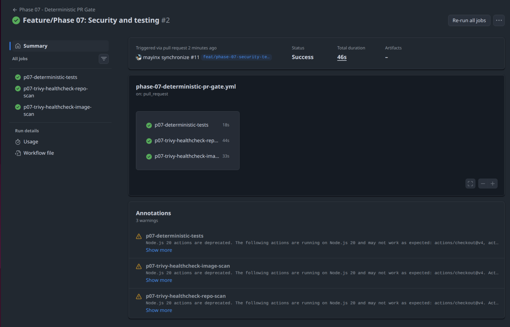
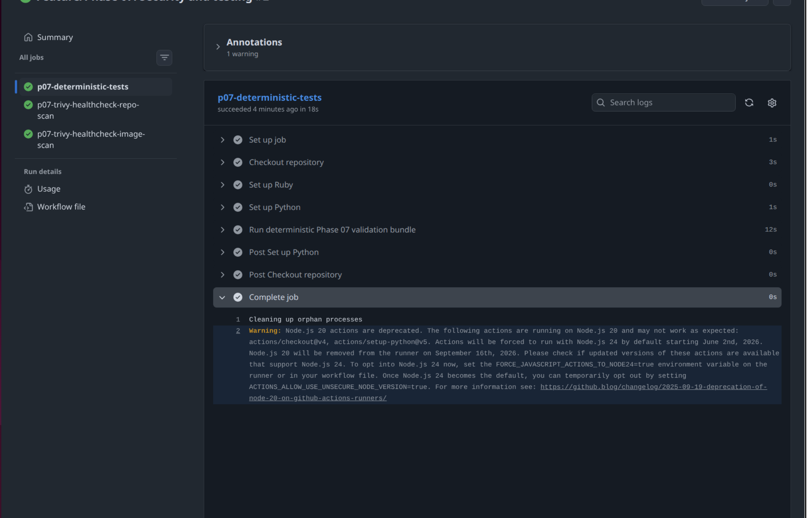
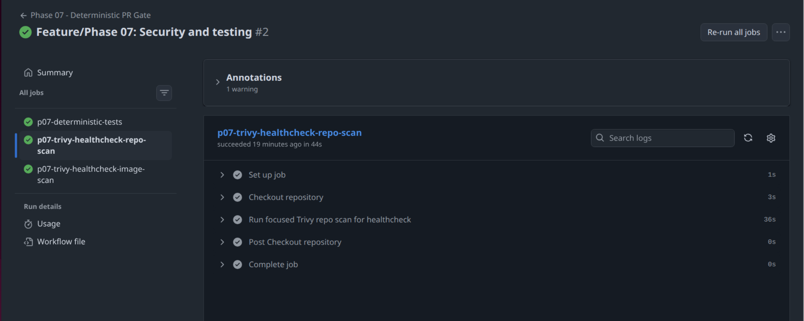
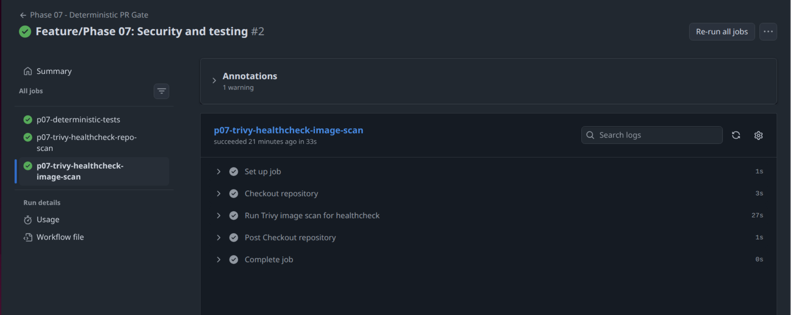
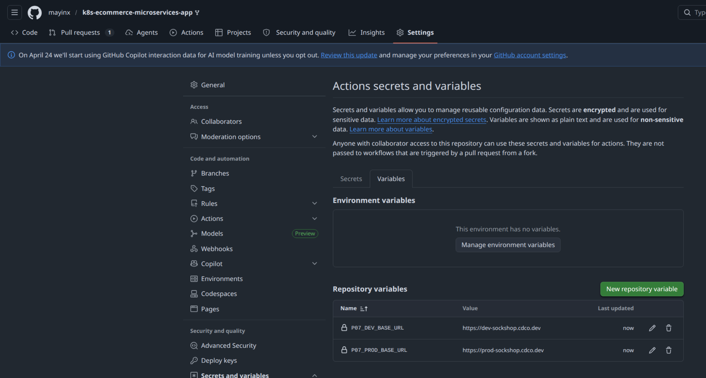
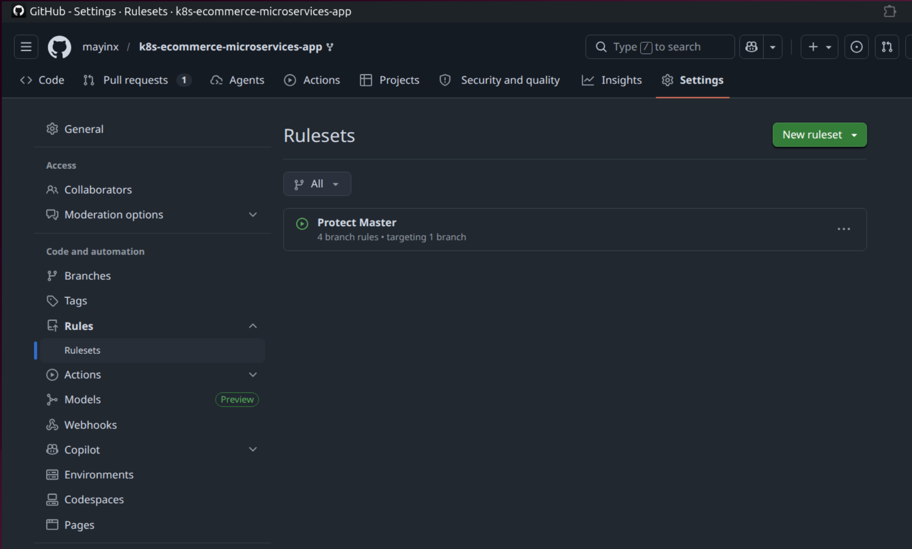
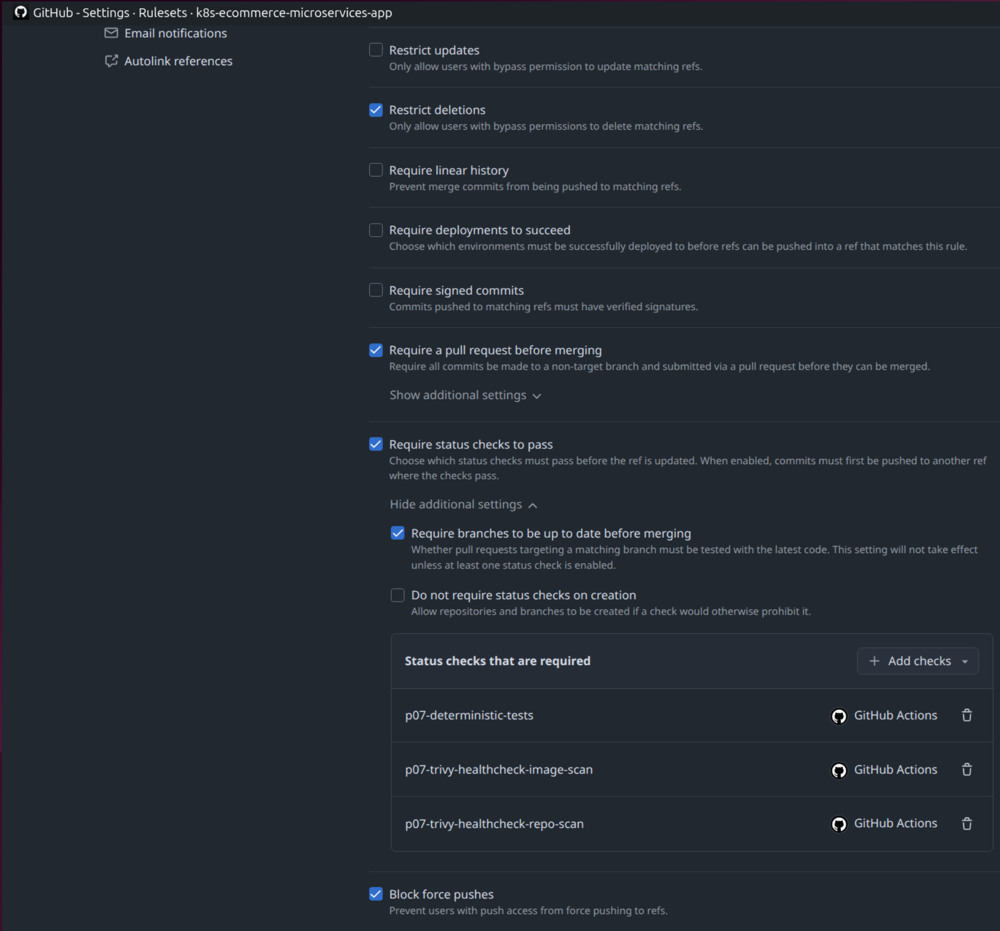

# Implementation — Subphase 04: Stable PR gate, live CI validation, and branch protection (Steps 11–13)

## Step 11 — Implement and activate a deterministic PR-gate workflow in GitHub Actions

### Rationale

Phase 07 now already provides a strong **local validation baseline**:

- **Service health / reachability** through the Ruby healthcheck
- **Observability-helper behavior** through the Bash observability-helper tests
- **API response-shape compatibility** through the Python API contract guard
- **Storefront rendering in a real browser** through the Playwright browser smoke test
- **Security-scanning for repo-owned surfaces** through Trivy
- **Dependency-scanning for repo-owned dependency surfaces** through Dependabot

What is still missing is a **GitHub-native deterministic PR gate** 
- that runs **automatically on pull requests** 
- and **prevents regressions** from reaching the **default branch**.

The next useful addition is therefore a **deterministic PR-gate workflow** in GitHub Actions.

**Scope**

This step stays intentionally limited to **deterministic checks** only:

- **`make p07-tests`**
  - Ruby helper tests
  - Bash helper tests
  - local Python contract-guard tests
- **`make p07-trivy-healthcheck-repo-scan`**
  - focused repo-level Trivy scan for the owned `healthcheck/` path
- **`make p07-trivy-healthcheck-image-scan`**
  - vulnerability scan of the repo-owned `sockshop-healthcheck` image

The following checks are **explicitly excluded** from this PR gate:

- **`make p07-tests-live`**
- **Playwright live smoke tests**
- **Live Python contract smoke checks**
- **The broad `make p07-trivy-repo-scan` baseline**

Reason:

- Live/browser checks are **environment-dependent** and potentially **flaky**
- The **broader Repo Trivy Issues Baseline** currently surfaces **additional backlog outside the focused `healthcheck/` remediation path**
- The PR gate in this step should stay **stable, explainable, and merge-blocking only for owned deterministic signals already under control**

> [!NOTE] **🛡️ Deterministic PR gate**
>
> A **deterministic PR gate** is a CI workflow that runs checks whose result should not depend on instable external conditions. It should rely on deterministic conditions and tests.
>
> A deterministic test runs entirely in isolation and produces - given the exact same input and initial state - always the exact same outout. It mocks or uses otherwise predefined stable input, doesn't rely on unstable random factors (like the public internet), and controls its own environment.
> 
> In short: If a deterministic test fails, the code is broken. No other factors play a role.
>
> In this phase, the PR gate is intentionally **limited to checks that are stable enough to act as merge blockers** for normal development work to check for broken code.

> [!NOTE] **🧭 Why "flaky"/non-deterministic live checks are not part of the PR gate**
>
> The Phase 07 live checks answer a different question:
>
> - **Deterministic PR gate:** “Is this change structurally and locally safe to merge?”
> - **Live smoke workflow:** “Does the deployed environment still behave correctly?”
>
> Apart from this, life tests against the public internet are flaky and not well suited for a determninistic PR gate. They are non-deterministic: Because of non-controllable external variables (network latency, 3rd part API downtime etc.) non-determinsitic tests can produce different outputs - for the same inputs.             
>
> In short: If a non-deterministic test fails, the code might be broken - or the network, or the database, or Cloudflare...
>
> For this rasons, those two concerns stay separated on purpose. The live path follows in the next step.

> [!NOTE] **🧭 Regression**
>
> In software testing, a **regression** means that a previously working behavior stops working correctly after a change.
>
> Typical examples:
>
> - A helper test that used to pass now fails
> - A Dockerfile hardening change breaks the container startup
> - A dependency update introduces a new incompatibility
> - A refactor keeps the code cleaner but unintentionally breaks existing behavior
>
> A CI gate helps catch such regressions before the change is merged into the default branch.

### Action

The goal of this step is to establish a first **GitHub Actions PR gate** for **deterministic validation**:
- **(1)** Map the existing owned Make targets into CI jobs
- **(2)** Create a workflow with stable job names for later branch protection
- **(3)** Keep the workflow intentionally deterministic and fast enough for pull-request use

#### Mapping the existing local validation targets into CI

We will reuse the deterministic Make targets already created earlier in Phase 07:

- **`make p07-tests`**
  - Aggregate deterministic code/test validation (Ruby, Bash, Python)
    - p07-healthcheck-tests (Ruby)
	- p07-traffic-helper-tests (Bash)
	- p07-contract-guard-tests (Python)
- **`make p07-trivy-healthcheck-repo-scan`**
  - Focused Trivy repo scan for `healthcheck/`
- **`make p07-trivy-healthcheck-image-scan`**
  - Focused Trivy healthcheck image vulnerability scan 

This keeps the local and CI execution paths aligned:

- Local reruns use the same targets
- GitHub Actions uses the same targets
- Later branch protection can require the exact same job results

#### Creating the workflow file: `.github/workflows/phase-07-deterministic-pr-gate.yml`

The workflow below acts as a **pre-merge gate for pull requests**. 
- It validates stable checks **before changes reach the default branch**. 
- The actual **deployment workflow remains separate** and runs on its own trigger **after merge or manual execution**.

The workflow 
- implements **3 separate, purely deterministic jobs** to avoid live checks with flaky MR/PR blocking from public-edge/network/browser conditions. 
- utilizes **existing Make targets only** to avoid a duplication of test logic between local and CI execution. 

~~~yaml
# .github/workflows/phase-07-deterministic-pr-gate.yml
#
# Phase 07 - Deterministic PR Gate
#
# Purpose:
# Run the deterministic, repo-owned validation bundle on pull requests 
# targeting the default branch. 
#
# This workflow intentionally excludes live/environment-dependent checks 
# (such as Playwright smoke runs against the deployed edge) to prevent 
# temporary network issues from blocking code merges.

name: Phase 07 - Deterministic PR Gate

on:
  # Run automatically for pull requests targeting the protected default branch.
  # This includes pull-request activity such as opening, reopening, and updating existing PRs.
  pull_request:
    branches:
      - master

  # Allow manual reruns from the GitHub Actions UI.
  workflow_dispatch:

# Keep the default token minimal.
permissions:
  contents: read

# Cancel older runs for the same ref when a newer commit is pushed.
concurrency:
  group: phase-07-deterministic-pr-gate-${{ github.ref }}
  cancel-in-progress: true

jobs:
  # ---------------------------------------------------------------------------
  # 1) Deterministic repo-owned test bundle
  # ---------------------------------------------------------------------------
  # Reuses the existing Make target from local development:
  # - Ruby helper tests
  # - Bash helper tests
  # - local Python contract-guard tests
  p07-deterministic-tests:
    name: p07-deterministic-tests
    runs-on: ubuntu-latest
    timeout-minutes: 20

    steps:
      # Check out the repository contents for this PR revision.
      - name: Checkout repository
        uses: actions/checkout@v4

      # Install a Ruby runtime for the repo-owned Ruby helper tests.
      - name: Set up Ruby
        uses: ruby/setup-ruby@v1
        with:
          ruby-version: "3.2"

      # Install a Python runtime for the repo-owned Python test path.
      - name: Set up Python
        uses: actions/setup-python@v5
        with:
          python-version: "3.12"

      # Execute the deterministic validation bundle.
      - name: Run deterministic Phase 07 validation bundle
        run: make p07-tests

  # ---------------------------------------------------------------------------
  # 2) Focused repo-level Trivy gate for the owned healthcheck path
  # ---------------------------------------------------------------------------
  # This is intentionally the focused path-specific scan, not the broad repo
  # baseline, so the PR gate only blocks on the currently owned/remediated scope.
  p07-trivy-healthcheck-repo-scan:
    name: p07-trivy-healthcheck-repo-scan
    runs-on: ubuntu-latest
    timeout-minutes: 15

    steps:
      # Check out the repository so Trivy can scan the current PR content.
      - name: Checkout repository
        uses: actions/checkout@v4

      # Reuse the focused repo-level Trivy scan already proven locally.
      - name: Run focused Trivy repo scan for healthcheck
        run: make p07-trivy-healthcheck-repo-scan

  # ---------------------------------------------------------------------------
  # 3) Owned image vulnerability gate
  # ---------------------------------------------------------------------------
  # Rebuild the repo-owned healthcheck image and scan that image in CI.
  p07-trivy-healthcheck-image-scan:
    name: p07-trivy-healthcheck-image-scan
    runs-on: ubuntu-latest
    timeout-minutes: 20

    steps:
      # Check out the repository so Docker can build the owned image.
      - name: Checkout repository
        uses: actions/checkout@v4

      # Reuse the existing Make target that builds and scans the owned image.
      - name: Run Trivy image scan for healthcheck
        run: make p07-trivy-healthcheck-image-scan
~~~

#### Why the broad Trivy repo baseline is not used as the PR gate

As noted in Step 9 (Healthcheck Dockerfile Hardening), the broader target `make p07-trivy-repo-scan` currently surfaces **additional findings outside the focused `healthcheck/` remediation path**. This Make target (i.e. its current output) functions as **Legacy Hardening Backlog** and will be addressed again in later phases. At this point, before its remediation, it is therefore not suitable to be used in the current PR gate workflow. 

For the deterministic PR gate in this step, the **correct Trivy repo target** is `make p07-trivy-healthcheck-repo-scan` - because it blocks only on the **owned and already-remediated `healthcheck/`-path**, that is under active control.

#### Trigger behavior of the workflow

This workflow is triggered by:

- **Pull requests targeting `master`**
    - On **PR activity** like openening, reopening, or updating a PR with new commits 
- **Manual workflow dispatch**
    - On manual execution - via the manual "Run workflow" / "rerun all steps" button in the GitHub UI

This gives us two useful execution paths:

- **Normal PR validation**
- **Manual rerun/debug run** from the Actions tab when needed

#### Running and verifying the workflow

Once the workflow file is committed and pushed, the deterministic PR-gate workflow is already live in GitHub Actions. It runs automatically for pull-request activity targeting `master`, i.e. when a new pull request is opened or new commits are pushed to an existing one.

In GitHub Actions, this appears as:

- Workflow: `Phase 07 - Deterministic PR Gate`
- Jobs:
  - `p07-deterministic-tests`
  - `p07-trivy-healthcheck-repo-scan`
  - `p07-trivy-healthcheck-image-scan`

A successful run shows all three jobs green. 

**GitHub Actions deterministic PR-gate run summary**

*Figure 8: GitHub Actions run summary of the `Phase 07 - Deterministic PR Gate` workflow for the open Phase-07 pull request. The summary shows all three required jobs in a successful state. The annotation area also shows non-blocking Node.js action-runtime deprecation warnings, but the workflow itself completed successfully.*

---

**GitHub Actions job `p07-deterministic-tests`**

*Figure 9: Detailed GitHub Actions job view for `p07-deterministic-tests`. The screenshot shows the deterministic validation bundle succeeding in CI, including repository checkout, runtime setup, and execution of the Phase-07 deterministic test bundle. A non-blocking Node.js action-runtime deprecation warning is visible in the completed job output.*

---

**GitHub Actions job `p07-trivy-healthcheck-repo-scan`**

*Figure 10: Detailed GitHub Actions job view for `p07-trivy-healthcheck-repo-scan`. The screenshot shows the focused Trivy repository scan for the owned `healthcheck/` path completing successfully inside the deterministic PR-gate workflow.*

---

**GitHub Actions job `p07-trivy-healthcheck-image-scan`**

*Figure 11: Detailed GitHub Actions job view for `p07-trivy-healthcheck-image-scan`. The screenshot shows the CI-side rebuild and Trivy scan of the repo-owned `sockshop-healthcheck` image succeeding as part of the deterministic PR gate.*

---

At this stage, however, the workflow is **not yet enforced as a truly mandatory merge gate**. It runs automatically - but merges are still possible, even when teh PR gate worflow failed. 

That enforcement follows later through default-branch protection and required status checks.

### Result

Step 11 establishes the first **deterministic GitHub Actions PR gate** for Phase 07.

The successful end state is shown by these signals / verification points:

- The repository now contains a dedicated workflow:
  - `.github/workflows/phase-07-deterministic-pr-gate.yml`
- The workflow reuses the already established deterministic local validation targets:
  - `make p07-tests`
  - `make p07-trivy-healthcheck-repo-scan`
  - `make p07-trivy-healthcheck-image-scan`
- The workflow intentionally excludes live/environment-dependent checks
- The job names are stable and suitable for later branch-protection enforcement
- Local and CI execution paths now stay aligned through the same Make targets
- The repository is now prepared for:
  - A separate live smoke workflow in the next step
  - Required status-check enforcement through branch protection afterward

At this point, the **Phase 07 Test & Security Layer** validates:
- **(1) Service health/reachability** (Ruby)
- **(2) Helper-script behavior (Traffic Generator)** (Bash)
- **(3) API response-shape compatibility** (Python)
- **(4) Storefront rendering in a real browser** (Playwright / JavaScript)
- **(5) Security-scanning for repo-owned surfaces** (Trivy)
- **(6) Evidence-based security remediation on a repo-owned Docker image path** (Trivy + hardened `healthcheck` image)
- **(7) Dependency-scanning for repo-owned dependency surfaces** (Dependabot)
- **(8) Deterministic PR-gate validation in CI** (GitHub Actions)

The remaining two steps are now:

- (1) Implement a separate GitHub Actions workflow for live smoke validation against the public `dev` and `prod`` environments
- (2) Make the PR gate mandatory and keep the live smoke workflow optional: turn the already active deterministic PR-gate workflow into a real mandatory merge gate through branch protection, while keeping the separate live smoke workflow available as a non-blocking validation check

---

## Step 12 — Implement and activate a live-smoke workflow in GitHub Actions for deployed environments

### Rationale

Now we need to implement a **GitHub-native live validation workflow** for the already deployed application environments. 

This **separate live smoke workflow** will validate the deployed storefront against a chosen target environment, using exsiting **Python and Playwright live smoke tests**. It's purpose is not broad feature testing. It is a focused check that the deployed storefront still behaves correctly on a basic but meaningful level:

- The **live application URL** responds
- The **catalogue API** still returns the expected **response shape**
- The **storefront** still **renders key visible content** in a **real browser**

This workflow is intentionally kept **separate from the PR gate** because it depends on a deployed environment and can therefore be affected by factors outside the pull request itself.  

#### Scope

- **1 GitHub Actions workflow** for live smoke validation
- **Manual execution through `workflow_dispatch`**
- **Optional later reuse through `workflow_call`**
- **Support for both `dev` and `prod`**
- Reuse of the already existing **Phase-07 live smoke test bundle**:
  - Python live contract smoke
  - Playwright browser smoke

#### Environment separation through explicit base-URL injection and repository-variable defaults

This workflow validates **deployed environments** and needs a target-specific **base URL**.

The **environment separation** is handled in two layers:

- (1) **GitHub repository variables** - as the default source for manually selected `dev` and `prod` runs:
  - `P07_DEV_BASE_URL`
  - `P07_PROD_BASE_URL`
- (2) **Explicit `base_url` input** - for reusable `workflow_call` executions

**Result:** 

- The workflow stays **reusable and environment-agnostic** at execution level - and can be run against the live edges of `dev` or `prod`
- At the same time, the workflow keeps the standard `dev` and `prod` configuration values **explicitly separated in GitHub as repository variables**.

### Action

The goal of this step is to establish a first **GitHub-native live smoke workflow** for the deployed storefront:
- **(1)** Define the environment-specific base-URLs 
- **(2)** Create the live-smoke GitHub Actions workflow
- **(3)** Reuse the already existing local live smoke test bundle in CI
- **(4)** Produce a clean post-run artifact for Playwright evidence and debugging

#### Defining the environment-specific base URLs

**Public environment URLs should not be hard-coded** directly into the workflow file.  

Instead, we define the two URLs as **GitHub repository variables**:

- `P07_DEV_BASE_URL` = `https://dev-sockshop.cdco.dev`
- `P07_PROD_BASE_URL` = `https://prod-sockshop.cdco.dev`

These values can be configured in the GitHub repository UI under:

- Settings > Secrets and variables > Actions > Tab "Variables" > Button "New repository variable" 

This keeps the workflow configuration clean and makes environment changes easier later without editing the workflow YAML itself.

**GitHub repository variables for live target URLs**

*Figure 12: GitHub Actions repository variables configured for the live-smoke workflow. The screenshot shows `P07_DEV_BASE_URL` and `P07_PROD_BASE_URL` stored as separate repository-level variables, providing explicit default target URLs for the deployed `dev` and `prod` environments.*

#### Creating the live-validation workflow: `.github/workflows/phase-07-live-smoke.yml`

#### Expected live workflow execution path

The reusable live-validation workflow established here follows this execution path:

- **(1)** Resolve the selected target environment
- **(2)** Resolve the matching base URL from repository variables
- **(3)** Set up Python and Node.js
- **(4)** Run the existing `make p07-tests-live` bundle
- **(5)** Upload the Playwright report and test-results as GitHub Actions artifacts

This means the workflow validates both existing live Phase-07 surfaces in one CI run:

- **Python live contract smoke**
- **Playwright live browser smoke**

For this, the workflow reuses the already existing Phase-07 live smoke bundle via the environment-agnostic Make target `p07-tests-live`, instead of introducing CI-specific test execution commands or additional Make targets:

- The same smoke tests are usable **locally** and in **CI**
- Live-validation behavior stays defined in **one place**
- Environment selection happens through **inputs + variables**
- The workflow is already structured for later reuse through `workflow_call`

~~~yaml
# .github/workflows/phase-07-live-smoke.yml
#
# Phase 07 - Reusable Live Smoke Validation Workflow
#
# Purpose:
#   Validate already deployed environments (dev/prod) using the existing Phase 07
#   live smoke bundle:
#   - Python API contract smoke tests
#   - Playwright browser smoke tests
#
# Scope & Strategy:
#   This workflow is intentionally separate from the required PR gate.
#   Because it validates a deployed environment, results can be influenced by
#   factors outside the pull request itself, such as target availability,
#   deployed runtime state, and browser timing.
#
# Trigger Model:
#   - workflow_dispatch : Manual on-demand validation from the GitHub Actions UI
#   - workflow_call     : Reusable hook for automated post-deployment validation
#
# Environment Handling:
#   Target environments (dev/prod) and base URLs are resolved dynamically via
#   repository variables or explicit workflow_call inputs.
#
# Usage Example (via workflow_call):
# ---------------------------------------------------------------------------
# jobs:
#   verify-prod-deployment:
#     uses: ./.github/workflows/phase-07-live-smoke.yml
#     with:
#       target_environment: "prod"
#       base_url: "https://prod-sockshop.cdco.dev"
# ---------------------------------------------------------------------------

name: Phase 07 - Live Smoke

on:
  # Manual trigger for ad-hoc environment validation
  workflow_dispatch:
    inputs:
      target_environment:
        description: "Deployed environment to validate"
        required: true
        type: choice
        options:
          - dev
          - prod
        default: dev

  # Reusable workflow hook for automated post-deployment validation
  # (i.e. reusable by another GitHub Actiosn workflow)
  workflow_call:
    inputs:
      target_environment:
        description: "Deployed environment to validate"
        required: true
        type: string
      base_url:
        description: "Optional explicit base URL override"
        required: false
        type: string

# Security: Enforce principle of least privilege
permissions:
  contents: read

jobs:
  # ---------------------------------------------------------------------------
  # 1) Live Environment Validation Bundle
  # ---------------------------------------------------------------------------
  p07-live-smoke:
    name: p07-live-smoke
    runs-on: ubuntu-latest
    timeout-minutes: 20

    steps:
      - name: Check out repository
        uses: actions/checkout@v4

      # Provide runtime for the Python API contract-guard tests
      - name: Set up Python
        uses: actions/setup-python@v5
        with:
          python-version: "3.12"

      # Provide runtime for the Playwright E2E browser tests
      - name: Set up Node.js
        uses: actions/setup-node@v4
        with:
          node-version: "20"

      # -----------------------------------------------------------------------
      # Dynamic Target Environment Resolution
      # -----------------------------------------------------------------------
      # Resolve the target environment and choose the matching base URL.
      #
      # Resolution order:
      # 1) Explicit workflow_call input `base_url`
      # 2) Repository variable P07_PROD_BASE_URL (for prod)
      # 3) Repository variable P07_DEV_BASE_URL (for dev)
      - name: Resolve live target URL
        id: resolve-target
        shell: bash
        env:
          INPUT_TARGET_ENVIRONMENT: ${{ inputs.target_environment }}
          INPUT_BASE_URL: ${{ inputs.base_url }}
          DEV_BASE_URL: ${{ vars.P07_DEV_BASE_URL }}
          PROD_BASE_URL: ${{ vars.P07_PROD_BASE_URL }}
        run: |
          # Default to 'dev' if the target environment is not explicitly passed.
          target_environment="${INPUT_TARGET_ENVIRONMENT:-dev}"
          base_url="${INPUT_BASE_URL:-}"

          # Fallback to repository variables if no explicit base_url override is provided
          if [ -z "$base_url" ]; then
            case "$target_environment" in
              dev)
                base_url="$DEV_BASE_URL"
                ;;
              prod)
                base_url="$PROD_BASE_URL"
                ;;
              *)
                echo "ERROR: Unsupported target_environment: $target_environment" >&2
                exit 1
                ;;
            esac
          fi

          # Fail workflow immediately if base URL is still empty.
          if [ -z "$base_url" ]; then
            echo "ERROR: No base URL resolved for environment '$target_environment'." >&2
            echo "Set repository variable P07_DEV_BASE_URL / P07_PROD_BASE_URL or pass base_url explicitly." >&2
            exit 1
          fi

          echo "target_environment=$target_environment" >> "$GITHUB_OUTPUT"
          echo "base_url=$base_url" >> "$GITHUB_OUTPUT"

      # Print the resolved target in the workflow logs for traceability.
      - name: Show resolved live target
        shell: bash
        run: |
          echo "Resolved target environment: ${{ steps.resolve-target.outputs.target_environment }}"
          echo "Resolved target base URL:    ${{ steps.resolve-target.outputs.base_url }}"

      # -----------------------------------------------------------------------
      # Live Smoke Tests Execution & Artifacts
      # -----------------------------------------------------------------------
      # Execute the live smoke test bundle against the resolved target environment.
      #
      # BASE_URL is injected explicitly into the environment-agnostic Make target
      # `p07-tests-live`, which passes it on to:
      # - Python live contract smoke tests
      # - Playwright browser smoke tests
      #
      # CI=true activates the CI-aware Playwright behavior already defined in
      # the Phase-07 Playwright configuration.
      - name: Run Phase 07 live smoke test bundle
        shell: bash
        env:
          BASE_URL: ${{ steps.resolve-target.outputs.base_url }}
          CI: "true"
        run: make p07-tests-live

      # Preserve the Playwright HTML report for debugging, even if the job fails.
      # The report is uploaded to GitHub Actions artifact storage and can be
      # downloaded from the workflow run page.
      - name: Upload Playwright HTML report
        if: always()
        uses: actions/upload-artifact@v4
        with:
          name: p07-playwright-report-${{ steps.resolve-target.outputs.target_environment }}
          path: tests/e2e/playwright-report
          if-no-files-found: ignore
          retention-days: 7

      # Preserve deep-dive artifacts (traces, screenshots) on failure
      - name: Upload Playwright test-results
        if: always()
        uses: actions/upload-artifact@v4
        with:
          name: p07-playwright-test-results-${{ steps.resolve-target.outputs.target_environment }}
          path: tests/e2e/test-results
          if-no-files-found: ignore
          retention-days: 7
~~~

#### Triggering the first live workflow run

After the workflow file is committed and pushed, the first live run can be started through the GitHub Actions UI:

- Actions > "Phase 07 - Live Smoke" > Run workflow
- Select branch 
- Select `target_environment`
- Run workflow

A first run should be executed against **`dev`**. 

At this stage, the workflow is intended to be used used primarily through `workflow_dispatch` for manual validation runs. 

The additional `workflow_call` trigger is implemented so that a later deployment workflow can call the same live-smoke workflow automatically after a successful `dev` or `prod` rollout.

### Result

Step 12 establishes the first **GitHub-native live smoke workflow** for deployed environments in Phase 07.

The successful end state is shown by these signals / verification points:

- The repository now contains a dedicated live-validation workflow:
  - `.github/workflows/phase-07-live-smoke.yml`
- The workflow is explicitly **environment-aware**:
  - `dev` and `prod` are selected through a workflow input
  - the matching base URLs are resolved from separate repository variables
- The workflow reuses the already existing **Phase-07 live smoke bundle**
  - Python live contract smoke
  - Playwright browser smoke
- The workflow remains intentionally **separate from the deterministic PR gate**
- The workflow uploads **Playwright artifacts** for later inspection and debugging
- The workflow is already shaped for two usage modes:
  - **manual live validation** through `workflow_dispatch`
  - **later reuse from another workflow** through `workflow_call`

At this point, the **Phase 07 Test & Security Layer** validates:

- **(1) Service health/reachability** (Ruby)
- **(2) Helper-script behavior (Traffic Generator)** (Bash)
- **(3) API response-shape compatibility** (Python)
- **(4) Storefront rendering in a real browser** (Playwright / JavaScript)
- **(5) Security-scanning for repo-owned surfaces** (Trivy)
- **(6) Evidence-based security remediation on a repo-owned Docker image path** (Trivy + hardened `healthcheck` image)
- **(7) Dependency-scanning for repo-owned dependency surfaces** (Dependabot)
- **(8) Stable PR-gate validation in GitHub Actions** (deterministic workflow)
- **(9) Live deployed-environment smoke validation in GitHub Actions** (manual / reusable live-smoke workflow)

The next step is now clear: 
- Apply repository governance by locking the default branch to the stable PR-gate checks
- While keeping the live workflow available as an explicit post-deploy validation path. 

---

## Step 13 — Default-branch protection and enforcement of the mandatory PR gate

### Rationale

- Step 11 introduced the first **deterministic GitHub Actions PR gate** for Phase 07.  
- Step 12 added the separate **live smoke test workflow** for deployed environments.
- Still missing: The **final governance layer** that actually **enforces the deterministic PR gate as potential merge blocker**.

The next (and phase-final) addition is therefore a **default-branch protection ruleset** in GitHub:

- (1) Changes to `master` **must be introduced through a pull request** - and not through direct branch updates
- (2) **Direct updates** that bypass the CI validation path are **not permitted**
- (3) A pull request can only be merged into `master` if the **mandatory deterministic PR-gate workflow completes successfully**
- (4) The **live smoke validation workflow remains separate** from the required merge gate

This completes the transition from:

- **local validation** 
- to **CI validation**
- to **repository-level merge governance**

In consequence, the deterministic workflow functions as the stable **merge gate**
while the live workflow remains an **post-deploy / environment-validation path**. 

> [!NOTE] **🛡️ Branch protection / ruleset governance**
>
> A CI workflow alone may run automatic and function eprfectly - but it can't frunciton as a rue Merge Gate without a corresponding GH Actions Ruleset to enforce branch protection.
>
> Without branch protection, a repository owner or collaborator could still push directly to the default branch and bypass the validation workflow entirely.
>
> This step turns the deterministic PR gate into an actual repository rule:
>
> - Changes must go through a pull request
> - The required deterministic checks must pass
> - Direct pushes or CI bypasses are not allowed

### Action

The goal of this step is to enforce the already established deterministic PR gate at the repository level:
- **(1)** Create a default-branch ruleset for `master`
- **(2)** Require the deterministic Step-11 jobs as "status checks" and thus as merge blockers
- **(3)** Verify that direct merge bypass is no longer possible through the normal path

#### Creating the ruleset in GitHub

A new branch ruleset can be created in the GitHub UI of the repo via  

- **Settings** > **Rules** > **Rulesets** > **New branch ruleset**

---

**GitHub ruleset overview**

*Figure 13: GitHub ruleset overview showing the active default-branch protection ruleset `Protect Master`. This confirms that repository-level branch-governance rules are configured for the default branch.*

---

##### Rule Identity + Target Branches 

For the created ruleset the following configuration was chosen

- **Ruleset name**: "Protect Master" 
- **Enforcement status**: `Active`
- **Bypass list**: Left empty
- **Target branches**: "Default branch" (ensures the ruleset applies only to `master`)

##### Branch rules to enable/edit 

- **"Restrict deletions"**: Enabled
- **"Require a pull request before merging"**: Enabled - optional edit:
        **Require conversation resolution before merging** - optional
- **„Block force pushes"**: Enabled
    When enabled, users may still work normally through PRs and regular merges, but they may not rewrite the protected branch history with force-push operations: Existing commits on `master` cannot later be replaced, removed, or moved to a different history by a force-push.
- **"Require status checks to pass before merging"**: Enabled - edit:
   - **"Status checks that are required"** lists the **deterministic Step-11 checks/job names**:  
        - `p07-deterministic-tests`
        - `p07-trivy-healthcheck-repo-scan`
        - `p07-trivy-healthcheck-image-scan`
    - **"Require branches to be up to date before merging"**: Enabled (ensures that a pull request is tested against the latest state of `master`, not against an outdated earlier branch state)

Note: If those job names/required checks are not available, it is necessary to make sure that the Step-11 workflow has already produced successful check results in the repository - at least once. Otherwise the jobs/checks might not be available for selection here! 

**GitHub ruleset details with required deterministic checks**

*Figure 14: Detailed GitHub ruleset configuration for `Protect Master`. The screenshot shows pull-request enforcement, required status checks, up-to-date-before-merge enforcement, and blocked force-pushes. It also shows the three deterministic Phase-07 job names selected as required merge checks: `p07-deterministic-tests`, `p07-trivy-healthcheck-image-scan`, and `p07-trivy-healthcheck-repo-scan`.*

---

#### Resulting merge path

Once the ruleset is saved, the intended merge path becomes:

- (1) Open a pull request against `master` 
- (2) GitHub runs the deterministic PR-gate workflow
- (3) The following checks must pass:
  - `p07-deterministic-tests`
  - `p07-trivy-healthcheck-repo-scan`
  - `p07-trivy-healthcheck-image-scan`
- (4) Only then can the pull request be merged 
- (5) Pushing into the PR triggers the PR-gate workflow as well  

**Rule of the Step-12 live smoke validation workflow**

The live smoke workflow remains:
- Manually runnable
- Reusable from other workflows later
- Visible as deployment/environment validation
- Not required for merge 

Later phases can iterate over this behavior and implement a successful automatic Live Check against the dev edge as gate for a production env deployment (given, the corresponding live tests are stable enough).  

#### Triggering the PR gate 

- A pull request to `master` triggers the deterministic PR-gate. The required deterministic checks (workflow job names) are visible. 
- The merge button remains blocked while those checks are pending or failing
- The merge becomes available only after all required checks are green
- Direct default-branch bypass through the normal merge path are not permitted

A quick repository-governance sanity check is now:

- Deterministic PR gate = **required**
- Live smoke workflow = **available, but not required**
- Default branch = **protected**

### Result

Step 13 enforces the first **repository-level governance rule** for Phase 07 by protecting the default branch with the deterministic PR gate.

The successful end state is shown by these signals / verification points:

- The repository now has a **default-branch ruleset** targeting `master`
- Direct default-branch work is now governed through a **pull-request-first** flow
- The deterministic Step-11 checks are now configured as **required status checks**:
  - `p07-deterministic-tests`
  - `p07-trivy-healthcheck-repo-scan`
  - `p07-trivy-healthcheck-image-scan`
- The required merge gate stays intentionally limited to **stable deterministic checks**
- The Step-12 live smoke workflow remains available as a **separate deployed-environment validation path**
- Phase 07 now covers the full chain:
  - local validation
  - CI validation
  - enforced repository governance

At this point, the **Phase 07 Test & Security Layer** validates:

- **(1) Service health/reachability** (Ruby)
- **(2) Helper-script behavior (Traffic Generator)** (Bash)
- **(3) API response-shape compatibility** (Python)
- **(4) Storefront rendering in a real browser** (Playwright / JavaScript)
- **(5) Security-scanning for repo-owned surfaces** (Trivy)
- **(6) Evidence-based security remediation on a repo-owned Docker image path** (Trivy + hardened `healthcheck` image)
- **(7) Dependency-scanning for repo-owned dependency surfaces** (Dependabot)
- **(8) Deterministic PR-gate validation in CI** (GitHub Actions)
- **(9) Live deployed-environment smoke validation in GitHub Actions** (manual / reusable live-smoke workflow)
- **(10) Repository-level merge governance on the default branch** (ruleset + required deterministic checks)

This concludes the implementation of Phase 07. 

