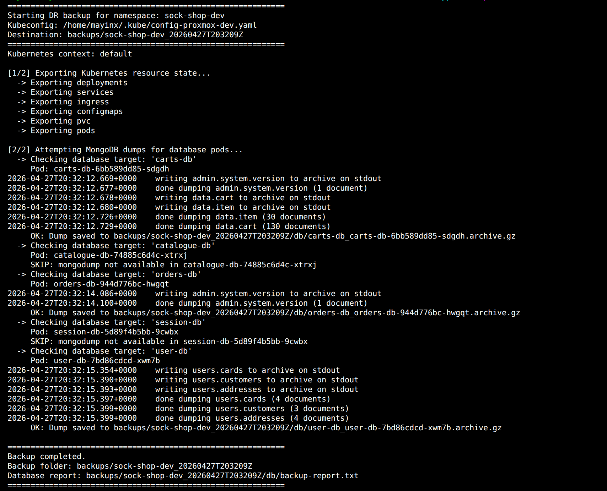
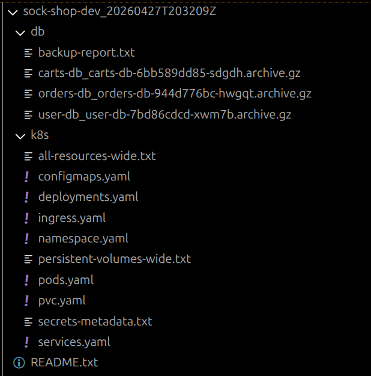
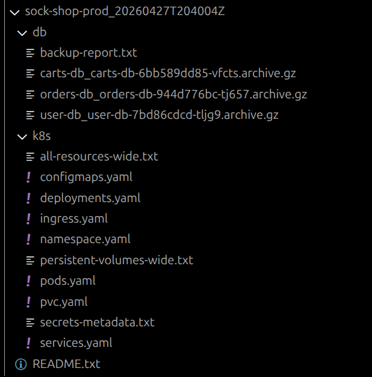

# Implementation Log Template
---

# Implementation Log — Phase XX (<Docs-Short-Name>): <long phase title>

> ## About
> This document is the implementation log and detailed build diary for **Phase XX (<Docs-Short-Name>)**.
> It records the full implementation path including rationales, key observations, verification steps, and evidence pointers so the work remains auditable and reproducible.
>
> For top-level project navigation, see: **[INDEX.md](../INDEX.md)**.
> For cross-phase incident and anomaly tracking, see: **[DEBUG-LOG.md](../DEBUG-LOG.md)**.
> For the broader project planning view, see: **[ROADMAP.md](../ROADMAP.md)**.

---

## Index (top-level)

- [**Purpose / Goal**](#purpose--goal)
- [**Definition of done**](#definition-of-done)
- [**Preconditions**](#preconditions)
- [**Step 1 — -----]
- [**Step 2 — -----]
- [**Step 3 — -----]
- [**Step 4 — -----]
- [**Step 5 — -----]
- [**Phase XX outcome summary**](#phase-XX-outcome-summary)
- [**Sources**](#sources)

---

## Purpose / Goal

### Goal Line

### Some Prose + Concept/Terms notes 

---

## Definition of done (Phase 06)

Phase XX is considered done when the following conditions are met:

- Condition 1
- Condition 2
- Condition 3
- ...
- (Browser) evidence for X, Y is captured in the phase evidence folder

---

## Preconditions

- The <feature> from Phase XX exists/whatever ... 
- The local workstation ...
- The production Sock Shop environment / The VM environment...
- Tool X is available on the workstation | the VM | Whatever

---

# Disaster Recovery & Rollback Readiness — Phase 09

> ## About
> This document is the implementation guide for **Phase 09 — Disaster Recovery & Rollback Readiness**.
>
> Phase 09 closes the remaining resilience and hand-in readiness gap by adding a practical disaster-recovery baseline:
>
> - A namespace backup script for Kubernetes state and MongoDB dump attempts
> - A safe container-recovery proof in the `dev` environment
> - A documented rollback model
> - A documented node/VM recovery model
> - Final README and architecture-documentation readiness notes
>
> This phase deliberately does **not** attempt to convert the current single-node target into a full high-availability platform. The current target is a single-node K3s platform, so the recovery model is **backup + rebuild + redeploy**, not automatic failover.

---

## Index

- [Phase 09 outcome at a glance](#phase-09-outcome-at-a-glance)
- [Step 1 — Add the DR baseline structure and backup script](#step-1--add-the-dr-baseline-structure-and-backup-script)
- [Step 2 — Run the backup proof against `sock-shop-dev`](#step-2--run-the-backup-proof-against-sock-shop-dev)
- [Step 3 — Prove recovery and rollback paths safely](#step-3--prove-recovery-and-rollback-paths-safely)
- [Step 4 — Final hand-in documentation and README readiness](#step-4--final-hand-in-documentation-and-readme-readiness)
- [Phase outcome summary](#phase-outcome-summary)
- [Sources](#sources)

---

## Phase 09 outcome at a glance

Phase 09 establishes the project’s first practical disaster-recovery and rollback baseline.

By the end of this phase, the project proves:

- **(1)** **Kubernetes namespace state** can be exported into a **local backup folder**
- **(2)** Sock Shop **database pods** can be targeted for **MongoDB dump** 
- **(3)** **Backup artifacts** are kept out of Git
- **(4)** **Container-level failure recovery** is safely demonstrated in the live traget `sock-shop-dev`
- **(5)** **Rollback paths are documented** for both **Git-based** and **Kubernetes-level rollback**
- **(6)** **Node/VM failure recovery** is **documented** for the current **single-node target** 

**Final recovery model:**

- **Container failure:** 
  - Kubernetes recreates failed pods through Deployment reconciliation
- **Application rollback:** 
  - Git-based revert + PR gate + redeploy
  - Kubernetes rollout undo is only used as an emergency runtime rollback
- **Node/VM failure:** 
  - Rebuild/redeploy from the documented Proxmox baseline, Phase 08 IaC proof, Kubernetes setup, GitHub Actions delivery path, and backup artifacts.
- **Database backup:** 
  - A namespace-level backup script is utilized that executed MongoDB dump attempts for sock-shop DB pods.

---

## Step 1 — Add the DR project structure and implement the backup script

### Rationale

Despite the already implemented DevOps capabilities, one central part is still missing: a **disaster-recovery baseline** that shows how the project can **preserve state and recover from common failure modes**.

This step creates the project’s DR-backup folder structure and implements a **backup script tailored to the current project state**:

- **Single-node Proxmox-based K3s cluster**
- **Namespace-separated Sock Shop environments** (`sock-shop-dev`, `sock-shop-prod`)
- **Kubernetes-managed application resources** such as Deployments, Services, Ingress, ConfigMaps, Pods, and PVC visibility
- **Sock Shop data-store pods**, including **MongoDB-compatible pods** that can be backed up through **logical `mongodump` archives**

The **backup script** needs to focus on capturing the recovery-relevant state layers of the application environment: The state of the Kubernetes cluster and the state of the Database: 

- **(1) Kubernetes state:** Export namespaced resources that describe the running application environment.
- **(2) Database state:** Create **logical database dumps** from the Sock Shop database pods that support **`mongodump`**.

The backup script must provide a **repeatable and auditable DR baseline** that can be executed safely against `sock-shop-dev` first and later against `sock-shop-prod` when needed.

> [!NOTE] **Logical database dump**
>
> A **logical database dump** exports database contents through the database engine itself, for example with `mongodump` for MongoDB. The output is a portable archive that can later be restored into a compatible database.
>
> This is different from a **physical backup** or **storage snapshot**, which copies database files, volumes, or disks at the storage layer.
>
> For this project, a logical dump is the better first DR baseline because it is:
>
> - easy to run from the existing Kubernetes pods,
> - portable across environments,
> - small enough for a lightweight proof,
> - and independent from Proxmox or storage-level snapshot tooling.

> [!NOTE] **MongoDB and `mongodump`**
>
> **MongoDB** is a document database used by several Sock Shop data-store pods.  
> **`mongodump`** is MongoDB’s logical backup utility. It can export database contents into an archive file.
>
> In this phase, the backup helper checks each known data-store pod first. If `mongodump` is available, the script streams a compressed archive into the local backup folder. If `mongodump` is not available, the pod is skipped and the reason is written to `backup-report.txt`.
>
> The created archive is a real **restoreable MongoDB dump artifact**. 

### Action

#### Backup Script

The backup script is placed under `scripts/dr/backup-k8s-namespace.sh`. It's output in form of backup artifacts is written to the new `backups/` directory, which should be excluded from Git: 

~~~gitignore
# Phase 09 DR local backup artifacts
backups/
~~~

In this phase, the backup script functions as a **K8s State & Data Backup Helper**: It creates **one timestamped recovery package for a selected Sock Shop namespace** and combines Kubernetes resource exports with MongoDB dumps:

- **(1)** It collects the **application recovery state** for the selected **Kubernetes namespace**:
  - **Kubernetes namespace state**, so the deployed application shape can be inspected later
  - **MongoDB dump archives** from the Sock Shop database pods, where `mongodump` is available

- **(2)** Its output is **one timestamped local backup artifact per run**, written to the local `backups/` directory. The script exports **no Kubernetes Secret values**; it records **only Kubernetes Secret metadata**.
  - `backups/<namespace>_<timestamp>/k8s/` — holds Kubernetes resource exports and status snapshots
  - `backups/<namespace>_<timestamp>/db/` — contains MongoDB dump archives and the database backup report
    - Each database dump artifact is a portable MongoDB archive that can be restored to a compatible MongoDB instance.

**Avoiding the Dependency Trap:** The following backup script also avoids a common container-backup issue: Instead of writing database dumps inside a container first and then copying them out with `kubectl cp`, it **streams database dumps through `kubectl exec`**.
- **Minimal container-side dependency:** The database container only needs to run `mongodump`; the archive itself is written directly to the local backup folder on the workstation.
- **No `tar` dependency:** This keeps the backup script independent of extra tools such as `tar`, which may be missing in hardened or minimal container images.
- **No temporary pod disk footprint:** The script also avoids leaving temporary dump files inside running database pods.

~~~bash
#!/usr/bin/env bash
#
# scripts/dr/backup-k8s-namespace.sh
#
# =============================================================================
#  SOCK-SHOP DR: K8S NAMESPACE BACKUP HELPER
# =============================================================================
#
# PURPOSE:
#   Create a local disaster-recovery backup snapshot for a Sock Shop namespace.
#   Each run creates a unique, timestamped directory. 
#
# BACKUP SCOPE:
# - Resource State: Full K8s namespace/resource state as YAML and text snapshots
# - Security: Metadata-only Secret inventory, without exporting secret values
# - Databases: Compressed MongoDB dumps from several Sock Shop DB pods that support 'mongodump'
#
# USAGE:
#   ./scripts/dr/backup-k8s-namespace.sh sock-shop-dev
#   ./scripts/dr/backup-k8s-namespace.sh sock-shop-prod
#
# MAKE TARGETS:
#   make p09-dr-backup-dev
#   make p09-dr-backup-prod
#  

# -----------------------------------------------------------------------------
# Shell safety
# -----------------------------------------------------------------------------

# Fail fast on errors, unset variables, and failed pipeline commands.
set -euo pipefail

# -----------------------------------------------------------------------------
# Input validation and kubeconfig selection
# -----------------------------------------------------------------------------

NAMESPACE="${1:-}"

# Accept only the known application namespaces.
# This prevents accidental execution against unrelated namespaces.
case "$NAMESPACE" in
  sock-shop-dev|sock-shop-prod)
    ;;
  *)
    echo "ERROR: Usage: $0 <sock-shop-dev|sock-shop-prod>" >&2
    exit 1
    ;;
esac

# Default to the Proxmox target kubeconfig unless the caller provides another one.
KUBECONFIG_PATH="${KUBECONFIG_PATH:-$HOME/.kube/config-proxmox-dev.yaml}" 
export KUBECONFIG

# Fail early if the selected kubeconfig file is missing.
if [ ! -f "$KUBECONFIG" ]; then
  echo "ERROR: Kubeconfig not found: ${KUBECONFIG}" >&2
  echo "INFO: Set KUBECONFIG=/path/to/kubeconfig to use another cluster." >&2
  exit 1
fi

# -----------------------------------------------------------------------------
# Backup configuration
# -----------------------------------------------------------------------------

# Use a UTC timestamp so backup folders sort naturally and remain timezone-independent.
TIMESTAMP="$(date -u +"%Y%m%dT%H%M%SZ")"
BACKUP_DIR="backups/${NAMESPACE}_${TIMESTAMP}"

# Known Sock Shop database pods:
# (not the generated db pod names - juts stable k8s workload prefixes 
# used to fetch the actual generated db names) 
DB_TARGETS=(
  "carts-db"
  "catalogue-db"
  "orders-db"
  "session-db"
  "user-db"
)

# Kubernetes resource types to export for inspection
RESOURCE_TYPES=(
  "deployments"
  "services"
  "ingress"
  "configmaps"
  "pvc"
  "pods"
)

# -----------------------------------------------------------------------------
# Script startup banner and local backup folders
# -----------------------------------------------------------------------------

echo "============================================================"
echo "Starting DR backup for namespace: ${NAMESPACE}"
echo "Kubeconfig: ${KUBECONFIG}"
echo "Destination: ${BACKUP_DIR}"
echo "============================================================"

# Verify that kubectl is available before starting.
if ! command -v kubectl >/dev/null 2>&1; then
  echo "ERROR: kubectl is required but was not found in PATH." >&2
  exit 1
fi

# Display the active Kubernetes context 
echo "Kubernetes context: $(kubectl config current-context)"

# Verify that the namespace exists and is reachable.
if ! kubectl get namespace "$NAMESPACE" >/dev/null 2>&1; then
  echo "ERROR: Namespace not found or not reachable: ${NAMESPACE}" >&2
  exit 1
fi

# Create local backup folders.
mkdir -p "${BACKUP_DIR}/k8s"
mkdir -p "${BACKUP_DIR}/db"

# Write a short local backup manifest.
cat > "${BACKUP_DIR}/README.txt" <<EOF
Sock Shop DR backup snapshot

Namespace: ${NAMESPACE}
Created UTC: ${TIMESTAMP}

Contents:
- k8s/: Kubernetes resource snapshots and metadata
- db/: MongoDB dump archives, if mongodump was available in the target DB pods
EOF

# -----------------------------------------------------------------------------
# Kubernetes namespace state export
# -----------------------------------------------------------------------------

echo
echo "[1/2] Exporting Kubernetes resource state..."

# Snapshot a broad status view first for quick inspection.
kubectl get all -n "$NAMESPACE" -o wide > "${BACKUP_DIR}/k8s/all-resources-wide.txt"

# Export the namespace object itself.
kubectl get namespace "$NAMESPACE" -o yaml > "${BACKUP_DIR}/k8s/namespace.yaml"

# Namespaced Resources
# Export resource definitions for the chosen namespace 
# Missing resource types must be tolerated to avoid crashing the script (see 'set -e') 
#   - '2>/dev/null' : Silences "not found" error messages to keep output clean.
#   - '|| true'     : Forces a success exit code to prevent script crash and to keep the loop going 
for resource in "${RESOURCE_TYPES[@]}"; do
  echo "  -> Exporting ${resource}"
  kubectl get "$resource" -n "$NAMESPACE" -o yaml > "${BACKUP_DIR}/k8s/${resource}.yaml" 2>/dev/null || true
done

# Cluster-Scoped Resources
# Export PersistentVolumes (PV)  
# PVs are exported separately because they are cluster-scoped.
kubectl get pv -o wide > "${BACKUP_DIR}/k8s/persistent-volumes-wide.txt" 2>/dev/null || true

# Export Secret metadata only.
# (not the full Secret YAML to avoid including encoded secret values)
kubectl get secrets -n "$NAMESPACE" \
  -o custom-columns=NAME:.metadata.name,TYPE:.type,CREATED:.metadata.creationTimestamp \
  > "${BACKUP_DIR}/k8s/secrets-metadata.txt" 2>/dev/null || true

# -----------------------------------------------------------------------------
# Logical database dump attempts
# -----------------------------------------------------------------------------

echo
echo "[2/2] Attempting MongoDB dumps for database pods..."

# Define the report path and truncate/clear the file to ensure a clean state for this run.
# The null command (:) ensures the file is empty before we begin appending results.
DB_REPORT="${BACKUP_DIR}/db/backup-report.txt"
: > "$DB_REPORT"

# Iterate through each database service to locate pods and stream 
# compressed logical backups directly to the local backup directory 
for db_target in "${DB_TARGETS[@]}"; do
  echo "  -> Checking database target: '${db_target}'"

  # Get the pod name on base of the 'name'-label  
  # (i.e. the generated name = base-name (service name prefix) + pod tempölate hash, e.g. 'carts-db-544c5bc9c8-bd67j'
  # - '-l "name=..."'   : Filters by the 'name' label 
  # - '-o jsonpath=...' : Extracts the 'metadata.name' 
  pod_name="$(kubectl get pods -n "$NAMESPACE" -l "name=${db_target}" \
    -o jsonpath='{.items[0].metadata.name}' 2>/dev/null || true)"

  # Fallback: Find the pod by its name prefix, If the label search failed,  
  # Pod names change, but the service name prefix is persistent. So awk 
  # is used here to filter pods starting with that prefix.
  if [ -z "$pod_name" ]; then
    pod_name="$(kubectl get pods -n "$NAMESPACE" --no-headers \
      -o custom-columns=':metadata.name' 2>/dev/null \
      | awk -v prefix="${db_target}-" 'index($0, prefix) == 1 { print; exit }')"
  fi

  if [ -z "$pod_name" ]; then
    echo "     SKIP: No running pod found for ${db_target}"
    echo "${db_target}: SKIPPED - no pod found" >> "$DB_REPORT"
    continue
  fi

  echo "     Pod: ${pod_name}"

  # Check whether 'mongodump' exists inside the target container before trying to dump data
  # otherwise skip (and append teh skip to the db report) - and move to the next DB  
  #  - 'kubectl exec': Executes the check command directly inside the running Pod.
  #  - '--': Separates kubectl arguments from the command being run inside the container.
  #  - 'sh -c': Invokes a shell inside the container to run the 'command -v' check.
  #  - 'command -v mongodump': Returns success (0) if the binary is found in the PATH.
  if ! kubectl exec -n "$NAMESPACE" "$pod_name" -- sh -c 'command -v mongodump >/dev/null 2>&1' 2>/dev/null; then
    echo "     SKIP: mongodump not available in ${pod_name}"
    echo "${db_target}: SKIPPED - mongodump not available in ${pod_name}" >> "$DB_REPORT"
    continue
  fi

  # Construct a unique filename for the database dump 
  dump_file="${BACKUP_DIR}/db/${db_target}_${pod_name}.archive.gz"

  # Execute the dump and stream it directly to the local workstation.
  #
  # This way 'kubectl cp' can be avoided, which depends on 'tar' being installed 
  # on the target Pod's container - and might be not available there. 
  # In hardened or minimalist production images (like Distroless or Alpine), 'tar' 
  # is often removed to reduce the attack surface and image size.
  #
  # Streaming via STDOUT (>) allows us to:
  #   1. Backup data from ANY container, regardless of installed utilities.
  #   2. Avoid using temporary disk space inside the Pod (preventing 'Disk Full' crashes).
  #   3. Transfer data directly to the local host filesystem in one step.
  #
  # - mongodump: MongoDB utility that creates a logical export of the database 
  # - --archive: streams everything into one single output instead of a folder/files..
  # - --gzip: Compresses the data stream on-the-fly (reduces network traffic and local storage size).
  # - > "$dump_file": Redirects the container's stdout directly to the dump_file on the local machine. 
  if kubectl exec -n "$NAMESPACE" "$pod_name" -- sh -c 'mongodump --archive --gzip' > "$dump_file"; then
    if [ -s "$dump_file" ]; then
      echo "     OK: Dump saved to ${dump_file}"
      echo "${db_target}: OK - ${dump_file}" >> "$DB_REPORT"
    else
      echo "     WARN: Dump file was created but is empty for ${db_target}"
      echo "${db_target}: WARN - empty dump file" >> "$DB_REPORT"
      rm -f "$dump_file"
    fi
  else
    echo "     WARN: mongodump failed for ${db_target}"
    echo "${db_target}: WARN - mongodump failed" >> "$DB_REPORT"
    rm -f "$dump_file"
  fi
done

# -----------------------------------------------------------------------------
# Completion summary
# -----------------------------------------------------------------------------

echo
echo "============================================================"
echo "Backup completed."
echo "Backup folder: ${BACKUP_DIR}"
echo "Database report: ${DB_REPORT}"
echo "============================================================"
~~~

To ensure, the script is executable and syntactically correct:

~~~bash
# Make the backup script executable.
$ chmod +x scripts/dr/backup-k8s-namespace.sh

# Validate Bash syntax without running the script.
# -n = read commands and check syntax, but do not execute them.
$ bash -n scripts/dr/backup-k8s-namespace.sh
~~~

#### Make Targets

For easy reruns and consitency with the other implementation phases, Makefile helpers for the DR path are added as well:

~~~make
# -----------------------------------------------------------------------------
# Phase 09 — Disaster Recovery & Rollback helpers
# -----------------------------------------------------------------------------

p09-dr-script-syntax:
  @# Validate Bash syntax of the Phase 09 DR backup script.
  @if bash -n $(P09_DR_BACKUP_SCRIPT); then \
    echo "OK: Bash syntax valid -> $(P09_DR_BACKUP_SCRIPT)" >&2; \
  else \
    echo "FAIL: Bash syntax invalid -> $(P09_DR_BACKUP_SCRIPT)" >&2; \
    exit 1; \
  fi

p09-dr-backup-dev:
  @# Run the Phase 09 DR backup script against the dev namespace.
  @KUBECONFIG=$(REMOTE_KUBECONFIG) $(P09_DR_BACKUP_SCRIPT) sock-shop-dev

p09-dr-backup-prod:
  @# Run the Phase 09 DR backup script against the prod namespace.
  @KUBECONFIG=$(REMOTE_KUBECONFIG) $(P09_DR_BACKUP_SCRIPT) sock-shop-prod	
 
p09-dr-print-report-dev:
  @# Print the database backup report from the latest dev backup.
  @latest_backup="$$(find backups -maxdepth 1 -type d -name 'sock-shop-dev_*' | sort | tail -n 1)"; \
  if [ -z "$$latest_backup" ]; then \
    echo "FAIL: No dev backup folder found under backups/" >&2; \
    echo "INFO: To create a dev backup, run 'make p09-dr-backup-dev'" >&2; \
    exit 1; \
  fi; \
  echo "RUN: Print database backup report -> $$latest_backup/db/backup-report.txt" >&2; \
  cat "$$latest_backup/db/backup-report.txt"

p09-dr-print-report-prod:
  @# Print the database backup report from the latest prod backup.
  @latest_backup="$$(find backups -maxdepth 1 -type d -name 'sock-shop-prod_*' | sort | tail -n 1)"; \
  if [ -z "$$latest_backup" ]; then \
    echo "FAIL: No prod backup folder found under backups/" >&2; \
    echo "INFO: To create a prod backup, run 'make p09-dr-backup-prod'" >&2; \
    exit 1; \
  fi; \
  echo "RUN: Print database backup report -> $$latest_backup/db/backup-report.txt" >&2; \
  cat "$$latest_backup/db/backup-report.txt"
~~~

The Makefile targets above wrap the following raw commands: 

~~~bash
# Validate the DR backup helper syntax without executing the script.
# -n = read the script and check Bash syntax only.
bash -n scripts/dr/backup-k8s-namespace.sh

# Run the DR backup helper against the dev namespace on the Proxmox target cluster.
# KUBECONFIG points kubectl to the remote target cluster instead of the local laptop cluster.
KUBECONFIG="$HOME/.kube/config-proxmox-dev.yaml" \
  scripts/dr/backup-k8s-namespace.sh sock-shop-dev

# Run the DR backup helper against the prod namespace on the Proxmox target cluster.
# This uses the same remote kubeconfig but switches the namespace argument.
KUBECONFIG="$HOME/.kube/config-proxmox-dev.yaml" \
  scripts/dr/backup-k8s-namespace.sh sock-shop-prod

# Find the latest dev backup folder.
# $(...) runs the find/sort/tail pipeline and stores the resulting folder path.
latest_backup="$(find backups -maxdepth 1 -type d -name 'sock-shop-dev_*' | sort | tail -n 1)"

# Print the database backup report from the latest dev backup.
cat "$latest_backup/db/backup-report.txt"

# Find the latest prod backup folder.
latest_backup="$(find backups -maxdepth 1 -type d -name 'sock-shop-prod_*' | sort | tail -n 1)"

# Print the database backup report from the latest prod backup.
cat "$latest_backup/db/backup-report.txt"
~~~

### Result

Step 1 establishes the project’s first executable DR backup path:

- Dedicated local `backups/` and `scripts/dr/` folders
- The local `backups/` folder is excluded from Git
- Make targets were implemented for backup script syntax checks, execution and reports 
- The backup script:
  - exports Kubernetes namespace state for later inspection
  - creates MongoDB dump archives from database pods where `mongodump` is available
  - targets known database pods explicitly instead of relying on broad `grep` matches
  - uses a fallback pod-name lookup if label-based lookup is not sufficient
  - continues with the remaining database pods if one pod is missing, lacks `mongodump`, or fails to dump
  - avoids the `kubectl cp` / `tar` dependency trap by streaming dumps through `kubectl exec`
  - avoids exporting Kubernetes Secret values and records only Secret metadata
  - writes a database backup report so skipped or failed dump attempts remain visible
  - is wrapped by Makefile helpers for repeatable execution

---

## Step 2 — Run the backup proof against `sock-shop-dev`

### Rationale

Before anchroing our **K8s State & Data Backup Helper** as a valid backup baseline, the script must be executed against the safe `dev` environment.

The goal of this step is a **non-destructive backup proof**: 
- verify that **recovery artifacts can be created and inspected** 
- **without deleting live resources** or **restoring data into a running environment**.

The `dev` namespace is used first because it is the safest environment for proof and evidence collection, leaving the production environment unaffected.

> [!NOTE] **Non-destructive backup proof**
>
> A **non-destructive backup proof** verifies that backup artifacts can be created w**ithout intentionally breaking or restoring the live environment**.
>
> In this phase, the goal is to proof:
>
> - The backup command runs successfully
> - The script exports Kubernetes namespace state
> - Logical Database dump attempts are made for the known DB pods - and captured successfully for those of them, who actually support `mongodump` 
> - Backup artifacts are produced locally in a local, gitignored `backup/` folder.
> - Secret values are not exported
> - The script does **not** delete pods, wipe databases, or restore data into the running cluster.
>
> A full restore drill can be added later as a separate exercise, ideally against a disposable namespace or disposable test cluster.

### Action 

The fopllowing make targets run from the repo root perform a **syntax check** followed by the actual **`dev` backup** against the corresponding live target cluster environment: 

~~~bash
$ make p09-dr-script-syntax
OK: Bash syntax valid -> scripts/dr/backup-k8s-namespace.sh

$ make p09-dr-backup-dev
============================================================
Starting DR backup for namespace: sock-shop-dev
Kubeconfig: /home/mayinx/.kube/config-proxmox-dev.yaml
Destination: backups/sock-shop-dev_20260427T203209Z
============================================================
Kubernetes context: default

[1/2] Exporting Kubernetes resource state...
  -> Exporting deployments
  -> Exporting services
  -> Exporting ingress
  -> Exporting configmaps
  -> Exporting pvc
  -> Exporting pods

[2/2] Attempting MongoDB dumps for database pods...
  -> Checking database target: 'carts-db'
     Pod: carts-db-6bb589dd85-sdgdh
2026-04-27T20:32:12.669+0000    writing admin.system.version to archive on stdout
2026-04-27T20:32:12.677+0000    done dumping admin.system.version (1 document)
2026-04-27T20:32:12.678+0000    writing data.cart to archive on stdout
2026-04-27T20:32:12.680+0000    writing data.item to archive on stdout
2026-04-27T20:32:12.726+0000    done dumping data.item (30 documents)
2026-04-27T20:32:12.729+0000    done dumping data.cart (130 documents)
     OK: Dump saved to backups/sock-shop-dev_20260427T203209Z/db/carts-db_carts-db-6bb589dd85-sdgdh.archive.gz
  -> Checking database target: 'catalogue-db'
     Pod: catalogue-db-74885c6d4c-xtrxj
     SKIP: mongodump not available in catalogue-db-74885c6d4c-xtrxj
  -> Checking database target: 'orders-db'
     Pod: orders-db-944d776bc-hwgqt
2026-04-27T20:32:14.086+0000    writing admin.system.version to archive on stdout
2026-04-27T20:32:14.100+0000    done dumping admin.system.version (1 document)
     OK: Dump saved to backups/sock-shop-dev_20260427T203209Z/db/orders-db_orders-db-944d776bc-hwgqt.archive.gz
  -> Checking database target: 'session-db'
     Pod: session-db-5d89f4b5bb-9cwbx
     SKIP: mongodump not available in session-db-5d89f4b5bb-9cwbx
  -> Checking database target: 'user-db'
     Pod: user-db-7bd86cdcd-xwm7b
2026-04-27T20:32:15.354+0000    writing users.cards to archive on stdout
2026-04-27T20:32:15.390+0000    writing users.customers to archive on stdout
2026-04-27T20:32:15.393+0000    writing users.addresses to archive on stdout
2026-04-27T20:32:15.397+0000    done dumping users.cards (4 documents)
2026-04-27T20:32:15.399+0000    done dumping users.customers (3 documents)
2026-04-27T20:32:15.399+0000    done dumping users.addresses (4 documents)
     OK: Dump saved to backups/sock-shop-dev_20260427T203209Z/db/user-db_user-db-7bd86cdcd-xwm7b.archive.gz

============================================================
Backup completed.
Backup folder: backups/sock-shop-dev_20260427T203209Z
Database report: backups/sock-shop-dev_20260427T203209Z/db/backup-report.txt
============================================================
~~~

A live prod backup can be created as easily using the corresponding make target:

~~~bash
$ make p09-dr-backup-dev
============================================================
Starting DR backup for namespace: sock-shop-prod
Kubeconfig: /home/mayinx/.kube/config-proxmox-dev.yaml
Destination: backups/sock-shop-prod_20260427T204004Z
============================================================
Kubernetes context: default

[1/2] Exporting Kubernetes resource state...
  -> Exporting deployments
  -> Exporting services
  -> Exporting ingress
  -> Exporting configmaps
  -> Exporting pvc
  -> Exporting pods

[2/2] Attempting MongoDB dumps for database pods...
  -> Checking database target: 'carts-db'
     Pod: carts-db-6bb589dd85-vfcts
2026-04-27T20:40:09.213+0000    writing admin.system.version to archive on stdout
2026-04-27T20:40:09.262+0000    done dumping admin.system.version (1 document)
2026-04-27T20:40:09.262+0000    writing data.cart to archive on stdout
2026-04-27T20:40:09.295+0000    writing data.item to archive on stdout
2026-04-27T20:40:09.368+0000    done dumping data.cart (211 documents)
2026-04-27T20:40:09.371+0000    done dumping data.item (17 documents)
     OK: Dump saved to backups/sock-shop-prod_20260427T204004Z/db/carts-db_carts-db-6bb589dd85-vfcts.archive.gz
  -> Checking database target: 'catalogue-db'
     Pod: catalogue-db-74885c6d4c-g26tv
     SKIP: mongodump not available in catalogue-db-74885c6d4c-g26tv
  -> Checking database target: 'orders-db'
     Pod: orders-db-944d776bc-tj657
2026-04-27T20:40:10.610+0000    writing admin.system.version to archive on stdout
2026-04-27T20:40:10.656+0000    done dumping admin.system.version (1 document)
     OK: Dump saved to backups/sock-shop-prod_20260427T204004Z/db/orders-db_orders-db-944d776bc-tj657.archive.gz
  -> Checking database target: 'session-db'
     Pod: session-db-5d89f4b5bb-27wkl
     SKIP: mongodump not available in session-db-5d89f4b5bb-27wkl
  -> Checking database target: 'user-db'
     Pod: user-db-7bd86cdcd-tljg9
2026-04-27T20:40:12.350+0000    writing users.cards to archive on stdout
2026-04-27T20:40:12.351+0000    writing users.addresses to archive on stdout
2026-04-27T20:40:12.351+0000    writing users.customers to archive on stdout
2026-04-27T20:40:12.358+0000    done dumping users.cards (4 documents)
2026-04-27T20:40:12.362+0000    done dumping users.customers (3 documents)
2026-04-27T20:40:12.363+0000    done dumping users.addresses (4 documents)
     OK: Dump saved to backups/sock-shop-prod_20260427T204004Z/db/user-db_user-db-7bd86cdcd-tljg9.archive.gz

============================================================
Backup completed.
Backup folder: backups/sock-shop-prod_20260427T204004Z
Database report: backups/sock-shop-prod_20260427T204004Z/db/backup-report.txt
============================================================
~~~

---

**Dev backup script run with Kubernetes state export and database dump attempts**

*Figure 1: The Phase 09 backup helper runs successfully against `sock-shop-dev`. The output shows Kubernetes resource export starting first, followed by database dump attempts for the known Sock Shop database pods. Dumps succeed for `carts-db`, `orders-db`, and `user-db`, while `catalogue-db` and `session-db` are skipped because `mongodump` is not available in those containers. This proves the intended behavior: unavailable dump tooling in one pod does not stop the whole backup run.*

---

**Prod backup script run with Kubernetes state export and database dump attempts**

*Figure 2: The Phase 09 backup helper runs also successfully against `sock-shop-prod`.*

---

**Inspect the generated backup folder with backup artifacts for `dev` and `prod`:**

~~~bash
# Show the generated backup files
$ find backups -maxdepth 4 -type f | sort
backups/sock-shop-dev_20260427T203209Z/db/backup-report.txt
backups/sock-shop-dev_20260427T203209Z/db/carts-db_carts-db-6bb589dd85-sdgdh.archive.gz
backups/sock-shop-dev_20260427T203209Z/db/orders-db_orders-db-944d776bc-hwgqt.archive.gz
backups/sock-shop-dev_20260427T203209Z/db/user-db_user-db-7bd86cdcd-xwm7b.archive.gz
backups/sock-shop-dev_20260427T203209Z/k8s/all-resources-wide.txt
backups/sock-shop-dev_20260427T203209Z/k8s/configmaps.yaml
backups/sock-shop-dev_20260427T203209Z/k8s/deployments.yaml
backups/sock-shop-dev_20260427T203209Z/k8s/ingress.yaml
backups/sock-shop-dev_20260427T203209Z/k8s/namespace.yaml
backups/sock-shop-dev_20260427T203209Z/k8s/persistent-volumes-wide.txt
backups/sock-shop-dev_20260427T203209Z/k8s/pods.yaml
backups/sock-shop-dev_20260427T203209Z/k8s/pvc.yaml
backups/sock-shop-dev_20260427T203209Z/k8s/secrets-metadata.txt
backups/sock-shop-dev_20260427T203209Z/k8s/services.yaml
backups/sock-shop-dev_20260427T203209Z/README.txt
backups/sock-shop-prod_20260427T204004Z/db/backup-report.txt
backups/sock-shop-prod_20260427T204004Z/db/carts-db_carts-db-6bb589dd85-vfcts.archive.gz
backups/sock-shop-prod_20260427T204004Z/db/orders-db_orders-db-944d776bc-tj657.archive.gz
backups/sock-shop-prod_20260427T204004Z/db/user-db_user-db-7bd86cdcd-tljg9.archive.gz
backups/sock-shop-prod_20260427T204004Z/k8s/all-resources-wide.txt
backups/sock-shop-prod_20260427T204004Z/k8s/configmaps.yaml
backups/sock-shop-prod_20260427T204004Z/k8s/deployments.yaml
backups/sock-shop-prod_20260427T204004Z/k8s/ingress.yaml
backups/sock-shop-prod_20260427T204004Z/k8s/namespace.yaml
backups/sock-shop-prod_20260427T204004Z/k8s/persistent-volumes-wide.txt
backups/sock-shop-prod_20260427T204004Z/k8s/pods.yaml
backups/sock-shop-prod_20260427T204004Z/k8s/pvc.yaml
backups/sock-shop-prod_20260427T204004Z/k8s/secrets-metadata.txt
backups/sock-shop-prod_20260427T204004Z/k8s/services.yaml
backups/sock-shop-prod_20260427T204004Z/README.txt
~~~

Inspect the database backup report for dev and prod:

~~~bash
# DEV REPORT
# Print the database backup report, k8s artifact list, and archive details from the latest dev backup
$ make p09-dr-print-report-dev

RUN: Print database backup report for dev -> backups/sock-shop-dev_20260427T203209Z/db/backup-report.txt
carts-db: OK - backups/sock-shop-dev_20260427T203209Z/db/carts-db_carts-db-6bb589dd85-sdgdh.archive.gz
catalogue-db: SKIPPED - mongodump not available in catalogue-db-74885c6d4c-xtrxj
orders-db: OK - backups/sock-shop-dev_20260427T203209Z/db/orders-db_orders-db-944d776bc-hwgqt.archive.gz
session-db: SKIPPED - mongodump not available in session-db-5d89f4b5bb-9cwbx
user-db: OK - backups/sock-shop-dev_20260427T203209Z/db/user-db_user-db-7bd86cdcd-xwm7b.archive.gz

RUN: Show generated backup k8s artifact list for dev -> backups/sock-shop-dev_20260427T203209Z
backups/sock-shop-dev_20260427T203209Z/db/backup-report.txt
backups/sock-shop-dev_20260427T203209Z/db/carts-db_carts-db-6bb589dd85-sdgdh.archive.gz
backups/sock-shop-dev_20260427T203209Z/db/orders-db_orders-db-944d776bc-hwgqt.archive.gz
backups/sock-shop-dev_20260427T203209Z/db/user-db_user-db-7bd86cdcd-xwm7b.archive.gz
backups/sock-shop-dev_20260427T203209Z/k8s/all-resources-wide.txt
backups/sock-shop-dev_20260427T203209Z/k8s/configmaps.yaml
backups/sock-shop-dev_20260427T203209Z/k8s/deployments.yaml
backups/sock-shop-dev_20260427T203209Z/k8s/ingress.yaml
backups/sock-shop-dev_20260427T203209Z/k8s/namespace.yaml
backups/sock-shop-dev_20260427T203209Z/k8s/persistent-volumes-wide.txt
backups/sock-shop-dev_20260427T203209Z/k8s/pods.yaml
backups/sock-shop-dev_20260427T203209Z/k8s/pvc.yaml
backups/sock-shop-dev_20260427T203209Z/k8s/secrets-metadata.txt
backups/sock-shop-dev_20260427T203209Z/k8s/services.yaml
backups/sock-shop-dev_20260427T203209Z/README.txt

RUN: Show MongoDB archive dump details for dev -> backups/sock-shop-dev_20260427T203209Z/db
  6428259      4 -rw-rw-r--   1    337 Apr 27 22:32 backups/sock-shop-dev_20260427T203209Z/db/orders-db_orders-db-944d776bc-hwgqt.archive.gz
  6428252      8 -rw-rw-r--   1   5773 Apr 27 22:32 backups/sock-shop-dev_20260427T203209Z/db/carts-db_carts-db-6bb589dd85-sdgdh.archive.gz
  6428261      4 -rw-rw-r--   1   1038 Apr 27 22:32 backups/sock-shop-dev_20260427T203209Z/db/user-db_user-db-7bd86cdcd-xwm7b.archive.gz

# PROD REPORT
# Print the database backup report, k8s artifact list, and archive details from the latest prod backup
$ make p09-dr-print-report-prod

RUN: Print database backup report for prod -> backups/sock-shop-prod_20260427T204004Z/db/backup-report.txt
carts-db: OK - backups/sock-shop-prod_20260427T204004Z/db/carts-db_carts-db-6bb589dd85-vfcts.archive.gz
catalogue-db: SKIPPED - mongodump not available in catalogue-db-74885c6d4c-g26tv
orders-db: OK - backups/sock-shop-prod_20260427T204004Z/db/orders-db_orders-db-944d776bc-tj657.archive.gz
session-db: SKIPPED - mongodump not available in session-db-5d89f4b5bb-27wkl
user-db: OK - backups/sock-shop-prod_20260427T204004Z/db/user-db_user-db-7bd86cdcd-tljg9.archive.gz

RUN: Show generated backup k8s artifact list for prod -> backups/sock-shop-prod_20260427T204004Z
backups/sock-shop-prod_20260427T204004Z/db/backup-report.txt
backups/sock-shop-prod_20260427T204004Z/db/carts-db_carts-db-6bb589dd85-vfcts.archive.gz
backups/sock-shop-prod_20260427T204004Z/db/orders-db_orders-db-944d776bc-tj657.archive.gz
backups/sock-shop-prod_20260427T204004Z/db/user-db_user-db-7bd86cdcd-tljg9.archive.gz
backups/sock-shop-prod_20260427T204004Z/k8s/all-resources-wide.txt
backups/sock-shop-prod_20260427T204004Z/k8s/configmaps.yaml
backups/sock-shop-prod_20260427T204004Z/k8s/deployments.yaml
backups/sock-shop-prod_20260427T204004Z/k8s/ingress.yaml
backups/sock-shop-prod_20260427T204004Z/k8s/namespace.yaml
backups/sock-shop-prod_20260427T204004Z/k8s/persistent-volumes-wide.txt
backups/sock-shop-prod_20260427T204004Z/k8s/pods.yaml
backups/sock-shop-prod_20260427T204004Z/k8s/pvc.yaml
backups/sock-shop-prod_20260427T204004Z/k8s/secrets-metadata.txt
backups/sock-shop-prod_20260427T204004Z/k8s/services.yaml
backups/sock-shop-prod_20260427T204004Z/README.txt

RUN: Show MongoDB archive dump details for prod -> backups/sock-shop-prod_20260427T204004Z/db
  6428372      4 -rw-rw-r--   1    337 Apr 27 22:40 backups/sock-shop-prod_20260427T204004Z/db/orders-db_orders-db-944d776bc-tj657.archive.gz
  6428373      4 -rw-rw-r--   1   1038 Apr 27 22:40 backups/sock-shop-prod_20260427T204004Z/db/user-db_user-db-7bd86cdcd-tljg9.archive.gz
  6428369     12 -rw-rw-r--   1   8263 Apr 27 22:40 backups/sock-shop-prod_20260427T204004Z/db/carts-db_carts-db-6bb589dd85-vfcts.archive.gz
~~~

---

**Generated DR backup folder with Kubernetes exports and database artifacts for dev and prod**

*Figure 3: The generated timestamped `backup` folders contain the expected DR artifact structure for both live target cluster environments `dev` and `prod`, here shown here side by side: `db/`, `k8s/` plus `README.md`*

---

**Dev: Expanded DR backup folder with Kubernetes exports and database artifacts**

*Figure 4: The expanded timestamped backup folder for teh dev-environment reveals the contents of the aritifact structure: The `db/` folder includes the database backup report plus MongoDB archive dumps for the database pods where `mongodump` was available. The `k8s/` folder contains Kubernetes resource exports and status snapshots, including Deployments, Services, Ingress, ConfigMaps, Pods, PVC visibility, PersistentVolume visibility, namespace metadata, and Secret metadata without Secret values. This proves that the backup helper creates a structured, target environment-specific local recovery package - while keeping generated backup artifacts outside the repository.*

---

**Prod: Expanded DR backup folder with Kubernetes exports and database artifacts**

*Figure 5: The expanded timestamped backup folder for the prod-environment.*

### Result

Step 2 proves that the project now has a working **DR backup baseline** for the `dev` environment.

The backup proof completed successfully:

- The backup script ran successfully against the remote target cluster environments `sock-shop-dev` + `sock-shop-prod`
- The backup helper defaults to the remote Proxmox target kubeconfig:
  - `~/.kube/config-proxmox-dev.yaml`
- A timestamped local backup folder was created under `backups/`
- Kubernetes namespace recovery state was exported locally
- Known database pods were targeted 
- MongoDB dump archives were created successfully for:
  - `carts-db`
  - `orders-db`
  - `user-db`
  - The generated `.archive.gz` files are real MongoDB dump artifacts. 
- `catalogue-db` and `session-db` were skipped:
  - `catalogue-db` uses the custom upstream `weaveworksdemos/catalogue-db:0.3.0` image and is not dumpable through `mongodump`
  - `session-db` uses `redis:alpine`, so MongoDB dump tooling is not applicable
- The script continued with the remaining data-store targets instead of failing early
- The result of every database target was recorded in `backup-report.txt`
- Generated backup artifacts remain local and gitignored

This confirms the **intended behavior** of the backup helper:

- The script creates a **structured local recovery package** from the live Proxmox target cluser
- It clearly **records which data-store dumps succeeded** and which ones were **skipped**
- It **does not abort the whole backup run** when one data-store container is not compatible with `mongodump`

**Scope boundary for the first DR baseline:** `catalogue-db` and `session-db` are recorded as skipped on purpose rather than treated as script failures:
- Phase 09 proves the backup path for Kubernetes namespace state and MongoDB-compatible data stores. 
- `session-db` uses Redis, and `catalogue-db` uses a custom upstream image without `mongodump`. 
- Redis-specific backup handling for `session-db` and image-specific backup handling for `catalogue-db` are important **follow-up hardening items** - but they are outside the scope this first DR backup baseline.

---

---

## Step 3 — ...

---

## Step 4 — ...

--- 

## Result

**The <main phase feature/goal > was <inatlled|implemeted|verified|...> successfully ...**

The successful end state is shown by these signals / verification points:

- signal 1
- signal 2
- signal 3
- ...

### Non-blocking observations and later follow-up

The observations below <did (not) block> successful completion of Phase XX....:

- observation 1
- observation 2
- observation 3
- ...

---

## Phase XX outcome summary

Phase XX <established|demonstarred|implemented> succcessfully <main goal / feature>.

- outcome-1
- outcome-2
- outcome-3
- ...

This makes Phase XX the point **where the project moves from <previous feature/project state/phase> toward <current feature/project state/phase>** .

---

## Sources

- [Source 1 Caption](source-1-url) 
  Source 1 optional details.
- [Source 2 Caption](source-2-url)  
  Source 2 optional details.
- [Source 3 Caption](source-3-url)  
  Source 3 optional details.
- ...
