# Implementation Log — Phase 10: Proxmox Exit Evidence and Migration Readiness

> ## About
> This document records the final evidence pass for the completed **Proxmox-based K3s target platform** before the project moves into the **AWS migration track**, because the **original Proxmox environment has a fixed remaining lifetime** and will no longer be available as a long-lived project target.
>
> For top-level project navigation, see: **[INDEX.md](../INDEX.md)**.\
> For the Phase 10 rerun guide, see: **[RUNBOOK.md](./RUNBOOK.md)**.\
> For the Phase 10 decision log, see: **[DECISIONS.md](./DECISIONS.md)**.\
> For the archived Proxmox-era README snapshot, see: **[archive/[2026-05-06]-README-proxmox-phases-00-09.md](./archive/%5B2026-05-06%5D-README-proxmox-phases-00-09.md)**.\
> For the final project presentation PDF, see: **[Sock Shop: Production-Grade DevOps Delivery Path](../final-presentation/%5B2026-05-05%5D-Sock-Shop-Production-Grade-DevOps-Delivery-Path.pdf)**.

---

## Index

- [Purpose / goal](#purpose--goal)
- [Definition of done](#definition-of-done)
- [Step 1 — Create the Phase 10 documentation and archive structure](#step-1--create-the-phase-10-documentation-and-archive-structure)
- [Step 2 — Archive the Proxmox-era README snapshot](#step-2--archive-the-proxmox-era-readme-snapshot)
- [Step 3 — Capture final public environment evidence](#step-3--capture-final-public-environment-evidence)
- [Step 4 — Capture final target-platform and observability evidence](#step-4--capture-final-target-platform-and-observability-evidence)
- [Step 5 — Capture final CI/CD and validation evidence](#step-5--capture-final-cicd-and-validation-evidence)
- [Step 6 — Create final DR backup artifacts for migration readiness](#step-6--create-final-dr-backup-artifacts-for-migration-readiness)
- [Step 7 — Record migration boundary and next phase direction](#step-7--record-migration-boundary-and-next-phase-direction)
- [Phase 10 outcome summary](#phase-10-outcome-summary)

---

## Purpose / goal

Phase 10 **captures the final proven state of the Proxmox-backed target platform** before the **Proxmox environment is decommissioned** - and before the project **moves toward AWS**.

Phases 00-09 already proved the complete delivery path on the Proxmox-based K3s target platform: local baselines, CI/CD, Proxmox VM baseline, real target delivery, observability, security/testing, Terraform IaC proof, and DR / rollback readiness.

Phase 10 is intentionally short and evidence-focused. It does not introduce a new runtime capability. Instead, it preserves the final live state, the Proxmox-era project narrative, and fresh backup artifacts while the original platform is still reachable.

**This creates a clean transition point:** 
- The **Proxmox**-based delivery path **remains documented as a completed platform track**
- Later **AWS** work can **start from a clearly recorded baseline** instead of silently replacing the previous target story.

---

## Definition of done

Phase 10 is considered done when the final Proxmox exit state is captured, archived, and ready to support the AWS migration track:

- `project-docs/10-proxmox-exit/` exists as the dedicated Phase 10 documentation folder
- A historical Proxmox-era README snapshot exists under `project-docs/10-proxmox-exit/archive/`
- Final public `dev` and `prod` storefront screenshots are captured
- Final public endpoint terminal verification confirms that both public endpoints returned `HTTP/2 200`
- Final target-platform state is captured through a read-only Kubernetes snapshot of the Proxmox-backed K3s target
- Final Grafana and Prometheus screenshots are captured as observability evidence
- Final GitHub Actions evidence is captured for CI/CD, PR-gate, and live-smoke validation
- Fresh local DR backup artifacts are created for `sock-shop-dev` and `sock-shop-prod`
- Backup artifacts remain local and are not committed to Git
- The migration boundary is documented clearly before the AWS follow-up phase starts

---

## Step 1 — Create the Phase 10 documentation and archive structure

Phase 10 uses a dedicated documentation area so the Proxmox exit evidence remains separate from the earlier implementation phases that built the platform.

The resulting structure is:

~~~text
project-docs/10-proxmox-exit/
├── archive/
├── evidence/
└── IMPLEMENTATION.md
~~~

The `evidence/` folder contains the final screenshots and terminal proof captured before migration work starts. The `archive/` folder contains a historical README snapshot representing the completed Proxmox/K3s project state before the root README evolves toward the AWS migration track.

---

## Step 2 — Archive the Proxmox-era README snapshot + the final project presentation 

### Archived README Snapshot

The root README is expected to change during the AWS migration track. To preserve the completed Proxmox-based project narrative, the current README was copied into the Phase 10 archive folder before AWS-specific updates begin.

**Archived README snapshot in `project-docs/10-proxmox-exit/archive/`:**

- **[[2026-05-06]-README-proxmox-phases-00-09.md](archive/[2026-05-06]-README-proxmox-phases-00-09.md)**

This snapshot preserves the project state after Phases 00-09: local baselines, Proxmox target delivery, CI/CD, observability, testing/security, Terraform IaC proof, and DR / rollback readiness.

### Archived Final Project Presentation

The final project presentation is also kept as a high-level review artifact for the completed Proxmox/K3s delivery path. It summarizes the delivery phases, architecture, evidence highlights, and final project state in a format that is easier to review quickly than the full implementation logs.

**Archived presentation PDF in `project-docs/final-presentation/`:**

- **[Sock Shop: Production-Grade DevOps Delivery Path](../final-presentation/[2026-05-05]-Sock-Shop-Production-Grade-DevOps-Delivery-Path.pdf)**

---

## Step 3 — Capture final public environment evidence

The public application entrypoints are the clearest evidence that the completed target platform was still live before migration work started.

The final browser screenshots show both Proxmox-backed environments loading through the Cloudflare-routed public URLs:

- `https://dev-sockshop.cdco.dev/`
- `https://prod-sockshop.cdco.dev/`

**Final live `dev` storefront before migration**

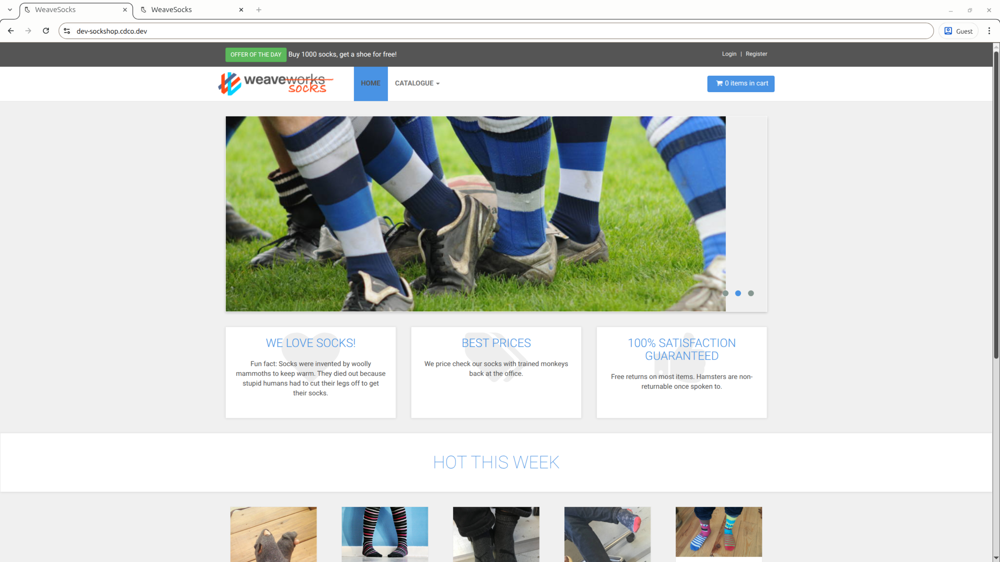

*Figure 1: Final browser-level evidence for the Proxmox-backed `dev` environment before migration work starts. The storefront loads through the public Cloudflare-routed endpoint `dev-sockshop.cdco.dev`.*

**Final live `prod` storefront before migration**

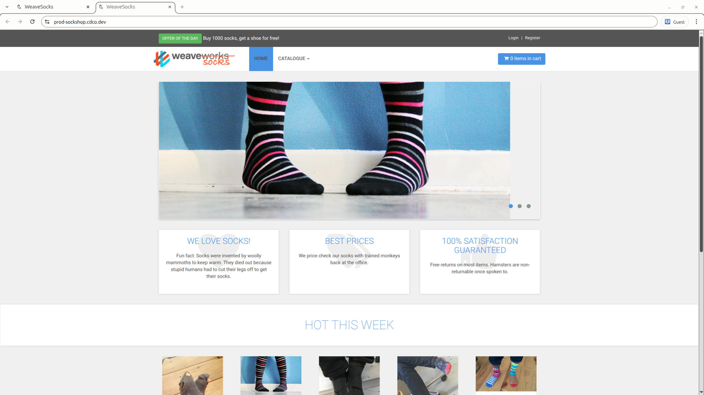

*Figure 2: Final browser-level evidence for the Proxmox-backed `prod` environment before migration work starts. The storefront loads through the public Cloudflare-routed endpoint `prod-sockshop.cdco.dev`.*

The browser evidence was complemented with terminal-based HTTP header checks for both public endpoints. The checks used filtered `curl` output so the evidence focuses on the meaningful verification signals: HTTP status, content type, Cloudflare routing, and application response headers.

~~~bash
# Verify final public dev endpoint reachability.
$ curl -I -sS https://dev-sockshop.cdco.dev | grep -Ei '^(HTTP/|date:|content-type:|server:|cf-cache-status:|x-powered-by:)'
HTTP/2 200 
date: Wed, 06 May 2026 17:55:03 GMT
content-type: text/html; charset=UTF-8
x-powered-by: Express
cf-cache-status: DYNAMIC
server: cloudflare

# Verify final public prod endpoint reachability.
$ curl -I -sS https://prod-sockshop.cdco.dev | grep -Ei '^(HTTP/|date:|content-type:|server:|cf-cache-status:|x-powered-by:)'
HTTP/2 200 
date: Wed, 06 May 2026 17:55:13 GMT
content-type: text/html; charset=UTF-8
x-powered-by: Express
cf-cache-status: DYNAMIC
server: cloudflare
~~~

**Terminal verification for public `dev` and `prod` endpoints**

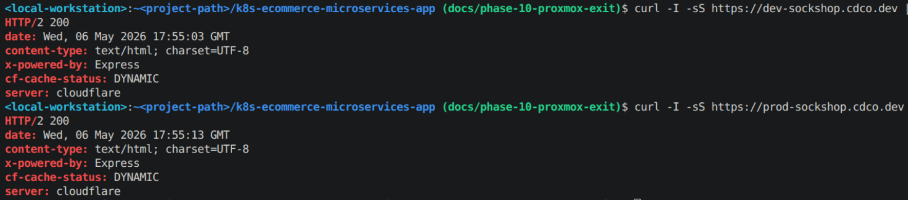

*Figure 3: Terminal verification of the final Proxmox-hosted public `dev` and `prod` endpoints before migration work starts. Both Cloudflare-routed storefront URLs return `HTTP/2 200`, confirming that the public edge was reachable during the Phase 10 exit-evidence capture.*

---

## Step 4 — Capture final target-platform and observability evidence

The public storefront screenshots prove external reachability. The target-platform snapshot and monitoring screenshots preserve the operational state behind those public entrypoints.

### Proxmox UI evidence

The final Proxmox UI screenshots preserve the hypervisor-side state of the target platform before migration. They show the Proxmox node inventory, the live target VM `9200`, the VM hardware shape, and the Cloud-Init configuration that provided the private target networking.

---

**Proxmox node inventory before migration**

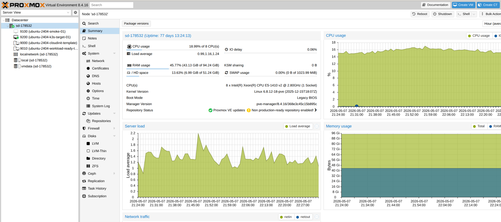

*Figure 11: Final Proxmox node inventory evidence before migration. The view shows the Proxmox node together with the relevant VM/template chain: generic Cloud-Init template `9000`, workload-ready template `9010`, reference smoke VM `9100`, and live K3s target VM `9200`.*

---

**Proxmox VM `9200` summary before migration**

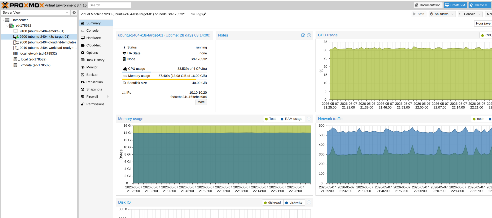

*Figure 12: Final Proxmox summary evidence for VM `9200` before migration. The VM is running, has a stable private IP `10.10.10.20`, and represents the live Proxmox-backed K3s target used by the `dev` and `prod` environments.*

---

**Proxmox VM `9200` hardware before migration**

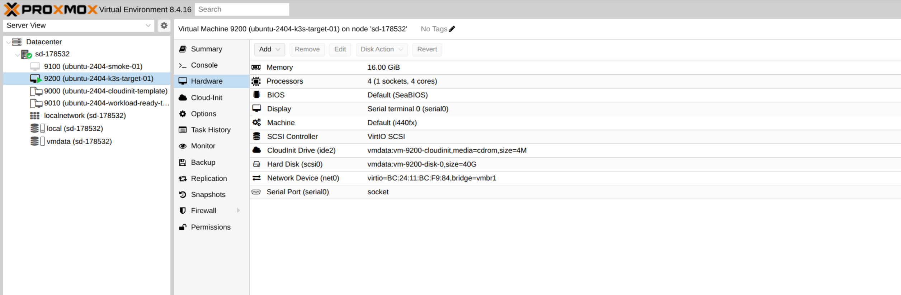

*Figure 13: Final Proxmox hardware evidence for VM `9200` before migration. The view records the target VM shape, including CPU, memory, disk, Cloud-Init drive, serial console, and private network bridge `vmbr1`.*

---

**Proxmox VM `9200` Cloud-Init before migration**

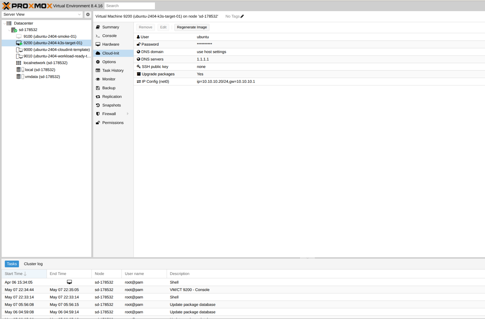

*Figure 14: Final Proxmox Cloud-Init evidence for VM `9200` before migration. The view records the guest initialization inputs, including the `ubuntu` user, DNS configuration, and static private IP configuration `10.10.10.20/24` with gateway `10.10.10.1`.*

---

**Proxmox host-side VM `9200` status and config before migration**

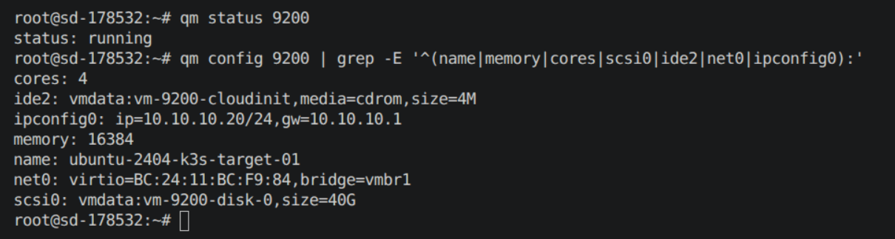

*Figure 15: Final Proxmox host-side terminal evidence for VM `9200` before migration. The output confirms that the target VM was running and records the non-secret VM shape: 4 CPU cores, 16 GiB memory, 40 GiB disk, Cloud-Init drive, private IP configuration `10.10.10.20/24`, gateway `10.10.10.1`, and bridge `vmbr1`.*

---

### Kubernetes Snapshot

A Kubernetes snapshot was captured from the operator workstation through the existing private cluster access path. The snapshot records the final target state for:

- The K3s node
- `sock-shop-dev` workloads, services, and ingress
- `sock-shop-prod` workloads, services, and ingress
- Front-end rollout status
- Ingress host routing
- The `monitoring` namespace
- Public HTTPS smoke checks

~~~bash
# Print a read-only K3s target snapshot for the final Proxmox evidence pass.
$ make k8s-demo-defense-snapshot

=== DEFENSE SNAPSHOT: PROXMOX K3S TARGET ===

## 1) KUBERNETES NODE STATE
$ kubectl get nodes -o wide
NAME                        STATUS   ROLES           AGE   VERSION        INTERNAL-IP   EXTERNAL-IP   OS-IMAGE             KERNEL-VERSION      CONTAINER-RUNTIME
ubuntu-2404-k3s-target-01   Ready    control-plane   29d   v1.34.6+k3s1   10.10.10.20   <none>        Ubuntu 24.04.4 LTS   6.8.0-107-generic   containerd://2.2.2-bd1.34

## 2) DEV ENVIRONMENT: WORKLOADS, SERVICES, AND INGRESS
$ kubectl get deploy,pods,svc,ingress -n sock-shop-dev -o wide
...
NAME                                  CLASS     HOSTS                   ADDRESS       PORTS   AGE
ingress.networking.k8s.io/front-end   traefik   dev-sockshop.cdco.dev   10.10.10.20   80      27d

## 3) PROD ENVIRONMENT: WORKLOADS, SERVICES, AND INGRESS
$ kubectl get deploy,pods,svc,ingress -n sock-shop-prod -o wide
...
NAME                                  CLASS     HOSTS                    ADDRESS       PORTS   AGE
ingress.networking.k8s.io/front-end   traefik   prod-sockshop.cdco.dev   10.10.10.20   80      26d

## 4) FRONT-END ROLLOUT STATUS
$ kubectl rollout status deployment/front-end -n sock-shop-dev --timeout=30s
deployment "front-end" successfully rolled out
$ kubectl rollout status deployment/front-end -n sock-shop-prod --timeout=30s
deployment "front-end" successfully rolled out

## 5) INGRESS HOST ROUTING
$ kubectl get ingress -n sock-shop-dev -o wide
NAME        CLASS     HOSTS                   ADDRESS       PORTS   AGE
front-end   traefik   dev-sockshop.cdco.dev   10.10.10.20   80      27d
$ kubectl get ingress -n sock-shop-prod -o wide
NAME        CLASS     HOSTS                    ADDRESS       PORTS   AGE
front-end   traefik   prod-sockshop.cdco.dev   10.10.10.20   80      26d

## 6) MONITORING NAMESPACE
$ kubectl get pods,svc -n monitoring -o wide
NAME                                                      READY   STATUS    RESTARTS   AGE   IP            NODE                        NOMINATED NODE   READINESS GATES
pod/observability-grafana-5f67d6b8f5-b4g99                3/3     Running   0          21d   10.42.0.126   ubuntu-2404-k3s-target-01   <none>           <none>
pod/observability-kube-prometh-operator-75fb78b59-6g7vq   1/1     Running   0          21d   10.42.0.121   ubuntu-2404-k3s-target-01   <none>           <none>
pod/observability-kube-state-metrics-7cf68b47dc-ncnzn     1/1     Running   0          21d   10.42.0.122   ubuntu-2404-k3s-target-01   <none>           <none>
pod/observability-prometheus-node-exporter-pbfk5          1/1     Running   0          21d   10.10.10.20   ubuntu-2404-k3s-target-01   <none>           <none>
pod/prometheus-observability-kube-prometh-prometheus-0    2/2     Running   0          21d   10.42.0.123   ubuntu-2404-k3s-target-01   <none>           <none>

## 7) PUBLIC HTTPS ENTRYPOINT SMOKE CHECKS
$ curl -fsSI https://dev-sockshop.cdco.dev/ | head -n 5
HTTP/2 200 
date: Wed, 06 May 2026 18:29:42 GMT
content-type: text/html; charset=UTF-8
accept-ranges: bytes
cache-control: public, max-age=0

$ curl -fsSI https://prod-sockshop.cdco.dev/ | head -n 5
HTTP/2 200 
date: Wed, 06 May 2026 18:29:42 GMT
content-type: text/html; charset=UTF-8
accept-ranges: bytes
cache-control: public, max-age=0

=== DEFENSE SNAPSHOT COMPLETED ===
~~~

The snapshot confirms that the final Proxmox target was not only reachable from the public edge, but also healthy from the Kubernetes control-plane perspective: the node was `Ready`, both environment ingresses pointed to VM `9200`, the front-end deployments were rolled out, and the monitoring namespace was running.

The observability screenshots preserve the final monitoring state before migration.

**Grafana production namespace dashboard before migration**

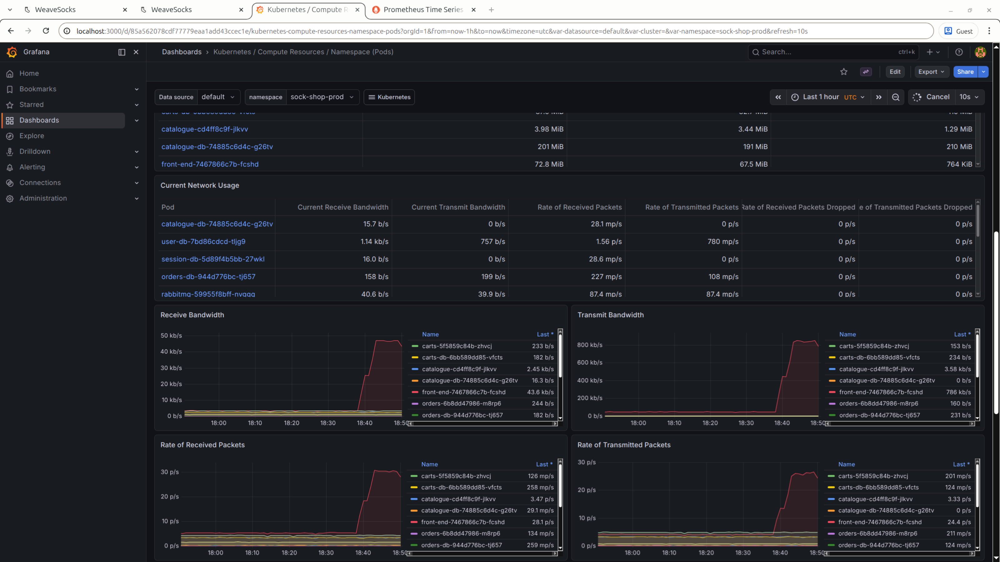

*Figure 4: Final Grafana evidence before migration. The dashboard shows the Proxmox-backed `sock-shop-prod` namespace with live workload visibility before the Proxmox environment becomes unavailable.*

**Prometheus targets before migration**

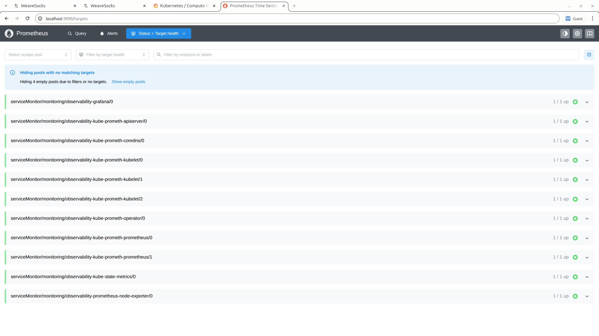

*Figure 5: Final Prometheus evidence before migration. The targets view confirms that the core monitoring targets were healthy during the Proxmox exit-evidence capture.*

---

## Step 5 — Capture final CI/CD and validation evidence

The platform state was also preserved from the delivery and validation perspective. The final screenshots capture the relevant GitHub Actions workflows that proved the project’s controlled delivery model before the Proxmox target becomes unavailable.

The evidence covers:

- Deterministic PR gate success
- Target delivery workflow with production approval gate
- Target delivery workflow after approved production deployment
- Live smoke workflow success

---

**Deterministic PR gate success**

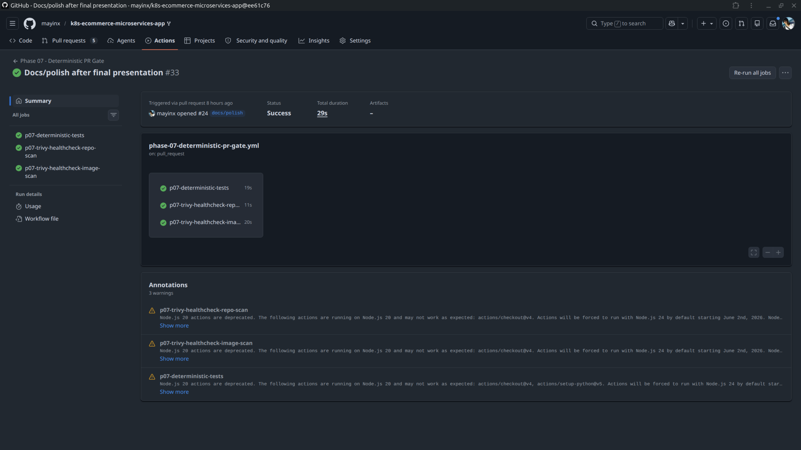

*Figure 6: Final deterministic PR-gate evidence before migration. The required validation path shows the repo-owned test and security checks in a successful state before changes are allowed into the protected branch.*

---

**Target delivery approval gate**

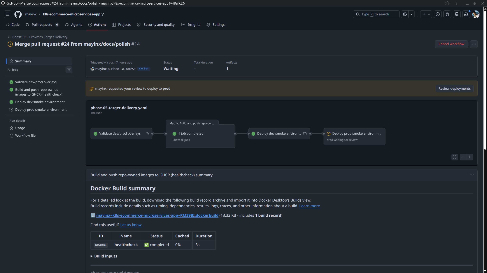

*Figure 7: Final target-delivery evidence showing the production approval gate. The workflow deploys to `dev` automatically and pauses before production promotion until approval is granted.*

---

**Target delivery approved and successful**

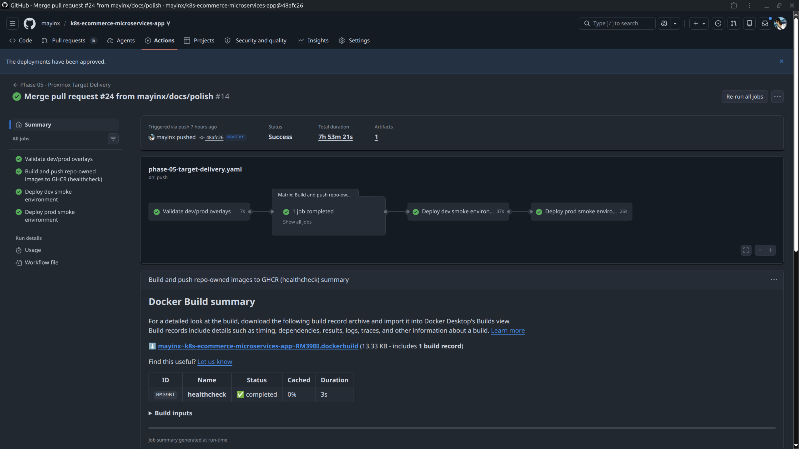

*Figure 8: Final target-delivery evidence after production approval. The workflow completes the approval-gated `prod` deployment path against the Proxmox-backed K3s target.*

---

**Live smoke workflow success**

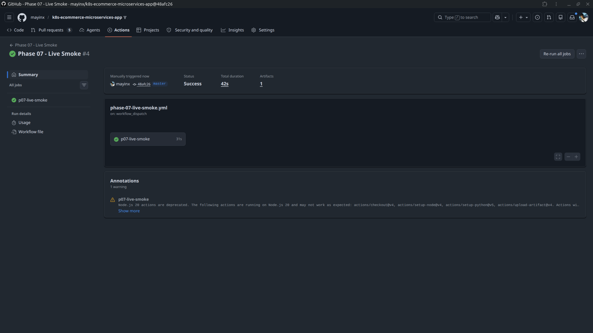

*Figure 9: Final live-smoke evidence before migration. The live validation workflow confirms that the deployed environment can still be checked through the project’s Python and Playwright smoke-test path.*

---

## Step 6 — Create final DR backup artifacts for migration readiness

Phase 09 already proved the DR backup path. Phase 10 creates the final pre-migration backup snapshot for both live namespaces so the project has recent local recovery material and migration inputs before the Proxmox environment disappears.

The backup artifacts are generated locally under `backups/` and remain excluded from Git.

Final `dev` backup:

~~~bash
# Create final DR backup for dev namespace.
$ make p09-dr-backup-dev
============================================================
Starting DR backup for namespace: sock-shop-dev
Kubeconfig: /home/mayinx/.kube/config-proxmox-dev.yaml
Destination: backups/sock-shop-dev_20260506T192433Z
============================================================
Kubernetes context: default

[1/2] Exporting Kubernetes resource state...
  -> Exporting deployments
  -> Exporting services
  -> Exporting ingress
  -> Exporting configmaps
  -> Exporting pvc
  -> Exporting pods

[2/2] Attempting MongoDB dumps for database pods...
  -> Checking database target: 'carts-db'
     Pod: carts-db-6bb589dd85-sdgdh
...
     OK: Dump saved to backups/sock-shop-dev_20260506T192433Z/db/carts-db_carts-db-6bb589dd85-sdgdh.archive.gz
  -> Checking database target: 'catalogue-db'
     Pod: catalogue-db-74885c6d4c-xtrxj
     SKIP: mongodump not available in catalogue-db-74885c6d4c-xtrxj
  -> Checking database target: 'orders-db'
     Pod: orders-db-944d776bc-hwgqt
...
     OK: Dump saved to backups/sock-shop-dev_20260506T192433Z/db/orders-db_orders-db-944d776bc-hwgqt.archive.gz
  -> Checking database target: 'session-db'
     Pod: session-db-5d89f4b5bb-9cwbx
     SKIP: mongodump not available in session-db-5d89f4b5bb-9cwbx
  -> Checking database target: 'user-db'
     Pod: user-db-7bd86cdcd-xwm7b
...
     OK: Dump saved to backups/sock-shop-dev_20260506T192433Z/db/user-db_user-db-7bd86cdcd-xwm7b.archive.gz

============================================================
Backup completed.
Backup folder: backups/sock-shop-dev_20260506T192433Z
Database report: backups/sock-shop-dev_20260506T192433Z/db/backup-report.txt
============================================================
~~~

Final `prod` backup:

~~~bash
# Create final DR backup for prod namespace.
$ make p09-dr-backup-prod
============================================================
Starting DR backup for namespace: sock-shop-prod
Kubeconfig: /home/mayinx/.kube/config-proxmox-dev.yaml
Destination: backups/sock-shop-prod_20260506T192448Z
============================================================
Kubernetes context: default

[1/2] Exporting Kubernetes resource state...
  -> Exporting deployments
  -> Exporting services
  -> Exporting ingress
  -> Exporting configmaps
  -> Exporting pvc
  -> Exporting pods

[2/2] Attempting MongoDB dumps for database pods...
  -> Checking database target: 'carts-db'
     Pod: carts-db-6bb589dd85-vfcts
...
     OK: Dump saved to backups/sock-shop-prod_20260506T192448Z/db/carts-db_carts-db-6bb589dd85-vfcts.archive.gz
  -> Checking database target: 'catalogue-db'
     Pod: catalogue-db-74885c6d4c-g26tv
     SKIP: mongodump not available in catalogue-db-74885c6d4c-g26tv
  -> Checking database target: 'orders-db'
     Pod: orders-db-944d776bc-tj657
...
     OK: Dump saved to backups/sock-shop-prod_20260506T192448Z/db/orders-db_orders-db-944d776bc-tj657.archive.gz
  -> Checking database target: 'session-db'
     Pod: session-db-5d89f4b5bb-27wkl
     SKIP: mongodump not available in session-db-5d89f4b5bb-27wkl
  -> Checking database target: 'user-db'
     Pod: user-db-7bd86cdcd-tljg9
...
     OK: Dump saved to backups/sock-shop-prod_20260506T192448Z/db/user-db_user-db-7bd86cdcd-tljg9.archive.gz

============================================================
Backup completed.
Backup folder: backups/sock-shop-prod_20260506T192448Z
Database report: backups/sock-shop-prod_20260506T192448Z/db/backup-report.txt
============================================================
~~~

The final generated artifact structure is:

~~~text
.
├── sock-shop-dev_20260506T192433Z
│   ├── db
│   │   ├── backup-report.txt
│   │   ├── carts-db_carts-db-6bb589dd85-sdgdh.archive.gz
│   │   ├── orders-db_orders-db-944d776bc-hwgqt.archive.gz
│   │   └── user-db_user-db-7bd86cdcd-xwm7b.archive.gz
│   ├── k8s
│   │   ├── all-resources-wide.txt
│   │   ├── configmaps.yaml
│   │   ├── deployments.yaml
│   │   ├── ingress.yaml
│   │   ├── namespace.yaml
│   │   ├── persistent-volumes-wide.txt
│   │   ├── pods.yaml
│   │   ├── pvc.yaml
│   │   ├── secrets-metadata.txt
│   │   └── services.yaml
│   └── README.txt
└── sock-shop-prod_20260506T192448Z
    ├── db
    │   ├── backup-report.txt
    │   ├── carts-db_carts-db-6bb589dd85-vfcts.archive.gz
    │   ├── orders-db_orders-db-944d776bc-tj657.archive.gz
    │   └── user-db_user-db-7bd86cdcd-tljg9.archive.gz
    ├── k8s
    │   ├── all-resources-wide.txt
    │   ├── configmaps.yaml
    │   ├── deployments.yaml
    │   ├── ingress.yaml
    │   ├── namespace.yaml
    │   ├── persistent-volumes-wide.txt
    │   ├── pods.yaml
    │   ├── pvc.yaml
    │   ├── secrets-metadata.txt
    │   └── services.yaml
    └── README.txt

7 directories, 30 files
~~~

**Final generated DR backup artifacts before migration**

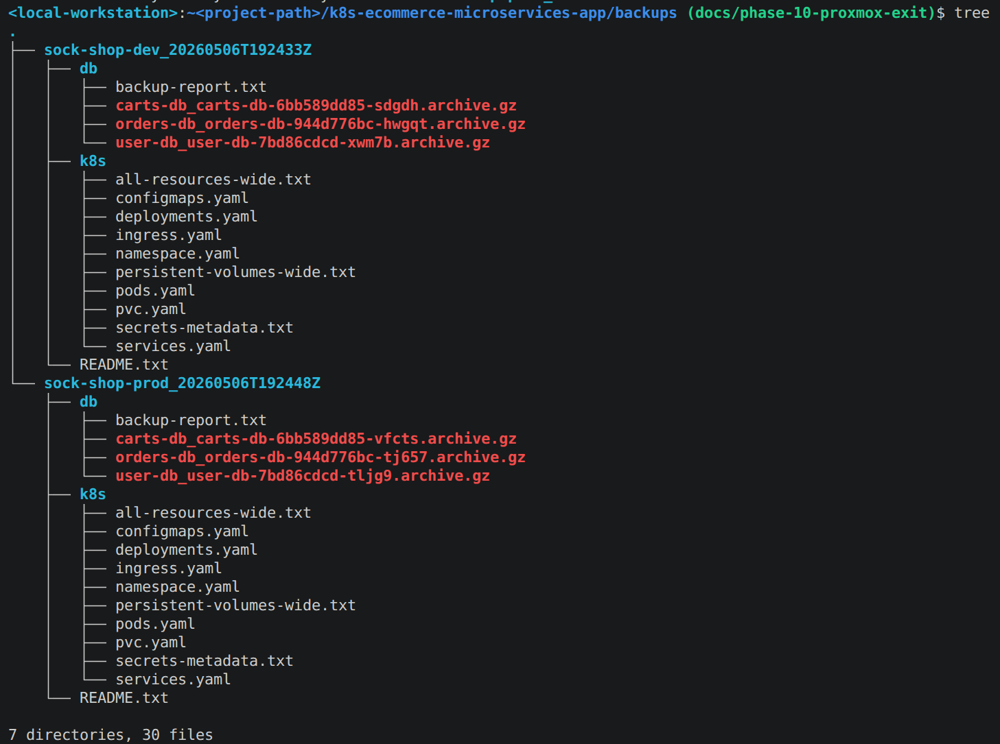

*Figure 10: Final local DR backup artifact structure before migration. Both `sock-shop-dev` and `sock-shop-prod` have timestamped backup folders with Kubernetes namespace exports, Secret metadata only, backup reports, and Mongo-compatible dump archives for the supported database pods.*

---

## Step 7 — Record migration boundary and next phase direction

Phase 10 defines the transition point from the completed Proxmox-backed platform to the AWS migration track.

Current boundary:

- Proxmox VM `9200` remains the final proven Proxmox target
- `sock-shop-dev` and `sock-shop-prod` remain the final proven Proxmox-backed app environments
- Phase 10 captures the final public, platform, observability, CI/CD, validation, and backup evidence
- Phase 11 will create a new AWS-backed target while preserving the proven delivery model where practical

This keeps the project story clean:

- Phases 00-09 prove the platform on Proxmox
- Phase 10 preserves the final Proxmox state
- Phase 11 starts the AWS migration path

The resulting Phase 10 documentation area is:

~~~text
project-docs/10-proxmox-exit/
├── archive/
│   └── [2026-05-06]-README-proxmox-phases-00-09.md
├── evidence/
│   ├── [2026-05-06]-01-P10-live-dev-storefront-before-migration.png
│   ├── [2026-05-06]-02-P10-live-prod-storefront-before-migration.png
│   ├── [2026-05-06]-03-P10-terminal-curl-dev-prod-public-endpoints-http-200.png
│   ├── [2026-05-06]-04-P10-grafana-prod-dashboard-before-migration.png
│   ├── [2026-05-06]-05-P10-prometheus-targets-before-migration.png
│   ├── [2026-05-06]-06-P10-github-actions-deterministic-pr-gate-success.png
│   ├── [2026-05-06]-07-P10-github-actions-target-delivery-approval-gate.png
│   ├── [2026-05-06]-08-P10-github-actions-target-delivery-approved-success.png
│   ├── [2026-05-06]-09-P10-github-actions-live-smoke-success.png
│   ├── [2026-05-06]-10-P10-terminal-final-generated-dev-prod-dr-backup-artifacts-before-migration.png
│   ├── [2026-05-07]-11-P10-proxmox-node-inventory-templates-and-target-before-migration.png
│   ├── [2026-05-07]-12-P10-proxmox-vm-9200-summary-running-before-migration.png
│   ├── [2026-05-07]-13-P10-proxmox-vm-9200-hardware-before-migration.png
│   └── [2026-05-07]-14-P10-proxmox-vm-9200-cloud-init-before-migration.png
└── IMPLEMENTATION.md
~~~

---

## Phase 10 outcome summary

Phase 10 preserves the final state of the completed Proxmox-backed project before the environment is decommissioned.

The phase adds:

- Final public environment evidence
- Final terminal endpoint verification
- Final K3s target-state evidence
- Final observability evidence
- Final CI/CD and live validation evidence
- Final local DR backup artifacts for the Proxmox-backed `dev` and `prod` namespaces
- A historical README snapshot for the completed Phase 00-09 Proxmox baseline
- A documented migration boundary for the AWS follow-up phase

At the end of Phase 10, the project has a clean handoff point from the Proxmox-backed delivery track to the AWS migration track. The completed Proxmox platform remains reviewable through documentation, screenshots, terminal verification, archived README content, and local backup artifacts even after the original target environment is no longer available.